<div align="center">
  
  <br><br>
  <strong>UNIVERSIDAD PERUANA DE CIENCIAS APLICADAS</strong>
  <br><br>
  <strong>INGENIERÍA DE SOFTWARE</strong>
  <br><br>
  <strong>1ACC0238 - Aplicaciones Para Dispositivos Móviles</strong>
  <br>
  NRC: <strong>4945</strong>
  <br><br>
  <strong>Informe de TB1</strong>
  <br><br>
  Docente:<br>
  <strong>Jorge Luis Mayta Guillermo</strong>
  <br><br>
  Equipo:<br>
  <strong>RouteGolem</strong>
  <br><br>
  Proyecto:<br>
  <strong>RouteGuard</strong>
  <br><br>
  <strong>Integrantes:</strong><br>
  u202424059 - De la Cruz De los Santos, Mathias Marcelo<br>
  u202417329 - Francia Torres, Jhony Manuel<br>
  u202411627 - Pareja Calloapaza, Marcelo Fausto<br>
  u202415551 - Ramirez Ruíz, Nickolas<br>
  <br><br>
  <strong>Periodo 2026-02</strong><br>
  <strong>Octubre 2026</strong>
</div>

<div style="page-break-after: always;"></div>

## Registro de Versiones del Informe

Como se detalla en la **Tabla 1**, a continuación se presentan las versiones de este documento.

<p><strong>Tabla 1.</strong> <em>Historial de Cambios y Versiones del Documento</em></p>
<table style="border-collapse: collapse; width: 100%; border: 1px solid #ddd;">
  <thead>
    <tr style="background-color: #003366; color: white;">
      <th style="padding: 10px; border: 1px solid #ddd; text-align: left;">Versión</th>
      <th style="padding: 10px; border: 1px solid #ddd; text-align: left;">Fecha</th>
      <th style="padding: 10px; border: 1px solid #ddd; text-align: left;">Autor</th>
      <th style="padding: 10px; border: 1px solid #ddd; text-align: left;">Descripción de modificación</th>
    </tr>
  </thead>
  <tbody>
    <tr>
      <td style="padding: 10px; border: 1px solid #ddd;"><strong>0.1</strong></td>
      <td style="padding: 10px; border: 1px solid #ddd;">05/09/2026</td>
      <td style="padding: 10px; border: 1px solid #ddd;">Marcelo Pareja</td>
      <td style="padding: 10px; border: 1px solid #ddd;">Creación de la estructura base del informe, carátula y aplicación de la plantilla Markdown oficial del curso.</td>
    </tr>
    <tr>
      <td style="padding: 10px; border: 1px solid #ddd;"><strong>0.2</strong></td>
      <td style="padding: 10px; border: 1px solid #ddd;">05/09/2026</td>
      <td style="padding: 10px; border: 1px solid #ddd;">Marcelo Pareja</td>
      <td style="padding: 10px; border: 1px solid #ddd;">Redacción del Startup Profile (Misión, Visión, Valores) y el Solution Profile (Antecedentes bajo la técnica 5W+2H) con sustento académico.</td>
    </tr>
    <tr>
      <td style="padding: 10px; border: 1px solid #ddd;"><strong>0.3</strong></td>
      <td style="padding: 10px; border: 1px solid #ddd;">06/09/2026</td>
      <td style="padding: 10px; border: 1px solid #ddd;">Marcelo Pareja</td>
      <td style="padding: 10px; border: 1px solid #ddd;">Integración del proceso Lean UX respetando los templates oficiales (Problem Statements, 5 tipos de Assumptions e Hipótesis).</td>
    </tr>
    <tr>
      <td style="padding: 10px; border: 1px solid #ddd;"><strong>0.4</strong></td>
      <td style="padding: 10px; border: 1px solid #ddd;">06/09/2026</td>
      <td style="padding: 10px; border: 1px solid #ddd;">Marcelo Pareja</td>
      <td style="padding: 10px; border: 1px solid #ddd;">Definición de los Segmentos Objetivo (Padres y Conductores) incorporando información estadística de sustento (MINEDU y ATU).</td>
    </tr>
    <tr>
      <td style="padding: 10px; border: 1px solid #ddd;"><strong>0.5</strong></td>
      <td style="padding: 10px; border: 1px solid #ddd;">06/09/2026</td>
      <td style="padding: 10px; border: 1px solid #ddd;">Marcelo Pareja</td>
      <td style="padding: 10px; border: 1px solid #ddd;">Incorporación de los Objetivos SMART, tabla de Student Outcome mapeada a la rúbrica y generación de la Tabla de Contenidos automatizada.</td>
    </tr>
    <tr>
      <td style="padding: 10px; border: 1px solid #ddd;"><strong>0.6</strong></td>
      <td style="padding: 10px; border: 1px solid #ddd;">09/09/2026</td>
      <td style="padding: 10px; border: 1px solid #ddd;">Marcelo Pareja</td>
      <td style="padding: 10px; border: 1px solid #ddd;">Diseño de guiones de entrevista, elaboración del User Task Matrix, User Personas y definición del Ubiquitous Language.</td>
    </tr>
    <tr>
      <td style="padding: 10px; border: 1px solid #ddd;"><strong>0.7</strong></td>
      <td style="padding: 10px; border: 1px solid #ddd;">10/09/2026</td>
      <td style="padding: 10px; border: 1px solid #ddd;">Marcelo Pareja</td>
      <td style="padding: 10px; border: 1px solid #ddd;">Integración visual del Big Picture EventStorming y desarrollo de los User Journey Maps (As-Is).</td>
    </tr>
    <tr>
      <td style="padding: 10px; border: 1px solid #ddd;"><strong>0.8</strong></td>
      <td style="padding: 10px; border: 1px solid #ddd;">13/09/2026</td>
      <td style="padding: 10px; border: 1px solid #ddd;">Manuel Francia</td>
      <td style="padding: 10px; border: 1px solid #ddd;">Definición de Épicas, creación del Product Backlog inicial y redacción de User Stories con criterios de aceptación Gherkin.</td>
    </tr>
    <tr>
      <td style="padding: 10px; border: 1px solid #ddd;"><strong>0.9</strong></td>
      <td style="padding: 10px; border: 1px solid #ddd;">14/09/2026</td>
      <td style="padding: 10px; border: 1px solid #ddd;">Mathias De La Cruz</td>
      <td style="padding: 10px; border: 1px solid #ddd;">Desarrollo del Strategic-Level DDD (EventStorming, Candidate Context Discovery, Domain Message Flows y Bounded Context Canvases).</td>
    </tr>
    <tr>
      <td style="padding: 10px; border: 1px solid #ddd;"><strong>1.0</strong></td>
      <td style="padding: 10px; border: 1px solid #ddd;">14/09/2026</td>
      <td style="padding: 10px; border: 1px solid #ddd;">Nickolas Ramirez</td>
      <td style="padding: 10px; border: 1px solid #ddd;">Redacción del Análisis Competitivo, definición de Estrategias frente a competidores y elaboración del Empathy Mapping.</td>
    </tr>
    <tr>
      <td style="padding: 10px; border: 1px solid #ddd;"><strong>1.1</strong></td>
      <td style="padding: 10px; border: 1px solid #ddd;">16/09/2026</td>
      <td style="padding: 10px; border: 1px solid #ddd;">Marcelo Pareja</td>
      <td style="padding: 10px; border: 1px solid #ddd;">Estructuración del Tactical-Level DDD, refinamiento del backlog e integración de arquitectura inicial para Tracking/Notifications.</td>
    </tr>
    <tr>
      <td style="padding: 10px; border: 1px solid #ddd;"><strong>1.2</strong></td>
      <td style="padding: 10px; border: 1px solid #ddd;">17/09/2026</td>
      <td style="padding: 10px; border: 1px solid #ddd;">Manuel Francia</td>
      <td style="padding: 10px; border: 1px solid #ddd;">Elaboración del Impact Mapping y actualización integral del formato de especificación de requisitos.</td>
    </tr>
    <tr>
      <td style="padding: 10px; border: 1px solid #ddd;"><strong>1.3</strong></td>
      <td style="padding: 10px; border: 1px solid #ddd;">18/09/2026</td>
      <td style="padding: 10px; border: 1px solid #ddd;">Mathias De La Cruz</td>
      <td style="padding: 10px; border: 1px solid #ddd;">Diseño de diagramas de Software Architecture (Context, Container, Deployment) y refinamiento del Context Mapping.</td>
    </tr>
    <tr>
      <td style="padding: 10px; border: 1px solid #ddd;"><strong>1.4</strong></td>
      <td style="padding: 10px; border: 1px solid #ddd;">18/09/2026</td>
      <td style="padding: 10px; border: 1px solid #ddd;">Nickolas Ramirez</td>
      <td style="padding: 10px; border: 1px solid #ddd;">Modelado completo del Bounded Context de Stakeholder (Domain, Interface, Application, Infra) y diagramas C4 a nivel de código.</td>
    </tr>
    <tr>
      <td style="padding: 10px; border: 1px solid #ddd;"><strong>1.5</strong></td>
      <td style="padding: 10px; border: 1px solid #ddd;">18/09/2026</td>
      <td style="padding: 10px; border: 1px solid #ddd;">Marcelo Pareja</td>
      <td style="padding: 10px; border: 1px solid #ddd;">Consolidación de diagramas C4 Model (Micro-Frontend/Backend), resúmenes de entrevistas, video de Needfinding y resolución de merge conflicts (Release AV1).</td>
    </tr>
    <tr>
      <td style="padding: 10px; border: 1px solid #ddd;"><strong>1.6</strong></td>
      <td style="padding: 10px; border: 1px solid #ddd;">04/10/2026</td>
      <td style="padding: 10px; border: 1px solid #ddd;">Marcelo Pareja</td>
      <td style="padding: 10px; border: 1px solid #ddd;">Refactorización táctica del backend según Domain-Driven Design (DDD): desacoplamiento de agregados en IAM, Fleet, Trip Execution y Notifications, eliminación de claves foráneas entre Bounded Contexts y reestructuración de la app Android modularizada.</td>
    </tr>
    <tr>
      <td style="padding: 10px; border: 1px solid #ddd;"><strong>1.7</strong></td>
      <td style="padding: 10px; border: 1px solid #ddd;">06/10/2026</td>
      <td style="padding: 10px; border: 1px solid #ddd;">Mathias De La Cruz</td>
      <td style="padding: 10px; border: 1px solid #ddd;">Integración del bus de mensajería asíncrona RabbitMQ (CloudAMQP) con MassTransit para eventos de dominio (StudentBoarded, IncidentReported, LocationUpdated) y configuración de Firebase Cloud Messaging (FCM) para push notifications automáticas.</td>
    </tr>
    <tr>
      <td style="padding: 10px; border: 1px solid #ddd;"><strong>1.8</strong></td>
      <td style="padding: 10px; border: 1px solid #ddd;">08/10/2026</td>
      <td style="padding: 10px; border: 1px solid #ddd;">Jhony Manuel Francia</td>
      <td style="padding: 10px; border: 1px solid #ddd;">Refinamiento de historias de usuario del Product Backlog, redacción de criterios de aceptación con sintaxis Gherkin para el Sprint 1 y elaboración de diagramas de User Flow para la interacción móvil de transportistas y familias.</td>
    </tr>
    <tr>
      <td style="padding: 10px; border: 1px solid #ddd;"><strong>1.9</strong></td>
      <td style="padding: 10px; border: 1px solid #ddd;">09/10/2026</td>
      <td style="padding: 10px; border: 1px solid #ddd;">Nickolas Ramirez</td>
      <td style="padding: 10px; border: 1px solid #ddd;">Diseño de la Arquitectura de Información móvil, refinamiento de hipótesis del Lean UX Canvas y documentación de especificaciones OpenAPI 3.0 / Swagger para los contratos de la API REST.</td>
    </tr>
    <tr>
      <td style="padding: 10px; border: 1px solid #ddd;"><strong>2.0</strong></td>
      <td style="padding: 10px; border: 1px solid #ddd;">10/10/2026</td>
      <td style="padding: 10px; border: 1px solid #ddd;">Marcelo Pareja &amp; Mathias De La Cruz</td>
      <td style="padding: 10px; border: 1px solid #ddd;">Implementación de persistencia local offline-first con Room DB en la app Android nativa, migración a PostgreSQL en Azure Flexible Server, despliegue continuo en Azure App Service con CI/CD, batería de 96 tests de integración y cierre del Sprint Review / TB1.</td>
    </tr>
  </tbody>
</table>
<p style="margin-top: 10px;"><em>Nota: Historial detallado de las modificaciones realizadas en el informe, indicando fecha, autor y descripción de cada versión.</em></p>

<div style="page-break-after: always;"></div>

## Project Report Collaboration Insights

El equipo ha utilizado un flujo de trabajo en github: https://github.com/upc-pre-202620-1acc0238-2620-routegolem/routeguard-report/tree/develop

AV1:


<div style="page-break-after: always;"></div>

## Tabla de contenidos

- [Capítulo I: Presentación](#capítulo-i-presentación)
  - [1.1 Startup Profile](#11-startup-profile)
    - [1.1.1 Descripción de la Startup](#111-descripción-de-la-startup)
    - [1.1.2 Perfiles de integrantes del equipo](#112-perfiles-de-integrantes-del-equipo)
  - [1.2. Solution Profile](#12-solution-profile)
    - [1.2.1 Antecedentes y problemática](#121-antecedentes-y-problemática)
    - [1.2.2 Lean UX Process](#122-lean-ux-process)
      - [1.2.2.1. Lean UX Problem Statements](#1221-lean-ux-problem-statements)
      - [1.2.2.2. Lean UX Assumptions](#1222-lean-ux-assumptions)
      - [1.2.2.3. Lean UX Hypothesis Statements](#1223-lean-ux-hypothesis-statements)
      - [1.2.2.4. Lean UX Canvas](#1224-lean-ux-canvas)
  - [1.3 Segmentos objetivo](#13-segmentos-objetivo)
    - [Segmento 1: Transportistas Escolares (Administradores y Conductores)](#segmento-1-transportistas-escolares-administradores-y-conductores)
    - [Segmento 2: Padres de Familia](#segmento-2-padres-de-familia)
- [Capítulo II: Requirements Development and Software Solution Design](#capítulo-ii-requirements-development-and-software-solution-design)
  - [2.1. Competidores](#21-competidores)
      - [2.1.1 Análisis Competitivo](#211-análisis-competitivo)
    - [2.1.2. Estrategias y tácticas frente a competidores](#212-estrategias-y-tácticas-frente-a-competidores)
      - [Enfoque en la especialización del problema](#enfoque-en-la-especialización-del-problema)
      - [Estrategia de digitalización del sector no estructurado](#estrategia-de-digitalización-del-sector-no-estructurado)
      - [Diferenciación mediante simplicidad y accesibilidad](#diferenciación-mediante-simplicidad-y-accesibilidad)
      - [Estrategia de confianza y seguridad para los padres](#estrategia-de-confianza-y-seguridad-para-los-padres)
      - [Estrategia de crecimiento progresivo y escalabilidad](#estrategia-de-crecimiento-progresivo-y-escalabilidad)
      - [Estrategia de posicionamiento local](#estrategia-de-posicionamiento-local)
      - [Estrategia de preparación tecnológica a futuro](#estrategia-de-preparación-tecnológica-a-futuro)
  - [2.2. Entrevistas](#22-entrevistas)
    - [2.2.1. Diseño de entrevistas](#221-diseño-de-entrevistas)
      - [A. Segmento 1: Transportistas Escolares (Administradores y Conductores)](#a-segmento-1-transportistas-escolares-administradores-y-conductores)
      - [B. Segmento 2: Padres de Familia](#b-segmento-2-padres-de-familia)
    - [2.2.2. Registro de entrevistas](#222-registro-de-entrevistas)
      - [Entrevistado 1: Manuel Jesús Francia Huambachano (Segmento: Padres de Familia)](#entrevistado-1-manuel-jesús-francia-huambachano-segmento-padres-de-familia)
      - [Entrevistado 2: Luis Johnny Jesús Mendoza (Segmento: Conductor / Transportista)](#entrevistado-2-luis-johnny-jesús-mendoza-segmento-conductor--transportista)
      - [Entrevistado 3: Máximo Quevedo (Segmento: Padres de Familia)](#entrevistado-3-máximo-quevedo-segmento-padres-de-familia)
      - [Entrevistado 4: Iván Oscco Cosío (Segmento: Conductor / Transportista)](#entrevistado-4-iván-oscco-cosío-segmento-conductor--transportista)
      - [Entrevistada 5: Diana Chávez Omonte (Segmento: Padres de Familia)](#entrevistada-5-diana-chávez-omonte-segmento-padres-de-familia)
      - [Entrevistado 6: Matías Aguilar (Segmento: Conductor / Transportista)](#entrevistado-6-matías-aguilar-segmento-conductor--transportista)
    - [2.2.3. Análisis de entrevistas](#223-análisis-de-entrevistas)
      - [Análisis del Segmento 1: Padres de Familia](#análisis-del-segmento-1-padres-de-familia)
      - [Análisis del Segmento 2: Conductores y Transportistas](#análisis-del-segmento-2-conductores-y-transportistas)
  - [2.3. Needfinding](#23-needfinding)
    - [2.3.1. User Personas](#231-user-personas)
      - [A. Segmento 1: El Transportista (Conductor)](#a-segmento-1-el-transportista-conductor)
      - [B. Segmento 2: El Padre de Familia](#b-segmento-2-el-padre-de-familia)
    - [2.3.2. User Task Matrix](#232-user-task-matrix)
    - [2.3.3. User Journey Mapping](#233-user-journey-mapping)
      - [A. Journey Map: El Transportista (Conductor)](#a-journey-map-el-transportista-conductor)
      - [B. Journey Map: El Padre de Familia](#b-journey-map-el-padre-de-familia)
    - [2.3.4. Empathy Mapping](#234-empathy-mapping)
      - [Segmento Objetivo 1: Drivers](#segmento-objetivo-1-drivers)
      - [Segmento Objetivo 2: Parents](#segmento-objetivo-2-parents)
    - [2.3.5. Big Picture EventStorming](#235-big-picture-eventstorming)
      - [Cronología de Eventos de Dominio Identificados:](#cronología-de-eventos-de-dominio-identificados)
    - [2.3.6. Ubiquitous Language](#236-ubiquitous-language)
  - [2.4. Requirements specification](#24-requirements-specification)
    - [2.4.1. User Stories](#241-user-stories)
    - [2.4.2. Impact Mapping](#242-impact-mapping)
    - [2.4.3. Product Backlog](#243-product-backlog)
  - [2.5. Strategic-Level Domain-Driven Design](#25-strategic-level-domain-driven-design)
    - [2.5.1. EventStorming](#251-eventstorming)
      - [2.5.1.1. Candidate Context Discovery](#2511-candidate-context-discovery)
      - [2.5.1.2. Domain Message Flows Modeling](#2512-domain-message-flows-modeling)
      - [2.5.1.3. Bounded Context Canvases](#2513-bounded-context-canvases)
    - [2.5.2. Context Mapping](#252-context-mapping)
    - [2.5.3. Software Architecture](#253-software-architecture)
      - [2.5.3.1. Software Architecture Context Level Diagrams](#2531-software-architecture-context-level-diagrams)
      - [2.5.3.2. Software Architecture Container Level Diagrams](#2532-software-architecture-container-level-diagrams)
      - [2.5.3.3. Software Architecture Components Level Diagrams](#2533-software-architecture-components-level-diagrams)
      - [2.5.3.4. Software Architecture Deployment Diagrams](#2534-software-architecture-deployment-diagrams)
  - [2.6. Tactical-Level Domain-Driven Design](#26-tactical-level-domain-driven-design)
    - [2.6.1. Bounded Context: Trip Execution \& Monitoring](#261-bounded-context-trip-execution--monitoring)
      - [2.6.1.1. Domain Layer](#2611-domain-layer)
      - [2.6.1.2. Interface Layer](#2612-interface-layer)
      - [2.6.1.3. Application Layer](#2613-application-layer)
      - [2.6.1.4. Infrastructure Layer](#2614-infrastructure-layer)
      - [2.6.1.5. Component Level Diagrams](#2615-component-level-diagrams)
      - [2.6.1.6. Code Level Diagrams](#2616-code-level-diagrams)
        - [2.6.1.6.1. Domain Layer Class Diagram](#26161-domain-layer-class-diagram)
        - [2.6.1.6.2. Database Design Diagram](#26162-database-design-diagram)
    - [2.6.2. Bounded Context: Notifications \& Communication](#262-bounded-context-notifications--communication)
      - [2.6.2.1. Domain Layer](#2621-domain-layer)
      - [2.6.2.2. Interface Layer](#2622-interface-layer)
      - [2.6.2.3. Application Layer](#2623-application-layer)
      - [2.6.2.4. Infrastructure Layer](#2624-infrastructure-layer)
      - [2.6.2.5. Component Level Diagrams](#2625-component-level-diagrams)
      - [2.6.2.6. Code Level Diagrams](#2626-code-level-diagrams)
        - [2.6.2.6.1. Domain Layer Class Diagram](#26261-domain-layer-class-diagram)
        - [2.6.2.6.2. Database Design Diagram](#26262-database-design-diagram)
    - [2.6.3. Bounded Context: Identity \& Access Management](#263-bounded-context-identity--access-management)
      - [2.6.3.1. Domain Layer](#2631-domain-layer)
      - [2.6.3.2. Interface Layer](#2632-interface-layer)
      - [2.6.3.3. Application Layer](#2633-application-layer)
      - [2.6.3.4. Infrastructure Layer](#2634-infrastructure-layer)
      - [2.6.3.5. Component Level Diagrams](#2635-component-level-diagrams)
      - [2.6.3.6. Code Level Diagrams](#2636-code-level-diagrams)
        - [2.6.3.6.1. Domain Layer Class Diagram](#26361-domain-layer-class-diagram)
        - [2.6.3.6.2. Database Design Diagram](#26362-database-design-diagram)
    - [2.6.4. Bounded Context: Subscription \& Plan Management](#264-bounded-context-subscription--plan-management)
      - [2.6.4.1. Domain Layer](#2641-domain-layer)
      - [2.6.4.2. Interface Layer](#2642-interface-layer)
      - [2.6.4.3. Application Layer](#2643-application-layer)
      - [2.6.4.4. Infrastructure Layer](#2644-infrastructure-layer)
      - [2.6.4.5. Component Level Diagrams](#2645-component-level-diagrams)
      - [2.6.4.6. Code Level Diagrams](#2646-code-level-diagrams)
        - [2.6.4.6.1. Domain Layer Class Diagram](#26461-domain-layer-class-diagram)
        - [2.6.4.6.2. Database Design Diagram](#26462-database-design-diagram)
    - [2.6.5. Bounded Context: Fleet \& Route Management](#265-bounded-context-fleet--route-management)
      - [2.6.5.1. Domain Layer](#2651-domain-layer)
      - [2.6.5.2. Interface Layer](#2652-interface-layer)
      - [2.6.5.3. Application Layer](#2653-application-layer)
      - [2.6.5.4. Infrastructure Layer](#2654-infrastructure-layer)
      - [2.6.5.5. Component Level Diagrams](#2655-component-level-diagrams)
      - [2.6.5.6. Code Level Diagrams](#2656-code-level-diagrams)
        - [2.6.5.6.1. Domain Layer Class Diagram](#26561-domain-layer-class-diagram)
        - [2.6.5.6.2. Database Design Diagram](#26562-database-design-diagram)
    - [2.6.6. Bounded Context: Stakeholder \& Asset Management](#266-bounded-context-stakeholder--asset-management)
      - [2.6.6.1. Domain Layer](#2661-domain-layer)
      - [2.6.6.2. Interface Layer](#2662-interface-layer)
      - [2.6.6.3. Application Layer](#2663-application-layer)
      - [2.6.6.4. Infrastructure Layer](#2664-infrastructure-layer)
      - [2.6.6.5. Component Level Diagrams](#2665-component-level-diagrams)
      - [2.6.6.6. Code Level Diagrams](#2666-code-level-diagrams)
        - [2.6.6.6.1. Domain Layer Class Diagram](#26661-domain-layer-class-diagram)
        - [2.6.6.6.2. Database Design Diagram](#26662-database-design-diagram)
- [Capítulo III: Solution UI/UX Design](#capítulo-iii-solution-uiux-design)
  - [3.1. Product design](#31-product-design)
    - [3.1.1. Style Guidelines](#311-style-guidelines)
      - [3.1.1.1. General Style Guidelines](#3111-general-style-guidelines)
    - [3.1.2. Information Architecture](#312-information-architecture)
      - [3.1.2.2. Labelling Systems](#3122-labelling-systems)
      - [3.1.2.3. SEO Tags and Meta Tags](#3123-seo-tags-and-meta-tags)
      - [3.1.2.4. Searching Systems](#3124-searching-systems)
      - [3.1.2.5. Navigation Systems](#3125-navigation-systems)
    - [3.1.3. Landing Page UI Design](#313-landing-page-ui-design)
      - [3.1.3.1. Landing Page Wireframe](#3131-landing-page-wireframe)
      - [3.1.3.2. Landing Page Mock-up](#3132-landing-page-mock-up)
    - [3.1.4. Mobile Applications UX/UI Design](#314-mobile-applications-uxui-design)
      - [3.1.4.1. Mobile Applications Wireframes](#3141-mobile-applications-wireframes)
      - [3.1.4.2. Mobile Applications Wireflow Diagrams](#3142-mobile-applications-wireflow-diagrams)
      - [3.1.4.3. Mobile Applications Mock-ups](#3143-mobile-applications-mock-ups)
      - [3.1.4.4. Mobile Applications User Flow Diagrams](#3144-mobile-applications-user-flow-diagrams)
      - [3.1.4.5. Mobile Applications Prototyping](#3145-mobile-applications-prototyping)
- [Capítulo IV: Product Implementation \& Validation](#capítulo-iv-product-implementation--validation)
  - [4.1. Software Configuration Management](#41-software-configuration-management)
    - [4.1.1. Software Development Environment Configuration](#411-software-development-environment-configuration)
    - [4.1.2. Source Code Management](#412-source-code-management)
    - [4.1.3. Source Code Style Guide \& Conventions](#413-source-code-style-guide--conventions)
    - [4.1.4. Software Deployment Configuration](#414-software-deployment-configuration)
  - [4.2. Landing Page \& Mobile Application Implementation](#42-landing-page--mobile-application-implementation)
    - [4.2.1. Sprint 1](#421-sprint-1)
      - [4.2.1.1. Sprint Planning 1](#4211-sprint-planning-1)
      - [4.2.1.2. Aspect Leaders and Collaborators](#4212-aspect-leaders-and-collaborators)
      - [4.2.1.3. Sprint Backlog 1](#4213-sprint-backlog-1)
      - [4.2.1.4. Development Evidence for Sprint Review](#4214-development-evidence-for-sprint-review)
      - [4.2.1.5. Testing Suite Evidence for Sprint Review](#4215-testing-suite-evidence-for-sprint-review)
      - [4.2.1.6. Execution Evidence for Sprint Review](#4216-execution-evidence-for-sprint-review)
      - [4.2.1.7. Services Documentation Evidence for Sprint Review](#4217-services-documentation-evidence-for-sprint-review)
      - [4.2.1.8. Software Deployment Evidence for Sprint Review](#4218-software-deployment-evidence-for-sprint-review)
      - [4.2.1.9. Team Collaboration Insights during Sprint](#4219-team-collaboration-insights-during-sprint)
  - [4.3. Validation Interviews](#43-validation-interviews)
    - [4.3.1. Diseño de Entrevistas](#431-diseño-de-entrevistas)
    - [4.3.2. Registro de Entrevistas](#432-registro-de-entrevistas)
    - [4.3.3. Evaluaciones según heurísticas](#433-evaluaciones-según-heurísticas)
- [Conclusiones](#conclusiones)
    - [Conclusiones y recomendaciones](#conclusiones-y-recomendaciones)
    - [Video App Validation](#video-app-validation)
    - [Video About the product](#video-about-the-product)
    - [Video About the team](#video-about-the-team)
- [Glosario](#glosario)
- [Bibliografía](#bibliografía)
- [Anexos](#anexos)

<div style="page-break-after: always;"></div>

## Student Outcome

El curso contribuye al cumplimiento del Student Outcome ABET:
**ABET - EAC - Student Outcome 7**
**Criterio:** La capacidad de adquirir y aplicar nuevos conocimientos según sea necesario, utilizando estrategias de aprendizaje apropiadas.

Tal como se evidencia en la **Tabla 2**, el equipo ha logrado aplicar nuevos aprendizajes en el desarrollo de este proyecto.

<p><strong>Tabla 2.</strong> <em>Evaluación del Student Outcome 7 (ABET)</em></p>
<table style="border-collapse: collapse; width: 100%; border: 1px solid #ddd;">
  <thead>
    <tr style="background-color: #003366; color: white;">
      <th style="padding: 10px; border: 1px solid #ddd; text-align: left;">Criterio específico</th>
      <th style="padding: 10px; border: 1px solid #ddd; text-align: left;">Acciones realizadas</th>
      <th style="padding: 10px; border: 1px solid #ddd; text-align: left;">Conclusiones</th>
    </tr>
  </thead>
  <tbody>
    <tr>
      <td style="padding: 10px; border: 1px solid #ddd;"><strong>Actualiza conceptos y conocimientos necesarios para su desarrollo profesional y en especial para su proyecto en soluciones de software.</strong></td>
      <td style="padding: 10px; border: 1px solid #ddd;">
        <strong>Pareja Calloapaza, Marcelo Fausto:</strong><br>
        <strong>AV1:</strong> Aprendió y aplicó técnicas avanzadas de Lean UX y herramientas de UX Research (UXPressia) para el diseño de entrevistas y mapeo de journeys, alineando las necesidades del negocio con la visión de la solución.<br>
        <strong>TB1:</strong> Dominó la implementación de patrones tácticos de Domain-Driven Design (DDD) en C# ASP.NET Core 10, desacoplando agregados mediante Value Objects locales y eventos de dominio con RabbitMQ/MassTransit. Asimismo, investigó e implementó persistencia local reactiva offline-first en Android nativo mediante Jetpack Room DB y Kotlin StateFlow para la sincronización asíncrona de abordajes.<br><br>
        <strong>Francia Torres, Jhony Manuel:</strong><br>
        <strong>AV1:</strong> Investigó y dominó la sintaxis Gherkin (Given-When-Then) para la correcta especificación de Criterios de Aceptación, así como el uso de Impact Mapping para alinear las historias de usuario con los objetivos SMART.<br>
        <strong>TB1:</strong> Adquirió competencias avanzadas en el modelado del ciclo de vida y navegación móvil en Android utilizando Jetpack Navigation Component y diseño estructurado de User Flows, integrando heurísticas de usabilidad móvil y principios de Material Design 3 orientados a reducir la carga cognitiva del transportista al volante.<br><br>
        <strong>De la Cruz De los Santos, Mathias Marcelo:</strong><br>
        <strong>AV1:</strong> Actualizó sus conocimientos en el modelado de arquitecturas aplicando Strategic-Level Domain-Driven Design (EventStorming, Context Mapping) y el framework C4 Model para la representación estructural del sistema.<br>
        <strong>TB1:</strong> Actualizó y aplicó competencias de infraestructura en la nube sobre Microsoft Azure (Azure App Service con contenedores Linux, Azure Container Registry y Azure Database for PostgreSQL Flexible Server), automatización de despliegue continuo mediante GitHub Actions CI/CD e integración de notificaciones push server-side mediante Firebase Admin SDK.<br><br>
        <strong>Ramirez Ruíz, Nickolas:</strong><br>
        <strong>AV1:</strong> Adquirió nuevos conocimientos en análisis competitivo y modelado de arquitecturas mediante herramientas de <em>Diagram-as-Code</em> (Structurizr DSL y PlantUML), aplicándolos para diagramar el nivel de código y base de datos.<br>
        <strong>TB1:</strong> Profundizó en la especificación y estandarización de contratos de servicios web mediante OpenAPI 3.0 / Swagger en ASP.NET Core, así como en el diseño y ejecución de baterías de pruebas de integración automatizadas para validar la emisión de claims JWT y la consistencia relacional con Entity Framework Core.
      </td>
      <td style="padding: 10px; border: 1px solid #ddd;">La actualización constante de conocimientos en metodologías ágiles (Lean UX), modelado de dominio (DDD táctico y estratégico), arquitectura de mensajería asíncrona (RabbitMQ/MassTransit), persistencia offline móvil (Room DB) e infraestructura en la nube (Azure App Service y PostgreSQL) fue fundamental para materializar el incremento de software funcional en el Sprint 1. Este aprendizaje autónomo y continuo permitió al equipo superar los desafíos técnicos de integración entre la API REST y la aplicación móvil nativa con estándares de calidad de la industria.</td>
    </tr>
    <tr>
      <td style="padding: 10px; border: 1px solid #ddd;"><strong>Reconoce la necesidad del aprendizaje permanente para el desempeño profesional y el desarrollo de proyectos en soluciones de software.</strong></td>
      <td style="padding: 10px; border: 1px solid #ddd;">
        <strong>Pareja Calloapaza, Marcelo Fausto:</strong><br>
        <strong>AV1:</strong> Reconoció la importancia de mantener un estándar de comunicación global (Ubiquitous Language) y dominar herramientas de prototipado colaborativo para asegurar la calidad de los entregables a largo plazo.<br>
        <strong>TB1:</strong> Reconoció que las arquitecturas móviles modernas demandan actualización continua en mecanismos de sincronización en red inestable (offline-first) y desacoplamiento de microservicios backend para garantizar la resiliencia en sistemas de misión crítica.<br><br>
        <strong>Francia Torres, Jhony Manuel:</strong><br>
        <strong>AV1:</strong> Identificó que el levantamiento de requisitos evoluciona constantemente, comprendiendo la necesidad de investigar técnicas ágiles de priorización (Product Backlog) para maximizar el valor entregado.<br>
        <strong>TB1:</strong> Identificó que los estándares de diseño de interacción móvil y experiencia de usuario evolucionan velozmente, comprendiendo la necesidad de mantenerse actualizado en guías de diseño accesible y patrones de arquitectura de software para dispositivos móviles.<br><br>
        <strong>De la Cruz De los Santos, Mathias Marcelo:</strong><br>
        <strong>AV1:</strong> Comprendió que las arquitecturas modernas requieren una constante investigación sobre patrones de integración, evidenciando la necesidad de actualizarse continuamente en enfoques de despliegue en la nube.<br>
        <strong>TB1:</strong> Comprendió que el ecosistema de DevOps, orquestación de contenedores y servicios gestionados en la nube evoluciona dinámicamente, reconociendo la imperiosa necesidad de investigar continuamente sobre seguridad de credenciales (secrets management), pipelines de entrega continua y observabilidad en producción.<br><br>
        <strong>Ramirez Ruíz, Nickolas:</strong><br>
        <strong>AV1:</strong> Reconoció que el estudio continuo del mercado y la adopción constante de nuevos frameworks de modelado estructural son habilidades indispensables para agilizar la documentación técnica en entornos reales.<br>
        <strong>TB1:</strong> Reconoció que la formalización rigurosa de especificaciones OpenAPI y la implementación de suites de pruebas automáticas continuas son habilidades vitales para evitar la degradación de contratos en equipos de desarrollo ágiles.
      </td>
      <td style="padding: 10px; border: 1px solid #ddd;">El equipo consolida su comprensión de que la ingeniería de software es una disciplina de aprendizaje permanente. Enfrentar los desafíos reales de despliegue en la nube, comunicación asíncrona basada en eventos y resiliencia móvil ante pérdida de conectividad demostró que el éxito del proyecto no depende únicamente de conocimientos preexistentes, sino de la capacidad de investigar, adaptarse y aplicar tecnologías emergentes con rigor profesional.</td>
    </tr>
  </tbody>
</table>
<p style="margin-top: 10px;"><em>Nota: Análisis de las acciones realizadas por cada integrante del equipo para cumplir con el criterio de aprendizaje autónomo y continuo.</em></p>

<div style="page-break-after: always;"></div>

## Objetivos SMART

Para garantizar el desarrollo ordenado y exitoso del ecosistema RouteGuard a lo largo del ciclo académico, el equipo ha establecido los siguientes objetivos bajo la metodología SMART:

**Objetivo 1: Validación de Experiencia de Usuario (UX) y Requisitos**
* Validar la propuesta de valor y las hipótesis establecidas en el *Lean UX* realizando 8 entrevistas a profundidad (4 a conductores y 4 a padres de familia) para elaborar el 100% de los artefactos de Needfinding y el *Product Backlog* antes de la Semana 4 del ciclo académico.
  * **S (Específico):** Validar propuesta de valor y elaborar artefactos UX.
  * **M (Medible):** 8 entrevistas exactas y 100% de artefactos completados.
  * **A (Alcanzable):** Viable dividiendo 2 entrevistas por cada uno de los 4 integrantes.
  * **R (Relevante):** Fundamental para definir la arquitectura y el diseño del software.
  * **T (Tiempo):** Antes de la Semana 4 (Hito AV1).

**Objetivo 2: Arquitectura de Software y Despliegue Inicial (Backend)**
* Diseñar, programar y desplegar en la nube la arquitectura base de la plataforma, completando el Landing Page y los endpoints RESTful fundamentales del *Identity & Access Management Bounded Context*, cumpliendo la totalidad de los Story Points asignados al Sprint 1 para la Semana 7.
  * **S:** Despliegue del Landing Page y endpoints de IAM.
  * **M:** Cumplimiento del 100% de los Story Points del Sprint 1.
  * **A:** Realizable utilizando frameworks modernos y CI/CD.
  * **R:** Construye los cimientos para que las aplicaciones móviles puedan conectarse.
  * **T:** Para la Semana 7 (Hito TB1).

**Objetivo 3: Implementación Nativa de Geolocalización (App Conductores)**
* Desarrollar la aplicación móvil nativa (Android) para el segmento de transportistas, integrando con éxito los servicios críticos de geolocalización en segundo plano (*Background GPS*) y el modo *offline* para la sincronización de bitácoras, culminando las pruebas de integración para la Semana 11.
  * **S:** Desarrollo de app nativa con GPS en *background* y soporte *offline*.
  * **M:** Lograr la sincronización de la bitácora sin pérdida de datos en pruebas.
  * **A:** Factible enfocando a 2 desarrolladores del equipo en la tecnología nativa.
  * **R:** Resuelve el mayor "punto de dolor" del conductor: evitar distracciones al volante.
  * **T:** Para la Semana 11 (Hito TB2).

**Objetivo 4: Ecosistema Cross-Platform y Notificaciones (App Padres)**
* Desplegar la aplicación *cross-platform* para padres de familia, logrando una comunicación *end-to-end* que procese las coordenadas del conductor y dispare alertas de *Geofencing* y notificaciones *Push* en el dispositivo del padre con una latencia menor a 5 segundos, garantizando un flujo operativo completo para la sustentación final en la Semana 15.
  * **S:** Integración de notificaciones Push y Geofencing en app cross-platform.
  * **M:** Latencia menor a 5 segundos desde el envío hasta la alerta.
  * **A:** Lograble utilizando servicios como Firebase Cloud Messaging.
  * **R:** Materializa el valor principal del producto: la paz mental de los padres.
  * **T:** Para la Semana 15 (Trabajo Final - TF).

<div style="page-break-after: always;"></div>

# Capítulo I: Presentación

## 1.1 Startup Profile

### 1.1.1 Descripción de la Startup

**Nombre:** RouteGolem

**Área:** EdTech / Mobility & Transportation (Software) B2B2C

RouteGolem es una startup tecnológica emergente conformada por estudiantes de la Facultad de Ingeniería de la Universidad Peruana de Ciencias Aplicadas (UPC). La compañía nace con el objetivo de modernizar y asegurar el ecosistema del transporte escolar privado mediante la digitalización integral de sus operaciones logísticas. A través del desarrollo de plataformas móviles avanzadas, conectamos en tiempo real a conductores y padres de familia, reemplazando la coordinación informal y manual por un monitoreo preciso de rutas y control de asistencias. De esta manera, buscamos erradicar la incertidumbre familiar, optimizar el trabajo operativo del transportista y, por sobre todo, garantizar la máxima seguridad de los menores durante sus trayectos diarios.

* **Misión:**
La misión de RouteGolem es salvaguardar la integridad de los estudiantes durante su traslado escolar mediante la implementación de soluciones móviles inteligentes que permitan una gestión logística transparente y estructurada. Nos dedicamos a transformar la cultura del transporte escolar privado, sustituyendo la comunicación reactiva (como llamadas y mensajes de texto durante la conducción) por un monitoreo automatizado basado en datos de geolocalización y validación de abordaje en tiempo real. A través de nuestro ecosistema dual, RouteGuard, proporcionamos tranquilidad a las familias y eficiencia a los conductores, asegurando que la tecnología se traduzca en traslados más seguros, sin distracciones al volante y con un estándar de servicio superior.

* **Visión:**
La visión de RouteGolem es consolidarse como el estándar tecnológico regional en la gestión de flotas y monitoreo del transporte escolar, liderando la transición hacia una movilidad estudiantil conectada, inteligente y proactiva. Nos proyectamos como el aliado tecnológico indispensable para asociaciones de padres, centros educativos y empresas de transporte, donde la integración de aplicaciones móviles e inteligencia de datos permita erradicar los riesgos y el estrés asociados al traslado de menores. Aspiramos a ser la plataforma que no solo brinde visibilidad, sino que dicte las pautas para un ecosistema de transporte seguro, escalable y tecnológicamente optimizado.

* **Valores:**
	* **Seguridad Incondicional:** Nos comprometemos con la protección absoluta de los menores. Valoramos el rigor y la precisión de nuestros sistemas de tracking y control de asistencia, entendiendo que de su exactitud depende la integridad de los estudiantes y la tranquilidad de sus familias.
	* **Transparencia Operativa:** Creemos en la detección y comunicación de incidentes en tiempo real. Nuestra filosofía se centra en visibilizar el estado del servicio para evitar la incertidumbre, conectando a todos los actores involucrados de manera directa y confiable.
	* **Innovación Continua:** Buscamos constantemente la evolución de nuestros ecosistemas de software. No nos conformamos con lo existente, sino que adaptamos tecnologías móviles de vanguardia, como la geolocalización en segundo plano y la validación rápida, para solucionar los desafíos operativos del sector.
	* **Ética y Privacidad:** Valoramos la privacidad y el manejo responsable de información altamente sensible, como la ubicación de menores de edad. Garantizamos que el monitoreo se realice bajo estrictos estándares éticos y de ciberseguridad, asegurando que la tecnología sea un escudo protector.
	* **Humanidad Centralizada:** Fomentamos un ecosistema donde la tecnología responde a la ansiedad natural de los padres y al desgaste operativo de los conductores. Entendemos que un sistema logístico eficiente solo es verdaderamente útil si alivia la carga emocional y laboral de sus usuarios.
	* **Orientación a Resultados:** Nos enfocamos en resultados escalables y tangibles. Nuestro modelo de negocio garantiza un soporte continuo y una plataforma de alta disponibilidad, asegurando que los transportistas cuenten con una herramienta ininterrumpida para la gestión y profesionalización de su trabajo diario.

### 1.1.2 Perfiles de integrantes del equipo

Como se puede observar en la **Tabla 3**, el equipo está compuesto por perfiles complementarios orientados al éxito del proyecto.

<p><strong>Tabla 3.</strong> <em>Perfiles de los Integrantes de RouteGolem</em></p>
<table style="border-collapse: collapse; width: 100%; border: 1px solid #ddd;">
  <thead>
    <tr style="background-color: #003366; color: white;">
      <th style="padding: 10px; border: 1px solid #ddd; text-align: left;">Foto</th>
      <th style="padding: 10px; border: 1px solid #ddd; text-align: left;">Apellidos y Nombres</th>
      <th style="padding: 10px; border: 1px solid #ddd; text-align: left;">Código</th>
      <th style="padding: 10px; border: 1px solid #ddd; text-align: left;">Carrera</th>
      <th style="padding: 10px; border: 1px solid #ddd; text-align: left;">Resumen</th>
    </tr>
  </thead>
  <tbody>
    <tr>
      <td style="padding: 10px; border: 1px solid #ddd;"></td>
      <td style="padding: 10px; border: 1px solid #ddd;">De la Cruz De los Santos, Mathias Marcelo</td>
      <td style="padding: 10px; border: 1px solid #ddd;">U202424059</td>
      <td style="padding: 10px; border: 1px solid #ddd;">Ingeniería de Software</td>
      <td style="padding: 10px; border: 1px solid #ddd;">Soy Mathias De la Cruz De los Santos, estudiante de quinto ciclo de la carrera de Ingeniería de Software en la Universidad Peruana de Ciencias Aplicadas. Soy un apasionado de la programación, así como del fútbol y los videojuegos, intereses que me han ayudado a desarrollar disciplina, paciencia y capacidad de trabajo en equipo. En cuanto al trabajo, aporto mis conocimientos técnicos junto con un enfoque responsable y comprometido, buscando siempre contribuir de forma constante al avance y la calidad del proyecto.</td>
    </tr>
    <tr>
      <td style="padding: 10px; border: 1px solid #ddd;"></td>
      <td style="padding: 10px; border: 1px solid #ddd;">Francia Torres, Jhony Manuel</td>
      <td style="padding: 10px; border: 1px solid #ddd;">U202417329</td>
      <td style="padding: 10px; border: 1px solid #ddd;">Ingeniería de Software</td>
      <td style="padding: 10px; border: 1px solid #ddd;">Mi nombre es Jhony Manuel Francia Torres, tengo 19 años, actualmente estoy cursando el 6to  ciclo de la carrera de Ingeniería de Software en la Universidad Peruana de Ciencias Aplicadas. Soy un apasionado del fútbol y la natación. Soy perseverante en lograr mis objetivos y metódico en mis proyectos. Mi objetivo en este grupo es poder desarrollar mis habilidades de trabajo en equipo y comunicación ágil, además de adquirir conocimientos en nuevos lenguajes de programación para el desarrollo de aplicaciones móviles. Mis aportes en este grupo serán cumplir responsablemente con las tareas que se me asignen y brindar ideas para el desarrollo del proyecto.</td>
    </tr>
    <tr>
      <td style="padding: 10px; border: 1px solid #ddd;"></td>
      <td style="padding: 10px; border: 1px solid #ddd;">Pareja Calloapaza, Marcelo Fausto</td>
      <td style="padding: 10px; border: 1px solid #ddd;">U202411627</td>
      <td style="padding: 10px; border: 1px solid #ddd;">Ingeniería de Software</td>
      <td style="padding: 10px; border: 1px solid #ddd;">Soy Marcelo Pareja Calloapaza, estudiante de Ingeniería de Software y considero que, gracias a mis estudios he podido construir un perfil técnico altamente versátil. Domino tecnologías backend, bases de datos y entornos cloud (C#, C++, JavaScript, SQL/NoSQL, Azure), y actualmente busco embarcarme en desarrollo móvil nativo con Kotlin. En RouteGuard desempeño un rol Full-Stack y de liderazgo arquitectónico, en donde busco involucrarme en todas las capas del ecosistema. Me considero un desarrollador analítico y adaptable, con disposición innata a resolver problemas complejos para asegurar el éxito del proyecto.</td>
    </tr>
    <tr>
      <td style="padding: 10px; border: 1px solid #ddd;"></td>
      <td style="padding: 10px; border: 1px solid #ddd;">Ramirez Ruiz, Nickolas</td>
      <td style="padding: 10px; border: 1px solid #ddd;">U202415551</td>
      <td style="padding: 10px; border: 1px solid #ddd;">Ingeniería de Software</td>
      <td style="padding: 10px; border: 1px solid #ddd;">Soy Nickolas Ramirez Ruiz, estudiante del sexto ciclo de la carrera de Ingeniería de Software. A lo largo de mi formación académica he adquirido conocimientos en programación, principalmente utilizando el lenguaje Java. Me considero una persona organizada, comprometida y con un enfoque proactivo, siempre buscando cumplir con mis responsabilidades antes del tiempo previsto.</td>
    </tr>
  </tbody>
</table>
<p style="margin-top: 10px;"><em>Nota: Información detallada de los miembros del equipo de desarrollo, incluyendo sus roles, habilidades y motivaciones.</em></p>

## 1.2. Solution Profile

### 1.2.1 Antecedentes y problemática

Para delimitar y entender a fondo el contexto del transporte escolar privado y sus deficiencias actuales, hemos aplicado la técnica de análisis **5W+2H**, sustentada en datos oficiales y literatura académica reciente:

* **Who (¿Quiénes son los afectados?):** 
La problemática afecta principalmente a tres actores. En primer lugar, los **padres de familia**, quienes experimentan ansiedad constante al delegar el traslado de sus hijos a terceros sin visibilidad del trayecto. En segundo lugar, los **conductores escolares**, quienes sufren de sobrecarga operativa al intentar comunicarse mientras conducen. Finalmente, los **administradores de flotas**, que carecen de herramientas centralizadas para gestionar sus rutas y asistencias.

* **What (¿Cuál es el problema?):** 
La coordinación del transporte escolar privado se realiza de manera predominantemente informal. El uso de llamadas telefónicas y grupos de mensajería impide tener trazabilidad y un registro histórico confiable. Según estudios sobre movilidad urbana, la falta de plataformas integradas en el transporte escolar de países en vías de desarrollo incrementa la ineficiencia logística y la percepción de inseguridad (García et al., 2024).

* **Where (¿Dónde ocurre?):** 
El problema se concentra en zonas urbanas con alta densidad poblacional y tráfico vehicular pesado, como Lima Metropolitana, donde las distancias entre los hogares y los centros educativos obligan a depender de servicios de movilidad privada externa al colegio.

* **When (¿Cuándo ocurre?):** 
Se manifiesta de forma diaria y crítica durante los horarios pico escolares: en el recojo matutino (6:00 a.m. - 8:00 a.m.) y en el retorno vespertino (1:30 p.m. - 4:00 p.m.). Es en estas ventanas donde la falta de información genera mayor desesperación en los padres.

* **Why (¿Por qué es un problema?):** 
Porque la falta de digitalización genera vulnerabilidad para el menor y promueve la conducción temeraria. Estudios de seguridad vial demuestran que la interacción con dispositivos móviles para enviar mensajes de texto o reportar estados durante la conducción multiplica por cuatro el riesgo de accidentes de tránsito (Smith & Johnson, 2025). Además, resulta en una desorganización logística que frena el crecimiento de las pequeñas empresas de transporte.

* **How (¿Cómo se manifiesta?):** 
Se evidencia a través del caos comunicacional: padres llamando insistentemente a los conductores, conductores olvidando registrar asistencias por el apuro, demoras no reportadas por tráfico, y una total desconexión entre la operación física del vehículo y la información que recibe la familia.

* **How much (¿Cuál es la magnitud?):** 
La magnitud del problema es masiva. Según el Censo Educativo del Ministerio de Educación (MINEDU, 2023), en Lima Metropolitana existen aproximadamente 1.9 millones de estudiantes, de los cuales una gran mayoría asiste a instituciones de gestión privada que no cuentan con flota propia. Paralelamente, la Autoridad de Transporte Urbano para Lima y Callao (ATU, 2024) reportó una disminución del 25% en las movilidades escolares formalmente autorizadas en un solo año, lo que sugiere un alarmante incremento en la informalidad del sector y una mayor exposición de los escolares a servicios sin monitoreo estandarizado.

### 1.2.2 Lean UX Process

Para el modelado de nuestra propuesta de valor y la mitigación de riesgos de desarrollo, aplicamos la metodología Lean UX (Gothelf & Seiden, 2021). Este enfoque iterativo nos permite validar de forma temprana nuestras asunciones mediante experimentación directa con los transportistas y padres de familia. Como señalan Gothelf y Seiden (2021), "Lean UX cambia radicalmente la forma en que enmarcamos nuestro trabajo al reintroducir el contexto estratégico para nuestras elecciones de diseño y funcionalidad y, lo que es más importante, cómo definimos el éxito" (p. 48).

#### 1.2.2.1. Lean UX Problem Statements
En el marco de Lean UX, las declaraciones de problemas de negocio reemplazan a los requisitos tradicionales, ya que exigen explícitamente que se lleve a cabo un trabajo de descubrimiento del producto (Gothelf & Seiden, 2021, p. 68). Siguiendo la plantilla oficial para nuevas iniciativas (Gothelf & Seiden, 2021, p. 71), definimos el problema de nuestra startup de la siguiente manera:

El estado actual del **[transporte escolar privado]** se ha enfocado principalmente en **[la coordinación operativa y comunicación a través de métodos manuales e informales (llamadas telefónicas y grupos de WhatsApp), lo que genera puntos de dolor críticos: una constante ansiedad en los padres por desconocer el paradero exacto del vehículo y un alto nivel de distracción y sobrecarga laboral para el conductor al intentar reportar su avance mientras maneja]**, factores que multiplican el riesgo de siniestros viales (Smith & Johnson, 2025).

Lo que los productos y servicios existentes no logran abordar es **[la falta de una plataforma integral que digitalice y profesionalice la gestión de las flotas escolares ya existentes, sin intentar convertirse en un marketplace de contratación]**.

Nuestro producto (RouteGuard) abordará esta brecha mediante **[un ecosistema SaaS multirol que ofrece una app nativa con GPS en segundo plano y modo offline para el conductor, y una app de monitoreo pasivo con notificaciones push y geofencing para los padres de familia]**.

Nuestro enfoque inicial será **[los administradores de pequeñas empresas de transporte escolar y conductores independientes que operan en zonas urbanas de alto tráfico]**.

Sabremos que hemos tenido éxito cuando veamos **[que el 80% de los conductores completan sus bitácoras de abordaje de forma estrictamente digital y las llamadas de consulta o reclamo por parte de los padres se reduzcan en un 90% en el primer mes de uso]**.

#### 1.2.2.2. Lean UX Assumptions
En el desarrollo de software, rara vez se cuenta con certezas absolutas. Por ello, Gothelf y Seiden (2021) recomiendan reconocer que la mayoría de los requisitos son simplemente "supuestos expresados con autoridad" (p. 61). A partir del análisis del problema, declaramos y priorizamos los siguientes supuestos que guiarán la validación de RouteGuard:

**1. Business Assumptions:**
* Creemos que los administradores de flotas y conductores independientes están dispuestos a pagar planes de suscripción (Básico, Intermedio, Completo) por una plataforma SaaS que modernice su logística y les brinde una ventaja competitiva en el mercado urbano (García et al., 2024).
* Creemos que RouteGuard no debe involucrarse en las transacciones de pago entre padres y transportistas, sino mantenerse puramente como una herramienta tecnológica de gestión, seguridad y monitoreo.

**2. Business Outcome Assumptions:**
* Creemos que el éxito del negocio se medirá por la cantidad de rutas activas recurrentes creadas por los administradores y la tasa de actualización (upgrade) hacia los planes de suscripción de mayor nivel.

**3. User Assumptions:**
* Creemos que el "Conductor" operará la aplicación en entornos de baja conectividad a internet, por lo que el modo offline con sincronización en diferido es un requisito crítico.
* Creemos que el "Padre de familia" prefiere una experiencia de usuario pasiva basada en alertas automáticas (Geofencing) en lugar de mantener la pantalla de su dispositivo encendida monitoreando un mapa todo el trayecto (Chen & Davis, 2025).

**4. User Outcome and Benefit Assumptions:**
* Creemos que los padres de familia obtendrán **paz mental total** mediante la transparencia automatizada del servicio.
* Creemos que los conductores lograrán **enfocarse al 100% en el manejo seguro**, reduciendo la carga cognitiva y el estrés provocado por reportar su ubicación o el recojo de alumnos manualmente.

**5. Feature Assumptions:**
* Creemos que la **transmisión de GPS en segundo plano (Background Location)** es vital para que el conductor no tenga que interactuar con la pantalla durante el viaje.
* Creemos que un **Checklist de abordaje a 1 toque con soporte offline** resolverá el problema de la pérdida de datos en zonas sin cobertura celular.
* Creemos que las **Notificaciones Push Automáticas y el Geofencing** resolverán la necesidad de certidumbre de los padres de forma proactiva.

#### 1.2.2.3. Lean UX Hypothesis Statements
Una hipótesis es una solución empresarial propuesta que debe validarse de la manera más eficiente posible utilizando los comentarios de los clientes (Gothelf & Seiden, 2021, p. 35). Siguiendo estrictamente el formato de declaración de hipótesis de Lean UX (Gothelf & Seiden, 2021, p. 110), formulamos:

**Hipótesis 1 (Transmisión GPS y Offline Sync):**
* Creemos que lograremos **[una alta retención de suscripciones y upgrades hacia los planes Intermedio y Completo]**
* Si **[los administradores y conductores de transporte escolar]**
* Consiguen **[enfocarse exclusivamente en conducir sin distracciones ni miedo a perder la data por falta de señal]**
* Con **[la funcionalidad de tracking GPS en segundo plano y checklist de abordaje con sincronización en modo offline]**.

**Hipótesis 2 (Notificaciones Proactivas):**
* Creemos que lograremos **[que los padres exijan el uso de RouteGuard como un estándar de calidad indispensable en su contratación de movilidad]**
* Si **[los padres de familia]**
* Consiguen **[paz mental absoluta al no tener que llamar al conductor para saber a qué hora llega su hijo]**
* Con **[las funcionalidades de Notificaciones Push Automáticas y alertas por Geofencing perimetral]**.

**Hipótesis 3 (Botón de Incidencias):**
* Creemos que lograremos **[una reducción drástica en las quejas y reclamos hacia las empresas de transporte]**
* Si **[los conductores escolares]**
* Consiguen **[comunicar emergencias o demoras por tráfico de forma inmediata y masiva]**
* Con **[el Botón de pánico y reporte de incidencias a 1 toque accesible sin desbloquear procesos complejos en la app nativa]**.

#### 1.2.2.4. Lean UX Canvas

El Lean UX Canvas consolida los métodos y procesos de esta metodología en un solo documento para facilitar el entendimiento compartido del equipo (Gothelf & Seiden, 2021, p. 57).

#### 1. Business Problem
- El transporte escolar privado se gestiona de forma manual e informal, con llamadas y grupos de WhatsApp. Los padres no saben dónde está el vehículo de sus hijos, y los conductores se distraen al reportar su avance mientras manejan. Esto genera ansiedad en las familias, riesgo vial y desorden operativo que frena el crecimiento de las pequeñas empresas de transporte.

#### 2. Business Outcomes
- Que el 70 % de los administradores pase del Plan Básico a los planes Intermedio o Completo en 3 meses.
- Reducir en 15 % el tiempo promedio de recojo en paraderos.
- Mantener una retención de flotas suscritas superior al 85 %.

#### 3. Users
- **Administrador:** dueño de la flota que busca gestionar rutas y formalizar su negocio.
- **Conductor:** opera el vehículo y necesita herramientas que no lo distraigan, con soporte sin conexión.
- **Padre de familia:** busca certeza y alertas automáticas sobre la seguridad de sus hijos.

#### 4. User Outcomes & Benefits
- **Padres:** tranquilidad, ahorro de tiempo y fin de la incertidumbre ante retrasos. En las entrevistas, 3 de 3 mostraron ansiedad por los retrasos sin aviso y disposición a recibir notificaciones automáticas.
- **Conductores:** conducción enfocada, menos estrés por reclamos y registro exacto del viaje. 3 de 3 declararon estrés por usar el celular al conducir.
- **Administrador:** logística centralizada y mejor reputación del servicio.

#### 5. Solutions
- App nativa para el conductor con ubicación en segundo plano y soporte sin conexión.
- Lista de abordaje a un toque.
- App para padres con notificaciones automáticas y alertas por geocerca.
- Botón de incidencias rápido.
- Plataforma SaaS de gestión de rutas y planes de suscripción.

#### 6. Hypotheses
- **H1:** We believe que lograremos una alta retención de suscripciones y upgrades a los planes Intermedio y Completo si los administradores y conductores consiguen enfocarse en conducir sin miedo a perder datos por falta de señal con la ubicación en segundo plano y la lista de abordaje con sincronización sin conexión.
- **H2:** We believe que los padres exigirán RouteGuard como estándar de calidad si consiguen paz mental sin tener que llamar al conductor con las notificaciones automáticas y las alertas por geocerca.
- **H3:** We believe que se reducirán las quejas hacia las empresas de transporte si los conductores consiguen comunicar emergencias o demoras de forma inmediata con el botón de incidencias a un toque.

#### 7. Riskiest Assumption
- ¿Está dispuesto el administrador, que es quien contrata el plan, a pagar una suscripción mensual por RouteGuard? Los 3 conductores entrevistados mostraron interés en pagar para proyectar una imagen formal, pero no se entrevistó a administradores, y el precio es lo que decide si el modelo de negocio funciona.

#### 8. Least Work / Experiments
- Entrevistar a 3 o 5 dueños de flotas o administradores de movilidad escolar y mostrarles los planes con su precio, para medir si lo contratarían. Es el experimento más barato, y puede hacerse con el prototipo de la app sin construir nada más.

## 1.3 Segmentos objetivo

Para el ecosistema de RouteGuard, hemos identificado dos segmentos de usuarios claramente diferenciados que interactuarán con nuestras interfaces (nativa y multiplataforma). Ambos segmentos son interdependientes para el éxito del modelo de negocio SaaS.

### Segmento 1: Transportistas Escolares (Administradores y Conductores)

* **Demografía:** Hombres y mujeres de 20 a 60 años, residentes en Lima Metropolitana y otras principales zonas urbanas del país. Nivel socioeconómico B, C y D.
* **Perfil Ocupacional:** Microempresarios dueños de su propio vehículo (minivans) que operan de forma independiente, o administradores de pequeñas flotas (de 2 a 5 unidades) dedicadas exclusivamente al traslado escolar privado.
* **Características y Comportamiento:** Poseen habilidades tecnológicas de nivel básico a intermedio. Pasan entre 4 y 6 horas diarias al volante lidiando con tráfico pesado. Buscan mantener o incrementar su cartera de clientes ofreciendo un servicio más profesional, pero evitan herramientas complejas que los distraigan. Requieren que la tecnología funcione como un asistente silencioso (GPS en segundo plano, soporte offline para zonas sin cobertura y botones grandes de 1 toque). Su mayor punto de dolor es la carga de responder llamadas y mensajes de padres mientras conducen.
* **Información estadística de sustento:** Según la Autoridad de Transporte Urbano para Lima y Callao (ATU, 2024), se registró una caída del 25% en las movilidades escolares formalmente autorizadas, dejando un mercado altamente fragmentado e informal. Este segmento representa a miles de transportistas que necesitan urgentemente herramientas accesibles (SaaS) para digitalizar, organizar y dar valor agregado a su servicio frente a un mercado cada vez más exigente.

### Segmento 2: Padres de Familia

* **Demografía:** Hombres y mujeres de 28 a 50 años. Nivel socioeconómico A, B y C+.
* **Perfil Familiar:** Padres o tutores legales con hijos en etapa preescolar o primaria (3 a 12 años) que asisten a instituciones educativas de gestión privada.
* **Características y Comportamiento:** Son usuarios altamente conectados a través de smartphones. Poseen jornadas laborales estructuradas que les impiden realizar el recojo escolar personalmente. Experimentan un alto nivel de ansiedad y vulnerabilidad respecto a la integridad física de sus hijos. No desean interactuar activamente con aplicaciones complejas; prefieren el consumo de información pasiva, es decir, valoran enormemente recibir notificaciones automáticas (Push Notifications) y alertas por proximidad (Geofencing) para continuar con su día a día con total paz mental.
* **Información estadística de sustento:** El Censo Educativo del Ministerio de Educación (MINEDU, 2023) detalla que de los aproximadamente 1.9 millones de estudiantes en Lima Metropolitana, un 74% asiste a colegios privados, la gran mayoría de los cuales no posee flotas de transporte propias. Esta cifra demuestra la masiva dependencia de las familias hacia los transportistas de terceros, justificando el tamaño de este segmento que clama por transparencia, trazabilidad y seguridad digital en el servicio diario.

<div style="page-break-after: always;"></div>

# Capítulo II: Requirements Development and Software Solution Design

## 2.1. Competidores

#### 2.1.1 Análisis Competitivo

**¿Por qué llevar a cabo el análisis?**

Este análisis nos permite conocer las características, ventajas y limitaciones de las principales soluciones de transporte escolar existentes en el mercado. También ayuda a identificar oportunidades de diferenciación y áreas de mejora para SafeRoute.

<p><strong>Tabla 4.</strong> <em>Este análisis nos permite conocer las características, ventajas y limitaciones de las principales soluciones de transporte escolar existentes en el mercado. También ayuda a identificar oportunidades de diferenciación y áreas de mejora para SafeRoute.</em></p>
<table style="border-collapse: collapse; width: 100%; border: 1px solid #ddd;">
  <thead>
    <tr style="background-color: #003366; color: white;">
      <th style="padding: 10px; border: 1px solid #ddd; text-align: left;">Categoría</th>
      <th style="padding: 10px; border: 1px solid #ddd; text-align: left;">Subcategoría</th>
      <th style="padding: 10px; border: 1px solid #ddd; text-align: left;"><strong>RouteGuard</strong> </th>
      <th style="padding: 10px; border: 1px solid #ddd; text-align: left;"><strong>OnTrack School</strong> </th>
      <th style="padding: 10px; border: 1px solid #ddd; text-align: left;"><strong>SafeRoute Parent</strong> </th>
      <th style="padding: 10px; border: 1px solid #ddd; text-align: left;"><strong>BusRight</strong> </th>
    </tr>
  </thead>
  <tbody>
    <tr>
      <td style="padding: 10px; border: 1px solid #ddd;"><strong>Perfil</strong></td>
      <td style="padding: 10px; border: 1px solid #ddd;">Overview</td>
      <td style="padding: 10px; border: 1px solid #ddd;">Plataforma de monitoreo y gestión de transporte escolar.</td>
      <td style="padding: 10px; border: 1px solid #ddd;">Plataforma de gestión de transporte escolar para colegios, instituciones educativas y empresas de transporte.</td>
      <td style="padding: 10px; border: 1px solid #ddd;">Plataforma de monitoreo y seguridad del transporte escolar enfocada principalmente en padres de familia.</td>
      <td style="padding: 10px; border: 1px solid #ddd;">Plataforma integral para la gestión y optimización del transporte escolar y sus operaciones.</td>
    </tr>
    <tr>
      <td style="padding: 10px; border: 1px solid #ddd;"></td>
      <td style="padding: 10px; border: 1px solid #ddd;">Ventaja Competitiva</td>
      <td style="padding: 10px; border: 1px solid #ddd;">Roles específicos tanto para el padre como para el conductor y herramientas para la gestión de los viajes escolares.</td>
      <td style="padding: 10px; border: 1px solid #ddd;">Integra la gestión del transporte, seguimiento en tiempo real, control de acceso y otros servicios escolares en una sola plataforma.</td>
      <td style="padding: 10px; border: 1px solid #ddd;">Enfoque en seguridad, seguimiento en tiempo real, alertas y tranquilidad para los padres durante el traslado.</td>
      <td style="padding: 10px; border: 1px solid #ddd;">Combina planificación de rutas, GPS, gestión de estudiantes, conductores y comunicación con los padres.</td>
    </tr>
    <tr>
      <td style="padding: 10px; border: 1px solid #ddd;"><strong>Perfil de Marketing</strong></td>
      <td style="padding: 10px; border: 1px solid #ddd;">Mercado Objetivo</td>
      <td style="padding: 10px; border: 1px solid #ddd;">Padres de familia y conductores de movilidad escolar.</td>
      <td style="padding: 10px; border: 1px solid #ddd;">Colegios, instituciones educativas y empresas de transporte escolar.</td>
      <td style="padding: 10px; border: 1px solid #ddd;">Padres de familia, colegios y operadores de transporte escolar.</td>
      <td style="padding: 10px; border: 1px solid #ddd;">Distritos escolares, departamentos de transporte y grandes operadores de transporte estudiantil.</td>
    </tr>
    <tr>
      <td style="padding: 10px; border: 1px solid #ddd;"></td>
      <td style="padding: 10px; border: 1px solid #ddd;">Estrategias de Marketing</td>
      <td style="padding: 10px; border: 1px solid #ddd;">Variedad de herramientas y seguridad para la correcta gestión de viajes escolares.</td>
      <td style="padding: 10px; border: 1px solid #ddd;">Marketing B2B dirigido a instituciones educativas mediante demostraciones, presencia digital y casos de éxito.</td>
      <td style="padding: 10px; border: 1px solid #ddd;">Marketing enfocado en seguridad, tranquilidad de los padres, seguimiento en tiempo real y protección de los estudiantes.</td>
      <td style="padding: 10px; border: 1px solid #ddd;">Marketing B2B orientado a eficiencia operativa, reducción de costos, seguridad y optimización de rutas.</td>
    </tr>
    <tr>
      <td style="padding: 10px; border: 1px solid #ddd;"><strong>Perfil de Producto</strong></td>
      <td style="padding: 10px; border: 1px solid #ddd;">Productos y Servicios</td>
      <td style="padding: 10px; border: 1px solid #ddd;">Plataforma web, dashboard, GPS.</td>
      <td style="padding: 10px; border: 1px solid #ddd;">Gestión de rutas, GPS, alumnos, vehículos, conductores, notificaciones y control de acceso.</td>
      <td style="padding: 10px; border: 1px solid #ddd;">Seguimiento GPS, ETA, alertas, geocercas, monitoreo del conductor y comunicación con padres.</td>
      <td style="padding: 10px; border: 1px solid #ddd;">Planificación de rutas, GPS, gestión de estudiantes, navegación para conductores, notificaciones y seguimiento.</td>
    </tr>
    <tr>
      <td style="padding: 10px; border: 1px solid #ddd;"></td>
      <td style="padding: 10px; border: 1px solid #ddd;">Precios y Costos</td>
      <td style="padding: 10px; border: 1px solid #ddd;">Suscripción mensual de entre S/.9.99 y S/.49.99.</td>
      <td style="padding: 10px; border: 1px solid #ddd;">Precios personalizados según los servicios y características contratados por cada institución.</td>
      <td style="padding: 10px; border: 1px solid #ddd;">Aplicación gratuita para padres. No presenta información pública clara sobre los precios para instituciones u operadores.</td>
      <td style="padding: 10px; border: 1px solid #ddd;">Precios personalizados según el tamaño y las necesidades de cada organización.</td>
    </tr>
    <tr>
      <td style="padding: 10px; border: 1px solid #ddd;"></td>
      <td style="padding: 10px; border: 1px solid #ddd;">Canales de Distribución (Web y/o Móvil)</td>
      <td style="padding: 10px; border: 1px solid #ddd;">Plataforma web.</td>
      <td style="padding: 10px; border: 1px solid #ddd;">Plataforma web y aplicaciones móviles para padres, conductores y administradores.</td>
      <td style="padding: 10px; border: 1px solid #ddd;">Aplicación móvil para padres y herramientas digitales para operadores de transporte.</td>
      <td style="padding: 10px; border: 1px solid #ddd;">Plataforma web y aplicaciones móviles para administradores, conductores y padres.</td>
    </tr>
    <tr>
      <td style="padding: 10px; border: 1px solid #ddd;"><strong>Análisis SWOT</strong></td>
      <td style="padding: 10px; border: 1px solid #ddd;">Fortalezas</td>
      <td style="padding: 10px; border: 1px solid #ddd;">Sistema enfocado en seguimiento de viajes, control de viajes y agendas y gestión.</td>
      <td style="padding: 10px; border: 1px solid #ddd;">Amplia propuesta de valor, integración con servicios escolares y presencia en el mercado latinoamericano.</td>
      <td style="padding: 10px; border: 1px solid #ddd;">Fuerte enfoque en seguridad, monitoreo en tiempo real y experiencia de los padres.</td>
      <td style="padding: 10px; border: 1px solid #ddd;">Plataforma completa con optimización de rutas, gestión operativa y herramientas de seguridad.</td>
    </tr>
    <tr>
      <td style="padding: 10px; border: 1px solid #ddd;"></td>
      <td style="padding: 10px; border: 1px solid #ddd;">Debilidades</td>
      <td style="padding: 10px; border: 1px solid #ddd;">Modelo de negocio nuevo en un mercado con mucha incertidumbre.</td>
      <td style="padding: 10px; border: 1px solid #ddd;">Puede resultar complejo para pequeños operadores y depende principalmente de instituciones educativas.</td>
      <td style="padding: 10px; border: 1px solid #ddd;">Se concentra principalmente en monitoreo y seguridad, con menor énfasis en la gestión integral del transporte.</td>
      <td style="padding: 10px; border: 1px solid #ddd;">Está orientado principalmente a organizaciones grandes y al mercado estadounidense.</td>
    </tr>
    <tr>
      <td style="padding: 10px; border: 1px solid #ddd;"></td>
      <td style="padding: 10px; border: 1px solid #ddd;">Oportunidades</td>
      <td style="padding: 10px; border: 1px solid #ddd;">Gran crecimiento potencial en el mercado de transporte escolar privado en Perú, ampliando funcionalidades y expandiéndose a otras ciudades y colegios.</td>
      <td style="padding: 10px; border: 1px solid #ddd;">Expandirse en Latinoamérica y ofrecer más servicios para empresas de transporte escolar.</td>
      <td style="padding: 10px; border: 1px solid #ddd;">Incorporar funcionalidades de gestión de rutas, alumnos, conductores y operaciones.</td>
      <td style="padding: 10px; border: 1px solid #ddd;">Expandirse hacia nuevos mercados e incorporar inteligencia artificial para optimizar rutas y operaciones.</td>
    </tr>
    <tr>
      <td style="padding: 10px; border: 1px solid #ddd;"></td>
      <td style="padding: 10px; border: 1px solid #ddd;">Amenazas</td>
      <td style="padding: 10px; border: 1px solid #ddd;">Entrada de competidores más consolidados (como SafeRouteParent u OnTrack School) y soluciones informales o manuales que ya usan algunos colegios y padres de familia.</td>
      <td style="padding: 10px; border: 1px solid #ddd;">Nuevas plataformas SaaS, soluciones locales de transporte y sistemas GPS de menor costo.</td>
      <td style="padding: 10px; border: 1px solid #ddd;">Competidores que integren monitoreo, gestión, pagos y comunicación en una sola plataforma.</td>
      <td style="padding: 10px; border: 1px solid #ddd;">Software local, soluciones internas de colegios y nuevos competidores especializados en transporte escolar.</td>
    </tr>
  </tbody>
</table>
<p style="margin-top: 10px;"><em>Nota: Comparativa de competidores directos e indirectos, destacando sus perfiles, ventajas competitivas y funcionalidades.</em></p>


### 2.1.2. Estrategias y tácticas frente a competidores

En base al análisis competitivo realizado, se plantean las siguientes estrategias y tácticas para posicionar a RouteGuard frente a sus competidores:

#### Enfoque en la especialización del problema

- RouteGuard se centrará exclusivamente en el transporte escolar, integrando funcionalidades pensadas para las necesidades particulares de este sector, entre ellas el control de abordaje, la gestión de rutas y el registro de incidencias.
- Con esto, la plataforma cubre aspectos operativos y de seguridad que las aplicaciones genéricas de geolocalización suelen dejar de lado.

#### Estrategia de digitalización del sector no estructurado

- La solución apuntará principalmente a transportistas independientes que hoy en día coordinan sus servicios a través de WhatsApp, llamadas y procesos manuales.
- RouteGuard propondrá una plataforma simple y práctica que permita digitalizar esas actividades sin exigir conocimientos técnicos ni implementaciones complicadas.

#### Diferenciación mediante simplicidad y accesibilidad

- Se apostará por una experiencia intuitiva, sencilla y económica, marcando distancia frente a plataformas corporativas más robustas como OnTrack School.
- La interfaz buscará minimizar la carga administrativa del conductor, facilitando su uso durante la operación del día a día.

#### Estrategia de confianza y seguridad para los padres

- RouteGuard trabajará en reducir la incertidumbre de los padres a través de notificaciones automáticas de abordaje, seguimiento del trayecto y alertas en tiempo real.
- De esta forma, se reemplaza la comunicación informal y fragmentada por un sistema estructurado que entrega información clara, oportuna y confiable sobre el traslado de los estudiantes.

#### Estrategia de crecimiento progresivo y escalabilidad

- La plataforma ofrecerá planes escalonados —Básico, Intermedio y Completo— capaces de ajustarse al crecimiento en número de estudiantes o vehículos gestionados por cada cliente.
- Este esquema facilita la entrada de nuevos usuarios con una opción inicial accesible, dejando abierta la posibilidad de ampliar servicios a medida que sus necesidades crezcan.

#### Estrategia de posicionamiento local

- En su etapa inicial, RouteGuard estará enfocado en las dinámicas operativas y particularidades geográficas de Lima Metropolitana, buscando entender a fondo las necesidades del transporte escolar en este mercado.
- Una vez que la solución se consolide localmente, se evaluará su expansión gradual hacia otras ciudades del país.

#### Estrategia de preparación tecnológica a futuro

- La arquitectura de RouteGuard se pensará contemplando futuras integraciones con tecnologías IoT, como sensores, cámaras y otros dispositivos de monitoreo.

## 2.2. Entrevistas

### 2.2.1. Diseño de entrevistas

El objetivo de estas entrevistas es validar la magnitud de los problemas de comunicación, el nivel de estrés operativo y la disposición para adoptar una solución tecnológica pasiva en el transporte escolar. Para asegurar un *Needfinding* efectivo, las preguntas se han diseñado de manera abierta, evitando sesgar las respuestas del usuario.

#### A. Segmento 1: Transportistas Escolares (Administradores y Conductores)

**Rompehielo y Contexto:**
1. ¿Cuánto tiempo llevas dedicándote al transporte escolar y cuántos alumnos o rutas manejas en un día promedio?
2. ¿Trabajas de forma independiente o administras una flota con otros conductores?

**Descubrimiento del Problema (Dolores y Procesos actuales):**
1. Cuéntame paso a paso: ¿Cómo llevas el control diario de qué alumno subió, faltó o bajó de tu unidad?
2. ¿Qué sucede exactamente cuando hay un retraso imprevisto (mucho tráfico, falla mecánica o un alumno que demora en salir)? ¿Cómo lo gestionas?
3. ¿Con qué frecuencia recibes llamadas o mensajes de WhatsApp de los padres mientras estás conduciendo? ¿Cómo lidias con eso sin descuidar el volante?
4. ¿Qué herramientas digitales usas hoy para organizarte? (¿Puro WhatsApp y cuaderno, o alguna app específica?)
5. ¿Cómo suele gestionar el cobro mensual a los padres? ¿Has tenido problemas con padres que dicen que pagaron tarde o retrasos que te afectan económicamente?
6. En tus rutas diarias, ¿te has encontrado con zonas donde la señal de internet se cae por completo (sótanos de edificios, avenidas con mala cobertura)? ¿Cómo manejas el registro de asistencia o la comunicación en esos momentos?
7. Cuando un padre te avisa a última hora que su hijo no irá al colegio o que hoy lo recoge en otro lugar, ¿cómo modificas tu ruta sobre la marcha y cómo te aseguras de no olvidarlo mientras estás manejando?
8. Cuando empieza el año escolar o entra un nuevo alumno a la ruta, ¿cómo es el proceso para coordinar los puntos exactos de recojo, los horarios y los números de contacto de los papás sin que se vuelva un enredo de chats?

**Validación de Solución:**
1. ¿Qué herramientas digitales usas hoy para organizarte? (¿Puro WhatsApp y cuaderno, o alguna app específica?)
2. Si existiera un sistema que pasara lista con un toque y notificara automáticamente a los padres tu ubicación sin que tengas que mirar la pantalla, ¿qué impacto tendría en tu rutina diaria?
3. ¿Estarías dispuesto a pagar una suscripción mensual por una herramienta SaaS si esta te ayuda a evitar quejas de los padres y te da una imagen más formal frente a los colegios?

#### B. Segmento 2: Padres de Familia

**Rompehielo y Contexto:**
1. ¿Cuántos años tienen tus hijos y por qué decidiste contratar un servicio de movilidad escolar privada en lugar de llevarlos personalmente?
2. ¿Aproximadamente cuánto tiempo dura el trayecto desde tu casa hasta el colegio?

**Descubrimiento del Problema (Dolores y Procesos actuales):**
1. Actualmente, ¿cómo te enteras de que la movilidad ya está cerca a tu casa para salir, o cómo te aseguras de que tu hijo llegó a salvo al colegio?
2. Cuéntame de alguna vez en la que la movilidad se retrasó de forma inusual o no te contestaban el teléfono. ¿Qué sentiste, qué pensaste y qué hiciste para resolverlo?
3. ¿Qué es lo más frustrante de la comunicación actual que tienes con el conductor de la movilidad?
4. Cuando tu hijo se enferma a última hora o tienes que cambiar el punto de recogida por un imprevisto, ¿qué tan complicado es avisarle al transportista y asegurarte de que realmente leyó tu mensaje antes de que llegue a buscarlo?
5. Pensando en la seguridad, ¿qué tan tranquilo te deja el sistema actual de llamadas o chats para saber que tu hijo realmente subió a la movilidad y está camino al colegio sin contratiempos?
6. ¿Cómo sueles enterarte del costo mensual, los retrasos en los pagos o los acuerdos de tarifa con el transportista? ¿Alguna vez ha habido confusiones o malos entendidos con el dinero?
7. Cuando la movilidad llega a recoger a tu hijo y este demora en salir de la casa, ¿cómo reacciona el conductor? ¿Te presiona, toca claxon insistentemente o genera tensión con los vecinos?
8. ¿Alguna vez has tenido dudas sobre la seguridad del vehículo en el que viaja tu hijo (por ejemplo, estado de las llantas, asientos sin cinturón adecuado o exceso de pasajeros)? ¿Cómo lo conversas con el transportista?
9. ¿Cómo es el momento de la entrega por la tarde? ¿Te avisan cuando están llegando para que bajes a recibir a tu hijo, o tienes que estar asomándote a la ventana cada cinco minutos?


**Validación de Solución:**
1. Si tuvieras una tecnología para monitorear el viaje, ¿preferirías tener que abrir la aplicación y vigilar un mapa todo el tiempo, o preferirías recibir notificaciones automáticas en segundo plano (ej. "A 2 cuadras de tu casa")? ¿Por qué?
2. Si el conductor actual de tu hijo se negara a usar un sistema de monitoreo, ¿considerarías cambiar a un transportista que sí te ofrezca esa trazabilidad y tecnología de seguridad?
3. ¿Estarías dispuesto a configurar contactos de emergencia o familiares autorizados dentro de la misma aplicación para que ellos también reciban las alertas de geofencing cuando tú estés ocupado trabajando?
4. ¿Qué tan útil te parecería un historial diario en la app donde puedas ver la hora exacta en que tu hijo subió a la movilidad y la hora exacta en que llegó al colegio?
5. Si el sistema te permitiera reportar desde la app que tu hijo faltará al colegio con un solo botón la noche anterior, ¿crees que eso reduciría los malentendidos con el conductor?


### 2.2.2. Registro de entrevistas

#### Entrevistado 1: Manuel Jesús Francia Huambachano (Segmento: Padres de Familia)
* **Edad:** 50
* **Distrito de residencia:** Lurín, Lima
* **URL de la entrevista:** [Entrevista](https://upcedupe-my.sharepoint.com/:v:/g/personal/u202411627_upc_edu_pe/IQCkcavPTPPXTp1o41Ed0EQjAXYwEDw-mDTgQKu7Ced_1NY?nav=eyJyZWZlcnJhbEluZm8iOnsicmVmZXJyYWxBcHAiOiJPbmVEcml2ZUZvckJ1c2luZXNzIiwicmVmZXJyYWxBcHBQbGF0Zm9ybSI6IldlYiIsInJlZmVycmFsTW9kZSI6InZpZXciLCJyZWZlcnJhbFZpZXciOiJNeUZpbGVzTGlua0NvcHkifX0&e=c7Cjd8)
* **Timing de inicio:** 00:00:05
* **Screenshot del video:**
  

**Resumen de la entrevista:**
Manuel es un padre de familia con un hijo de 13 años, quien contrató el servicio de movilidad escolar debido a la lejanía del centro educativo y la incompatibilidad de sus horarios. A nivel tecnológico, es un usuario activo de canales digitales: utiliza WhatsApp para comunicación, realiza pagos mediante billeteras digitales (Yape) y transferencias bancarias, y emplea aplicaciones de control parental (*Google Family Link*) para rastrear el dispositivo de su hijo. 

* **Comportamiento actual:** Actualmente, su único canal de interacción en tiempo real para saber que la movilidad llegó es escuchar el claxon en la puerta. Para emergencias o retrasos, su única alternativa es realizar llamadas telefónicas directas a la conductora. Él y su esposa mantienen un control manual para asegurar el cumplimiento de los pagos puntuales de la pensión.
* **Frustraciones (Pain Points):** Su mayor frustración radica en la incertidumbre y la falta de visibilidad. Señala que ocurren episodios donde su hijo está listo con 10 minutos de anticipación, pero la movilidad se retrasa hasta 15 minutos sin previo aviso debido al tráfico, obligándolos a esperar a ciegas. Le resulta muy incómodo y peligroso tener que llamar por teléfono a la conductora para conocer su ubicación, ya que ella se encuentra manejando. Además, indica que si bien usa *Family Link*, esta herramienta no está diseñada para este contexto, ya que no le muestra el tráfico, desvíos ni el tiempo estimado de llegada de la movilidad. Tampoco cuenta con información formal sobre las condiciones de seguridad y aforo del vehículo.
* **Percepción de la solución propuesta:** Manuel ve un alto valor en la propuesta tecnológica. Considera indispensable contar con notificaciones automáticas de proximidad (alertas de que la movilidad está cerca) y valora mucho la función de tener un historial diario que registre la hora exacta de abordaje y llegada al colegio. Indica que un botón para reportar ausencias (añadiendo el motivo) reduciría drásticamente los problemas de comunicación. Su interés por la seguridad es tan alto que afirma estar dispuesto a cambiar de transportista si su servicio actual se negara a modernizarse y usar una plataforma tecnológica de este tipo.

#### Entrevistado 2: Luis Johnny Jesús Mendoza (Segmento: Conductor / Transportista)
* **Edad:** 57
* **Distrito de residencia:** Lurín, Lima
* **URL de la entrevista:** [Entrevista](https://upcedupe-my.sharepoint.com/:v:/g/personal/u202411627_upc_edu_pe/IQCkcavPTPPXTp1o41Ed0EQjAXYwEDw-mDTgQKu7Ced_1NY?nav=eyJyZWZlcnJhbEluZm8iOnsicmVmZXJyYWxBcHAiOiJPbmVEcml2ZUZvckJ1c2luZXNzIiwicmVmZXJyYWxBcHBQbGF0Zm9ybSI6IldlYiIsInJlZmVycmFsTW9kZSI6InZpZXciLCJyZWZlcnJhbFZpZXciOiJNeUZpbGVzTGlua0NvcHkifX0&e=c7Cjd8)
* **Timing de inicio:** 00:10:51
* **Screenshot del video:**
  

**Resumen de la entrevista:**
Luis Johnny es conductor y representante de *Transporte JCM SAC*, una empresa con casi 5 años en el rubro dedicada al transporte de personal, turismo y taxis. Actualmente presta servicios corporativos, tanto directos como tercerizados (ej. empresa Netafin), para trasladar personal operativo hacia fábricas y plantas industriales. Su dinámica de trabajo diaria se basa en horarios estrictos y turnos rotativos (Guardias A, B y C). A nivel tecnológico, su principal y única herramienta de coordinación en tiempo real es **WhatsApp**, a través del cual reporta su ubicación a los supervisores de la planta. 

* **Comportamiento actual:** La gestión de los pasajeros la realiza de forma manual mediante **listas impresas en papel** proporcionadas por el área de logística de la empresa cliente. Luis no recoge a los pasajeros puerta por puerta, sino que cumple con 3 o 4 "puntos de recojo" fijos con horarios preestablecidos. A medida que avanza en su ruta, escribe mensajes en el grupo de WhatsApp (ej. *"Llegando al punto 1"*) para que los jefes sepan que el transporte está en curso. Sus pagos se manejan mediante contratos a 30 días con el área de logística.
* **Frustraciones (Pain Points):** El mayor estrés en su ruta son los imprevistos de tráfico por choques o rotura de tuberías. Si el retraso supera los 10 o 15 minutos, se convierte en un problema crítico para la fábrica, ya que *"las máquinas no paran"* y los trabajadores del turno anterior deben quedarse trabajando horas extras. Notificar estos retrasos mientras conduce es ineficiente y recae totalmente en la comunicación manual por chat, lo cual no le permite actualizar de forma automática los tiempos estimados de llegada (ETA) para los trabajadores que lo esperan en los siguientes paraderos.
* **Percepción de la solución propuesta:** Luis considera que una aplicación móvil de monitoreo y gestión sería una herramienta invaluable, especialmente para escalar su negocio. Reconoce que actualmente lleva el control "así nomás" (hojas y chats), pero entiende que para manejar flotas más grandes un software de trazabilidad es obligatorio. Ve un impacto muy positivo en el uso de la app para transmitir una **imagen más formal y profesional** frente a sus clientes corporativos, y afirmó estar dispuesto a pagar una suscripción mensual por esta tecnología conforme su empresa de transportes siga creciendo.

#### Entrevistado 3: Máximo Quevedo (Segmento: Padres de Familia)
* **Edad:** 22 años
* **Distrito de residencia:** Lima, Lima
* **URL de la entrevista:** [Entrevista](https://upcedupe-my.sharepoint.com/:v:/g/personal/u202411627_upc_edu_pe/IQCkcavPTPPXTp1o41Ed0EQjAXYwEDw-mDTgQKu7Ced_1NY?nav=eyJyZWZlcnJhbEluZm8iOnsicmVmZXJyYWxBcHAiOiJPbmVEcml2ZUZvckJ1c2luZXNzIiwicmVmZXJyYWxBcHBQbGF0Zm9ybSI6IldlYiIsInJlZmVycmFsTW9kZSI6InZpZXciLCJyZWZlcnJhbFZpZXciOiJNeUZpbGVzTGlua0NvcHkifX0&e=c7Cjd8)
* **Timing de inicio:** 27:55:22
* **Screenshot del video:**
  

**Resumen de la entrevista:**
Máximo es un padre de familia con un hijo de 7 años. Optó por contratar movilidad escolar privada para optimizar su tiempo frente al complejo tráfico de Lima, permitiéndole dirigirse directamente a su centro de labores. Su perfil es marcadamente tecnológico y analítico; está muy familiarizado con aplicativos financieros y valora la eficiencia digital, afirmando firmemente que *"quienes no se adaptan a la tecnología en el siglo XXI se quedan atrás"*.

* **Comportamiento actual:** La comunicación que mantiene con el servicio de movilidad se da exclusivamente a través de mensajes o llamadas. Del mismo modo, el control de los pagos de la pensión escolar de su hijo se realiza por WhatsApp, donde recibe las notificaciones de cobro de manera informal y manual.
* **Frustraciones (Pain Points):** Su principal dolor es la falta de comunicación en tiempo real y la gran angustia que esto le genera. Relató un episodio crítico donde la movilidad se retrasó 20 minutos; al no tener forma de rastrear el vehículo, sintió un altísimo nivel de estrés temiendo un accidente o un extravío, viéndose obligado a timbrar desesperadamente a la directora del colegio. Adicionalmente, encuentra ineficiente llevar el control de pagos por WhatsApp, ya que a menudo se generan confusiones, desorden y *"los montos no cuadran"*.
* **Percepción de la solución propuesta:** Máximo aprueba rotundamente la creación de la aplicación. Debido a la alta concentración que exige su trabajo (análisis de costos), prefiere recibir **notificaciones automáticas en segundo plano** en lugar de tener que vigilar activamente un mapa. Destaca la necesidad de tener un historial integrado, tanto para registrar las horas exactas de los viajes, como para llevar un control transparente de los pagos (comparándolo con una app bancaria). Es tan firme en su postura que asegura que **descartaría de inmediato** a su transportista actual si este se negara a usar el aplicativo. Finalmente, respalda con entusiasmo la función de reportar inasistencias con un botón y la opción de incluir contactos de emergencia.

#### Entrevistado 4: Iván Oscco Cosío (Segmento: Conductor / Transportista)
* **Edad:** 51 años
* **Distrito de residencia:** Santiago de Surco, Lima
* **URL de la entrevista:** [Entrevista](https://upcedupe-my.sharepoint.com/:v:/g/personal/u202411627_upc_edu_pe/IQCkcavPTPPXTp1o41Ed0EQjAXYwEDw-mDTgQKu7Ced_1NY?nav=eyJyZWZlcnJhbEluZm8iOnsicmVmZXJyYWxBcHAiOiJPbmVEcml2ZUZvckJ1c2luZXNzIiwicmVmZXJyYWxBcHBQbGF0Zm9ybSI6IldlYiIsInJlZmVycmFsTW9kZSI6InZpZXciLCJyZWZlcnJhbFZpZXciOiJNeUZpbGVzTGlua0NvcHkifX0&e=c7Cjd8)
* **Timing de inicio:** 36:03:18
* **Screenshot del video:**
  

**Resumen de la entrevista:**
Iván es un conductor independiente con más de 25 años de experiencia en el transporte escolar, operando actualmente con dos unidades móviles (conduce una y delega la otra según la demanda). A nivel tecnológico, utiliza WhatsApp para comunicarse con los padres, Waze y Google Maps (proyectados en una tablet grande) para la navegación, y lleva su control de asistencia mediante una hoja de cálculo en *Google Drive* y una app de *Checklist/Notas*. 

* **Comportamiento actual:** Su servicio se contrata de forma anual. Para el control de asistencia, aplica una estrategia por descarte: asume que todos suben y solo anota a los ausentes en su Excel. Para evitar retrasos en las mañanas, ha establecido reglas estrictas acordadas mediante un "padre delegado"; si un niño no sale, él espera máximo 5 minutos y se retira para no perjudicar al resto. Con los padres que suelen tardar, ha optado por escribirles un mensaje de WhatsApp 5 minutos antes de llegar a su casa. Ocasionalmente, comparte su ubicación en tiempo real por WhatsApp a pedido de los padres.
* **Frustraciones (Pain Points):** Su principal frustración es la distracción al volante causada por llamadas nerviosas de las madres cuando hay mucho tráfico, por lo que ha tenido que pedirles expresamente que solo envíen mensajes de texto. Además, sufre con las cancelaciones tardías: a menudo le avisan que un niño está enfermo cuando él ya está a punto de llegar a su casa, impidiéndole recalcular su ruta a tiempo y generándole estrés matutino. También menciona la presión de los padres para que no mire la pantalla del celular mientras maneja, obligándolo a usar solo los comandos de voz del GPS.
* **Percepción de la solución propuesta:** Iván se muestra sumamente abierto a adoptar un sistema automatizado. Considera que una aplicación que pase lista con un solo toque y que le envíe notificaciones automáticas de ubicación a los padres (ej. cada 5 minutos) solucionaría el problema de las llamadas entrantes y la necesidad de compartir su ubicación manual por WhatsApp. Afirma que este sistema no interrumpiría su rutina, le permitiría mantener los ojos en la pista y le daría mucha más tranquilidad tanto a él como a los apoderados.

#### Entrevistada 5: Diana Chávez Omonte (Segmento: Padres de Familia)
* **Edad:** 31 años
* **Distrito de residencia:** Santiago de Surco, Lima
* **URL de la entrevista:** [Entrevista](https://upcedupe-my.sharepoint.com/:v:/g/personal/u202411627_upc_edu_pe/IQCkcavPTPPXTp1o41Ed0EQjAXYwEDw-mDTgQKu7Ced_1NY?nav=eyJyZWZlcnJhbEluZm8iOnsicmVmZXJyYWxBcHAiOiJPbmVEcml2ZUZvckJ1c2luZXNzIiwicmVmZXJyYWxBcHBQbGF0Zm9ybSI6IldlYiIsInJlZmVycmFsTW9kZSI6InZpZXciLCJyZWZlcnJhbFZpZXciOiJNeUZpbGVzTGlua0NvcHkifX0&e=c7Cjd8)
* **Timing de inicio:** 45:01:26
* **Screenshot del video:**
  

**Resumen de la entrevista:**
Diana es una madre de familia trabajadora con un hijo de 8 años. Decidió contratar el servicio de movilidad escolar privada por motivos de tiempo, ya que su jornada laboral le impide realizar los traslados personalmente. Su rutina actual involucra trayectos de 35 a 40 minutos dependiendo del tráfico. A nivel tecnológico, su único canal de interacción con el servicio es un grupo de WhatsApp conformado por las madres del distrito y el personal de la movilidad. 

* **Comportamiento actual:** A diferencia de otros servicios, el vehículo de su hijo cuenta con un conductor y un acompañante. Este acompañante se encarga de enviar mensajes al grupo de WhatsApp 5 minutos antes de llegar al domicilio de cada niño, tanto en el recojo matutino como en la entrega por la tarde. El servicio no utiliza el claxon; simplemente envían el mensaje y esperan que el niño esté listo en la puerta, siguiendo pautas de puntualidad preestablecidas.
* **Frustraciones (Pain Points):** A pesar de contar con un acompañante enviando mensajes, Diana indica que la comunicación sigue siendo deficiente y "un poco tediosa". Su principal frustración ocurre cuando hace preguntas por el chat y no recibe respuesta inmediata, dejándola con la incertidumbre de si la movilidad ya salió del domicilio anterior o cuánto tardará. Además, en caso de emergencias médicas de última hora, considera que tener que redactar un mensaje al grupo para cancelar el recojo quita tiempo valioso cuando la prioridad es atender la salud de su hijo.
* **Percepción de la solución propuesta:** Diana tiene un perfil más analítico y cauteloso frente a nuevas tecnologías. Se muestra abierta a probar una aplicación móvil que envíe notificaciones automáticas y mantenga un historial exacto, con el fin de compararla con su método actual (fotos y chats) y evaluar cuál se adapta mejor a sus necesidades. Respecto a cambiar de transportista por uno más tecnológico, indica que primero intentaría persuadir a su conductor actual para que pruebe el sistema, ya que les tiene confianza. Finalmente, valora de forma muy positiva la opción de configurar familiares como contactos de emergencia para que reciban alertas cuando ella esté ocupada en el trabajo.

#### Entrevistado 6: Matías Aguilar (Segmento: Conductor / Transportista)
* **Edad:** 24 años
* **Distrito de residencia:** Santiago de Surco, Lima
* **URL de la entrevista:** [Entrevista](https://upcedupe-my.sharepoint.com/:v:/g/personal/u202411627_upc_edu_pe/IQCkcavPTPPXTp1o41Ed0EQjAXYwEDw-mDTgQKu7Ced_1NY?nav=eyJyZWZlcnJhbEluZm8iOnsicmVmZXJyYWxBcHAiOiJPbmVEcml2ZUZvckJ1c2luZXNzIiwicmVmZXJyYWxBcHBQbGF0Zm9ybSI6IldlYiIsInJlZmVycmFsTW9kZSI6InZpZXciLCJyZWZlcnJhbFZpZXciOiJNeUZpbGVzTGlua0NvcHkifX0&e=c7Cjd8)
* **Timing de inicio:** 54:10:00
* **Screenshot del video:**
  

**Resumen de la entrevista:**
Matías es un conductor de movilidad escolar que trabaja de forma independiente y administra su propia unidad desde hace 4 años. Gestiona un volumen considerable de pasajeros, manejando dos rutas diarias con un promedio de 10 a 15 alumnos por turno. A nivel tecnológico, sus procesos administrativos son altamente manuales y analógicos; emplea un cuaderno físico para controlar la asistencia de los menores mediante un checklist mensual, y delega los cobros de las pensiones a un archivo de Excel y transferencias bancarias.

* **Comportamiento actual:** Todo su canal de comunicación y recolección de ubicaciones se basa en grupos de WhatsApp. Al inicio de la temporada escolar, sufre tratando de organizar rutas nuevas recibiendo ubicaciones por Google Maps, anotándolas a mano y armando el orden del recorrido mentalmente. Durante la ruta, al transitar por zonas sin señal de internet, su registro de asistencia no se detiene al ser en papel, pero se ve imposibilitado de responderle a los padres, lo que genera angustia en las familias.
* **Frustraciones (Pain Points):** Su principal frustración radica en las distracciones al volante; recibe entre 10 y 15 mensajes durante el trayecto, y ante retrasos graves, se ve forzado a cuadrar el vehículo para enviar notas de voz por WhatsApp. Además, padece serios problemas logísticos con las cancelaciones de última hora: los padres le avisan que su hijo faltará justo cuando él ya está manejando. Al no poder leer el celular de inmediato, se desvía inútilmente hasta la casa del niño, perdiendo entre 5 y 10 minutos de ruta. Finalmente, sufre estrés administrativo porque un 30% de los padres se retrasa en los pagos u olvida enviar el voucher, obligándolo a revisar su cuenta bancaria de forma constante.
* **Percepción de la solución propuesta:** Matías reaccionó de manera muy positiva ante la propuesta tecnológica. Afirma que una plataforma automatizada le "quitaría un estrés enorme de encima", permitiéndole conducir tranquilo sin la presión de responder chats ni llamadas. Exhibe una clara intención de pago, indicando estar dispuesto a abonar una suscripción mensual equivalente al costo de "medio pasaje de un alumno". Valora que esta herramienta no solo agilizaría su trabajo (al evitarle discusiones), sino que le proyectaría una imagen mucho más profesional ante los colegios y apoderados.

### 2.2.3. Análisis de entrevistas

A continuación, se presenta el análisis estadístico y cualitativo derivado de las entrevistas realizadas a los dos segmentos objetivo del proyecto. Este análisis extrae las características objetivas (datos demográficos y uso de tecnología) y subjetivas (frustraciones, motivaciones y comportamientos) más repetitivas, las cuales servirán como base fundamental para la construcción de los arquetipos (*User Personas*).

#### Análisis del Segmento 1: Padres de Familia
Se analizaron las entrevistas de 3 padres de familia (Manuel, Máximo y Diana) que actualmente utilizan servicios de movilidad escolar privada para sus hijos (con un rango de edad entre los 7 y 13 años).

**A. Características Objetivas y Tecnológicas**

En la **Tabla 5** se detallan las características objetivas del segmento evaluado.

<p><strong>Tabla 5.</strong> <em>Hábitos Tecnológicos y Objetivos de Padres de Familia</em></p>
<table style="border-collapse: collapse; width: 100%; border: 1px solid #ddd;">
  <thead>
    <tr style="background-color: #003366; color: white;">
      <th style="padding: 10px; border: 1px solid #ddd; text-align: left;">Característica / Hábito</th>
      <th style="padding: 10px; border: 1px solid #ddd; text-align: left;">Frecuencia</th>
      <th style="padding: 10px; border: 1px solid #ddd; text-align: left;">Porcentaje</th>
      <th style="padding: 10px; border: 1px solid #ddd; text-align: left;">Impacto en el User Persona</th>
    </tr>
  </thead>
  <tbody>
    <tr>
      <td style="padding: 10px; border: 1px solid #ddd;">Uso de WhatsApp como canal principal</td>
      <td style="padding: 10px; border: 1px solid #ddd;">3 de 3</td>
      <td style="padding: 10px; border: 1px solid #ddd;"><strong>100%</strong></td>
      <td style="padding: 10px; border: 1px solid #ddd;">Alta afinidad móvil, pero uso de canales no optimizados para rastreo.</td>
    </tr>
    <tr>
      <td style="padding: 10px; border: 1px solid #ddd;">Incompatibilidad de horarios y falta de tiempo</td>
      <td style="padding: 10px; border: 1px solid #ddd;">3 de 3</td>
      <td style="padding: 10px; border: 1px solid #ddd;"><strong>100%</strong></td>
      <td style="padding: 10px; border: 1px solid #ddd;">Demandan soluciones rápidas que no requieran vigilancia constante.</td>
    </tr>
    <tr>
      <td style="padding: 10px; border: 1px solid #ddd;">Control manual/informal del pago de pensiones</td>
      <td style="padding: 10px; border: 1px solid #ddd;">2 de 3</td>
      <td style="padding: 10px; border: 1px solid #ddd;"><strong>66%</strong></td>
      <td style="padding: 10px; border: 1px solid #ddd;">Digitalizados financieramente, pero con desorganización en los cobros.</td>
    </tr>
  </tbody>
</table>
<p style="margin-top: 10px;"><em>Nota: Resultados estadísticos sobre los canales de comunicación y hábitos operativos del segmento de padres de familia.</em></p>

**B. Características Subjetivas (Pains & Gains)**

La **Tabla 6** muestra los principales dolores y ganancias identificados en el análisis.

<p><strong>Tabla 6.</strong> <em>Dolores y Necesidades (Pains & Gains) de Padres de Familia</em></p>
<table style="border-collapse: collapse; width: 100%; border: 1px solid #ddd;">
  <thead>
    <tr style="background-color: #003366; color: white;">
      <th style="padding: 10px; border: 1px solid #ddd; text-align: left;">Percepción / Frustración</th>
      <th style="padding: 10px; border: 1px solid #ddd; text-align: left;">Frecuencia</th>
      <th style="padding: 10px; border: 1px solid #ddd; text-align: left;">Porcentaje</th>
      <th style="padding: 10px; border: 1px solid #ddd; text-align: left;">Impacto en el User Persona</th>
    </tr>
  </thead>
  <tbody>
    <tr>
      <td style="padding: 10px; border: 1px solid #ddd;">Ansiedad/Incertidumbre ante retrasos sin aviso</td>
      <td style="padding: 10px; border: 1px solid #ddd;">3 de 3</td>
      <td style="padding: 10px; border: 1px solid #ddd;"><strong>100%</strong></td>
      <td style="padding: 10px; border: 1px solid #ddd;">Su mayor "Pain". Necesitan visibilidad absoluta para sentir tranquilidad.</td>
    </tr>
    <tr>
      <td style="padding: 10px; border: 1px solid #ddd;">Disposición a adoptar notificaciones automáticas</td>
      <td style="padding: 10px; border: 1px solid #ddd;">3 de 3</td>
      <td style="padding: 10px; border: 1px solid #ddd;"><strong>100%</strong></td>
      <td style="padding: 10px; border: 1px solid #ddd;">Alto interés en modernizar el servicio; su principal motivación (<em>Gain</em>).</td>
    </tr>
    <tr>
      <td style="padding: 10px; border: 1px solid #ddd;">Frustración por falta de respuesta rápida al chat</td>
      <td style="padding: 10px; border: 1px solid #ddd;">2 de 3</td>
      <td style="padding: 10px; border: 1px solid #ddd;"><strong>66%</strong></td>
      <td style="padding: 10px; border: 1px solid #ddd;">No les agrada la comunicación asíncrona en situaciones de emergencia.</td>
    </tr>
  </tbody>
</table>
<p style="margin-top: 10px;"><em>Nota: Análisis cualitativo de las principales frustraciones y motivaciones del segmento de padres respecto al servicio actual.</em></p>

**Conclusión del Segmento 1:** El arquetipo del Padre de Familia es un usuario altamente ocupado que sufre de "espera a ciegas" generada por el tráfico y la nula comunicación proactiva de la movilidad. Su principal motivación (*Gain*) es la tranquilidad mental respecto a la seguridad de su hijo, valorando enormemente las notificaciones en segundo plano.

---

#### Análisis del Segmento 2: Conductores y Transportistas
Se analizaron las entrevistas de 3 transportistas (Luis, Iván y Matías) con experiencia variada (desde 4 hasta 25 años) que manejan flotas independientes o corporativas con rutas preestablecidas.

**A. Características Objetivas y Tecnológicas**

Como se aprecia en la **Tabla 7**, se muestran las características objetivas encontradas en los conductores.

<p><strong>Tabla 7.</strong> <em>Hábitos Tecnológicos y Objetivos de Conductores</em></p>
<table style="border-collapse: collapse; width: 100%; border: 1px solid #ddd;">
  <thead>
    <tr style="background-color: #003366; color: white;">
      <th style="padding: 10px; border: 1px solid #ddd; text-align: left;">Característica / Hábito</th>
      <th style="padding: 10px; border: 1px solid #ddd; text-align: left;">Frecuencia</th>
      <th style="padding: 10px; border: 1px solid #ddd; text-align: left;">Porcentaje</th>
      <th style="padding: 10px; border: 1px solid #ddd; text-align: left;">Impacto en el User Persona</th>
    </tr>
  </thead>
  <tbody>
    <tr>
      <td style="padding: 10px; border: 1px solid #ddd;">Uso de WhatsApp para reportar ubicación</td>
      <td style="padding: 10px; border: 1px solid #ddd;">3 de 3</td>
      <td style="padding: 10px; border: 1px solid #ddd;"><strong>100%</strong></td>
      <td style="padding: 10px; border: 1px solid #ddd;">Canal sobresaturado que mezcla emergencias, ubicaciones y reportes.</td>
    </tr>
    <tr>
      <td style="padding: 10px; border: 1px solid #ddd;">Uso de registros físicos (papel) o listas manuales</td>
      <td style="padding: 10px; border: 1px solid #ddd;">2 de 3</td>
      <td style="padding: 10px; border: 1px solid #ddd;"><strong>66%</strong></td>
      <td style="padding: 10px; border: 1px solid #ddd;">Resistencia a sistemas complejos; requieren botones grandes y simples.</td>
    </tr>
    <tr>
      <td style="padding: 10px; border: 1px solid #ddd;">Facturación y cobros fuera de plataformas de gestión</td>
      <td style="padding: 10px; border: 1px solid #ddd;">3 de 3</td>
      <td style="padding: 10px; border: 1px solid #ddd;"><strong>100%</strong></td>
      <td style="padding: 10px; border: 1px solid #ddd;">Administran su dinero de forma manual, propensos al desorden.</td>
    </tr>
  </tbody>
</table>
<p style="margin-top: 10px;"><em>Nota: Resultados estadísticos sobre los canales de comunicación y procesos operativos actuales del segmento de conductores escolares.</em></p>

**B. Características Subjetivas (Pains & Gains)**

Tal como se documenta en la **Tabla 8**, las frustraciones de los conductores son variadas.

<p><strong>Tabla 8.</strong> <em>Dolores y Necesidades (Pains & Gains) de Conductores</em></p>
<table style="border-collapse: collapse; width: 100%; border: 1px solid #ddd;">
  <thead>
    <tr style="background-color: #003366; color: white;">
      <th style="padding: 10px; border: 1px solid #ddd; text-align: left;">Percepción / Frustración</th>
      <th style="padding: 10px; border: 1px solid #ddd; text-align: left;">Frecuencia</th>
      <th style="padding: 10px; border: 1px solid #ddd; text-align: left;">Porcentaje</th>
      <th style="padding: 10px; border: 1px solid #ddd; text-align: left;">Impacto en el User Persona</th>
    </tr>
  </thead>
  <tbody>
    <tr>
      <td style="padding: 10px; border: 1px solid #ddd;">Estrés por usar el celular mientras conducen</td>
      <td style="padding: 10px; border: 1px solid #ddd;">3 de 3</td>
      <td style="padding: 10px; border: 1px solid #ddd;"><strong>100%</strong></td>
      <td style="padding: 10px; border: 1px solid #ddd;">Riesgo alto de accidentes; necesitan que la app avise por ellos (<em>Gain</em>).</td>
    </tr>
    <tr>
      <td style="padding: 10px; border: 1px solid #ddd;">Interés en pagar por proyectar una imagen formal</td>
      <td style="padding: 10px; border: 1px solid #ddd;">3 de 3</td>
      <td style="padding: 10px; border: 1px solid #ddd;"><strong>100%</strong></td>
      <td style="padding: 10px; border: 1px solid #ddd;">Buscan escalar su negocio y retener clientes mediante tecnología.</td>
    </tr>
    <tr>
      <td style="padding: 10px; border: 1px solid #ddd;">Pérdida de tiempo por ausencias/cancelaciones tardías</td>
      <td style="padding: 10px; border: 1px solid #ddd;">2 de 3</td>
      <td style="padding: 10px; border: 1px solid #ddd;"><strong>66%</strong></td>
      <td style="padding: 10px; border: 1px solid #ddd;">"Pain" logístico. Conducen o se desvían en vano hacia un punto de recojo.</td>
    </tr>
  </tbody>
</table>
<p style="margin-top: 10px;"><em>Nota: Análisis cualitativo de los niveles de estrés, riesgos operativos y motivaciones de los transportistas durante sus rutas.</em></p>

**Conclusión del Segmento 2:** El arquetipo del Conductor es un trabajador que sufre de sobrecarga operativa y distracciones peligrosas al volante. Su principal dolor (*Pain*) es la desorganización provocada por mensajes cruzados y la incapacidad de notificar su ubicación de forma segura. Su motivación principal (*Gain*) es formalizar su negocio y conducir en paz, estando dispuesto a invertir económicamente en una solución tecnológica.

## 2.3. Needfinding

### 2.3.1. User Personas

Para empatizar con nuestros usuarios y comprender a profundidad sus necesidades, frustraciones y metas, hemos desarrollado dos *User Personas* (Cooper, 1999) basados en la investigación y entrevistas realizadas en las fases previas. Estos arquetipos representan a nuestros dos segmentos objetivo y son fundamentales para guiar el diseño de la arquitectura de información y la experiencia de usuario (UX) de **RouteGuard**.

#### A. Segmento 1: El Transportista (Conductor)

El primer arquetipo representa a nuestro segmento operativo. Carlos ilustra al conductor tradicional que maneja un alto nivel de estrés debido al tráfico y a las constantes interrupciones por parte de los padres de familia. Su nivel tecnológico es intermedio, lo que nos indica que la interfaz móvil que utilice debe ser altamente intuitiva, con botones grandes y requerir la menor interacción manual posible (idealmente de 1 solo toque) para evitar distracciones al volante y reducir su carga cognitiva (Kumar & Lee, 2024).


#### B. Segmento 2: El Padre de Familia

El segundo arquetipo representa a nuestro cliente final. Valeria ilustra a la madre profesional moderna, cuyo principal dolor es la incertidumbre y la falta de tiempo. Al tener un alto nivel de dominio tecnológico, espera que la tecnología trabaje para ella de forma pasiva. Esto valida nuestra hipótesis de que la aplicación para padres no debe requerir un monitoreo activo del mapa, sino apoyarse fuertemente en un sistema de notificaciones automáticas y alertas contextuales mediante *Geofencing* (Chen & Zhao, 2025).


---
**Conclusión del Needfinding:**

El contraste entre ambos perfiles justifica nuestra decisión arquitectónica de separar el ecosistema RouteGuard en dos aplicaciones distintas, garantizando que cada segmento reciba una interfaz adaptada a su contexto de uso, nivel de atención y habilidades tecnológicas.

### 2.3.2. User Task Matrix

El *User Task Matrix* es un artefacto fundamental en el diseño de interacción humano-computadora, ya que permite mapear la criticidad y la frecuencia de las tareas según el rol del usuario, lo que optimiza así la arquitectura de la información (Kumar & Lee, 2024).
En el caso de RouteGuard, esta matriz justifica nuestra decisión de separar la solución en dos aplicaciones distintas: una interfaz operativa para el conductor, donde se busca que la interacción manual sea mínima (de 1 solo toque) para no incrementar la carga cognitiva ni el riesgo de accidentes viales (Smith & Johnson, 2025), y una interfaz de monitoreo pasivo para el padre de familia.
La **Tabla 9** detalla las tareas principales dentro del ecosistema y la frecuencia con la que cada segmento interactúa con ellas:

<p><strong>Tabla 9.</strong> <em>Matriz de Tareas de Usuario (User Task Matrix)</em></p>
<table style="border-collapse: collapse; width: 100%; border: 1px solid #ddd;">
  <thead>
    <tr style="background-color: #003366; color: white;">
      <th style="padding: 10px; border: 1px solid #ddd; text-align: left;">Tarea (Task)</th>
      <th style="padding: 10px; border: 1px solid #ddd; text-align: left;">Administrador / Conductor</th>
      <th style="padding: 10px; border: 1px solid #ddd; text-align: left;">Padre de Familia</th>
      <th style="padding: 10px; border: 1px solid #ddd; text-align: left;">Frecuencia</th>
    </tr>
  </thead>
  <tbody>
    <tr>
      <td style="padding: 10px; border: 1px solid #ddd;">Registrar perfil y pagar suscripción</td>
      <td style="padding: 10px; border: 1px solid #ddd;">Alta (Crea la ruta)</td>
      <td style="padding: 10px; border: 1px solid #ddd;">Nula</td>
      <td style="padding: 10px; border: 1px solid #ddd;">Única vez</td>
    </tr>
    <tr>
      <td style="padding: 10px; border: 1px solid #ddd;">Monitorear mapa en tiempo real</td>
      <td style="padding: 10px; border: 1px solid #ddd;">Baja</td>
      <td style="padding: 10px; border: 1px solid #ddd;">Alta</td>
      <td style="padding: 10px; border: 1px solid #ddd;">Diaria</td>
    </tr>
    <tr>
      <td style="padding: 10px; border: 1px solid #ddd;">Iniciar y finalizar un trayecto (Trip)</td>
      <td style="padding: 10px; border: 1px solid #ddd;">Alta</td>
      <td style="padding: 10px; border: 1px solid #ddd;">Nula</td>
      <td style="padding: 10px; border: 1px solid #ddd;">Diaria</td>
    </tr>
    <tr>
      <td style="padding: 10px; border: 1px solid #ddd;">Marcar asistencia (Check-in/out)</td>
      <td style="padding: 10px; border: 1px solid #ddd;">Alta</td>
      <td style="padding: 10px; border: 1px solid #ddd;">Nula</td>
      <td style="padding: 10px; border: 1px solid #ddd;">Diaria</td>
    </tr>
    <tr>
      <td style="padding: 10px; border: 1px solid #ddd;">Reportar incidencia / Botón de Pánico</td>
      <td style="padding: 10px; border: 1px solid #ddd;">Media</td>
      <td style="padding: 10px; border: 1px solid #ddd;">Nula</td>
      <td style="padding: 10px; border: 1px solid #ddd;">Ocasional</td>
    </tr>
    <tr>
      <td style="padding: 10px; border: 1px solid #ddd;">Recibir notificación de proximidad</td>
      <td style="padding: 10px; border: 1px solid #ddd;">Nula</td>
      <td style="padding: 10px; border: 1px solid #ddd;">Alta</td>
      <td style="padding: 10px; border: 1px solid #ddd;">Diaria</td>
    </tr>
    <tr>
      <td style="padding: 10px; border: 1px solid #ddd;">Revisar historial de asistencias</td>
      <td style="padding: 10px; border: 1px solid #ddd;">Alta</td>
      <td style="padding: 10px; border: 1px solid #ddd;">Media</td>
      <td style="padding: 10px; border: 1px solid #ddd;">Semanal</td>
    </tr>
  </tbody>
</table>
<p style="margin-top: 10px;"><em>Nota: Relación de tareas críticas y su frecuencia de uso según los segmentos de Conductor y Padre de Familia.</em></p>

### 2.3.3. User Journey Mapping

El *User Journey Map* es una herramienta metodológica fundamental en el diseño de servicios que nos permite visualizar la experiencia del usuario a lo largo del tiempo. Ello nos permite identificar sistemáticamente los puntos de dolor (*pain points*) y las oportunidades de interacción con nuestra solución tecnológica (Stickdorn et al., 2018). Para RouteGuard, hemos mapeado las rutinas matutinas de nuestros dos segmentos principales. De esa manera demostramos cómo la aplicación interviene en los momentos de mayor fricción.

#### A. Journey Map: El Transportista (Conductor)
El recorrido de Carlos evidencia que el momento crítico ocurre durante el tráfico pesado. La implementación de transmisión GPS en segundo plano (*background location*) transforma una situación de alto estrés en un momento de serenidad, ya que el conductor no necesita interactuar con el dispositivo para calmar la ansiedad de los padres.


#### B. Journey Map: El Padre de Familia
El recorrido de Valeria demuestra cómo la incertidumbre matutina se resuelve mediante la tecnología. El uso de alertas automatizadas por *Geofencing* elimina la necesidad de monitoreo activo, generando un pico de confianza y alivio exactamente en el momento en que el estudiante aborda la unidad.


### 2.3.4. Empathy Mapping


En esta sección se presenta el análisis de empatía realizado para nuestros segmentos objetivo, buscando responder a las preguntas fundamentales del marco de trabajo: *¿Con quién estamos empatizando?*, *¿Qué necesita hacer?*, *¿Qué ve?*, *¿Qué dice?*, *¿Qué hace?*, *¿Qué oye?*, *¿Qué piensa y siente?*, e identificando claramente sus dolores (*Pains*) y ganancias (*Gains*).

---

#### Segmento Objetivo 1: Drivers


---

#### Segmento Objetivo 2: Parents


### 2.3.5. Big Picture EventStorming

El *Big Picture EventStorming* es una técnica de modelado colaborativo de arquitectura de software que nos permitió explorar y mapear la totalidad de los procesos de negocio de **RouteGuard**. En esta etapa inicial, nos enfocamos exclusivamente en descubrir la línea temporal del ecosistema a través de los **Domain Events** (Eventos de Dominio). 

Como dicta el estándar de esta herramienta (Brandolini, 2021), los eventos fueron redactados utilizando el *Ubiquitous Language* en inglés y en pasado participio, representando hechos relevantes que ya han ocurrido en el sistema y que interesan a los expertos del negocio.

A continuación, se presenta la pizarra desarrollada, dividida en las tres fases principales del ciclo de vida del servicio de movilidad:


#### Cronología de Eventos de Dominio Identificados:

**Fase 1: Pre-viaje y Configuración (Setup)**
* `SubscriptionPlanPurchased`: Un administrador adquiere un plan SaaS.
* `DriverAccountCreated`: Se registra un conductor en la plataforma.
* `SchoolRouteCreated`: El administrador diseña la secuencia de paradas.
* `StudentAssignedToRoute`: Se asocia un niño a una ruta específica.

**Fase 2: Operación Central (Core)**
* `TripStarted`: El conductor inicia el recorrido diario.
* `ProximityGeofenceTriggered`: El GPS penetra el radio del hogar, detonando alertas.
* `StudentBoarded`: El conductor registra la subida del niño (*Check-in*).
* `StudentDroppedOff`: El conductor registra la bajada del niño (*Check-out*).
* `IncidentReported`: Se registra un retraso o emergencia en el trayecto.

**Fase 3: Post-viaje y Cierre**
* `TripFinished`: El vehículo llega a su destino final.
* `DailyReportGenerated`: El sistema procesa la bitácora de asistencia.

El descubrimiento de esta línea temporal fue el insumo principal para poder agrupar lógicamente estos eventos y descubrir nuestros *Bounded Contexts* en la etapa de diseño estratégico.

### 2.3.6. Ubiquitous Language

Siguiendo los principios fundamentales del *Domain-Driven Design* (Evans, 2003), hemos establecido en la **Tabla 10** el *Ubiquitous Language* (Lenguaje Ubicuo). Este glosario estandariza los términos del negocio en inglés para garantizar que tanto el equipo de desarrollo como los expertos del dominio utilicen exactamente el mismo vocabulario, eliminando ambigüedades entre el código fuente y las reglas de negocio.

<p><strong>Tabla 10.</strong> <em>Glosario del Lenguaje Ubicuo (Ubiquitous Language)</em></p>
<table style="border-collapse: collapse; width: 100%; border: 1px solid #ddd;">
  <thead>
    <tr style="background-color: #003366; color: white;">
      <th style="padding: 10px; border: 1px solid #ddd; text-align: left;">Término</th>
      <th style="padding: 10px; border: 1px solid #ddd; text-align: left;">Descripción</th>
      <th style="padding: 10px; border: 1px solid #ddd; text-align: left;">Contexto</th>
    </tr>
  </thead>
  <tbody>
    <tr>
      <td style="padding: 10px; border: 1px solid #ddd;"><strong>Fleet</strong></td>
      <td style="padding: 10px; border: 1px solid #ddd;">Colección de vehículos y conductores gestionados por un mismo Administrador de transporte escolar.</td>
      <td style="padding: 10px; border: 1px solid #ddd;">IAM / Routing</td>
    </tr>
    <tr>
      <td style="padding: 10px; border: 1px solid #ddd;"><strong>Route</strong></td>
      <td style="padding: 10px; border: 1px solid #ddd;">Secuencia predefinida de paradas (<em>Stops</em>) desde un punto de origen hacia un colegio (o viceversa).</td>
      <td style="padding: 10px; border: 1px solid #ddd;">Routing</td>
    </tr>
    <tr>
      <td style="padding: 10px; border: 1px solid #ddd;"><strong>Trip</strong></td>
      <td style="padding: 10px; border: 1px solid #ddd;">La ejecución física y en tiempo real de una <em>Route</em> en una fecha y hora específica.</td>
      <td style="padding: 10px; border: 1px solid #ddd;">Operations</td>
    </tr>
    <tr>
      <td style="padding: 10px; border: 1px solid #ddd;"><strong>Stop</strong></td>
      <td style="padding: 10px; border: 1px solid #ddd;">Ubicación geográfica (coordenadas) donde un estudiante debe subir o bajar del vehículo.</td>
      <td style="padding: 10px; border: 1px solid #ddd;">Routing</td>
    </tr>
    <tr>
      <td style="padding: 10px; border: 1px solid #ddd;"><strong>Boarding</strong></td>
      <td style="padding: 10px; border: 1px solid #ddd;">El acto en el que un estudiante ingresa al vehículo y el conductor registra su asistencia en el sistema.</td>
      <td style="padding: 10px; border: 1px solid #ddd;">Operations</td>
    </tr>
    <tr>
      <td style="padding: 10px; border: 1px solid #ddd;"><strong>Geofence</strong></td>
      <td style="padding: 10px; border: 1px solid #ddd;">Perímetro virtual circular alrededor de un <em>Stop</em>. Cuando el GPS del conductor penetra este perímetro, dispara eventos automáticos.</td>
      <td style="padding: 10px; border: 1px solid #ddd;">Notifications</td>
    </tr>
    <tr>
      <td style="padding: 10px; border: 1px solid #ddd;"><strong>Proximity Alert</strong></td>
      <td style="padding: 10px; border: 1px solid #ddd;">Notificación Push enviada pasivamente al celular del padre cuando se penetra el <em>Geofence</em> de su hogar.</td>
      <td style="padding: 10px; border: 1px solid #ddd;">Notifications</td>
    </tr>
    <tr>
      <td style="padding: 10px; border: 1px solid #ddd;"><strong>Incident</strong></td>
      <td style="padding: 10px; border: 1px solid #ddd;">Evento inesperado (tráfico pesado, falla mecánica, accidente) que altera el curso normal de un <em>Trip</em>.</td>
      <td style="padding: 10px; border: 1px solid #ddd;">Operations</td>
    </tr>
  </tbody>
</table>
<p style="margin-top: 10px;"><em>Nota: Definición estandarizada de los conceptos centrales del dominio de negocio.</em></p>

## 2.4. Requirements specification

La especificación de requisitos en entornos de desarrollo ágil reemplaza la documentación extensa y rígida por formatos ligeros que fomentan la colaboración y capturan el valor directo para el cliente (Cohn, 2004). En este proyecto, integramos técnicas de agilidad con los principios de *Domain-Driven Design* (Evans, 2003) para garantizar que las necesidades del negocio se reflejen fielmente en la estructura del software.

### 2.4.1. User Stories

Las Historias de Usuario (*User Stories*) y las Épicas son herramientas fundamentales en Scrum y metodologías ágiles, diseñadas para desplazar el enfoque de "escribir requisitos" hacia "fomentar conversaciones" sobre ellos (Cohn, 2004). 

Para el caso de RouteGuard, hemos estructurado nuestras Épicas de modo que se alineen uno a uno con los *Bounded Contexts* descubiertos en nuestro diseño estratégico. Esta decisión asegura una transición fluida entre el modelado del problema y el diseño de la solución (Vernon, 2013). A continuación, se detallan las Épicas y sus respectivas Historias de Usuario, Historias Técnicas y Spikes, estructuradas bajo el formato de Criterios de Aceptación Gherkin (*Given-When-Then*).

**EPICS (Alineadas a los Bounded Contexts)**

La **Tabla 11** presenta las Épicas del proyecto, estructuradas según nuestros contextos identificados.

<p><strong>Tabla 11.</strong> <em>Épicas del Proyecto RouteGuard</em></p>
<table style="border-collapse: collapse; width: 100%; border: 1px solid #ddd;">
  <thead>
    <tr style="background-color: #003366; color: white;">
      <th style="padding: 10px; border: 1px solid #ddd; text-align: left;">Epic ID</th>
      <th style="padding: 10px; border: 1px solid #ddd; text-align: left;">Título (Bounded Context)</th>
      <th style="padding: 10px; border: 1px solid #ddd; text-align: left;">Descripción</th>
      <th style="padding: 10px; border: 1px solid #ddd; text-align: left;">Criterios de Aceptación</th>
    </tr>
  </thead>
  <tbody>
    <tr>
      <td style="padding: 10px; border: 1px solid #ddd;"><strong>EP01</strong></td>
      <td style="padding: 10px; border: 1px solid #ddd;"><strong>Identity & Access Management</strong></td>
      <td style="padding: 10px; border: 1px solid #ddd;">Como usuario, quiero registrarme y autenticarme según mi rol para usar la plataforma.</td>
      <td style="padding: 10px; border: 1px solid #ddd;"><strong>Escenario 1:</strong><br><strong>Dado que</strong> el usuario es válido, <br><strong>Cuando</strong> ingresa sus credenciales, <br><strong>Entonces</strong> accede a las funciones de su perfil.</td>
    </tr>
    <tr>
      <td style="padding: 10px; border: 1px solid #ddd;"><strong>EP02</strong></td>
      <td style="padding: 10px; border: 1px solid #ddd;"><strong>Subscription & Plan Management</strong></td>
      <td style="padding: 10px; border: 1px solid #ddd;">Como administrador, quiero gestionar los pagos y planes SaaS para habilitar las funcionalidades.</td>
      <td style="padding: 10px; border: 1px solid #ddd;"><strong>Escenario 1:</strong><br><strong>Dado que</strong> el pago es exitoso, <br><strong>Cuando</strong> se valida con la pasarela, <br><strong>Entonces</strong> el sistema activa el acceso a la plataforma.</td>
    </tr>
    <tr>
      <td style="padding: 10px; border: 1px solid #ddd;"><strong>EP03</strong></td>
      <td style="padding: 10px; border: 1px solid #ddd;"><strong>Fleet & Route Management</strong></td>
      <td style="padding: 10px; border: 1px solid #ddd;">Como conductor, quiero gestionar mi flota y planificar rutas para asegurar un recojo eficiente.</td>
      <td style="padding: 10px; border: 1px solid #ddd;"><strong>Escenario 1:</strong><br><strong>Dado que</strong> tengo alumnos asignados, <br><strong>Cuando</strong> genero la ruta, <br><strong>Entonces</strong> el sistema ordena las paradas geográficamente.</td>
    </tr>
    <tr>
      <td style="padding: 10px; border: 1px solid #ddd;"><strong>EP04</strong></td>
      <td style="padding: 10px; border: 1px solid #ddd;"><strong>Stakeholder & Asset Management</strong></td>
      <td style="padding: 10px; border: 1px solid #ddd;">Como administrador o padre, quiero gestionar perfiles, calificar el servicio y vincular estudiantes a rutas.</td>
      <td style="padding: 10px; border: 1px solid #ddd;"><strong>Escenario 1:</strong><br><strong>Dado que</strong> un estudiante es validado, <br><strong>Cuando</strong> el padre lo vincula a la movilidad, <br><strong>Entonces</strong> el estudiante se agrega al grupo del conductor.</td>
    </tr>
    <tr>
      <td style="padding: 10px; border: 1px solid #ddd;"><strong>EP05</strong></td>
      <td style="padding: 10px; border: 1px solid #ddd;"><strong>Trip Execution & Monitoring</strong></td>
      <td style="padding: 10px; border: 1px solid #ddd;">Como conductor y padre, quiero transmitir y consultar la ubicación GPS y registrar abordajes offline.</td>
      <td style="padding: 10px; border: 1px solid #ddd;"><strong>Escenario 1:</strong><br><strong>Dado que</strong> el conductor avanza, <br><strong>Cuando</strong> marca un abordaje sin internet, <br><strong>Entonces</strong> se guarda localmente y sincroniza después.</td>
    </tr>
    <tr>
      <td style="padding: 10px; border: 1px solid #ddd;"><strong>EP06</strong></td>
      <td style="padding: 10px; border: 1px solid #ddd;"><strong>Notifications & Communication</strong></td>
      <td style="padding: 10px; border: 1px solid #ddd;">Como usuario, quiero recibir alertas automáticas, avisos y chatear para mantener la comunicación al momento.</td>
      <td style="padding: 10px; border: 1px solid #ddd;"><strong>Escenario 1:</strong><br><strong>Dado que</strong> el viaje está activo, <br><strong>Cuando</strong> la movilidad entra al geocerca, <br><strong>Entonces</strong> el padre recibe un Push Notification.</td>
    </tr>
  </tbody>
</table>
<p style="margin-top: 10px;"><em>Nota: Épicas de alto nivel alineadas con los Bounded Contexts y sus respectivos criterios de aceptación.</em></p>

<br>

**USER STORIES**

<!--US01-->
<table>
  <tr>
    <th><strong>Story ID</strong></th>
    <th>User</th>
    <th>Priority</th>
    <th>Epic</th>
  </tr>
  <tr>
    <td>US-01</td>
    <td>Padre / Conductor</td>
    <td>Alta</td>
    <td>EP01</td>
  </tr>
  <tr>
    <th>Title</th>
    <td colspan="3">Registro y Asignación de Rol</td>
  </tr>
  <tr>
    <th colspan="4">Description</th>
  </tr>
  <tr>
    <td colspan="4">Como nuevo usuario, quiero crear una cuenta especificando si soy Padre, Conductor o Administrador para acceder a las funciones correspondientes a mi perfil.</td>
  </tr>
  <tr>
  <th colspan="4">Acceptance Criteria</th>
  </tr>
  <tr>
    <td colspan="4">
      <strong>Escenario 1: Creación de cuenta exitosa</strong><br>
      <strong>Dado que</strong> el usuario ingresa sus datos válidos,<br>
      <strong>Cuando</strong> selecciona su rol principal,<br>
      <strong>Entonces</strong> el sistema persiste la cuenta en la base de datos con los accesos correspondientes.<br><br>
      <strong>Escenario 2: Correo duplicado</strong><br>
      <strong>Dado que</strong> el usuario ingresa un correo ya registrado,<br>
      <strong>Cuando</strong> intenta finalizar el registro,<br>
      <strong>Entonces</strong> el sistema bloquea la acción y exige credenciales diferentes.
    </td>
  </tr>
</table>

<br>

<!--US02-->
<table>
  <tr>
    <th><strong>Story ID</strong></th>
    <th>User</th>
    <th>Priority</th>
    <th>Epic</th>
  </tr>
  <tr>
    <td>US-02</td>
    <td>Administrador</td>
    <td>Alta</td>
    <td>EP02</td>
  </tr>
  <tr>
    <th>Title</th>
    <td colspan="3">Adquisición de Plan de Suscripción</td>
  </tr>
  <tr>
    <th colspan="4">Description</th>
  </tr>
  <tr>
    <td colspan="4">Como administrador de flota, quiero suscribirme a un plan de pago mensual para poder registrar más de un vehículo en mi organización.</td>
  </tr>
  <tr>
  <th colspan="4">Acceptance Criteria</th>
  </tr>
  <tr>
    <td colspan="4">
      <strong>Escenario 1: Pago procesado correctamente</strong><br>
      <strong>Dado que</strong> el administrador selecciona un plan premium,<br>
      <strong>Cuando</strong> el procesador de pagos confirma la transacción,<br>
      <strong>Entonces</strong> el sistema actualiza el estado de la cuenta a premium inmediatamente.<br><br>
      <strong>Escenario 2: Pago rechazado</strong><br>
      <strong>Dado que</strong> el administrador tiene fondos insuficientes,<br>
      <strong>Cuando</strong> el procesador de pagos deniega la transacción,<br>
      <strong>Entonces</strong> el sistema mantiene la cuenta en plan básico.
    </td>
  </tr>
</table>

<br>

<!--US03-->
<table>
  <tr>
    <th><strong>Story ID</strong></th>
    <th>User</th>
    <th>Priority</th>
    <th>Epic</th>
  </tr>
  <tr>
    <td>US-03</td>
    <td>Administrador</td>
    <td>Media</td>
    <td>EP03</td>
  </tr>
  <tr>
    <th>Title</th>
    <td colspan="3">Gestión de Capacidad Vehicular</td>
  </tr>
  <tr>
    <th colspan="4">Description</th>
  </tr>
  <tr>
    <td colspan="4">Como administrador, quiero establecer la cantidad de asientos de cada vehículo para evitar la sobreasignación de estudiantes.</td>
  </tr>
  <tr>
  <th colspan="4">Acceptance Criteria</th>
  </tr>
  <tr>
    <td colspan="4">
      <strong>Escenario 1: Límite respetado</strong><br>
      <strong>Dado que</strong> un vehículo tiene un límite de 10 asientos,<br>
      <strong>Cuando</strong> el administrador intenta asignar un estudiante,<br>
      <strong>Entonces</strong> el sistema reduce la disponibilidad a 9 asientos.<br><br>
      <strong>Escenario 2: Límite excedido</strong><br>
      <strong>Dado que</strong> un vehículo tiene 0 asientos disponibles,<br>
      <strong>Cuando</strong> el administrador intenta asignar otro estudiante,<br>
      <strong>Entonces</strong> el sistema aborta la operación por exceso de capacidad.
    </td>
  </tr>
</table>

<br>

<!--US04-->
<table>
  <tr>
    <th><strong>Story ID</strong></th>
    <th>User</th>
    <th>Priority</th>
    <th>Epic</th>
  </tr>
  <tr>
    <td>US-04</td>
    <td>Conductor</td>
    <td>Alta</td>
    <td>EP03</td>
  </tr>
  <tr>
    <th>Title</th>
    <td colspan="3">Listado y Secuencia de Paradas</td>
  </tr>
  <tr>
    <th colspan="4">Description</th>
  </tr>
  <tr>
    <td colspan="4">Como conductor, quiero visualizar la lista diaria de alumnos ordenados por secuencia geográfica para seguir una ruta óptima.</td>
  </tr>
  <tr>
  <th colspan="4">Acceptance Criteria</th>
  </tr>
  <tr>
    <td colspan="4">
      <strong>Escenario 1: Ordenamiento exitoso</strong><br>
      <strong>Dado que</strong> el conductor tiene 5 recojos programados,<br>
      <strong>Cuando</strong> solicita la ruta del día,<br>
      <strong>Entonces</strong> el sistema devuelve los domicilios ordenados según proximidad.
    </td>
  </tr>
</table>

<br>

<!--US05-->
<table>
  <tr>
    <th><strong>Story ID</strong></th>
    <th>User</th>
    <th>Priority</th>
    <th>Epic</th>
  </tr>
  <tr>
    <td>US-05</td>
    <td>Conductor</td>
    <td>Alta</td>
    <td>EP05</td>
  </tr>
  <tr>
    <th>Title</th>
    <td colspan="3">Transmisión de GPS en Segundo Plano</td>
  </tr>
  <tr>
    <th colspan="4">Description</th>
  </tr>
  <tr>
    <td colspan="4">Como conductor, quiero que la aplicación emita mi ubicación mientras está minimizada para poder concentrarme en manejar.</td>
  </tr>
  <tr>
  <th colspan="4">Acceptance Criteria</th>
  </tr>
  <tr>
    <td colspan="4">
      <strong>Escenario 1: Emisión en background</strong><br>
      <strong>Dado que</strong> el viaje está activo,<br>
      <strong>Cuando</strong> el sistema operativo minimiza la aplicación,<br>
      <strong>Entonces</strong> el servicio continúa enviando las coordenadas al servidor cada 15 segundos.
    </td>
  </tr>
</table>

<br>

<!--US06-->
<table>
  <tr>
    <th><strong>Story ID</strong></th>
    <th>User</th>
    <th>Priority</th>
    <th>Epic</th>
  </tr>
  <tr>
    <td>US-06</td>
    <td>Conductor</td>
    <td>Alta</td>
    <td>EP05</td>
  </tr>
  <tr>
    <th>Title</th>
    <td colspan="3">Check-in de Abordaje Offline</td>
  </tr>
  <tr>
    <th colspan="4">Description</th>
  </tr>
  <tr>
    <td colspan="4">Como conductor, quiero registrar la subida de un niño incluso sin acceso a internet para no perder los datos del viaje.</td>
  </tr>
  <tr>
  <th colspan="4">Acceptance Criteria</th>
  </tr>
  <tr>
    <td colspan="4">
      <strong>Escenario 1: Registro sin internet</strong><br>
      <strong>Dado que</strong> el dispositivo carece de conexión a la red,<br>
      <strong>Cuando</strong> el conductor marca la asistencia de un alumno,<br>
      <strong>Entonces</strong> el sistema guarda el evento localmente en la memoria del dispositivo.<br><br>
      <strong>Escenario 2: Sincronización diferida</strong><br>
      <strong>Dado que</strong> existen registros locales pendientes,<br>
      <strong>Cuando</strong> el dispositivo recupera la conexión a internet,<br>
      <strong>Entonces</strong> el sistema sincroniza automáticamente los datos con la base de datos principal.
    </td>
  </tr>
</table>

<br>

<!--US07-->
<table>
  <tr>
    <th><strong>Story ID</strong></th>
    <th>User</th>
    <th>Priority</th>
    <th>Epic</th>
  </tr>
  <tr>
    <td>US-07</td>
    <td>Padre de Familia</td>
    <td>Alta</td>
    <td>EP06</td>
  </tr>
  <tr>
    <th>Title</th>
    <td colspan="3">Alerta de Geofencing</td>
  </tr>
  <tr>
    <th colspan="4">Description</th>
  </tr>
  <tr>
    <td colspan="4">Como padre de familia, quiero recibir una notificación automática cuando la movilidad esté a 500 metros de mi casa para salir a tiempo.</td>
  </tr>
  <tr>
  <th colspan="4">Acceptance Criteria</th>
  </tr>
  <tr>
    <td colspan="4">
      <strong>Escenario 1: Activación de alerta</strong><br>
      <strong>Dado que</strong> el vehículo transmite su ubicación,<br>
      <strong>Cuando</strong> la coordenada ingresa al radio de 500 metros del hogar,<br>
      <strong>Entonces</strong> el sistema dispara un evento de notificación push al dispositivo del padre.
    </td>
  </tr>
</table>

<br>

<!--US08-->
<table>
  <tr>
    <th><strong>Story ID</strong></th>
    <th>User</th>
    <th>Priority</th>
    <th>Epic</th>
  </tr>
  <tr>
    <td>US-08</td>
    <td>Padre de Familia</td>
    <td>Media</td>
    <td>EP05</td>
  </tr>
  <tr>
    <th>Title</th>
    <td colspan="3">Monitoreo de Ruta en Tiempo Real</td>
  </tr>
  <tr>
    <th colspan="4">Description</th>
  </tr>
  <tr>
    <td colspan="4">Como padre de familia, quiero visualizar la ubicación actual de la movilidad en un mapa para tener certeza sobre el trayecto de mi hijo.</td>
  </tr>
  <tr>
  <th colspan="4">Acceptance Criteria</th>
  </tr>
  <tr>
    <td colspan="4">
      <strong>Escenario 1: Actualización de mapa</strong><br>
      <strong>Dado que</strong> el viaje está en curso,<br>
      <strong>Cuando</strong> el padre consulta la ruta,<br>
      <strong>Entonces</strong> el sistema renderiza un marcador geográfico que se actualiza según las coordenadas recibidas del conductor.
    </td>
  </tr>
</table>

<br>

<!--US09-->
<table>
  <tr>
    <th><strong>Story ID</strong></th>
    <th>User</th>
    <th>Priority</th>
    <th>Epic</th>
  </tr>
  <tr>
    <td>US-09</td>
    <td>Padre de Familia</td>
    <td>Media</td>
    <td>EP06</td>
  </tr>
  <tr>
    <th>Title</th>
    <td colspan="3">Reporte de Ausencia Temprana</td>
  </tr>
  <tr>
    <th colspan="4">Description</th>
  </tr>
  <tr>
    <td colspan="4">Como padre de familia, quiero avisar al sistema que mi hijo no asistirá al colegio hoy para que el conductor no pierda tiempo yendo a mi domicilio.</td>
  </tr>
  <tr>
  <th colspan="4">Acceptance Criteria</th>
  </tr>
  <tr>
    <td colspan="4">
      <strong>Escenario 1: Cancelación exitosa</strong><br>
      <strong>Dado que</strong> el viaje aún no ha iniciado,<br>
      <strong>Cuando</strong> el padre marca al alumno como ausente,<br>
      <strong>Entonces</strong> el sistema remueve esa parada de la lista diaria del conductor y le envía una notificación.
    </td>
  </tr>
</table>

<br>

<!--US10-->
<table>
  <tr>
    <th><strong>Story ID</strong></th>
    <th>User</th>
    <th>Priority</th>
    <th>Epic</th>
  </tr>
  <tr>
    <td>US-10</td>
    <td>Conductor</td>
    <td>Media</td>
    <td>EP06</td>
  </tr>
  <tr>
    <th>Title</th>
    <td colspan="3">Botón de Incidencias Rápido</td>
  </tr>
  <tr>
    <th colspan="4">Description</th>
  </tr>
  <tr>
    <td colspan="4">Como conductor, quiero emitir una alerta general de retraso (por tráfico o accidente) a todos los padres de la ruta de manera simultánea.</td>
  </tr>
  <tr>
  <th colspan="4">Acceptance Criteria</th>
  </tr>
  <tr>
    <td colspan="4">
      <strong>Escenario 1: Emisión masiva</strong><br>
      <strong>Dado que</strong> el conductor reporta tráfico intenso,<br>
      <strong>Cuando</strong> se emite el evento de incidencia,<br>
      <strong>Entonces</strong> el sistema despacha alertas push simultáneas a todas las familias de los alumnos a bordo.
    </td>
  </tr>
</table>

<br>

<!--US11-->
<table>
  <tr>
    <th><strong>Story ID</strong></th>
    <th>User</th>
    <th>Priority</th>
    <th>Epic</th>
  </tr>
  <tr>
    <td>US-11</td>
    <td>Padre de Familia</td>
    <td>Alta</td>
    <td>EP02</td>
  </tr>
  <tr>
    <th>Title</th>
    <td colspan="3">Registro de Múltiples Hijos</td>
  </tr>
  <tr>
    <th colspan="4">Description</th>
  </tr>
  <tr>
    <td colspan="4">Como padre de familia, quiero vincular a más de un hijo en mi cuenta para poder monitorear los viajes de todos desde una sola sesión.</td>
  </tr>
  <tr>
  <th colspan="4">Acceptance Criteria</th>
  </tr>
  <tr>
    <td colspan="4">
      <strong>Escenario 1: Vinculación exitosa</strong><br>
      <strong>Dado que</strong> el padre tiene un hijo ya registrado,<br>
      <strong>Cuando</strong> ingresa el código de vinculación de un segundo hijo,<br>
      <strong>Entonces</strong> el sistema asocia ambos perfiles a la misma cuenta parental.<br><br>
      <strong>Escenario 2: Límite de capacidad</strong><br>
      <strong>Dado que</strong> el padre intenta vincular a un hijo en una ruta llena,<br>
      <strong>Cuando</strong> envía la solicitud de asignación,<br>
      <strong>Entonces</strong> el sistema la rechaza indicando falta de vacantes.
    </td>
  </tr>
</table>

<br>

<!--US12-->
<table>
  <tr>
    <th><strong>Story ID</strong></th>
    <th>User</th>
    <th>Priority</th>
    <th>Epic</th>
  </tr>
  <tr>
    <td>US-12</td>
    <td>Conductor</td>
    <td>Alta</td>
    <td>EP03</td>
  </tr>
  <tr>
    <th>Title</th>
    <td colspan="3">Control de Documentación (SOAT)</td>
  </tr>
  <tr>
    <th colspan="4">Description</th>
  </tr>
  <tr>
    <td colspan="4">Como conductor, quiero subir la documentación obligatoria de mi vehículo (SOAT, Revisión Técnica) para cumplir con las normativas y evitar suspensiones.</td>
  </tr>
  <tr>
  <th colspan="4">Acceptance Criteria</th>
  </tr>
  <tr>
    <td colspan="4">
      <strong>Escenario 1: Documento vigente</strong><br>
      <strong>Dado que</strong> el conductor sube un SOAT válido,<br>
      <strong>Cuando</strong> el sistema lee la fecha de expiración,<br>
      <strong>Entonces</strong> el vehículo cambia su estado a "Apto para Operar".<br><br>
      <strong>Escenario 2: Documento vencido</strong><br>
      <strong>Dado que</strong> la fecha actual supera la expiración del SOAT registrado,<br>
      <strong>Cuando</strong> el conductor intenta iniciar una ruta,<br>
      <strong>Entonces</strong> el sistema bloquea el viaje y solicita la renovación.
    </td>
  </tr>
</table>

<br>

<!--US13-->
<table>
  <tr>
    <th><strong>Story ID</strong></th>
    <th>User</th>
    <th>Priority</th>
    <th>Epic</th>
  </tr>
  <tr>
    <td>US-13</td>
    <td>Usuario</td>
    <td>Media</td>
    <td>EP01</td>
  </tr>
  <tr>
    <th>Title</th>
    <td colspan="3">Gestión de Perfil de Usuario</td>
  </tr>
  <tr>
    <th colspan="4">Description</th>
  </tr>
  <tr>
    <td colspan="4">Como usuario, quiero actualizar mi número de teléfono y foto de perfil para mantener mi información de contacto al día.</td>
  </tr>
  <tr>
  <th colspan="4">Acceptance Criteria</th>
  </tr>
  <tr>
    <td colspan="4">
      <strong>Escenario 1: Actualización exitosa</strong><br>
      <strong>Dado que</strong> el usuario modifica su teléfono,<br>
      <strong>Cuando</strong> guarda los cambios,<br>
      <strong>Entonces</strong> el sistema persiste la actualización inmediatamente.<br><br>
      <strong>Escenario 2: Teléfono inválido</strong><br>
      <strong>Dado que</strong> el usuario ingresa letras en el campo numérico,<br>
      <strong>Cuando</strong> intenta guardar,<br>
      <strong>Entonces</strong> el sistema muestra un error de validación.
    </td>
  </tr>
</table>

<br>

<!--US14-->
<table>
  <tr>
    <th><strong>Story ID</strong></th>
    <th>User</th>
    <th>Priority</th>
    <th>Epic</th>
  </tr>
  <tr>
    <td>US-14</td>
    <td>Padre de Familia</td>
    <td>Media</td>
    <td>EP04</td>
  </tr>
  <tr>
    <th>Title</th>
    <td colspan="3">Calificación del Servicio</td>
  </tr>
  <tr>
    <th colspan="4">Description</th>
  </tr>
  <tr>
    <td colspan="4">Como padre de familia, quiero calificar el servicio del conductor al finalizar el mes para ayudar a mantener un estándar de calidad.</td>
  </tr>
  <tr>
  <th colspan="4">Acceptance Criteria</th>
  </tr>
  <tr>
    <td colspan="4">
      <strong>Escenario 1: Envío de calificación</strong><br>
      <strong>Dado que</strong> el sistema habilita la evaluación mensual,<br>
      <strong>Cuando</strong> el padre asigna 5 estrellas,<br>
      <strong>Entonces</strong> el sistema suma la puntuación al promedio histórico del conductor.
    </td>
  </tr>
</table>

<br>

<!--US15-->
<table>
  <tr>
    <th><strong>Story ID</strong></th>
    <th>User</th>
    <th>Priority</th>
    <th>Epic</th>
  </tr>
  <tr>
    <td>US-15</td>
    <td>Padre de Familia</td>
    <td>Baja</td>
    <td>EP05</td>
  </tr>
  <tr>
    <th>Title</th>
    <td colspan="3">Historial de Viajes Finalizados</td>
  </tr>
  <tr>
    <th colspan="4">Description</th>
  </tr>
  <tr>
    <td colspan="4">Como padre de familia, quiero acceder al historial de viajes de la semana pasada para verificar los horarios exactos en los que mi hijo fue recogido.</td>
  </tr>
  <tr>
  <th colspan="4">Acceptance Criteria</th>
  </tr>
  <tr>
    <td colspan="4">
      <strong>Escenario 1: Visualización de bitácora</strong><br>
      <strong>Dado que</strong> existen viajes completados,<br>
      <strong>Cuando</strong> el padre navega al historial,<br>
      <strong>Entonces</strong> el sistema devuelve una lista ordenada cronológicamente con las horas exactas de abordaje.
    </td>
  </tr>
</table>

<br>

<!--US16-->
<table>
  <tr>
    <th><strong>Story ID</strong></th>
    <th>User</th>
    <th>Priority</th>
    <th>Epic</th>
  </tr>
  <tr>
    <td>US-16</td>
    <td>Administrador</td>
    <td>Media</td>
    <td>EP03</td>
  </tr>
  <tr>
    <th>Title</th>
    <td colspan="3">Asignación de Conductor a Vehículo</td>
  </tr>
  <tr>
    <th colspan="4">Description</th>
  </tr>
  <tr>
    <td colspan="4">Como administrador, quiero asignar conductores específicos a los vehículos registrados para mantener un orden interno de la flota.</td>
  </tr>
  <tr>
  <th colspan="4">Acceptance Criteria</th>
  </tr>
  <tr>
    <td colspan="4">
      <strong>Escenario 1: Asignación uno a uno</strong><br>
      <strong>Dado que</strong> existe un vehículo sin piloto,<br>
      <strong>Cuando</strong> el administrador selecciona un conductor libre,<br>
      <strong>Entonces</strong> el sistema vincula ambas entidades operativamente.<br><br>
      <strong>Escenario 2: Vehículo ya ocupado</strong><br>
      <strong>Dado que</strong> un vehículo ya tiene piloto asignado,<br>
      <strong>Cuando</strong> se intenta asignar a otro,<br>
      <strong>Entonces</strong> el sistema requiere confirmación de reemplazo.
    </td>
  </tr>
</table>

<br>

<!--US17-->
<table>
  <tr>
    <th><strong>Story ID</strong></th>
    <th>User</th>
    <th>Priority</th>
    <th>Epic</th>
  </tr>
  <tr>
    <td>US-17</td>
    <td>Administrador</td>
    <td>Baja</td>
    <td>EP05</td>
  </tr>
  <tr>
    <th>Title</th>
    <td colspan="3">Generación de Reporte de Asistencia</td>
  </tr>
  <tr>
    <th colspan="4">Description</th>
  </tr>
  <tr>
    <td colspan="4">Como administrador, quiero generar un reporte mensual con las inasistencias y tardanzas para poder justificar incidentes ante los padres.</td>
  </tr>
  <tr>
  <th colspan="4">Acceptance Criteria</th>
  </tr>
  <tr>
    <td colspan="4">
      <strong>Escenario 1: Descarga de reporte</strong><br>
      <strong>Dado que</strong> el mes escolar ha concluido,<br>
      <strong>Cuando</strong> el administrador solicita el informe de un alumno,<br>
      <strong>Entonces</strong> el sistema consolida los eventos `StudentBoarded` y `StudentAbsent` en un documento tabular.
    </td>
  </tr>
</table>

<br>

<!--US18-->
<table>
  <tr>
    <th><strong>Story ID</strong></th>
    <th>User</th>
    <th>Priority</th>
    <th>Epic</th>
  </tr>
  <tr>
    <td>US-18</td>
    <td>Nuevo Usuario</td>
    <td>Baja</td>
    <td>EP04</td>
  </tr>
  <tr>
    <th>Title</th>
    <td colspan="3">Sección de Preguntas Frecuentes (FAQ)</td>
  </tr>
  <tr>
    <th colspan="4">Description</th>
  </tr>
  <tr>
    <td colspan="4">Como nuevo usuario, quiero consultar una sección de dudas comunes para resolver problemas sin necesidad de contactar a soporte técnico.</td>
  </tr>
  <tr>
  <th colspan="4">Acceptance Criteria</th>
  </tr>
  <tr>
    <td colspan="4">
      <strong>Escenario 1: Búsqueda de FAQ</strong><br>
      <strong>Dado que</strong> el usuario tiene dudas sobre los precios,<br>
      <strong>Cuando</strong> ingresa el término "pago",<br>
      <strong>Entonces</strong> el sistema filtra dinámicamente las preguntas relevantes.
    </td>
  </tr>
</table>

<br>


<!--US19-->
<table>
  <tr>
    <th><strong>Story ID</strong></th>
    <th>User</th>
    <th>Priority</th>
    <th>Epic</th>
  </tr>
  <tr>
    <td>US-19</td>
    <td>Usuario General</td>
    <td>Alta</td>
    <td>EP01</td>
  </tr>
  <tr>
    <th>Title</th>
    <td colspan="3">Recuperación de Contraseña</td>
  </tr>
  <tr>
    <th colspan="4">Description</th>
  </tr>
  <tr>
    <td colspan="4">Como usuario, quiero poder recuperar mi contraseña mediante mi correo electrónico para recuperar el acceso a mi cuenta en caso de olvido.</td>
  </tr>
  <tr>
  <th colspan="4">Acceptance Criteria</th>
  </tr>
  <tr>
    <td colspan="4">
      <strong>Escenario 1: Envío de enlace de recuperación</strong><br>
      <strong>Dado que</strong> el usuario ingresa su correo registrado,<br>
      <strong>Cuando</strong> solicita la recuperación,<br>
      <strong>Entonces</strong> el sistema envía un correo con un token seguro de restablecimiento con vigencia de 15 minutos.
    </td>
  </tr>
</table>

<br>

<!--US20-->
<table>
  <tr>
    <th><strong>Story ID</strong></th>
    <th>User</th>
    <th>Priority</th>
    <th>Epic</th>
  </tr>
  <tr>
    <td>US-20</td>
    <td>Administrador</td>
    <td>Media</td>
    <td>EP03</td>
  </tr>
  <tr>
    <th>Title</th>
    <td colspan="3">Historial de Mantenimientos</td>
  </tr>
  <tr>
    <th colspan="4">Description</th>
  </tr>
  <tr>
    <td colspan="4">Como administrador, quiero visualizar el historial de mantenimientos preventivos y correctivos de cada vehículo para gestionar las fechas de su próxima revisión.</td>
  </tr>
  <tr>
  <th colspan="4">Acceptance Criteria</th>
  </tr>
  <tr>
    <td colspan="4">
      <strong>Escenario 1: Revisión de bitácora vehicular</strong><br>
      <strong>Dado que</strong> el administrador selecciona un vehículo de la flota,<br>
      <strong>Cuando</strong> navega a la pestaña de mantenimiento,<br>
      <strong>Entonces</strong> el sistema lista todas las intervenciones pasadas ordenadas por fecha.
    </td>
  </tr>
</table>

<br>

<!--US21-->
<table>
  <tr>
    <th><strong>Story ID</strong></th>
    <th>User</th>
    <th>Priority</th>
    <th>Epic</th>
  </tr>
  <tr>
    <td>US-21</td>
    <td>Conductor</td>
    <td>Media</td>
    <td>EP03</td>
  </tr>
  <tr>
    <th>Title</th>
    <td colspan="3">Cancelación de Viaje por Fuerza Mayor</td>
  </tr>
  <tr>
    <th colspan="4">Description</th>
  </tr>
  <tr>
    <td colspan="4">Como conductor, quiero poder cancelar un viaje en curso en caso de avería mecánica extrema o emergencia para detener el monitoreo y notificar automáticamente a los padres afectados.</td>
  </tr>
  <tr>
  <th colspan="4">Acceptance Criteria</th>
  </tr>
  <tr>
    <td colspan="4">
      <strong>Escenario 1: Cancelación de ruta activa</strong><br>
      <strong>Dado que</strong> el conductor se encuentra en medio de un viaje,<br>
      <strong>Cuando</strong> presiona el botón de cancelación por fuerza mayor y confirma,<br>
      <strong>Entonces</strong> el sistema cambia el estado de la ruta a "Cancelado" y emite una alerta a los padres restantes.
    </td>
  </tr>
</table>

<br>

<!--US22-->
<table>
  <tr>
    <th><strong>Story ID</strong></th>
    <th>User</th>
    <th>Priority</th>
    <th>Epic</th>
  </tr>
  <tr>
    <td>US-22</td>
    <td>Conductor</td>
    <td>Alta</td>
    <td>EP05</td>
  </tr>
  <tr>
    <th>Title</th>
    <td colspan="3">Reporte de Llegada al Colegio</td>
  </tr>
  <tr>
    <th colspan="4">Description</th>
  </tr>
  <tr>
    <td colspan="4">Como conductor, quiero registrar el check-in final al llegar al colegio para que el sistema marque la finalización exitosa del viaje matutino.</td>
  </tr>
  <tr>
  <th colspan="4">Acceptance Criteria</th>
  </tr>
  <tr>
    <td colspan="4">
      <strong>Escenario 1: Check-in de destino final</strong><br>
      <strong>Dado que</strong> el vehículo se encuentra en el radio del colegio,<br>
      <strong>Cuando</strong> el conductor confirma la llegada,<br>
      <strong>Entonces</strong> el sistema desembarca virtualmente a todos los alumnos a bordo y da por finalizada la ruta.
    </td>
  </tr>
</table>

<br>

<!--US23-->
<table>
  <tr>
    <th><strong>Story ID</strong></th>
    <th>User</th>
    <th>Priority</th>
    <th>Epic</th>
  </tr>
  <tr>
    <td>US-23</td>
    <td>Padre de Familia</td>
    <td>Baja</td>
    <td>EP04</td>
  </tr>
  <tr>
    <th>Title</th>
    <td colspan="3">Envío de Ticket de Soporte</td>
  </tr>
  <tr>
    <th colspan="4">Description</th>
  </tr>
  <tr>
    <td colspan="4">Como padre de familia, quiero poder crear un ticket de soporte dentro de la aplicación para resolver problemas técnicos con mi cuenta o pagos.</td>
  </tr>
  <tr>
  <th colspan="4">Acceptance Criteria</th>
  </tr>
  <tr>
    <td colspan="4">
      <strong>Escenario 1: Generación de ticket</strong><br>
      <strong>Dado que</strong> el usuario tiene un problema en la app,<br>
      <strong>Cuando</strong> llena el formulario de contacto y lo envía,<br>
      <strong>Entonces</strong> el sistema genera un ID de seguimiento y lo notifica al área de soporte.
    </td>
  </tr>
</table>

<br>

<!--US24-->
<table>
  <tr>
    <th><strong>Story ID</strong></th>
    <th>User</th>
    <th>Priority</th>
    <th>Epic</th>
  </tr>
  <tr>
    <td>US-24</td>
    <td>Conductor</td>
    <td>Media</td>
    <td>EP06</td>
  </tr>
  <tr>
    <th>Title</th>
    <td colspan="3">Foro de Anuncios del Conductor</td>
  </tr>
  <tr>
    <th colspan="4">Description</th>
  </tr>
  <tr>
    <td colspan="4">Como conductor, quiero tener una sección de anuncios (ej. "Mañana no hay servicio por feriado") para comunicar información relevante de manera asíncrona a todos los padres de mi ruta.</td>
  </tr>
  <tr>
  <th colspan="4">Acceptance Criteria</th>
  </tr>
  <tr>
    <td colspan="4">
      <strong>Escenario 1: Publicación de anuncio global</strong><br>
      <strong>Dado que</strong> el conductor publica un anuncio en su muro,<br>
      <strong>Cuando</strong> los padres vinculados ingresan a su perfil,<br>
      <strong>Entonces</strong> visualizan el mensaje resaltado en la parte superior.
    </td>
  </tr>
</table>

<br>


<!--US25-->
<table>
  <tr>
    <th><strong>Story ID</strong></th>
    <th>User</th>
    <th>Priority</th>
    <th>Epic</th>
  </tr>
  <tr>
    <td>US-25</td>
    <td>Nuevo Usuario</td>
    <td>Media</td>
    <td>EP02</td>
  </tr>
  <tr>
    <th>Title</th>
    <td colspan="3">Sección Tutorial interactiva (Onboarding)</td>
  </tr>
  <tr>
    <th colspan="4">Description</th>
  </tr>
  <tr>
    <td colspan="4">Como nuevo usuario, quiero acceder a un tutorial interactivo al iniciar sesión por primera vez para aprender a utilizar las funcionalidades principales de la aplicación.</td>
  </tr>
  <tr>
  <th colspan="4">Acceptance Criteria</th>
  </tr>
  <tr>
    <td colspan="4">
      <strong>Escenario 1: Completar onboarding</strong><br>
      <strong>Dado que</strong> el usuario ingresa por primera vez,<br>
      <strong>Cuando</strong> navega por las 3 pantallas de tutorial,<br>
      <strong>Entonces</strong> el sistema marca el onboarding como completado y no lo vuelve a mostrar.
    </td>
  </tr>
</table>

<br>

<!--US26-->
<table>
  <tr>
    <th><strong>Story ID</strong></th>
    <th>User</th>
    <th>Priority</th>
    <th>Epic</th>
  </tr>
  <tr>
    <td>US-26</td>
    <td>Conductor</td>
    <td>Baja</td>
    <td>EP03</td>
  </tr>
  <tr>
    <th>Title</th>
    <td colspan="3">Registro de Gastos Operativos</td>
  </tr>
  <tr>
    <th colspan="4">Description</th>
  </tr>
  <tr>
    <td colspan="4">Como conductor, quiero registrar mis gastos diarios (combustible, peajes, lavado) para tener un control financiero directamente en la aplicación de gestión de flota.</td>
  </tr>
  <tr>
  <th colspan="4">Acceptance Criteria</th>
  </tr>
  <tr>
    <td colspan="4">
      <strong>Escenario 1: Ingreso de gasto</strong><br>
      <strong>Dado que</strong> el conductor realiza una recarga de combustible,<br>
      <strong>Cuando</strong> ingresa el monto y adjunta la foto del comprobante,<br>
      <strong>Entonces</strong> el sistema añade el gasto al reporte financiero mensual.
    </td>
  </tr>
</table>

<br>

<!--US27-->
<table>
  <tr>
    <th><strong>Story ID</strong></th>
    <th>User</th>
    <th>Priority</th>
    <th>Epic</th>
  </tr>
  <tr>
    <td>US-27</td>
    <td>Padre de Familia</td>
    <td>Alta</td>
    <td>EP03</td>
  </tr>
  <tr>
    <th>Title</th>
    <td colspan="3">Cambio Temporal de Dirección de Recojo</td>
  </tr>
  <tr>
    <th colspan="4">Description</th>
  </tr>
  <tr>
    <td colspan="4">Como padre de familia, quiero poder solicitar un cambio de dirección de recojo por un solo día (ej. casa de abuelos) para que el conductor ajuste su ruta sin alterar mi dirección base.</td>
  </tr>
  <tr>
  <th colspan="4">Acceptance Criteria</th>
  </tr>
  <tr>
    <td colspan="4">
      <strong>Escenario 1: Aprobación de cambio temporal</strong><br>
      <strong>Dado que</strong> el padre envía una solicitud de desvío con 12 horas de anticipación,<br>
      <strong>Cuando</strong> el conductor la acepta,<br>
      <strong>Entonces</strong> el sistema actualiza temporalmente la coordenada de la parada para el día siguiente.
    </td>
  </tr>
</table>

<br>

<!--US28-->
<table>
  <tr>
    <th><strong>Story ID</strong></th>
    <th>User</th>
    <th>Priority</th>
    <th>Epic</th>
  </tr>
  <tr>
    <td>US-28</td>
    <td>Administrador</td>
    <td>Media</td>
    <td>EP03</td>
  </tr>
  <tr>
    <th>Title</th>
    <td colspan="3">Reasignación de Rutas por Ausencias</td>
  </tr>
  <tr>
    <th colspan="4">Description</th>
  </tr>
  <tr>
    <td colspan="4">Como administrador, quiero recalcular y reasignar las rutas si un conductor reporta una avería o falta, para garantizar que todos los alumnos sean recogidos por otro vehículo disponible.</td>
  </tr>
  <tr>
  <th colspan="4">Acceptance Criteria</th>
  </tr>
  <tr>
    <td colspan="4">
      <strong>Escenario 1: Traspaso de ruta</strong><br>
      <strong>Dado que</strong> el conductor A reporta una avería severa,<br>
      <strong>Cuando</strong> el administrador transfiere sus paradas al conductor B,<br>
      <strong>Entonces</strong> el sistema notifica a los padres y fusiona las secuencias de recojo en el dispositivo de B.
    </td>
  </tr>
</table>

<br>

<!--US29-->
<table>
  <tr>
    <th><strong>Story ID</strong></th>
    <th>User</th>
    <th>Priority</th>
    <th>Epic</th>
  </tr>
  <tr>
    <td>US-29</td>
    <td>Conductor</td>
    <td>Media</td>
    <td>EP05</td>
  </tr>
  <tr>
    <th>Title</th>
    <td colspan="3">Reporte de Bloqueo de Vías</td>
  </tr>
  <tr>
    <th colspan="4">Description</th>
  </tr>
  <tr>
    <td colspan="4">Como conductor, quiero poder reportar un bloqueo de vía en tiempo real en mi mapa, para recalcular la ruta automáticamente y advertir a la central sobre la demora.</td>
  </tr>
  <tr>
  <th colspan="4">Acceptance Criteria</th>
  </tr>
  <tr>
    <td colspan="4">
      <strong>Escenario 1: Recálculo por incidencia</strong><br>
      <strong>Dado que</strong> el conductor se topa con tráfico bloqueado,<br>
      <strong>Cuando</strong> marca el segmento vial como cerrado en la app,<br>
      <strong>Entonces</strong> el sistema genera una ruta alternativa hacia la siguiente parada.
    </td>
  </tr>
</table>

<br>

<!--US30-->
<table>
  <tr>
    <th><strong>Story ID</strong></th>
    <th>User</th>
    <th>Priority</th>
    <th>Epic</th>
  </tr>
  <tr>
    <td>US-30</td>
    <td>Padre de Familia</td>
    <td>Baja</td>
    <td>EP06</td>
  </tr>
  <tr>
    <th>Title</th>
    <td colspan="3">Chat Interno Conductor - Padre</td>
  </tr>
  <tr>
    <th colspan="4">Description</th>
  </tr>
  <tr>
    <td colspan="4">Como padre de familia, quiero tener un chat interno con el conductor asignado para comunicarme directamente sobre detalles urgentes (ej. "el niño está saliendo, espere 1 minuto").</td>
  </tr>
  <tr>
  <th colspan="4">Acceptance Criteria</th>
  </tr>
  <tr>
    <td colspan="4">
      <strong>Escenario 1: Envío de mensaje</strong><br>
      <strong>Dado que</strong> el conductor está en camino a la parada del padre,<br>
      <strong>Cuando</strong> el padre envía un mensaje de texto,<br>
      <strong>Entonces</strong> el dispositivo del conductor lo recibe y, si está conduciendo, lo lee mediante Voice-to-Text.
    </td>
  </tr>
</table>

<br>


**TECHNICAL STORIES**


<!--TS01-->
<table>
  <tr>
    <th><strong>Story ID</strong></th>
    <th>User</th>
    <th>Priority</th>
    <th>Epic</th>
  </tr>
  <tr>
    <td>TS-01</td>
    <td>Developer</td>
    <td>Alta</td>
    <td>EP01</td>
  </tr>
  <tr>
    <th>Title</th>
    <td colspan="3">Autenticación de API vía JWT</td>
  </tr>
  <tr>
    <th colspan="4">Description</th>
  </tr>
  <tr>
    <td colspan="4">Como Developer, quiero implementar un endpoint RESTful seguro para autenticar a los usuarios móviles y emitir tokens JWT con tiempo de expiración.</td>
  </tr>
  <tr>
  <th colspan="4">Acceptance Criteria</th>
  </tr>
  <tr>
    <td colspan="4">
      <strong>Escenario 1: Generación de token</strong><br>
      <strong>Dado que</strong> un cliente envía credenciales válidas al endpoint de login,<br>
      <strong>Cuando</strong> el servidor valida el hash de la contraseña,<br>
      <strong>Entonces</strong> el sistema responde con un JSON Web Token válido por 24 horas y código HTTP 200.
    </td>
  </tr>
</table>

<br>

<!--TS02-->
<table>
  <tr>
    <th><strong>Story ID</strong></th>
    <th>User</th>
    <th>Priority</th>
    <th>Epic</th>
  </tr>
  <tr>
    <td>TS-02</td>
    <td>Developer</td>
    <td>Alta</td>
    <td>EP05</td>
  </tr>
  <tr>
    <th>Title</th>
    <td colspan="3">Caché Local para Abordajes (Offline First)</td>
  </tr>
  <tr>
    <th colspan="4">Description</th>
  </tr>
  <tr>
    <td colspan="4">Como Developer, quiero configurar una base de datos local (ej. Room/SQLite) en la app nativa para garantizar la persistencia temporal de los abordajes sin internet.</td>
  </tr>
  <tr>
  <th colspan="4">Acceptance Criteria</th>
  </tr>
  <tr>
    <td colspan="4">
      <strong>Escenario 1: Persistencia sin red</strong><br>
      <strong>Dado que</strong> la aplicación detecta error de conectividad (Timeout),<br>
      <strong>Cuando</strong> se genera un evento de abordaje,<br>
      <strong>Entonces</strong> el evento se escribe en la tabla local `PendingSync_Events` con un timestamp exacto.
    </td>
  </tr>
</table>

<br>

<!--TS03-->
<table>
  <tr>
    <th><strong>Story ID</strong></th>
    <th>User</th>
    <th>Priority</th>
    <th>Epic</th>
  </tr>
  <tr>
    <td>TS-03</td>
    <td>Developer</td>
    <td>Media</td>
    <td>EP06</td>
  </tr>
  <tr>
    <th>Title</th>
    <td colspan="3">Integración de Firebase Cloud Messaging (FCM)</td>
  </tr>
  <tr>
    <th colspan="4">Description</th>
  </tr>
  <tr>
    <td colspan="4">Como Developer, quiero acoplar los microservicios de notificaciones con FCM para asegurar la entrega masiva de alertas a los dispositivos móviles.</td>
  </tr>
  <tr>
  <th colspan="4">Acceptance Criteria</th>
  </tr>
  <tr>
    <td colspan="4">
      <strong>Escenario 1: Entrega de payload</strong><br>
      <strong>Dado que</strong> el servicio backend genera un evento `ProximityGeofenceTriggered`,<br>
      <strong>Cuando</strong> el sistema despacha el payload hacia FCM,<br>
      <strong>Entonces</strong> el servidor de Google retorna un `message_id` de confirmación.
    </td>
  </tr>
</table>


<br>

<!--TS04-->
<table>
  <tr>
    <th><strong>Story ID</strong></th>
    <th>User</th>
    <th>Priority</th>
    <th>Epic</th>
  </tr>
  <tr>
    <td>TS-04</td>
    <td>DevOps / Developer</td>
    <td>Alta</td>
    <td>General</td>
  </tr>
  <tr>
    <th>Title</th>
    <td colspan="3">Pipeline de Integración Continua (CI/CD)</td>
  </tr>
  <tr>
    <th colspan="4">Description</th>
  </tr>
  <tr>
    <td colspan="4">Como desarrollador, quiero configurar un pipeline de CI/CD (e.g., GitHub Actions) para compilar y ejecutar pruebas automáticamente con cada push a la rama principal.</td>
  </tr>
  <tr>
  <th colspan="4">Acceptance Criteria</th>
  </tr>
  <tr>
    <td colspan="4">
      <strong>Escenario 1: Ejecución exitosa de pruebas</strong><br>
      <strong>Dado que</strong> se realiza un Pull Request hacia <code>develop</code>,<br>
      <strong>Cuando</strong> el pipeline se activa automáticamente,<br>
      <strong>Entonces</strong> se compila la solución, se corren las pruebas unitarias y se reporta el estado en GitHub.
    </td>
  </tr>
</table>

<br>

<!--TS05-->
<table>
  <tr>
    <th><strong>Story ID</strong></th>
    <th>User</th>
    <th>Priority</th>
    <th>Epic</th>
  </tr>
  <tr>
    <td>TS-05</td>
    <td>Developer</td>
    <td>Media</td>
    <td>EP02</td>
  </tr>
  <tr>
    <th>Title</th>
    <td colspan="3">Integración de Pasarela de Pagos</td>
  </tr>
  <tr>
    <th colspan="4">Description</th>
  </tr>
  <tr>
    <td colspan="4">Como desarrollador, quiero integrar la API de una pasarela de pagos (ej. Stripe o Niubiz) para procesar las suscripciones de los conductores de forma segura.</td>
  </tr>
  <tr>
  <th colspan="4">Acceptance Criteria</th>
  </tr>
  <tr>
    <td colspan="4">
      <strong>Escenario 1: Tokenización de tarjeta</strong><br>
      <strong>Dado que</strong> el usuario ingresa sus datos de tarjeta,<br>
      <strong>Cuando</strong> la pasarela responde con éxito,<br>
      <strong>Entonces</strong> el backend almacena únicamente el token de pago seguro y no los datos sensibles de la tarjeta.
    </td>
  </tr>
</table>


<!--TS06-->
<table>
  <tr>
    <th><strong>Story ID</strong></th>
    <th>User</th>
    <th>Priority</th>
    <th>Epic</th>
  </tr>
  <tr>
    <td>TS-06</td>
    <td>Database Admin</td>
    <td>Alta</td>
    <td>EP05</td>
  </tr>
  <tr>
    <th>Title</th>
    <td colspan="3">Configuración de Base de Datos Espacial</td>
  </tr>
  <tr>
    <th colspan="4">Description</th>
  </tr>
  <tr>
    <td colspan="4">Como administrador de base de datos, quiero configurar un motor de BD con capacidades espaciales (ej. PostgreSQL con PostGIS o MongoDB con GeoJSON) para realizar consultas eficientes de geocercas y proximidad.</td>
  </tr>
  <tr>
  <th colspan="4">Acceptance Criteria</th>
  </tr>
  <tr>
    <td colspan="4">
      <strong>Escenario 1: Inserción y consulta geoespacial</strong><br>
      <strong>Dado que</strong> se recibe una coordenada de latitud/longitud,<br>
      <strong>Cuando</strong> el sistema la persiste en la base de datos,<br>
      <strong>Entonces</strong> es capaz de usar índices espaciales para encontrarla en consultas de "puntos dentro de un polígono" en menos de 50ms.
    </td>
  </tr>
</table>

<br>

<!--TS07-->
<table>
  <tr>
    <th><strong>Story ID</strong></th>
    <th>User</th>
    <th>Priority</th>
    <th>Epic</th>
  </tr>
  <tr>
    <td>TS-07</td>
    <td>Backend Developer</td>
    <td>Media</td>
    <td>EP06</td>
  </tr>
  <tr>
    <th>Title</th>
    <td colspan="3">Implementación de Cola de Mensajería</td>
  </tr>
  <tr>
    <th colspan="4">Description</th>
  </tr>
  <tr>
    <td colspan="4">Como desarrollador backend, quiero implementar un Message Broker (RabbitMQ o Kafka) para encolar el procesamiento de notificaciones masivas, evitando bloqueos en el hilo principal del servidor.</td>
  </tr>
  <tr>
  <th colspan="4">Acceptance Criteria</th>
  </tr>
  <tr>
    <td colspan="4">
      <strong>Escenario 1: Encolado de eventos masivos</strong><br>
      <strong>Dado que</strong> se dispara una alerta general de retraso,<br>
      <strong>Cuando</strong> el controlador recibe la petición,<br>
      <strong>Entonces</strong> delega la creación de las 30 notificaciones individuales a la cola de mensajería para su procesamiento en background, respondiendo inmediatamente HTTP 202 Accepted al cliente.
    </td>
  </tr>
</table>

<br>


<!--TS08-->
<table>
  <tr>
    <th><strong>Story ID</strong></th>
    <th>User</th>
    <th>Priority</th>
    <th>Epic</th>
  </tr>
  <tr>
    <td>TS-08</td>
    <td>Backend Developer</td>
    <td>Media</td>
    <td>EP05</td>
  </tr>
  <tr>
    <th>Title</th>
    <td colspan="3">API para Validación de Códigos QR</td>
  </tr>
  <tr>
    <th colspan="4">Description</th>
  </tr>
  <tr>
    <td colspan="4">Como desarrollador backend, quiero exponer un endpoint para la generación y validación de códigos QR únicos por alumno, permitiendo un escaneo rápido para el abordaje offline y online.</td>
  </tr>
  <tr>
  <th colspan="4">Acceptance Criteria</th>
  </tr>
  <tr>
    <td colspan="4">
      <strong>Escenario 1: Validación exitosa</strong><br>
      <strong>Dado que</strong> el conductor escanea un QR válido,<br>
      <strong>Cuando</strong> la app envía el payload al backend,<br>
      <strong>Entonces</strong> el sistema marca al estudiante como abordado y actualiza su estado.
    </td>
  </tr>
</table>

<br>


**SPIKE STORIES**

<!--SS01-->
<table>
  <tr>
    <th><strong>Story ID</strong></th>
    <th>User</th>
    <th>Priority</th>
    <th>Epic</th>
  </tr>
  <tr>
    <td>SS-01</td>
    <td>Architect</td>
    <td>Alta</td>
    <td>EP05</td>
  </tr>
  <tr>
    <th>Title</th>
    <td colspan="3">Investigación: Consumo de Batería en Foreground vs Background Service</td>
  </tr>
  <tr>
    <th colspan="4">Description</th>
  </tr>
  <tr>
    <td colspan="4">Como Arquitecto, necesito investigar qué API de geolocalización de Android e iOS minimiza el consumo de batería durante trayectos largos.</td>
  </tr>
  <tr>
  <th colspan="4">Acceptance Criteria</th>
  </tr>
  <tr>
    <td colspan="4">
      <strong>Escenario 1: Documentación entregable</strong><br>
      <strong>Dado que</strong> se realiza la investigación de la documentación oficial de Fused Location Provider,<br>
      <strong>Cuando</strong> finaliza el timebox de 8 horas,<br>
      <strong>Entonces</strong> se debe entregar un documento con la comparativa de drenaje de batería y la recomendación del intervalo de actualización (polling rate).
    </td>
  </tr>
</table>

<br>

<!--SS02-->
<table>
  <tr>
    <th><strong>Story ID</strong></th>
    <th>User</th>
    <th>Priority</th>
    <th>Epic</th>
  </tr>
  <tr>
    <td>SS-02</td>
    <td>Architect</td>
    <td>Media</td>
    <td>EP06</td>
  </tr>
  <tr>
    <th>Title</th>
    <td colspan="3">Prueba de Latencia: WebSockets vs FCM para Geofencing</td>
  </tr>
  <tr>
    <th colspan="4">Description</th>
  </tr>
  <tr>
    <td colspan="4">Como Arquitecto, necesito evaluar la latencia de entrega de alertas geográficas para decidir el protocolo de comunicación con la App de Padres.</td>
  </tr>
  <tr>
  <th colspan="4">Acceptance Criteria</th>
  </tr>
  <tr>
    <td colspan="4">
      <strong>Escenario 1: Benchmark de latencia</strong><br>
      <strong>Dado que</strong> se requiere tiempo real para alertas críticas,<br>
      <strong>Cuando</strong> finaliza el timebox de pruebas,<br>
      <strong>Entonces</strong> el equipo debe documentar el tiempo promedio en milisegundos de entrega de un payload mediante socket abierto frente a un push notification tradicional.
    </td>
  </tr>
</table>
<br>

<!--SS03-->
<table>
  <tr>
    <th><strong>Story ID</strong></th>
    <th>User</th>
    <th>Priority</th>
    <th>Epic</th>
  </tr>
  <tr>
    <td>SS-03</td>
    <td>Arquitecto</td>
    <td>Alta</td>
    <td>EP05</td>
  </tr>
  <tr>
    <th>Title</th>
    <td colspan="3">Spike: Precisión GPS vs Consumo de Red</td>
  </tr>
  <tr>
    <th colspan="4">Description</th>
  </tr>
  <tr>
    <td colspan="4">Como arquitecto de software, quiero evaluar la frecuencia de muestreo del GPS en zonas urbanas para determinar el balance óptimo entre precisión en vivo y consumo de datos móviles del conductor.</td>
  </tr>
  <tr>
  <th colspan="4">Acceptance Criteria</th>
  </tr>
  <tr>
    <td colspan="4">
      <strong>Escenario 1: Documentación de hallazgos</strong><br>
      <strong>Dado que</strong> el equipo realiza pruebas de campo con muestreo cada 5, 10 y 15 segundos,<br>
      <strong>Cuando</strong> se analizan los resultados,<br>
      <strong>Entonces</strong> se documenta el intervalo ideal que mantiene un error de desviación menor a 15 metros sin saturar el plan de datos.
    </td>
  </tr>
</table>

<br>

<!--SS04-->
<table>
  <tr>
    <th><strong>Story ID</strong></th>
    <th>User</th>
    <th>Priority</th>
    <th>Epic</th>
  </tr>
  <tr>
    <td>SS-04</td>
    <td>Developer</td>
    <td>Media</td>
    <td>EP05</td>
  </tr>
  <tr>
    <th>Title</th>
    <td colspan="3">Spike: Resolución de Conflictos Offline</td>
  </tr>
  <tr>
    <th colspan="4">Description</th>
  </tr>
  <tr>
    <td colspan="4">Como desarrollador, quiero investigar estrategias de sincronización de datos locales (SQLite) a la nube para resolver conflictos cuando dos dispositivos (ej. auxiliar y conductor) marcan un abordaje al mismo tiempo sin conexión.</td>
  </tr>
  <tr>
  <th colspan="4">Acceptance Criteria</th>
  </tr>
  <tr>
    <td colspan="4">
      <strong>Escenario 1: Definición de estrategia</strong><br>
      <strong>Dado que</strong> se prueban patrones de sincronización transaccional,<br>
      <strong>Cuando</strong> se evalúa la política *Last-Writer-Wins* vs. *Timestamp Merge*,<br>
      <strong>Entonces</strong> el equipo decide e implementa en un prototipo la estrategia elegida.
    </td>
  </tr>
</table>


<!--SS05-->
<table>
  <tr>
    <th><strong>Story ID</strong></th>
    <th>User</th>
    <th>Priority</th>
    <th>Epic</th>
  </tr>
  <tr>
    <td>SS-05</td>
    <td>Mobile Developer</td>
    <td>Baja</td>
    <td>EP01</td>
  </tr>
  <tr>
    <th>Title</th>
    <td colspan="3">Spike: Viabilidad de Inicio de Sesión Biométrico</td>
  </tr>
  <tr>
    <th colspan="4">Description</th>
  </tr>
  <tr>
    <td colspan="4">Como desarrollador móvil, quiero investigar la implementación de autenticación biométrica (FaceID / Fingerprint) en Flutter o Swift/Kotlin para agilizar el login de los conductores.</td>
  </tr>
  <tr>
  <th colspan="4">Acceptance Criteria</th>
  </tr>
  <tr>
    <td colspan="4">
      <strong>Escenario 1: Prototipo funcional</strong><br>
      <strong>Dado que</strong> el equipo finaliza la investigación,<br>
      <strong>Cuando</strong> exponen los resultados técnicos,<br>
      <strong>Entonces</strong> presentan un prototipo local que lee la credencial biométrica del OS y la vincula a un token JWT de sesión.
    </td>
  </tr>
</table>

<br>

<!--SS06-->
<table>
  <tr>
    <th><strong>Story ID</strong></th>
    <th>User</th>
    <th>Priority</th>
    <th>Epic</th>
  </tr>
  <tr>
    <td>SS-06</td>
    <td>Arquitecto</td>
    <td>Media</td>
    <td>EP06</td>
  </tr>
  <tr>
    <th>Title</th>
    <td colspan="3">Spike: Consumo de Geofencing OS-Level</td>
  </tr>
  <tr>
    <th colspan="4">Description</th>
  </tr>
  <tr>
    <td colspan="4">Como arquitecto de software, quiero evaluar la diferencia de consumo de batería al delegar el *Geofencing* directamente a las APIs nativas de iOS/Android versus calcular la distancia constantemente en el hilo de la aplicación.</td>
  </tr>
  <tr>
  <th colspan="4">Acceptance Criteria</th>
  </tr>
  <tr>
    <td colspan="4">
      <strong>Escenario 1: Decisión arquitectónica</strong><br>
      <strong>Dado que</strong> se elabora un cuadro comparativo de consumo en miliamperios (mAh),<br>
      <strong>Cuando</strong> el equipo discute los hallazgos,<br>
      <strong>Entonces</strong> se emite un documento técnico (ADR) que dictamina si se usarán los listeners nativos del SO o un cálculo periódico propio.
    </td>
  </tr>
</table>

<br>


<!--SS07-->
<table>
  <tr>
    <th><strong>Story ID</strong></th>
    <th>User</th>
    <th>Priority</th>
    <th>Epic</th>
  </tr>
  <tr>
    <td>SS-07</td>
    <td>Arquitecto</td>
    <td>Media</td>
    <td>EP05</td>
  </tr>
  <tr>
    <th>Title</th>
    <td colspan="3">Spike: Evaluación de Mapbox vs Google Maps</td>
  </tr>
  <tr>
    <th colspan="4">Description</th>
  </tr>
  <tr>
    <td colspan="4">Como equipo de desarrollo, queremos evaluar y comparar los proveedores de mapas (Google Maps Platform vs. Mapbox) para determinar cuál ofrece la mejor rentabilidad y precisión para el trazado de rutas y geovallas.</td>
  </tr>
  <tr>
  <th colspan="4">Acceptance Criteria</th>
  </tr>
  <tr>
    <td colspan="4">
      <strong>Escenario 1: Decisión del proveedor</strong><br>
      <strong>Dado que</strong> se realiza un análisis de costos y cuotas gratuitas,<br>
      <strong>Cuando</strong> el equipo presenta el reporte técnico,<br>
      <strong>Entonces</strong> se escoge un proveedor definitivo para implementar en la aplicación.
    </td>
  </tr>
</table>

<br>


---

### 2.4.2. Impact Mapping


### 2.4.3. Product Backlog

El *Product Backlog* es un artefacto vivo y emergente que centraliza y ordena todo el trabajo necesario para la evolución del producto (Schwaber & Sutherland, 2020). Para RouteGuard, las historias han sido estimadas y priorizadas como se muestra en la **Tabla 12**, asegurando que las funcionalidades críticas para el *Minimum Viable Product* (MVP) se desarrollen en los primeros *sprints*.

<p><strong>Tabla 12.</strong> <em>Product Backlog Priorizado</em></p>
<table style="border-collapse: collapse; width: 100%; border: 1px solid #ddd;">
  <thead>
    <tr style="background-color: #003366; color: white;">
      <th style="padding: 10px; border: 1px solid #ddd; text-align: left;">Orden</th>
      <th style="padding: 10px; border: 1px solid #ddd; text-align: left;">ID</th>
      <th style="padding: 10px; border: 1px solid #ddd; text-align: left;">Título</th>
      <th style="padding: 10px; border: 1px solid #ddd; text-align: left;">Epic</th>
      <th style="padding: 10px; border: 1px solid #ddd; text-align: left;">Story Points</th>
    </tr>
  </thead>
  <tbody>
    <tr>
      <td style="padding: 10px; border: 1px solid #ddd;">1</td>
      <td style="padding: 10px; border: 1px solid #ddd;">TS-04</td>
      <td style="padding: 10px; border: 1px solid #ddd;">Pipeline de Integración Continua (CI/CD)</td>
      <td style="padding: 10px; border: 1px solid #ddd;">General</td>
      <td style="padding: 10px; border: 1px solid #ddd;">5</td>
    </tr>
    <tr>
      <td style="padding: 10px; border: 1px solid #ddd;">2</td>
      <td style="padding: 10px; border: 1px solid #ddd;">TS-01</td>
      <td style="padding: 10px; border: 1px solid #ddd;">Autenticación de API vía JWT</td>
      <td style="padding: 10px; border: 1px solid #ddd;">EP01</td>
      <td style="padding: 10px; border: 1px solid #ddd;">5</td>
    </tr>
    <tr>
      <td style="padding: 10px; border: 1px solid #ddd;">3</td>
      <td style="padding: 10px; border: 1px solid #ddd;">SS-01</td>
      <td style="padding: 10px; border: 1px solid #ddd;">Investigación: Consumo de Batería (Background Service)</td>
      <td style="padding: 10px; border: 1px solid #ddd;">EP05</td>
      <td style="padding: 10px; border: 1px solid #ddd;">3</td>
    </tr>
    <tr>
      <td style="padding: 10px; border: 1px solid #ddd;">4</td>
      <td style="padding: 10px; border: 1px solid #ddd;">US-01</td>
      <td style="padding: 10px; border: 1px solid #ddd;">Registro y Asignación de Rol</td>
      <td style="padding: 10px; border: 1px solid #ddd;">EP01</td>
      <td style="padding: 10px; border: 1px solid #ddd;">3</td>
    </tr>
    <tr>
      <td style="padding: 10px; border: 1px solid #ddd;">5</td>
      <td style="padding: 10px; border: 1px solid #ddd;">SS-05</td>
      <td style="padding: 10px; border: 1px solid #ddd;">Spike: Viabilidad de Inicio de Sesión Biométrico</td>
      <td style="padding: 10px; border: 1px solid #ddd;">EP01</td>
      <td style="padding: 10px; border: 1px solid #ddd;">3</td>
    </tr>
    <tr>
      <td style="padding: 10px; border: 1px solid #ddd;">6</td>
      <td style="padding: 10px; border: 1px solid #ddd;">US-19</td>
      <td style="padding: 10px; border: 1px solid #ddd;">Recuperación de Contraseña</td>
      <td style="padding: 10px; border: 1px solid #ddd;">EP01</td>
      <td style="padding: 10px; border: 1px solid #ddd;">3</td>
    </tr>
    <tr>
      <td style="padding: 10px; border: 1px solid #ddd;">7</td>
      <td style="padding: 10px; border: 1px solid #ddd;">US-11</td>
      <td style="padding: 10px; border: 1px solid #ddd;">Registro de Múltiples Hijos</td>
      <td style="padding: 10px; border: 1px solid #ddd;">EP02</td>
      <td style="padding: 10px; border: 1px solid #ddd;">3</td>
    </tr>
    <tr>
      <td style="padding: 10px; border: 1px solid #ddd;">8</td>
      <td style="padding: 10px; border: 1px solid #ddd;">TS-05</td>
      <td style="padding: 10px; border: 1px solid #ddd;">Integración de Pasarela de Pagos</td>
      <td style="padding: 10px; border: 1px solid #ddd;">EP02</td>
      <td style="padding: 10px; border: 1px solid #ddd;">5</td>
    </tr>
    <tr>
      <td style="padding: 10px; border: 1px solid #ddd;">9</td>
      <td style="padding: 10px; border: 1px solid #ddd;">US-02</td>
      <td style="padding: 10px; border: 1px solid #ddd;">Adquisición de Plan de Suscripción</td>
      <td style="padding: 10px; border: 1px solid #ddd;">EP02</td>
      <td style="padding: 10px; border: 1px solid #ddd;">5</td>
    </tr>
    <tr>
      <td style="padding: 10px; border: 1px solid #ddd;">10</td>
      <td style="padding: 10px; border: 1px solid #ddd;">US-12</td>
      <td style="padding: 10px; border: 1px solid #ddd;">Control de Documentación (SOAT)</td>
      <td style="padding: 10px; border: 1px solid #ddd;">EP03</td>
      <td style="padding: 10px; border: 1px solid #ddd;">5</td>
    </tr>
    <tr>
      <td style="padding: 10px; border: 1px solid #ddd;">11</td>
      <td style="padding: 10px; border: 1px solid #ddd;">US-20</td>
      <td style="padding: 10px; border: 1px solid #ddd;">Historial de Mantenimientos</td>
      <td style="padding: 10px; border: 1px solid #ddd;">EP03</td>
      <td style="padding: 10px; border: 1px solid #ddd;">3</td>
    </tr>
    <tr>
      <td style="padding: 10px; border: 1px solid #ddd;">12</td>
      <td style="padding: 10px; border: 1px solid #ddd;">US-04</td>
      <td style="padding: 10px; border: 1px solid #ddd;">Listado y Secuencia de Paradas</td>
      <td style="padding: 10px; border: 1px solid #ddd;">EP03</td>
      <td style="padding: 10px; border: 1px solid #ddd;">5</td>
    </tr>
    <tr>
      <td style="padding: 10px; border: 1px solid #ddd;">13</td>
      <td style="padding: 10px; border: 1px solid #ddd;">US-22</td>
      <td style="padding: 10px; border: 1px solid #ddd;">Reporte de Llegada al Colegio</td>
      <td style="padding: 10px; border: 1px solid #ddd;">EP05</td>
      <td style="padding: 10px; border: 1px solid #ddd;">3</td>
    </tr>
    <tr>
      <td style="padding: 10px; border: 1px solid #ddd;">14</td>
      <td style="padding: 10px; border: 1px solid #ddd;">SS-04</td>
      <td style="padding: 10px; border: 1px solid #ddd;">Spike: Resolución de Conflictos Offline</td>
      <td style="padding: 10px; border: 1px solid #ddd;">EP05</td>
      <td style="padding: 10px; border: 1px solid #ddd;">5</td>
    </tr>
    <tr>
      <td style="padding: 10px; border: 1px solid #ddd;">15</td>
      <td style="padding: 10px; border: 1px solid #ddd;">TS-02</td>
      <td style="padding: 10px; border: 1px solid #ddd;">Caché Local para Abordajes (Offline First)</td>
      <td style="padding: 10px; border: 1px solid #ddd;">EP05</td>
      <td style="padding: 10px; border: 1px solid #ddd;">8</td>
    </tr>
    <tr>
      <td style="padding: 10px; border: 1px solid #ddd;">16</td>
      <td style="padding: 10px; border: 1px solid #ddd;">US-06</td>
      <td style="padding: 10px; border: 1px solid #ddd;">Check-in de Abordaje Offline</td>
      <td style="padding: 10px; border: 1px solid #ddd;">EP05</td>
      <td style="padding: 10px; border: 1px solid #ddd;">5</td>
    </tr>
    <tr>
      <td style="padding: 10px; border: 1px solid #ddd;">17</td>
      <td style="padding: 10px; border: 1px solid #ddd;">TS-08</td>
      <td style="padding: 10px; border: 1px solid #ddd;">API para Validación de Códigos QR</td>
      <td style="padding: 10px; border: 1px solid #ddd;">EP05</td>
      <td style="padding: 10px; border: 1px solid #ddd;">5</td>
    </tr>
    <tr>
      <td style="padding: 10px; border: 1px solid #ddd;">18</td>
      <td style="padding: 10px; border: 1px solid #ddd;">SS-03</td>
      <td style="padding: 10px; border: 1px solid #ddd;">Spike: Precisión GPS vs Consumo de Red</td>
      <td style="padding: 10px; border: 1px solid #ddd;">EP05</td>
      <td style="padding: 10px; border: 1px solid #ddd;">3</td>
    </tr>
    <tr>
      <td style="padding: 10px; border: 1px solid #ddd;">19</td>
      <td style="padding: 10px; border: 1px solid #ddd;">TS-06</td>
      <td style="padding: 10px; border: 1px solid #ddd;">Configuración de Base de Datos Espacial</td>
      <td style="padding: 10px; border: 1px solid #ddd;">EP05</td>
      <td style="padding: 10px; border: 1px solid #ddd;">8</td>
    </tr>
    <tr>
      <td style="padding: 10px; border: 1px solid #ddd;">20</td>
      <td style="padding: 10px; border: 1px solid #ddd;">US-05</td>
      <td style="padding: 10px; border: 1px solid #ddd;">Transmisión de GPS en Segundo Plano</td>
      <td style="padding: 10px; border: 1px solid #ddd;">EP05</td>
      <td style="padding: 10px; border: 1px solid #ddd;">8</td>
    </tr>
    <tr>
      <td style="padding: 10px; border: 1px solid #ddd;">21</td>
      <td style="padding: 10px; border: 1px solid #ddd;">SS-07</td>
      <td style="padding: 10px; border: 1px solid #ddd;">Spike: Evaluación de Mapbox vs Google Maps</td>
      <td style="padding: 10px; border: 1px solid #ddd;">EP05</td>
      <td style="padding: 10px; border: 1px solid #ddd;">3</td>
    </tr>
    <tr>
      <td style="padding: 10px; border: 1px solid #ddd;">22</td>
      <td style="padding: 10px; border: 1px solid #ddd;">US-08</td>
      <td style="padding: 10px; border: 1px solid #ddd;">Monitoreo de Ruta en Tiempo Real</td>
      <td style="padding: 10px; border: 1px solid #ddd;">EP05</td>
      <td style="padding: 10px; border: 1px solid #ddd;">8</td>
    </tr>
    <tr>
      <td style="padding: 10px; border: 1px solid #ddd;">23</td>
      <td style="padding: 10px; border: 1px solid #ddd;">SS-02</td>
      <td style="padding: 10px; border: 1px solid #ddd;">Prueba de Latencia: WebSockets vs FCM</td>
      <td style="padding: 10px; border: 1px solid #ddd;">EP06</td>
      <td style="padding: 10px; border: 1px solid #ddd;">2</td>
    </tr>
    <tr>
      <td style="padding: 10px; border: 1px solid #ddd;">24</td>
      <td style="padding: 10px; border: 1px solid #ddd;">TS-03</td>
      <td style="padding: 10px; border: 1px solid #ddd;">Integración de Firebase Cloud Messaging (FCM)</td>
      <td style="padding: 10px; border: 1px solid #ddd;">EP06</td>
      <td style="padding: 10px; border: 1px solid #ddd;">5</td>
    </tr>
    <tr>
      <td style="padding: 10px; border: 1px solid #ddd;">25</td>
      <td style="padding: 10px; border: 1px solid #ddd;">TS-07</td>
      <td style="padding: 10px; border: 1px solid #ddd;">Implementación de Cola de Mensajería</td>
      <td style="padding: 10px; border: 1px solid #ddd;">EP06</td>
      <td style="padding: 10px; border: 1px solid #ddd;">5</td>
    </tr>
    <tr>
      <td style="padding: 10px; border: 1px solid #ddd;">26</td>
      <td style="padding: 10px; border: 1px solid #ddd;">SS-06</td>
      <td style="padding: 10px; border: 1px solid #ddd;">Spike: Consumo de Geofencing OS-Level</td>
      <td style="padding: 10px; border: 1px solid #ddd;">EP06</td>
      <td style="padding: 10px; border: 1px solid #ddd;">3</td>
    </tr>
    <tr>
      <td style="padding: 10px; border: 1px solid #ddd;">27</td>
      <td style="padding: 10px; border: 1px solid #ddd;">US-07</td>
      <td style="padding: 10px; border: 1px solid #ddd;">Alerta de Geofencing</td>
      <td style="padding: 10px; border: 1px solid #ddd;">EP06</td>
      <td style="padding: 10px; border: 1px solid #ddd;">5</td>
    </tr>
    <tr>
      <td style="padding: 10px; border: 1px solid #ddd;">28</td>
      <td style="padding: 10px; border: 1px solid #ddd;">US-16</td>
      <td style="padding: 10px; border: 1px solid #ddd;">Asignación de Conductor a Vehículo</td>
      <td style="padding: 10px; border: 1px solid #ddd;">EP03</td>
      <td style="padding: 10px; border: 1px solid #ddd;">3</td>
    </tr>
    <tr>
      <td style="padding: 10px; border: 1px solid #ddd;">29</td>
      <td style="padding: 10px; border: 1px solid #ddd;">US-03</td>
      <td style="padding: 10px; border: 1px solid #ddd;">Gestión de Capacidad Vehicular</td>
      <td style="padding: 10px; border: 1px solid #ddd;">EP03</td>
      <td style="padding: 10px; border: 1px solid #ddd;">3</td>
    </tr>
    <tr>
      <td style="padding: 10px; border: 1px solid #ddd;">30</td>
      <td style="padding: 10px; border: 1px solid #ddd;">US-13</td>
      <td style="padding: 10px; border: 1px solid #ddd;">Gestión de Perfil de Usuario</td>
      <td style="padding: 10px; border: 1px solid #ddd;">EP01</td>
      <td style="padding: 10px; border: 1px solid #ddd;">2</td>
    </tr>
    <tr>
      <td style="padding: 10px; border: 1px solid #ddd;">31</td>
      <td style="padding: 10px; border: 1px solid #ddd;">US-10</td>
      <td style="padding: 10px; border: 1px solid #ddd;">Botón de Incidencias Rápido</td>
      <td style="padding: 10px; border: 1px solid #ddd;">EP06</td>
      <td style="padding: 10px; border: 1px solid #ddd;">3</td>
    </tr>
    <tr>
      <td style="padding: 10px; border: 1px solid #ddd;">32</td>
      <td style="padding: 10px; border: 1px solid #ddd;">US-21</td>
      <td style="padding: 10px; border: 1px solid #ddd;">Cancelación de Viaje por Fuerza Mayor</td>
      <td style="padding: 10px; border: 1px solid #ddd;">EP03</td>
      <td style="padding: 10px; border: 1px solid #ddd;">3</td>
    </tr>
    <tr>
      <td style="padding: 10px; border: 1px solid #ddd;">33</td>
      <td style="padding: 10px; border: 1px solid #ddd;">US-14</td>
      <td style="padding: 10px; border: 1px solid #ddd;">Calificación del Servicio</td>
      <td style="padding: 10px; border: 1px solid #ddd;">EP04</td>
      <td style="padding: 10px; border: 1px solid #ddd;">3</td>
    </tr>
    <tr>
      <td style="padding: 10px; border: 1px solid #ddd;">34</td>
      <td style="padding: 10px; border: 1px solid #ddd;">US-24</td>
      <td style="padding: 10px; border: 1px solid #ddd;">Foro de Anuncios del Conductor</td>
      <td style="padding: 10px; border: 1px solid #ddd;">EP06</td>
      <td style="padding: 10px; border: 1px solid #ddd;">2</td>
    </tr>
    <tr>
      <td style="padding: 10px; border: 1px solid #ddd;">35</td>
      <td style="padding: 10px; border: 1px solid #ddd;">US-09</td>
      <td style="padding: 10px; border: 1px solid #ddd;">Reporte de Ausencia Temprana</td>
      <td style="padding: 10px; border: 1px solid #ddd;">EP06</td>
      <td style="padding: 10px; border: 1px solid #ddd;">2</td>
    </tr>
    <tr>
      <td style="padding: 10px; border: 1px solid #ddd;">36</td>
      <td style="padding: 10px; border: 1px solid #ddd;">US-17</td>
      <td style="padding: 10px; border: 1px solid #ddd;">Generación de Reporte de Asistencia</td>
      <td style="padding: 10px; border: 1px solid #ddd;">EP05</td>
      <td style="padding: 10px; border: 1px solid #ddd;">3</td>
    </tr>
    <tr>
      <td style="padding: 10px; border: 1px solid #ddd;">37</td>
      <td style="padding: 10px; border: 1px solid #ddd;">US-15</td>
      <td style="padding: 10px; border: 1px solid #ddd;">Historial de Viajes Finalizados</td>
      <td style="padding: 10px; border: 1px solid #ddd;">EP05</td>
      <td style="padding: 10px; border: 1px solid #ddd;">2</td>
    </tr>
    <tr>
      <td style="padding: 10px; border: 1px solid #ddd;">38</td>
      <td style="padding: 10px; border: 1px solid #ddd;">US-18</td>
      <td style="padding: 10px; border: 1px solid #ddd;">Sección de Preguntas Frecuentes (FAQ)</td>
      <td style="padding: 10px; border: 1px solid #ddd;">EP04</td>
      <td style="padding: 10px; border: 1px solid #ddd;">2</td>
    </tr>
    <tr>
      <td style="padding: 10px; border: 1px solid #ddd;">39</td>
      <td style="padding: 10px; border: 1px solid #ddd;">US-23</td>
      <td style="padding: 10px; border: 1px solid #ddd;">Envío de Ticket de Soporte</td>
      <td style="padding: 10px; border: 1px solid #ddd;">EP04</td>
      <td style="padding: 10px; border: 1px solid #ddd;">2</td>
    </tr>
    <tr>
      <td style="padding: 10px; border: 1px solid #ddd;">40</td>
      <td style="padding: 10px; border: 1px solid #ddd;">US-25</td>
      <td style="padding: 10px; border: 1px solid #ddd;">Sección Tutorial interactiva (Onboarding)</td>
      <td style="padding: 10px; border: 1px solid #ddd;">EP02</td>
      <td style="padding: 10px; border: 1px solid #ddd;">3</td>
    </tr>
    <tr>
      <td style="padding: 10px; border: 1px solid #ddd;">41</td>
      <td style="padding: 10px; border: 1px solid #ddd;">US-26</td>
      <td style="padding: 10px; border: 1px solid #ddd;">Registro de Gastos Operativos</td>
      <td style="padding: 10px; border: 1px solid #ddd;">EP03</td>
      <td style="padding: 10px; border: 1px solid #ddd;">2</td>
    </tr>
    <tr>
      <td style="padding: 10px; border: 1px solid #ddd;">42</td>
      <td style="padding: 10px; border: 1px solid #ddd;">US-27</td>
      <td style="padding: 10px; border: 1px solid #ddd;">Cambio Temporal de Dirección de Recojo</td>
      <td style="padding: 10px; border: 1px solid #ddd;">EP03</td>
      <td style="padding: 10px; border: 1px solid #ddd;">5</td>
    </tr>
    <tr>
      <td style="padding: 10px; border: 1px solid #ddd;">43</td>
      <td style="padding: 10px; border: 1px solid #ddd;">US-28</td>
      <td style="padding: 10px; border: 1px solid #ddd;">Reasignación de Rutas por Ausencias</td>
      <td style="padding: 10px; border: 1px solid #ddd;">EP03</td>
      <td style="padding: 10px; border: 1px solid #ddd;">5</td>
    </tr>
    <tr>
      <td style="padding: 10px; border: 1px solid #ddd;">44</td>
      <td style="padding: 10px; border: 1px solid #ddd;">US-29</td>
      <td style="padding: 10px; border: 1px solid #ddd;">Reporte de Bloqueo de Vías</td>
      <td style="padding: 10px; border: 1px solid #ddd;">EP05</td>
      <td style="padding: 10px; border: 1px solid #ddd;">3</td>
    </tr>
    <tr>
      <td style="padding: 10px; border: 1px solid #ddd;">45</td>
      <td style="padding: 10px; border: 1px solid #ddd;">US-30</td>
      <td style="padding: 10px; border: 1px solid #ddd;">Chat Interno Conductor - Padre</td>
      <td style="padding: 10px; border: 1px solid #ddd;">EP06</td>
      <td style="padding: 10px; border: 1px solid #ddd;">5</td>
    </tr>
  </tbody>
</table>
<p style="margin-top: 10px;"><em>Nota: Listado de historias de usuario, técnicas y spikes priorizadas para el desarrollo.</em></p>

## 2.5. Strategic-Level Domain-Driven Design

### 2.5.1. EventStorming
 
Para el proceso de EventStorming a nivel de diseño utilizamos la herramienta **Miro** y seguimos cuatro pasos hasta llegar a la definición de los Bounded Contexts del sistema.
 
**Paso 1: Identificación de Domain Events.** Trazamos los eventos sobre una línea de tiempo imaginaria de izquierda a derecha, redactados en pasado participio y utilizando el lenguaje ubicuo en inglés. Los eventos se representan con post-it de color anaranjado.
 
**Paso 2: Identificación de Commands.** Sobre cada evento identificamos el comando que lo dispara, es decir, la intención explícita que provoca el hecho. Los comandos se representan con post-it de color azul.
 
**Paso 3: Identificación de Actors.** Determinamos qué actor ejecuta cada comando, distinguiendo los tres roles del ecosistema (Administrador, Conductor y Padre de familia) de los procesos que dispara el propio sistema. Los actores se representan con post-it de color amarillo.
 
**Paso 4: Agrupación en Bounded Contexts.** Finalmente agrupamos los eventos que se relacionan entre sí a través de los agregados y entidades que comparten, delimitando los Bounded Contexts del sistema.
 
A lo largo del tablero utilizamos cuatro tipos de post-it complementarios, los cuales se explican en la **Tabla 13**, para enriquecer el modelo.
 
<p><strong>Tabla 13.</strong> <em>Simbología Complementaria del EventStorming</em></p>
<table style="border-collapse: collapse; width: 100%; border: 1px solid #ddd;">
  <thead>
    <tr style="background-color: #003366; color: white;">
      <th style="padding: 10px; border: 1px solid #ddd; text-align: left;">Color</th>
      <th style="padding: 10px; border: 1px solid #ddd; text-align: left;">Tipo</th>
      <th style="padding: 10px; border: 1px solid #ddd; text-align: left;">Descripción</th>
    </tr>
  </thead>
  <tbody>
    <tr>
      <td style="padding: 10px; border: 1px solid #ddd;">Amarillo pálido</td>
      <td style="padding: 10px; border: 1px solid #ddd;">Agregado</td>
      <td style="padding: 10px; border: 1px solid #ddd;">Entidad o conjunto de entidades que agrupan el comportamiento y el estado sobre el que actúa un comando.</td>
    </tr>
    <tr>
      <td style="padding: 10px; border: 1px solid #ddd;">Rosado</td>
      <td style="padding: 10px; border: 1px solid #ddd;">Sistema Externo</td>
      <td style="padding: 10px; border: 1px solid #ddd;">Servicio de terceros con el que el sistema se integra (pasarela de pago, proveedor de mapas, proveedor push, broker de mensajería).</td>
    </tr>
    <tr>
      <td style="padding: 10px; border: 1px solid #ddd;">Morado</td>
      <td style="padding: 10px; border: 1px solid #ddd;">Política</td>
      <td style="padding: 10px; border: 1px solid #ddd;">Regla de negocio que conecta automáticamente un evento con el siguiente comando, sin intervención de un actor humano.</td>
    </tr>
    <tr>
      <td style="padding: 10px; border: 1px solid #ddd;">Verde</td>
      <td style="padding: 10px; border: 1px solid #ddd;">Pantalla</td>
      <td style="padding: 10px; border: 1px solid #ddd;">Vista de la aplicación desde la que un actor dispara un comando.</td>
    </tr>
  </tbody>
</table>
<p style="margin-top: 10px;"><em>Nota: Leyenda de colores y tipos de elementos utilizados en el tablero de EventStorming.</em></p>


 
#### 2.5.1.1. Candidate Context Discovery
 
En esta sesión aplicamos la técnica de *Candidate Context Discovery* para identificar y separar los posibles Bounded Contexts del sistema RouteGuard. La sesión se realizó en **Miro** con la participación de los cuatro integrantes del equipo y tuvo una duración de una hora y cuarenta minutos, dentro del límite de dos horas recomendado para esta técnica.
 
Utilizamos las tres técnicas sugeridas de forma encadenada, ya que cada una responde una pregunta distinta. Con **start-with-simple** descompusimos la línea temporal en tres fases secuenciales —configuración y contratación, operación diaria, y cierre y postventa— para obtener un modelo manejable antes de intentar agrupar. Con **look-for-pivotal-events** identificamos los eventos que marcan cambios de estado entre partes distintas del proceso de negocio, que resultaron ser las costuras naturales del dominio. Finalmente, con **start-with-value** determinamos qué agrupaciones concentran el mayor valor para el negocio, contrastándolas con la propuesta de valor.
 
La **Tabla 14** lista los eventos pivote identificados durante el análisis.
 
<p><strong>Tabla 14.</strong> <em>Eventos Pivote del Negocio</em></p>
<table style="border-collapse: collapse; width: 100%; border: 1px solid #ddd;">
  <thead>
    <tr style="background-color: #003366; color: white;">
      <th style="padding: 10px; border: 1px solid #ddd; text-align: left;">Evento pivote</th>
      <th style="padding: 10px; border: 1px solid #ddd; text-align: left;">Cambio de estado que señala</th>
    </tr>
  </thead>
  <tbody>
    <tr>
      <td style="padding: 10px; border: 1px solid #ddd;">`RouteActivationFinalized`</td>
      <td style="padding: 10px; border: 1px solid #ddd;">La ruta pasa de configuración a disponible para operar; separa la planificación de la ejecución, y es el evento que directamente dispara `Start Trip` en Trip Execution & Monitoring.</td>
    </tr>
    <tr>
      <td style="padding: 10px; border: 1px solid #ddd;">`TripStarted`</td>
      <td style="padding: 10px; border: 1px solid #ddd;">El plan de ruta pasa de intención a ejecución; separa la planificación del registro operativo.</td>
    </tr>
    <tr>
      <td style="padding: 10px; border: 1px solid #ddd;">`LocationUpdated`</td>
      <td style="padding: 10px; border: 1px solid #ddd;">La posición del vehículo pasa de dato crudo transmitido por el dispositivo a telemetría persistida del viaje; abre el flujo de monitoreo en tiempo real y dispara la evaluación de geocerca en Notifications & Communication.</td>
    </tr>
    <tr>
      <td style="padding: 10px; border: 1px solid #ddd;">`GeofenceBreached`</td>
      <td style="padding: 10px; border: 1px solid #ddd;">La telemetría cruda pasa a ser un hecho accionable: el vehículo penetra el radio de una parada, disparando la alerta hacia el padre.</td>
    </tr>
    <tr>
      <td style="padding: 10px; border: 1px solid #ddd;">`GroupFinalized`</td>
      <td style="padding: 10px; border: 1px solid #ddd;">El grupo de estudiantes pasa de configuración a disponible para asignar; es el evento que, a través de la política `Export Group Manifest to Route Context`, dispara `Assign Students to Route` en Fleet & Route Management.</td>
    </tr>
    <tr>
      <td style="padding: 10px; border: 1px solid #ddd;">`SubscriptionActivated`</td>
      <td style="padding: 10px; border: 1px solid #ddd;">El vínculo comercial pasa de solicitud a acceso habilitado; separa la capa comercial de la operativa.</td>
    </tr>
    <tr>
      <td style="padding: 10px; border: 1px solid #ddd;">`TripCompleted`</td>
      <td style="padding: 10px; border: 1px solid #ddd;">La ejecución pasa a cierre; separa la operación diaria de la postventa.</td>
    </tr>
  </tbody>
</table>
<p style="margin-top: 10px;"><em>Nota: Eventos críticos que marcan transiciones de estado entre distintas fases del proceso de negocio.</em></p>
 
Al analizar estos eventos pudimos observar que cada grupo implicaba responsabilidades, reglas y garantías de consistencia distintas dentro del sistema, lo que nos permitió agruparlos en contextos bien definidos, evitando ambigüedad y facilitando la organización del dominio.
 
A continuación se presenta la evolución progresiva del EventStorm durante la sesión.
 
*Paso 1 — Domain Events:* los eventos trazados sobre la línea temporal, en pasado participio y con el lenguaje ubicuo en inglés.
 


*Paso 2 — Commands:* sobre cada evento se identificó el comando que lo dispara.
 


*Paso 3 — Actors:* se determinó qué actor ejecuta cada comando.
 


*Paso 4 — Agrupación:* aplicando los eventos pivote como líneas de corte, los eventos se agruparon por los agregados que comparten.
 


Este proceso nos llevó a definir los Bounded Contexts descritos en la **Tabla 15**.
 
<p><strong>Tabla 15.</strong> <em>Definición de Bounded Contexts Identificados</em></p>
<table style="border-collapse: collapse; width: 100%; border: 1px solid #ddd;">
  <thead>
    <tr style="background-color: #003366; color: white;">
      <th style="padding: 10px; border: 1px solid #ddd; text-align: left;">Bounded Context</th>
      <th style="padding: 10px; border: 1px solid #ddd; text-align: left;">Descripción</th>
      <th style="padding: 10px; border: 1px solid #ddd; text-align: left;">Eventos clave</th>
    </tr>
  </thead>
  <tbody>
    <tr>
      <td style="padding: 10px; border: 1px solid #ddd;"><strong>Identity & Access Management</strong></td>
      <td style="padding: 10px; border: 1px solid #ddd;">Gestiona el registro, la autenticación y el control de acceso por rol de los usuarios de la plataforma.</td>
      <td style="padding: 10px; border: 1px solid #ddd;">Login Accepted, User Authenticated, JWT Session Token Issued, User Logged In, Administrator Account Created, Admin Role Privileges Granted, Driver Account Provisioned, Parent Account Provisioned, Password Generated</td>
    </tr>
    <tr>
      <td style="padding: 10px; border: 1px solid #ddd;"><strong>Subscription & Plan Management</strong></td>
      <td style="padding: 10px; border: 1px solid #ddd;">Administra los planes SaaS, procesa el cobro a través de la pasarela de pago y habilita el acceso comercial a la plataforma.</td>
      <td style="padding: 10px; border: 1px solid #ddd;">Plan Selected, Payment Confirmed, Subscription Activated, Plan Features Enabled, Plan Upgraded, Quotas Increased</td>
    </tr>
    <tr>
      <td style="padding: 10px; border: 1px solid #ddd;"><strong>Fleet & Route Management</strong></td>
      <td style="padding: 10px; border: 1px solid #ddd;">Custodia el plan de recorrido vigente: paradas, vehículo, conductor y programación de servicio de cada ruta.</td>
      <td style="padding: 10px; border: 1px solid #ddd;">Route Defined, Waypoint Selected, Stop Count Updated, Student Assigned To Route, Passenger Manifest Generated, Vehicle Assigned To Route, Service Days Defined, Route Activation Finalized</td>
    </tr>
    <tr>
      <td style="padding: 10px; border: 1px solid #ddd;"><strong>Stakeholder & Asset Management</strong></td>
      <td style="padding: 10px; border: 1px solid #ddd;">Registra a conductores y padres de familia, vincula estudiantes y organiza los grupos por ruta.</td>
      <td style="padding: 10px; border: 1px solid #ddd;">Driver Profile Created, Parent Profile Created, Child Profile Created, Child Linked To Parent, Group Name Assigned, Parents Assigned To Group, Students Included In Group, Group Finalized</td>
    </tr>
    <tr>
      <td style="padding: 10px; border: 1px solid #ddd;"><strong>Trip Execution & Monitoring</strong></td>
      <td style="padding: 10px; border: 1px solid #ddd;">Registra la ejecución real del viaje diario, incluyendo el registro de abordaje con soporte <em>offline</em> (US-06/TS-02), y la transmisión de la ubicación GPS en tiempo real del vehículo.</td>
      <td style="padding: 10px; border: 1px solid #ddd;">Trip Started, Boarding Opened, Student Boarded, Student Dropped Off, Location Updated, Incident Reported, Trip Completed, Trip Archived</td>
    </tr>
    <tr>
      <td style="padding: 10px; border: 1px solid #ddd;"><strong>Notifications & Communication</strong></td>
      <td style="padding: 10px; border: 1px solid #ddd;">Consume los eventos del viaje, evalúa la penetración de geocercas y traduce los eventos del dominio en notificaciones push para los padres de familia.</td>
      <td style="padding: 10px; border: 1px solid #ddd;">Notification Created, Notification Queued, Notification Dispatched, High Priority Alert Created, Geofence Breached, Announcement Published, Notification Sent</td>
    </tr>
  </tbody>
</table>
<p style="margin-top: 10px;"><em>Nota: Descripción de los Bounded Contexts y los eventos principales que gestionan.</em></p>
 
Aplicando finalmente *start-with-value*, clasificamos los contextos según su aporte estratégico. **Trip Execution & Monitoring** constituye el *Core Domain*: es el contexto donde RouteGuard concentra su ventaja competitiva, al garantizar tanto el registro de abordaje sin pérdida de datos ante la falta de conectividad como el monitoreo en tiempo real del trayecto. **Fleet & Route Management**, **Stakeholder & Asset Management** y **Notifications & Communication** son *Supporting Subdomains*: indispensables para el negocio pero no diferenciadores. **Identity & Access Management** y **Subscription & Plan Management** son *Generic Subdomains*, problemas ya resueltos por la industria en los que se prioriza la reutilización.
 
La capacidad que distingue a RouteGuard es la combinación de resiliencia ante la falta de conectividad con monitoreo en tiempo real dentro de Trip Execution & Monitoring, y es ahí donde se concentra el mayor esfuerzo de diseño táctico en las siguientes secciones.
 
**Conexiones confirmadas entre Bounded Contexts**
 
Las integraciones formales identificadas entre los contextos se resumen en la **Tabla 16**.

<p><strong>Tabla 16.</strong> <em>Conexiones e Integraciones entre Bounded Contexts</em></p>
<table style="border-collapse: collapse; width: 100%; border: 1px solid #ddd;">
  <thead>
    <tr style="background-color: #003366; color: white;">
      <th style="padding: 10px; border: 1px solid #ddd; text-align: left;">#</th>
      <th style="padding: 10px; border: 1px solid #ddd; text-align: left;">Origen</th>
      <th style="padding: 10px; border: 1px solid #ddd; text-align: left;">Evento</th>
      <th style="padding: 10px; border: 1px solid #ddd; text-align: left;">Política</th>
      <th style="padding: 10px; border: 1px solid #ddd; text-align: left;">Destino</th>
      <th style="padding: 10px; border: 1px solid #ddd; text-align: left;">Comando / Evento</th>
    </tr>
  </thead>
  <tbody>
    <tr>
      <td style="padding: 10px; border: 1px solid #ddd;">1</td>
      <td style="padding: 10px; border: 1px solid #ddd;">Stakeholder & Asset Management</td>
      <td style="padding: 10px; border: 1px solid #ddd;">`Group Finalized`</td>
      <td style="padding: 10px; border: 1px solid #ddd;">`Export Group Manifest to Route Context`</td>
      <td style="padding: 10px; border: 1px solid #ddd;">Fleet & Route Management</td>
      <td style="padding: 10px; border: 1px solid #ddd;">`Assign Students to Route`</td>
    </tr>
    <tr>
      <td style="padding: 10px; border: 1px solid #ddd;">2</td>
      <td style="padding: 10px; border: 1px solid #ddd;">Fleet & Route Management</td>
      <td style="padding: 10px; border: 1px solid #ddd;">`Route Activation Finalized`</td>
      <td style="padding: 10px; border: 1px solid #ddd;">—</td>
      <td style="padding: 10px; border: 1px solid #ddd;">Trip Execution & Monitoring</td>
      <td style="padding: 10px; border: 1px solid #ddd;">`Start Trip`</td>
    </tr>
    <tr>
      <td style="padding: 10px; border: 1px solid #ddd;">3</td>
      <td style="padding: 10px; border: 1px solid #ddd;">Trip Execution & Monitoring</td>
      <td style="padding: 10px; border: 1px solid #ddd;">`Student Boarded`</td>
      <td style="padding: 10px; border: 1px solid #ddd;">—</td>
      <td style="padding: 10px; border: 1px solid #ddd;">Notifications & Communication</td>
      <td style="padding: 10px; border: 1px solid #ddd;">`Student Boarded` (consumido)</td>
    </tr>
    <tr>
      <td style="padding: 10px; border: 1px solid #ddd;">4</td>
      <td style="padding: 10px; border: 1px solid #ddd;">Trip Execution & Monitoring</td>
      <td style="padding: 10px; border: 1px solid #ddd;">`Incident Reported`</td>
      <td style="padding: 10px; border: 1px solid #ddd;">—</td>
      <td style="padding: 10px; border: 1px solid #ddd;">Notifications & Communication</td>
      <td style="padding: 10px; border: 1px solid #ddd;">`Incident Reported` (consumido)</td>
    </tr>
    <tr>
      <td style="padding: 10px; border: 1px solid #ddd;">5</td>
      <td style="padding: 10px; border: 1px solid #ddd;">Trip Execution & Monitoring</td>
      <td style="padding: 10px; border: 1px solid #ddd;">`Location Updated`</td>
      <td style="padding: 10px; border: 1px solid #ddd;"><em>(evaluación de geocerca)</em></td>
      <td style="padding: 10px; border: 1px solid #ddd;">Notifications & Communication</td>
      <td style="padding: 10px; border: 1px solid #ddd;">`Geofence Breached`</td>
    </tr>
  </tbody>
</table>
<p style="margin-top: 10px;"><em>Nota: Detalle de eventos consumidos y políticas que enlazan los distintos Bounded Contexts.</em></p>
 
**Identity & Access Management** se conecta de forma transversal con los cinco contextos restantes a través de `User Authenticated`/`JWT Session Token Issued`, pero esta no es una política de negocio sino una dependencia de identidad.
 
**Subscription & Plan Management** no tiene ninguna conexión hacia otro Bounded Context: su único vínculo externo es con la pasarela de pago (Payment Gateway), un sistema externo. Ningún otro contexto consulta sus cuotas o límites en tiempo real.

#### 2.5.1.2. Domain Message Flows Modeling
 
El *Domain Message Flow Modelling* es una técnica que permite representar cómo fluyen los mensajes de dominio —*commands*, *events* y *queries*— entre los distintos Bounded Contexts del sistema. Su propósito es clarificar las interacciones, dependencias y responsabilidades de cada contexto al resolver un caso concreto del negocio.

Para cada escenario se documenta la secuencia numerada de mensajes, que es la que se representa en el diagrama: los comandos en azul, los eventos en naranja y las políticas en morado, con los contextos dibujados como nubes.
 
**Escenario 01: Conformación del grupo de estudiantes y asignación a la ruta**
 
Como se aprecia en la **Tabla 17**, este proceso requiere múltiples interacciones.

<p><strong>Tabla 17.</strong> <em>Flujo de Mensajes: Escenario 01 - Conformación de Grupo</em></p>
<table style="border-collapse: collapse; width: 100%; border: 1px solid #ddd;">
  <thead>
    <tr style="background-color: #003366; color: white;">
      <th style="padding: 10px; border: 1px solid #ddd; text-align: left;">#</th>
      <th style="padding: 10px; border: 1px solid #ddd; text-align: left;">Tipo</th>
      <th style="padding: 10px; border: 1px solid #ddd; text-align: left;">Mensaje</th>
      <th style="padding: 10px; border: 1px solid #ddd; text-align: left;">Origen</th>
      <th style="padding: 10px; border: 1px solid #ddd; text-align: left;">Destino</th>
    </tr>
  </thead>
  <tbody>
    <tr>
      <td style="padding: 10px; border: 1px solid #ddd;">1</td>
      <td style="padding: 10px; border: 1px solid #ddd;">Command</td>
      <td style="padding: 10px; border: 1px solid #ddd;">Crear grupo de estudiantes</td>
      <td style="padding: 10px; border: 1px solid #ddd;">Administrador</td>
      <td style="padding: 10px; border: 1px solid #ddd;">Stakeholder & Asset Management</td>
    </tr>
    <tr>
      <td style="padding: 10px; border: 1px solid #ddd;">2</td>
      <td style="padding: 10px; border: 1px solid #ddd;">Command</td>
      <td style="padding: 10px; border: 1px solid #ddd;">Asignar padres e incluir hijos vinculados</td>
      <td style="padding: 10px; border: 1px solid #ddd;">Administrador</td>
      <td style="padding: 10px; border: 1px solid #ddd;">Stakeholder & Asset Management</td>
    </tr>
    <tr>
      <td style="padding: 10px; border: 1px solid #ddd;">3</td>
      <td style="padding: 10px; border: 1px solid #ddd;">Command</td>
      <td style="padding: 10px; border: 1px solid #ddd;">Finalizar grupo</td>
      <td style="padding: 10px; border: 1px solid #ddd;">Administrador</td>
      <td style="padding: 10px; border: 1px solid #ddd;">Stakeholder & Asset Management</td>
    </tr>
    <tr>
      <td style="padding: 10px; border: 1px solid #ddd;">4</td>
      <td style="padding: 10px; border: 1px solid #ddd;">Event</td>
      <td style="padding: 10px; border: 1px solid #ddd;">`Group Finalized`</td>
      <td style="padding: 10px; border: 1px solid #ddd;">Stakeholder & Asset Management</td>
      <td style="padding: 10px; border: 1px solid #ddd;">Stakeholder & Asset Management</td>
    </tr>
    <tr>
      <td style="padding: 10px; border: 1px solid #ddd;">5</td>
      <td style="padding: 10px; border: 1px solid #ddd;">Policy</td>
      <td style="padding: 10px; border: 1px solid #ddd;">`Export Group Manifest to Route Context`</td>
      <td style="padding: 10px; border: 1px solid #ddd;">Stakeholder & Asset Management</td>
      <td style="padding: 10px; border: 1px solid #ddd;">Fleet & Route Management</td>
    </tr>
    <tr>
      <td style="padding: 10px; border: 1px solid #ddd;">6</td>
      <td style="padding: 10px; border: 1px solid #ddd;">Command</td>
      <td style="padding: 10px; border: 1px solid #ddd;">`Assign Students to Route`</td>
      <td style="padding: 10px; border: 1px solid #ddd;">Fleet & Route Management</td>
      <td style="padding: 10px; border: 1px solid #ddd;">Fleet & Route Management</td>
    </tr>
    <tr>
      <td style="padding: 10px; border: 1px solid #ddd;">7</td>
      <td style="padding: 10px; border: 1px solid #ddd;">Event</td>
      <td style="padding: 10px; border: 1px solid #ddd;">`Student Assigned to Route`</td>
      <td style="padding: 10px; border: 1px solid #ddd;">Fleet & Route Management</td>
      <td style="padding: 10px; border: 1px solid #ddd;">Fleet & Route Management</td>
    </tr>
  </tbody>
</table>
<p style="margin-top: 10px;"><em>Nota: Secuencia de comandos y eventos para agrupar y asignar estudiantes a una ruta.</em></p>
 

 
Este es el único cruce del sistema donde la conexión pasa explícitamente por una política (post-it morado) antes del comando destino, en vez de ir directo de evento a comando.
 
**Escenario 02: Activación de ruta e inicio del viaje**
 
Los mensajes involucrados en este escenario se enumeran en la **Tabla 18**.

<p><strong>Tabla 18.</strong> <em>Flujo de Mensajes: Escenario 02 - Activación e Inicio de Viaje</em></p>
<table style="border-collapse: collapse; width: 100%; border: 1px solid #ddd;">
  <thead>
    <tr style="background-color: #003366; color: white;">
      <th style="padding: 10px; border: 1px solid #ddd; text-align: left;">#</th>
      <th style="padding: 10px; border: 1px solid #ddd; text-align: left;">Tipo</th>
      <th style="padding: 10px; border: 1px solid #ddd; text-align: left;">Mensaje</th>
      <th style="padding: 10px; border: 1px solid #ddd; text-align: left;">Origen</th>
      <th style="padding: 10px; border: 1px solid #ddd; text-align: left;">Destino</th>
    </tr>
  </thead>
  <tbody>
    <tr>
      <td style="padding: 10px; border: 1px solid #ddd;">1</td>
      <td style="padding: 10px; border: 1px solid #ddd;">Command</td>
      <td style="padding: 10px; border: 1px solid #ddd;">Definir días de servicio y hora de salida</td>
      <td style="padding: 10px; border: 1px solid #ddd;">Administrador</td>
      <td style="padding: 10px; border: 1px solid #ddd;">Fleet & Route Management</td>
    </tr>
    <tr>
      <td style="padding: 10px; border: 1px solid #ddd;">2</td>
      <td style="padding: 10px; border: 1px solid #ddd;">Event</td>
      <td style="padding: 10px; border: 1px solid #ddd;">`Route Activation Finalized`</td>
      <td style="padding: 10px; border: 1px solid #ddd;">Fleet & Route Management</td>
      <td style="padding: 10px; border: 1px solid #ddd;">Trip Execution & Monitoring</td>
    </tr>
    <tr>
      <td style="padding: 10px; border: 1px solid #ddd;">3</td>
      <td style="padding: 10px; border: 1px solid #ddd;">Command</td>
      <td style="padding: 10px; border: 1px solid #ddd;">`Start Trip`</td>
      <td style="padding: 10px; border: 1px solid #ddd;">Conductor</td>
      <td style="padding: 10px; border: 1px solid #ddd;">Trip Execution & Monitoring</td>
    </tr>
    <tr>
      <td style="padding: 10px; border: 1px solid #ddd;">4</td>
      <td style="padding: 10px; border: 1px solid #ddd;">Event</td>
      <td style="padding: 10px; border: 1px solid #ddd;">`Trip Started`</td>
      <td style="padding: 10px; border: 1px solid #ddd;">Trip Execution & Monitoring</td>
      <td style="padding: 10px; border: 1px solid #ddd;">Trip Execution & Monitoring</td>
    </tr>
  </tbody>
</table>
<p style="margin-top: 10px;"><em>Nota: Secuencia de comandos y eventos para la activación de la ruta operativa.</em></p>
 

 
`Route Activation Finalized` es evento pivote: marca el punto exacto donde el plan de ruta, propiedad de Fleet & Route Management, deja de poder modificarse en caliente y habilita a Trip Execution & Monitoring a operar sobre él.
 
**Escenario 03: Transmisión de ubicación en tiempo real y alerta de geocerca**
 
La **Tabla 19** especifica los mensajes intercambiados en este flujo.

<p><strong>Tabla 19.</strong> <em>Flujo de Mensajes: Escenario 03 - Ubicación y Geocerca</em></p>
<table style="border-collapse: collapse; width: 100%; border: 1px solid #ddd;">
  <thead>
    <tr style="background-color: #003366; color: white;">
      <th style="padding: 10px; border: 1px solid #ddd; text-align: left;">#</th>
      <th style="padding: 10px; border: 1px solid #ddd; text-align: left;">Tipo</th>
      <th style="padding: 10px; border: 1px solid #ddd; text-align: left;">Mensaje</th>
      <th style="padding: 10px; border: 1px solid #ddd; text-align: left;">Origen</th>
      <th style="padding: 10px; border: 1px solid #ddd; text-align: left;">Destino</th>
    </tr>
  </thead>
  <tbody>
    <tr>
      <td style="padding: 10px; border: 1px solid #ddd;">1</td>
      <td style="padding: 10px; border: 1px solid #ddd;">Command</td>
      <td style="padding: 10px; border: 1px solid #ddd;">Transmitir ubicación en segundo plano</td>
      <td style="padding: 10px; border: 1px solid #ddd;">App del conductor</td>
      <td style="padding: 10px; border: 1px solid #ddd;">Trip Execution & Monitoring</td>
    </tr>
    <tr>
      <td style="padding: 10px; border: 1px solid #ddd;">2</td>
      <td style="padding: 10px; border: 1px solid #ddd;">Event</td>
      <td style="padding: 10px; border: 1px solid #ddd;">`Location Updated`</td>
      <td style="padding: 10px; border: 1px solid #ddd;">Trip Execution & Monitoring</td>
      <td style="padding: 10px; border: 1px solid #ddd;">RabbitMQ (broker)</td>
    </tr>
    <tr>
      <td style="padding: 10px; border: 1px solid #ddd;">3</td>
      <td style="padding: 10px; border: 1px solid #ddd;">Event</td>
      <td style="padding: 10px; border: 1px solid #ddd;">Recibe de broker</td>
      <td style="padding: 10px; border: 1px solid #ddd;">RabbitMQ (broker)</td>
      <td style="padding: 10px; border: 1px solid #ddd;">Notifications & Communication</td>
    </tr>
    <tr>
      <td style="padding: 10px; border: 1px solid #ddd;">4</td>
      <td style="padding: 10px; border: 1px solid #ddd;">Command</td>
      <td style="padding: 10px; border: 1px solid #ddd;">Evaluar intersección de geocerca</td>
      <td style="padding: 10px; border: 1px solid #ddd;">Notifications & Communication</td>
      <td style="padding: 10px; border: 1px solid #ddd;">Notifications & Communication</td>
    </tr>
    <tr>
      <td style="padding: 10px; border: 1px solid #ddd;">5</td>
      <td style="padding: 10px; border: 1px solid #ddd;">Event</td>
      <td style="padding: 10px; border: 1px solid #ddd;">`Geofence Breached`</td>
      <td style="padding: 10px; border: 1px solid #ddd;">Notifications & Communication</td>
      <td style="padding: 10px; border: 1px solid #ddd;">Notifications & Communication</td>
    </tr>
    <tr>
      <td style="padding: 10px; border: 1px solid #ddd;">6</td>
      <td style="padding: 10px; border: 1px solid #ddd;">Command</td>
      <td style="padding: 10px; border: 1px solid #ddd;">`Dispatch Notification`</td>
      <td style="padding: 10px; border: 1px solid #ddd;">Notifications & Communication</td>
      <td style="padding: 10px; border: 1px solid #ddd;">Proveedor push (FCM)</td>
    </tr>
    <tr>
      <td style="padding: 10px; border: 1px solid #ddd;">7</td>
      <td style="padding: 10px; border: 1px solid #ddd;">Event</td>
      <td style="padding: 10px; border: 1px solid #ddd;">`Notification Sent`</td>
      <td style="padding: 10px; border: 1px solid #ddd;">Proveedor push (FCM)</td>
      <td style="padding: 10px; border: 1px solid #ddd;">Padre de familia</td>
    </tr>
  </tbody>
</table>
<p style="margin-top: 10px;"><em>Nota: Secuencia de comandos y eventos para la transmisión de ubicación y alertas de geofencing.</em></p>
 

 
Este escenario sustenta directamente el Objetivo SMART 4 (latencia menor a 5 segundos entre la transmisión de ubicación y la alerta recibida por el padre). A diferencia del Escenario 01, aquí no hay una política intermedia visible en el Miro entre `Location Updated` y la evaluación de geocerca; el paso 4 representa el comando implícito que Notifications & Communication ejecuta al consumir el evento del broker.
 
**Escenario 04: Abordaje e incidencia notificados al padre**
 
La **Tabla 20** detalla el flujo de mensajes de este escenario.

<p><strong>Tabla 20.</strong> <em>Flujo de Mensajes: Escenario 04 - Abordaje e Incidencia</em></p>
<table style="border-collapse: collapse; width: 100%; border: 1px solid #ddd;">
  <thead>
    <tr style="background-color: #003366; color: white;">
      <th style="padding: 10px; border: 1px solid #ddd; text-align: left;">#</th>
      <th style="padding: 10px; border: 1px solid #ddd; text-align: left;">Tipo</th>
      <th style="padding: 10px; border: 1px solid #ddd; text-align: left;">Mensaje</th>
      <th style="padding: 10px; border: 1px solid #ddd; text-align: left;">Origen</th>
      <th style="padding: 10px; border: 1px solid #ddd; text-align: left;">Destino</th>
    </tr>
  </thead>
  <tbody>
    <tr>
      <td style="padding: 10px; border: 1px solid #ddd;">1</td>
      <td style="padding: 10px; border: 1px solid #ddd;">Command</td>
      <td style="padding: 10px; border: 1px solid #ddd;">Marcar abordaje</td>
      <td style="padding: 10px; border: 1px solid #ddd;">Conductor</td>
      <td style="padding: 10px; border: 1px solid #ddd;">Trip Execution & Monitoring</td>
    </tr>
    <tr>
      <td style="padding: 10px; border: 1px solid #ddd;">2</td>
      <td style="padding: 10px; border: 1px solid #ddd;">Event</td>
      <td style="padding: 10px; border: 1px solid #ddd;">`Student Boarded`</td>
      <td style="padding: 10px; border: 1px solid #ddd;">Trip Execution & Monitoring</td>
      <td style="padding: 10px; border: 1px solid #ddd;">RabbitMQ (broker)</td>
    </tr>
    <tr>
      <td style="padding: 10px; border: 1px solid #ddd;">3</td>
      <td style="padding: 10px; border: 1px solid #ddd;">Event</td>
      <td style="padding: 10px; border: 1px solid #ddd;">Recibe de broker</td>
      <td style="padding: 10px; border: 1px solid #ddd;">RabbitMQ (broker)</td>
      <td style="padding: 10px; border: 1px solid #ddd;">Notifications & Communication</td>
    </tr>
    <tr>
      <td style="padding: 10px; border: 1px solid #ddd;">4</td>
      <td style="padding: 10px; border: 1px solid #ddd;">Event</td>
      <td style="padding: 10px; border: 1px solid #ddd;">`Notification Sent`</td>
      <td style="padding: 10px; border: 1px solid #ddd;">Notifications & Communication</td>
      <td style="padding: 10px; border: 1px solid #ddd;">Padre de familia</td>
    </tr>
    <tr>
      <td style="padding: 10px; border: 1px solid #ddd;">5</td>
      <td style="padding: 10px; border: 1px solid #ddd;">Command</td>
      <td style="padding: 10px; border: 1px solid #ddd;">Reportar incidencia</td>
      <td style="padding: 10px; border: 1px solid #ddd;">Conductor</td>
      <td style="padding: 10px; border: 1px solid #ddd;">Trip Execution & Monitoring</td>
    </tr>
    <tr>
      <td style="padding: 10px; border: 1px solid #ddd;">6</td>
      <td style="padding: 10px; border: 1px solid #ddd;">Event</td>
      <td style="padding: 10px; border: 1px solid #ddd;">`Incident Reported`</td>
      <td style="padding: 10px; border: 1px solid #ddd;">Trip Execution & Monitoring</td>
      <td style="padding: 10px; border: 1px solid #ddd;">RabbitMQ (broker)</td>
    </tr>
    <tr>
      <td style="padding: 10px; border: 1px solid #ddd;">7</td>
      <td style="padding: 10px; border: 1px solid #ddd;">Event</td>
      <td style="padding: 10px; border: 1px solid #ddd;">Recibe de broker</td>
      <td style="padding: 10px; border: 1px solid #ddd;">RabbitMQ (broker)</td>
      <td style="padding: 10px; border: 1px solid #ddd;">Notifications & Communication</td>
    </tr>
    <tr>
      <td style="padding: 10px; border: 1px solid #ddd;">8</td>
      <td style="padding: 10px; border: 1px solid #ddd;">Command</td>
      <td style="padding: 10px; border: 1px solid #ddd;">`Trigger Panic Alert`</td>
      <td style="padding: 10px; border: 1px solid #ddd;">Notifications & Communication</td>
      <td style="padding: 10px; border: 1px solid #ddd;">Notifications & Communication</td>
    </tr>
    <tr>
      <td style="padding: 10px; border: 1px solid #ddd;">9</td>
      <td style="padding: 10px; border: 1px solid #ddd;">Event</td>
      <td style="padding: 10px; border: 1px solid #ddd;">`High Priority Alert Created`</td>
      <td style="padding: 10px; border: 1px solid #ddd;">Notifications & Communication</td>
      <td style="padding: 10px; border: 1px solid #ddd;">Notifications & Communication</td>
    </tr>
    <tr>
      <td style="padding: 10px; border: 1px solid #ddd;">10</td>
      <td style="padding: 10px; border: 1px solid #ddd;">Event</td>
      <td style="padding: 10px; border: 1px solid #ddd;">`Notification Sent`</td>
      <td style="padding: 10px; border: 1px solid #ddd;">Notifications & Communication</td>
      <td style="padding: 10px; border: 1px solid #ddd;">Padre de familia</td>
    </tr>
  </tbody>
</table>
<p style="margin-top: 10px;"><em>Nota: Secuencia de comandos y eventos para el registro del abordaje y la notificación de incidencias al padre.</em></p>
 

 
Ambas rutas —abordaje e incidencia— llegan a Notifications & Communication como eventos consumidos, sin que Trip Execution & Monitoring conozca la lógica de despacho ni de priorización.

#### 2.5.1.3. Bounded Context Canvases
 
El *Bounded Context Canvas* permite representar de forma clara los límites, responsabilidades e interacciones de cada contexto dentro de un sistema complejo, facilitando que el equipo construya una visión compartida sobre su propósito, sus agregados y las reglas de negocio que lo gobiernan. El equipo utilizó la plantilla oficial *Bounded Context Canvas v4* de ddd-crew.
 
**Canvas 1: Trip Execution & Monitoring**
 

 
La **Tabla 21** explica las partes constitutivas de este primer Bounded Context.

<p><strong>Tabla 21.</strong> <em>Detalles del Bounded Context Canvas - Trip Execution & Monitoring</em></p>
<table style="border-collapse: collapse; width: 100%; border: 1px solid #ddd;">
  <thead>
    <tr style="background-color: #003366; color: white;">
      <th style="padding: 10px; border: 1px solid #ddd; text-align: left;">Campo</th>
      <th style="padding: 10px; border: 1px solid #ddd; text-align: left;">Contenido</th>
    </tr>
  </thead>
  <tbody>
    <tr>
      <td style="padding: 10px; border: 1px solid #ddd;"><strong>Name</strong></td>
      <td style="padding: 10px; border: 1px solid #ddd;">Trip Execution & Monitoring</td>
    </tr>
    <tr>
      <td style="padding: 10px; border: 1px solid #ddd;"><strong>Description</strong></td>
      <td style="padding: 10px; border: 1px solid #ddd;">Registra la ejecución real del viaje diario del conductor: el abordaje con soporte de sincronización <em>offline</em> (US-06/TS-02), y la transmisión de la ubicación GPS en tiempo real durante todo el trayecto.</td>
    </tr>
    <tr>
      <td style="padding: 10px; border: 1px solid #ddd;"><strong>Strategic Classification</strong></td>
      <td style="padding: 10px; border: 1px solid #ddd;">Domain: core · Business Model: revenue generator · Evolution: custom built</td>
    </tr>
    <tr>
      <td style="padding: 10px; border: 1px solid #ddd;"><strong>Domain Roles</strong></td>
      <td style="padding: 10px; border: 1px solid #ddd;">Execution Context</td>
    </tr>
    <tr>
      <td style="padding: 10px; border: 1px solid #ddd;"><strong>Inbound Communication</strong></td>
      <td style="padding: 10px; border: 1px solid #ddd;"><em>Commands:</em> Select Route Card, Start Trip, Open Boarding, Set Boarding Status, Send Location Update, Report Incident, Complete Trip, Archive Trip. <em>Events:</em> Route Activation Finalized <em>(recibido de Fleet & Route Management)</em>, Trip Started, Boarding Opened, Student Boarded, Student Dropped Off, Location Updated, Incident Reported, Trip Completed, Trip Archived</td>
    </tr>
    <tr>
      <td style="padding: 10px; border: 1px solid #ddd;"><strong>Ubiquitous Language</strong></td>
      <td style="padding: 10px; border: 1px solid #ddd;"><strong>Trip:</strong> ejecución física de una ruta en una fecha y hora específica. <strong>Boarding:</strong> acto en que un estudiante ingresa o desciende del vehículo. <strong>Location Update:</strong> registro puntual de coordenadas transmitido por el dispositivo en segundo plano. <strong>Incident:</strong> evento inesperado que altera el curso normal del viaje.</td>
    </tr>
    <tr>
      <td style="padding: 10px; border: 1px solid #ddd;"><strong>Business Decisions</strong></td>
      <td style="padding: 10px; border: 1px solid #ddd;">El viaje inicia con `Boarding Opened` antes de aceptar registros de abordaje. Un registro sin señal se guarda localmente y sincroniza al recuperar conexión, de forma independiente al estado de la transmisión GPS.</td>
    </tr>
    <tr>
      <td style="padding: 10px; border: 1px solid #ddd;"><strong>Outbound Communication</strong></td>
      <td style="padding: 10px; border: 1px solid #ddd;"><em>Messages:</em> `Student Boarded`, `Incident Reported`, `Location Updated` — publicados hacia el broker. <em>Collaborators:</em> RabbitMQ (Message Broker) → Notifications & Communication</td>
    </tr>
  </tbody>
</table>
<p style="margin-top: 10px;"><em>Nota: Elementos de dominio, reglas de negocio y dependencias del contexto Trip Execution & Monitoring.</em></p>
 
**Canvas 2: Fleet & Route Management**
 

 
La **Tabla 22** aborda la definición de este límite de contexto.

<p><strong>Tabla 22.</strong> <em>Detalles del Bounded Context Canvas - Fleet & Route Management</em></p>
<table style="border-collapse: collapse; width: 100%; border: 1px solid #ddd;">
  <thead>
    <tr style="background-color: #003366; color: white;">
      <th style="padding: 10px; border: 1px solid #ddd; text-align: left;">Campo</th>
      <th style="padding: 10px; border: 1px solid #ddd; text-align: left;">Contenido</th>
    </tr>
  </thead>
  <tbody>
    <tr>
      <td style="padding: 10px; border: 1px solid #ddd;"><strong>Name</strong></td>
      <td style="padding: 10px; border: 1px solid #ddd;">Fleet & Route Management</td>
    </tr>
    <tr>
      <td style="padding: 10px; border: 1px solid #ddd;"><strong>Description</strong></td>
      <td style="padding: 10px; border: 1px solid #ddd;">Custodia el plan de recorrido vigente de cada ruta escolar: secuencia de paradas, vehículo y conductor asignados, días de servicio y hora de salida.</td>
    </tr>
    <tr>
      <td style="padding: 10px; border: 1px solid #ddd;"><strong>Strategic Classification</strong></td>
      <td style="padding: 10px; border: 1px solid #ddd;">Domain: supporting · Business Model: engagement · Evolution: custom built</td>
    </tr>
    <tr>
      <td style="padding: 10px; border: 1px solid #ddd;"><strong>Domain Roles</strong></td>
      <td style="padding: 10px; border: 1px solid #ddd;">Specification Context</td>
    </tr>
    <tr>
      <td style="padding: 10px; border: 1px solid #ddd;"><strong>Inbound Communication</strong></td>
      <td style="padding: 10px; border: 1px solid #ddd;"><em>Commands:</em> Define Route, Pick Waypoints, Assign Students to Route, Select Vehicle, Define Service Days, Set Departure Time. <em>Events:</em> Route Defined, Waypoint Selected, Stop Count Updated, Student Assigned to Route <em>(recibido vía política de Stakeholder & Asset Management)</em>, Passenger Manifest Generated, Vehicle Assigned to Route, Service Days Defined, Route Activation Finalized</td>
    </tr>
    <tr>
      <td style="padding: 10px; border: 1px solid #ddd;"><strong>Ubiquitous Language</strong></td>
      <td style="padding: 10px; border: 1px solid #ddd;"><strong>Route:</strong> secuencia predefinida de paradas entre un origen y un colegio. <strong>Waypoint:</strong> punto de paso seleccionado sobre el mapa al trazar la ruta. <strong>Passenger Manifest:</strong> listado de estudiantes asignados a una ruta.</td>
    </tr>
    <tr>
      <td style="padding: 10px; border: 1px solid #ddd;"><strong>Business Decisions</strong></td>
      <td style="padding: 10px; border: 1px solid #ddd;">Una ruta no puede activarse sin vehículo y conductor asignados. El conteo de paradas se recalcula automáticamente al agregar o quitar un <em>waypoint</em>. Los estudiantes asignables a una ruta provienen únicamente del manifiesto exportado por Stakeholder & Asset Management, nunca de una consulta directa a su modelo interno.</td>
    </tr>
    <tr>
      <td style="padding: 10px; border: 1px solid #ddd;"><strong>Outbound Communication</strong></td>
      <td style="padding: 10px; border: 1px solid #ddd;"><em>Messages:</em> `Route Activation Finalized`. <em>Collaborators:</em> Trip Execution & Monitoring</td>
    </tr>
  </tbody>
</table>
<p style="margin-top: 10px;"><em>Nota: Elementos de dominio, reglas de negocio y dependencias del contexto Fleet & Route Management.</em></p>
 
**Canvas 3: Stakeholder & Asset Management**
 

 
En la **Tabla 23** se describen sus componentes clave.

<p><strong>Tabla 23.</strong> <em>Detalles del Bounded Context Canvas - Stakeholder & Asset Management</em></p>
<table style="border-collapse: collapse; width: 100%; border: 1px solid #ddd;">
  <thead>
    <tr style="background-color: #003366; color: white;">
      <th style="padding: 10px; border: 1px solid #ddd; text-align: left;">Campo</th>
      <th style="padding: 10px; border: 1px solid #ddd; text-align: left;">Contenido</th>
    </tr>
  </thead>
  <tbody>
    <tr>
      <td style="padding: 10px; border: 1px solid #ddd;"><strong>Name</strong></td>
      <td style="padding: 10px; border: 1px solid #ddd;">Stakeholder & Asset Management</td>
    </tr>
    <tr>
      <td style="padding: 10px; border: 1px solid #ddd;"><strong>Description</strong></td>
      <td style="padding: 10px; border: 1px solid #ddd;">Registra a conductores y padres de familia, vincula estudiantes a sus padres y organiza los grupos de estudiantes que luego se asignan a una ruta.</td>
    </tr>
    <tr>
      <td style="padding: 10px; border: 1px solid #ddd;"><strong>Strategic Classification</strong></td>
      <td style="padding: 10px; border: 1px solid #ddd;">Domain: supporting · Business Model: engagement · Evolution: custom built</td>
    </tr>
    <tr>
      <td style="padding: 10px; border: 1px solid #ddd;"><strong>Domain Roles</strong></td>
      <td style="padding: 10px; border: 1px solid #ddd;">Registry Context</td>
    </tr>
    <tr>
      <td style="padding: 10px; border: 1px solid #ddd;"><strong>Inbound Communication</strong></td>
      <td style="padding: 10px; border: 1px solid #ddd;"><em>Commands:</em> Register Driver, Register Parent, Register Child, Link Child to Parent, Create Group, Assign Parents to Group, Include Linked Students, Finalize Group. <em>Events:</em> Driver Profile Created, Parent Profile Created, Child Profile Created, Child Linked to Parent, Group Name Assigned, Parents Assigned to Group, Students Included in Group, Group Finalized</td>
    </tr>
    <tr>
      <td style="padding: 10px; border: 1px solid #ddd;"><strong>Ubiquitous Language</strong></td>
      <td style="padding: 10px; border: 1px solid #ddd;"><strong>Driver:</strong> persona registrada que opera una unidad de transporte. <strong>Parent:</strong> persona registrada responsable de uno o más estudiantes. <strong>Group:</strong> conjunto de estudiantes vinculados a los padres asignados, previo a su incorporación a una ruta.</td>
    </tr>
    <tr>
      <td style="padding: 10px; border: 1px solid #ddd;"><strong>Business Decisions</strong></td>
      <td style="padding: 10px; border: 1px solid #ddd;">Un estudiante solo se vincula a un padre ya registrado. Un grupo no se finaliza sin al menos un padre y sus estudiantes incluidos. Al finalizarse, la política `Export Group Manifest to Route Context` traduce el grupo al único dato que Fleet & Route Management necesita: la nómina de estudiantes.</td>
    </tr>
    <tr>
      <td style="padding: 10px; border: 1px solid #ddd;"><strong>Outbound Communication</strong></td>
      <td style="padding: 10px; border: 1px solid #ddd;"><em>Messages:</em> `Group Finalized` → política `Export Group Manifest to Route Context`. <em>Collaborators:</em> Fleet & Route Management</td>
    </tr>
  </tbody>
</table>
<p style="margin-top: 10px;"><em>Nota: Elementos de dominio, reglas de negocio y dependencias del contexto Stakeholder & Asset Management.</em></p>
 
**Canvas 4: Notifications & Communication**
 

 
La **Tabla 24** contiene los datos específicos de este canvas.

<p><strong>Tabla 24.</strong> <em>Detalles del Bounded Context Canvas - Notifications & Communication</em></p>
<table style="border-collapse: collapse; width: 100%; border: 1px solid #ddd;">
  <thead>
    <tr style="background-color: #003366; color: white;">
      <th style="padding: 10px; border: 1px solid #ddd; text-align: left;">Campo</th>
      <th style="padding: 10px; border: 1px solid #ddd; text-align: left;">Contenido</th>
    </tr>
  </thead>
  <tbody>
    <tr>
      <td style="padding: 10px; border: 1px solid #ddd;"><strong>Name</strong></td>
      <td style="padding: 10px; border: 1px solid #ddd;">Notifications & Communication</td>
    </tr>
    <tr>
      <td style="padding: 10px; border: 1px solid #ddd;"><strong>Description</strong></td>
      <td style="padding: 10px; border: 1px solid #ddd;">Consume de forma asíncrona los eventos del viaje publicados por Trip Execution & Monitoring, evalúa la penetración de geocercas y traduce los eventos relevantes en notificaciones push, incluyendo alertas de alta prioridad y anuncios del conductor.</td>
    </tr>
    <tr>
      <td style="padding: 10px; border: 1px solid #ddd;"><strong>Strategic Classification</strong></td>
      <td style="padding: 10px; border: 1px solid #ddd;">Domain: supporting · Business Model: engagement · Evolution: custom built sobre broker y proveedor push de terceros</td>
    </tr>
    <tr>
      <td style="padding: 10px; border: 1px solid #ddd;"><strong>Domain Roles</strong></td>
      <td style="padding: 10px; border: 1px solid #ddd;">Dispatch Context</td>
    </tr>
    <tr>
      <td style="padding: 10px; border: 1px solid #ddd;"><strong>Inbound Communication</strong></td>
      <td style="padding: 10px; border: 1px solid #ddd;"><em>Commands:</em> Trigger Panic Alert, Post Broadcast Message, Retry Notification. <em>Events (recibidos vía broker):</em> Student Boarded, Incident Reported, Location Updated. <em>Eventos propios:</em> Notification Created, Notification Queued, Geofence Breached, High Priority Alert Created, Notification Dispatched, Announcement Published, Notification Sent, Notification Failed</td>
    </tr>
    <tr>
      <td style="padding: 10px; border: 1px solid #ddd;"><strong>Ubiquitous Language</strong></td>
      <td style="padding: 10px; border: 1px solid #ddd;"><strong>Notification:</strong> mensaje push entregado al dispositivo del padre ante un evento del viaje. <strong>Geofence:</strong> perímetro virtual cuya intersección con la posición del vehículo dispara `Geofence Breached`. <strong>High Priority Alert:</strong> notificación generada a partir de una incidencia reportada por el conductor.</td>
    </tr>
    <tr>
      <td style="padding: 10px; border: 1px solid #ddd;"><strong>Business Decisions</strong></td>
      <td style="padding: 10px; border: 1px solid #ddd;">El consumo de eventos es asíncrono vía broker, sin bloquear la ejecución del viaje en Trip Execution & Monitoring. Una alerta de alta prioridad se despacha antes que las notificaciones ordinarias en cola. Una notificación fallida se reintenta automáticamente. Por decisión del equipo, no se genera ninguna notificación al completar o archivar un viaje.</td>
    </tr>
    <tr>
      <td style="padding: 10px; border: 1px solid #ddd;"><strong>Outbound Communication</strong></td>
      <td style="padding: 10px; border: 1px solid #ddd;"><em>Messages:</em> `Notification Dispatched` / `Notification Sent`. <em>Collaborators:</em> Proveedor push (FCM)</td>
    </tr>
  </tbody>
</table>
<p style="margin-top: 10px;"><em>Nota: Elementos de dominio, reglas de negocio y dependencias del contexto Notifications & Communication.</em></p>
 
**Canvas 5: Identity & Access Management**
 

 
Como se explica en la **Tabla 25**, se listan los atributos de este contexto.

<p><strong>Tabla 25.</strong> <em>Detalles del Bounded Context Canvas - Identity & Access Management</em></p>
<table style="border-collapse: collapse; width: 100%; border: 1px solid #ddd;">
  <thead>
    <tr style="background-color: #003366; color: white;">
      <th style="padding: 10px; border: 1px solid #ddd; text-align: left;">Campo</th>
      <th style="padding: 10px; border: 1px solid #ddd; text-align: left;">Contenido</th>
    </tr>
  </thead>
  <tbody>
    <tr>
      <td style="padding: 10px; border: 1px solid #ddd;"><strong>Name</strong></td>
      <td style="padding: 10px; border: 1px solid #ddd;">Identity & Access Management</td>
    </tr>
    <tr>
      <td style="padding: 10px; border: 1px solid #ddd;"><strong>Description</strong></td>
      <td style="padding: 10px; border: 1px solid #ddd;">Gestiona el registro, la autenticación y el control de acceso de los usuarios de la plataforma, resolviendo el rol activo que determina las funcionalidades visibles para cada perfil.</td>
    </tr>
    <tr>
      <td style="padding: 10px; border: 1px solid #ddd;"><strong>Strategic Classification</strong></td>
      <td style="padding: 10px; border: 1px solid #ddd;">Domain: generic · Business Model: compliance enforcement · Evolution: product</td>
    </tr>
    <tr>
      <td style="padding: 10px; border: 1px solid #ddd;"><strong>Domain Roles</strong></td>
      <td style="padding: 10px; border: 1px solid #ddd;">Gateway Context</td>
    </tr>
    <tr>
      <td style="padding: 10px; border: 1px solid #ddd;"><strong>Inbound Communication</strong></td>
      <td style="padding: 10px; border: 1px solid #ddd;"><em>Commands:</em> Sign In, Register Administrator, Generate Session Token, Generate Password. <em>Events:</em> Login Accepted, User Authenticated, JWT Session Token Issued, User Logged In, Administrator Account Created, Admin Role Privileges Granted, Driver Account Provisioned, Parent Account Provisioned, Password Generated</td>
    </tr>
    <tr>
      <td style="padding: 10px; border: 1px solid #ddd;"><strong>Ubiquitous Language</strong></td>
      <td style="padding: 10px; border: 1px solid #ddd;"><strong>Account:</strong> identidad única de un usuario en la plataforma. <strong>Session Token:</strong> credencial temporal emitida tras una autenticación válida. <strong>Role:</strong> perfil activo (Administrador, Conductor, Padre) que determina las funcionalidades visibles.</td>
    </tr>
    <tr>
      <td style="padding: 10px; border: 1px solid #ddd;"><strong>Business Decisions</strong></td>
      <td style="padding: 10px; border: 1px solid #ddd;">Un usuario debe estar registrado para acceder a la plataforma. Las cuentas de conductor y padre se provisionan con credenciales generadas automáticamente al momento del registro por el administrador.</td>
    </tr>
    <tr>
      <td style="padding: 10px; border: 1px solid #ddd;"><strong>Outbound Communication</strong></td>
      <td style="padding: 10px; border: 1px solid #ddd;"><em>Messages:</em> `User Authenticated` / `JWT Session Token Issued`, consumidos sin traducción. <em>Collaborators:</em> Todos los Bounded Contexts (patrón Conformist, ver 2.5.2)</td>
    </tr>
  </tbody>
</table>
<p style="margin-top: 10px;"><em>Nota: Elementos de dominio, reglas de negocio y dependencias del contexto Identity & Access Management.</em></p>
 
**Canvas 6: Subscription & Plan Management**
 

 
En la **Tabla 26** se desglosan los detalles correspondientes a este Bounded Context.

<p><strong>Tabla 26.</strong> <em>Detalles del Bounded Context Canvas - Subscription & Plan Management</em></p>
<table style="border-collapse: collapse; width: 100%; border: 1px solid #ddd;">
  <thead>
    <tr style="background-color: #003366; color: white;">
      <th style="padding: 10px; border: 1px solid #ddd; text-align: left;">Campo</th>
      <th style="padding: 10px; border: 1px solid #ddd; text-align: left;">Contenido</th>
    </tr>
  </thead>
  <tbody>
    <tr>
      <td style="padding: 10px; border: 1px solid #ddd;"><strong>Name</strong></td>
      <td style="padding: 10px; border: 1px solid #ddd;">Subscription & Plan Management</td>
    </tr>
    <tr>
      <td style="padding: 10px; border: 1px solid #ddd;"><strong>Description</strong></td>
      <td style="padding: 10px; border: 1px solid #ddd;">Administra los planes SaaS, procesa el cobro a través de la pasarela de pago y habilita el acceso comercial a la plataforma según el plan vigente del administrador.</td>
    </tr>
    <tr>
      <td style="padding: 10px; border: 1px solid #ddd;"><strong>Strategic Classification</strong></td>
      <td style="padding: 10px; border: 1px solid #ddd;">Domain: generic · Business Model: revenue generator · Evolution: product</td>
    </tr>
    <tr>
      <td style="padding: 10px; border: 1px solid #ddd;"><strong>Domain Roles</strong></td>
      <td style="padding: 10px; border: 1px solid #ddd;">Gateway Context</td>
    </tr>
    <tr>
      <td style="padding: 10px; border: 1px solid #ddd;"><strong>Inbound Communication</strong></td>
      <td style="padding: 10px; border: 1px solid #ddd;"><em>Commands:</em> Select Plan, Initiate Payment Process, Upgrade Plan. <em>Events:</em> Plan Selected, Payment Confirmed, Subscription Activated, Plan Features Enabled, Plan Upgraded, Quotas Increased</td>
    </tr>
    <tr>
      <td style="padding: 10px; border: 1px solid #ddd;"><strong>Ubiquitous Language</strong></td>
      <td style="padding: 10px; border: 1px solid #ddd;"><strong>Subscription:</strong> vínculo comercial vigente entre el administrador y la plataforma. <strong>Plan:</strong> nivel de servicio contratado, con límites propios de unidades gestionables. <strong>Quota:</strong> número máximo de rutas y conductores habilitados por el plan.</td>
    </tr>
    <tr>
      <td style="padding: 10px; border: 1px solid #ddd;"><strong>Business Decisions</strong></td>
      <td style="padding: 10px; border: 1px solid #ddd;">La suscripción se activa solo tras la confirmación de pago de la pasarela externa. Una mejora de plan incrementa las cuotas sin interrumpir el servicio vigente. Ningún otro Bounded Context consulta estas cuotas en tiempo real.</td>
    </tr>
    <tr>
      <td style="padding: 10px; border: 1px solid #ddd;"><strong>Outbound Communication</strong></td>
      <td style="padding: 10px; border: 1px solid #ddd;"><em>Messages:</em> Solicitar procesamiento de pago. <em>Collaborators:</em> Pasarela de pago (sistema externo) — sin colaboradores dentro del dominio propio</td>
    </tr>
  </tbody>
</table>
<p style="margin-top: 10px;"><em>Nota: Elementos de dominio, reglas de negocio y dependencias del contexto Subscription & Plan Management.</em></p>

### 2.5.2. Context Mapping

El *Context Map* establece las fronteras de nuestros Bounded Contexts y define explícitamente los patrones de integración y comunicación entre ellos, evitando que los modelos de dominio se contaminen entre sí. A diferencia de la sección anterior, aquí no se descubren conexiones nuevas: se toman las cinco conexiones ya confirmadas en el EventStorming (sección 2.5.1.1) y se les asigna el patrón de Domain-Driven Design que mejor describe la relación de poder y acoplamiento entre las partes.
 
Durante las sesiones de diseño se respondieron algunas dudas para validar la robustez y definir las relaciones de los contextos:
 
- **¿Qué pasaría si Fleet & Route Management consultara directamente las entidades internas de Stakeholder & Asset Management para armar el manifiesto de pasajeros, en lugar de recibir el manifiesto ya exportado?**
Se descartó. La conexión confirmada entre `Group Finalized` y `Assign Students to Route` ya pasa por una política explícita (`Export Group Manifest to Route Context`), que actúa como el contrato de traducción entre ambos contextos. El manifiesto de una ruta solo necesita saber qué estudiantes pertenecen a un grupo ya finalizado, no la estructura completa de padres, vínculos y perfiles que administra Stakeholder & Asset Management. Esto corresponde al patrón **Open Host Service** con un **Published Language** propio: el manifiesto exportado es el único dato que cruza la frontera.
 
- **¿Qué pasaría si Notifications & Communication consultara directamente el estado de Trip Execution & Monitoring cada vez que necesita evaluar una geocerca o generar una alerta?**
Se descartó. Las tres conexiones confirmadas desde Trip Execution & Monitoring (`Student Boarded`, `Incident Reported`, `Location Updated`) llegan a Notifications & Communication como eventos consumidos, no como consultas. Consultar en tiempo real acoplaría la disponibilidad de Notifications & Communication a la de Trip Execution & Monitoring, y ambos contextos escalan a ritmos distintos: uno recibe una posición cada pocos segundos por vehículo activo, el otro decide cuándo notificar. Se optó por que Trip Execution & Monitoring **publique** sus eventos a través de un broker de mensajería (RabbitMQ, según lo definido en la sección 2.6.1) y que Notifications & Communication los **consuma** de forma asíncrona: el patrón es **Published Language** sobre el broker, sin que ningún contexto conozca la implementación interna del otro.
 
- **¿Qué pasaría si aislamos Identity & Access Management y Subscription & Plan Management del resto del sistema?**
Al ser ambos *Generic Subdomain*, el resto de los contextos los consume tal como están, sin invertir esfuerzo en adaptarlos a las particularidades de RouteGuard. Identity & Access Management se conecta de forma transversal con los cinco contextos restantes a través de `User Authenticated`/`JWT Session Token Issued`, y esto corresponde al patrón **Conformist**: el costo de adaptarse es menor que el de mantener una traducción para un contexto que no evoluciona según las necesidades propias de RouteGuard. Subscription & Plan Management, en cambio, no tiene ninguna conexión confirmada hacia otro Bounded Context propio; su único vínculo es con la pasarela de pago, un sistema externo.
 
- **¿Qué pasaría si duplicáramos el plan de ruta dentro de Trip Execution & Monitoring para no depender de Fleet & Route Management en tiempo real?**
Se descartó. El plan puede cambiar entre la planificación de la ruta y la ejecución del viaje, y duplicarlo arriesgaría a que el conductor opere con una lista desactualizada. Se mantiene la relación **Customer/Supplier**, con Fleet & Route Management como proveedor autoritativo: es su evento `Route Activation Finalized` el que directamente habilita el comando `Start Trip` en Trip Execution & Monitoring.
 
**Diagrama de Context Mapping**
 

 
*Identity & Access Management* es consumido como **Conformist** por los cinco contextos restantes: todos aceptan su modelo de identidad y rol sin traducción.
 
*Subscription & Plan Management* opera aislado del resto del dominio operativo: su única relación externa es con la pasarela de pago. Ningún contexto consulta sus cuotas o límites en tiempo real, y por eso no aparece conectado a ningún otro Bounded Context en el mapa.
 
*Stakeholder & Asset Management* actúa como proveedor de un **Open Host Service** hacia *Fleet & Route Management*, mediado por la política `Export Group Manifest to Route Context`.
 
*Fleet & Route Management* y *Trip Execution & Monitoring* mantienen una relación **Customer/Supplier**: el plan de ruta es propiedad de Fleet & Route Management, y su finalización es la que habilita el inicio del viaje.
 
*Trip Execution & Monitoring* es el contexto con más salidas confirmadas del sistema: las tres relaciones hacia *Notifications & Communication* (abordaje, incidencia y geocerca) se comunican exclusivamente a través de **RabbitMQ**, sin invocación directa entre ambos contextos. Esto permite que el alto volumen de telemetría GPS generado por Trip Execution & Monitoring no compita por recursos con la ejecución del viaje, y que Notifications & Communication escale su consumo de forma independiente.

### 2.5.3. Software Architecture

#### 2.5.3.1. Software Architecture Context Level Diagrams

Este diagrama muestra a RouteGuard como el sistema central que conecta a los tres roles del ecosistema de transporte escolar: Administrador, Conductor y Padre de familia, cada uno interactuando desde con el sistema de RouteGuard. El sistema se apoya además en cuatro servicios externos — pasarela de pago, proveedor de mapas, proveedor push y broker de mensajería.


#### 2.5.3.2. Software Architecture Container Level Diagrams

Este diagrama se definen los cinco contenedores principales para la interfaz responsiva, la aplicación movil, landing page, interfaz de la logica del negocio (API) y la base de datos.


#### 2.5.3.3. Software Architecture Components Level Diagrams

El nivel de Contenedores del modelo C4 descompone el sistema en las unidades de despliegue independientes que lo conforman: las aplicaciones que corren en el dispositivo del usuario y la API que las sirve.

A continuación se presenta la vista macro de cada uno de los dos contenedores principales, mostrando sus módulos:


#### 2.5.3.4. Software Architecture Deployment Diagrams

Este diagrama describe la distribución del entorno en la nube de RouteGuard: los dispositivos del usuario, el servidor de aplicaciones, el broker de mensajería y la base de datos gestionada, asegurando que los componentes se desplieguen sobre infraestructura escalable.


## 2.6. Tactical-Level Domain-Driven Design

### 2.6.1. Bounded Context: Trip Execution & Monitoring

Este contexto (Core Domain) encapsula toda la ejecución en tiempo real del viaje. Para asegurar su máxima resiliencia, soporta la sincronización de abordajes *Offline-First* mediante caché local y el monitoreo GPS constante.

#### 2.6.1.1. Domain Layer
*   **Entities:** `Route` (Raíz del Agregado), `LocationRecord`, `Waypoint`.
*   **Value Objects:** `Coordinates` (Lat/Lng), `Telemetry` (Speed, Battery), `Timestamp`.
*   **Domain Events:** `TripStarted`, `StudentBoarded`, `OfflineSyncCompleted`.

#### 2.6.1.2. Interface Layer
*   **REST Controllers:** `TripCommandController` (Inicia/cancela rutas), `WaypointController` (Marca abordajes).
*   **Event Listeners:** `SyncOfflineAbordajesListener` (Recibe lotes de datos SQLite en reconexión).
*   **WebSockets:** `RouteTrackingSocketHandler` (Emite la coordenada en vivo a los padres).

#### 2.6.1.3. Application Layer
*   **Application Services:** `RouteTrackingService` (Calcula la distancia a la siguiente parada y publica eventos al bus). `MapboxRoutingService` (Integración para ETA).

#### 2.6.1.4. Infrastructure Layer
*   **Persistence:** Base de datos con capacidades espaciales (PostGIS / GeoJSON) para almacenamiento geométrico.
*   **External APIs:** Mapbox API / Google Maps Platform.

#### 2.6.1.5. Component Level Diagrams


#### 2.6.1.6. Code Level Diagrams
##### 2.6.1.6.1. Domain Layer Class Diagram

**Versión Detallada:**


**Versión Legible (Simplificada):**


##### 2.6.1.6.2. Database Design Diagram


### 2.6.2. Bounded Context: Notifications & Communication

Este contexto reacciona a los eventos del sistema para notificar asíncronamente a los dispositivos móviles, asegurando alta disponibilidad a través de colas de mensajería y evitando cuellos de botella en la ejecución de los viajes.

#### 2.6.2.1. Domain Layer
*   **Entities:** `Notification` (Raíz), `GeofenceAlert` (Alerta generada por proximidad).
*   **Value Objects:** `PushPayload`, `DeviceToken`, `NotificationPriority`.
*   **Domain Events:** `NotificationDispatched`, `GeofenceBreached`.

#### 2.6.2.2. Interface Layer
*   **Message Consumers:** `TrackingEventConsumer` (Consume los eventos del viaje vía RabbitMQ/Kafka).
*   **REST Controllers:** `NotificationPreferencesController` (Gestión de preferencias del padre).

#### 2.6.2.3. Application Layer
*   **Application Services:** `GeofencingService` (Calcula intersecciones de radios), `PushNotificationDispatcher` (Genera el payload para el dispositivo).

#### 2.6.2.4. Infrastructure Layer
*   **Message Broker:** RabbitMQ para desacoplar el envío masivo de notificaciones.
*   **External Integrations:** Firebase Cloud Messaging (FCM) SDK.

#### 2.6.2.5. Component Level Diagrams


#### 2.6.2.6. Code Level Diagrams
##### 2.6.2.6.1. Domain Layer Class Diagram

**Versión Detallada:**


**Versión Legible (Simplificada):**


##### 2.6.2.6.2. Database Design Diagram


### 2.6.3. Bounded Context: Identity & Access Management

Este contexto es un *Generic Subdomain* que gestiona el registro, la autenticación y el control de acceso por rol de los tres tipos de usuario del ecosistema. Es el único Bounded Context del que dependen los cinco restantes.

#### 2.6.3.1. Domain Layer

*   **Entities:** `User` (Raíz de Agregado), `Role`, `Credential`.
*   **Value Objects:** `Token`.
*   **Domain Events:** `AdministratorAccountCreated`, `DriverAccountProvisioned`, `ParentAccountProvisioned`, `UserAuthenticated`, `JWTSessionTokenIssued`, `PasswordGenerated`.

#### 2.6.3.2. Interface Layer

*   **REST Controllers:** `IAM Controller` (Endpoints de autenticación y gestión de cuentas).

#### 2.6.3.3. Application Layer

*   **Application Services:** `IAM Application Service` (orquesta `AuthenticateUserUseCase`, `RegisterUserUseCase` y `RefreshTokenUseCase`).

#### 2.6.3.4. Infrastructure Layer

*   **Persistence:** `User JPA Repository`, persistido sobre las tablas `users`, `roles`, `user_roles` y `credentials`.

#### 2.6.3.5. Component Level Diagrams


#### 2.6.3.6. Code Level Diagrams

##### 2.6.3.6.1. Domain Layer Class Diagram

**Versión Detallada:**


**Versión Legible (Simplificada):**


##### 2.6.3.6.2. Database Design Diagram


### 2.6.4. Bounded Context: Subscription & Plan Management

#### 2.6.4.1. Domain Layer

*   **Entities:** `Subscription` (Raíz de Agregado), `Plan`, `Invoice`.
*   **Value Objects:** `PaymentMethod`.
*   **Domain Events:** `PlanSelected`, `PaymentConfirmed`, `SubscriptionActivated`, `PlanFeaturesEnabled`, `PlanUpgraded`, `QuotasIncreased`.

#### 2.6.4.2. Interface Layer

*   **REST Controllers:** `Subscription Controller` (Endpoints de contratación, cobro y actualización de plan).

#### 2.6.4.3. Application Layer

*   **Application Services:** `Subscription App Service` (orquesta `CreateSubscriptionUseCase`, `ProcessPaymentUseCase` y `CheckSubscriptionStatusUseCase`).

#### 2.6.4.4. Infrastructure Layer

*   **Persistence:** `Plan JPA Repository`, persistido sobre las tablas `plans`, `subscriptions` e `invoices`.
*   **External Integrations:** Pasarela de pago (procesamiento de `PaymentMethod` y confirmación asíncrona vía webhook).

#### 2.6.4.5. Component Level Diagrams


#### 2.6.4.6. Code Level Diagrams

##### 2.6.4.6.1. Domain Layer Class Diagram

**Versión Detallada:**


**Versión Legible (Simplificada):**


##### 2.6.4.6.2. Database Design Diagram


### 2.6.5. Bounded Context: Fleet & Route Management

#### 2.6.5.1. Domain Layer
*   **Entities:** `Trip` (Raíz del Agregado), `Waypoint`, `LocationRecord`.
*   **Value Objects:** `Coordinates` (Lat/Lng), `Telemetry` (Speed, Battery, Heading), `Timestamp`.
*   **Domain Events:** `TripStarted`, `StudentBoarded`, `TripFinished`, `OfflineSyncCompleted`.


#### 2.6.5.2. Interface Layer
*   **REST Controllers:** `TrackingController` (Expone los endpoints REST principales).
*   **Event Listeners / Message Brokers:** `RabbitMqEventPublisher` (Publica eventos de dominio al bus de mensajes).
*   **WebSockets / External Integrations:** `MapboxAdapter / TripApiService` (Integración remota para cálculo de ETA y rutas).

#### 2.6.5.3. Application Layer
*   **Application Services:** TrackingApp Service / Use Cases (`StartTripUseCase`, `BoardStudentUseCase`, `SyncOfflineRecordsUseCase`, `FinishTripUseCase`, `RouteTrackingService` - Maneja la lógica de casos de uso y cálculo de distancias/paradas).

#### 2.6.5.4. Infrastructure Layer
*   **Persistence:** Base de datos relacional principal con `PostgreSQL` y capacidades espaciales `PostGIS` (utilizando Trip JPA Repo / Room DAO para almacenamiento geométrico y local).
*   **External APIs:** `Mapbox API / Retrofit` (Servicios externos para mapas, geolocalización y sincronización).

#### 2.6.5.5. Component Level Diagrams


#### 2.6.5.6. Code Level Diagrams
##### 2.6.5.6.1. Domain Layer Class Diagram

**Versión Detallada:**


**Versión Legible (Simplificada):**


##### 2.6.5.6.2. Database Design Diagram


### 2.6.6. Bounded Context: Stakeholder & Asset Management

#### 2.6.6.1. Domain Layer

En esta capa se definen las entidades principales del dominio de Stakeholder, como `Parent`, `Student`, `EmergencyContact` y `School`, junto con sus relaciones (por ejemplo, un padre puede tener varios hijos y varios contactos de emergencia asociados). También se incluyen contratos como `StakeholderRepository` que abstraen el acceso a los datos desde la lógica de negocio.


#### 2.6.6.2. Interface Layer

Esta capa expone la interacción con el usuario mediante pantallas como `StakeholderScreen`, que se comunican con el `StakeholderViewModel` para gestionar el estado de la interfaz (`StakeholderUiState`) y disparar las acciones del usuario hacia los casos de uso correspondientes.


#### 2.6.6.3. Application Layer

Aquí se ubican los casos de uso (Use Cases) que orquestan la lógica de negocio, como `AddEmergencyContactUseCase`, que coordina las validaciones y operaciones necesarias antes de delegar la persistencia a la capa de infraestructura.


#### 2.6.6.4. Infrastructure Layer

Contiene las implementaciones concretas de los repositorios (`ParentRepositoryImpl`), el acceso a datos locales mediante `ParentDao`, el consumo de servicios remotos con `ParentApiService`, y los mappers (`ParentMapper`) encargados de transformar los datos entre las distintas representaciones (entidad, DTO, modelo de dominio).


#### 2.6.6.5. Component Level Diagrams

**Backend**


**Frontend / Mobile**


#### 2.6.6.6. Code Level Diagrams

##### 2.6.6.6.1. Domain Layer Class Diagram


##### 2.6.6.6.2. Database Design Diagram


<div style="page-break-after: always;"></div>

# Capítulo III: Solution UI/UX Design

## 3.1. Product design

### 3.1.1. Style Guidelines

#### 3.1.1.1. General Style Guidelines
Para el diseño de interfaces de RouteGuard, hemos establecido un sistema de diseño enfocado en la accesibilidad, el contraste y la jerarquía visual, asegurando que ambos segmentos de usuarios (padres y conductores) logren sus objetivos sin esfuerzo cognitivo y con rapidez.

*   **Branding y Logotipo:** El isotipo de RouteGuard representa protección y ruta. Se ha diseñado pensando en su escalabilidad para pantallas móviles pequeñas y plataformas web.
*   **Colores:**
    *   **Color Principal (Primary):** Azul Marino Oscuro (`#1A365D`). Transmite seguridad, profesionalismo y confianza, esencial para brindar tranquilidad a los padres y formalidad a los conductores.
    *   **Color Secundario (Secondary):** Naranja de Seguridad (`#F59E0B`). Utilizado como color de acento y para elementos críticos como los botones de emergencia y alertas.
    *   **Colores de Estado:**
        *   **Éxito:** Verde (`#10B981`) para confirmación de abordaje y llegadas a destino.
        *   **Peligro/Error:** Rojo (`#EF4444`) para incidentes o notificaciones urgentes.
        *   **Fondo:** Gris Claro (`#F3F4F6`) y Blanco (`#FFFFFF`) para minimizar la fatiga visual.
*   **Tipografía:** Se emplea la familia tipográfica **Inter**, elegida por su alta legibilidad en pantallas digitales, particularmente en condiciones de movimiento o exteriores (crucial para el conductor).
*   **Tono de Voz:** El tono es profesional, proactivo, directo y tranquilizador. Las alertas se redactan en oraciones cortas, precisas y sin ambigüedades (ej. "El alumno abordó el vehículo" en lugar de mensajes extensos).

### 3.1.2. Information Architecture

####  La arquitectura de información de RouteGuard parte de dos segmentos de usuarios con metas distintas, los conductores y los padres de familia, y de dos superficies: el Landing Page, que explica y convence, y la aplicación móvil, que ejecuta las tareas. El administrador, normalmente el colegio o la empresa de transporte, no es un segmento aparte: es quien crea las cuentas de conductores y padres. Por eso el Landing se organiza como una narrativa secuencial de una sola página, y la aplicación se organiza por rol, de modo que cada usuario solo ve las funciones que le corresponden. Las decisiones se contrastaron con las heurísticas de usabilidad de Nielsen (1994).

> **Alcance.** El proyecto no incluye una Web Application: la administración de la flota se realiza desde la aplicación móvil con el rol Administrador. Por ello las decisiones se documentan para el **Landing Page** y para las **aplicaciones móviles**.

#### 3.1.2.1. Organization Systems

#### 3.1.2.2. Labelling Systems

**Criterios.** (1) Máximo dos palabras por etiqueta. (2) Sustantivos para secciones y verbos en infinitivo/imperativo para acciones. (3) Vocabulario tomado del **Ubiquitous Language** (sección 2.3.6): *Viaje, Ruta, Abordaje, Alerta, Grupo*, para que lo que ve el usuario coincida con lo que dice el negocio. (4) Una etiqueta = un concepto, sin sinónimos entre pantallas. (5) Español latinoamericano (`es_419`) con equivalente en inglés (`en_US`), que es el idioma por defecto exigido para la interfaz.

| Contexto | Etiqueta `es_419` | Etiqueta `en_US` (default) | Qué asocia en la mente del usuario |
|---|---|---|---|
| Navegación del Landing | Problema | Problem | Por qué existe RouteGuard |
| | Solución | Solution | Qué propone el producto |
| | Funciones *(hoy figura como "Features")* | Features | Capacidades concretas |
| | Planes | Plans | Costos y suscripción |
| | Producto | Product | Capturas de la app |
| | Equipo | Team | Quién lo construye |
| Barra inferior — Administrador | Personas | People | Conductores, padres, estudiantes, grupos |
| | Rutas | Routes | Rutas, paradas, vehículo, días |
| | En vivo | Live | Monitoreo en tiempo real |
| | Planes | Plans | Suscripción |
| Barra inferior — Conductor | Viaje | Trip | Iniciar y ejecutar el recorrido |
| | Alertas | Alerts | Avisos, incidencias, pánico |
| Barra inferior — Padre | Seguimiento | Tracking | Ver dónde está la unidad |
| | Alertas | Alerts | Llegada, retraso |
| Acción global | Salir | Sign out | Cerrar sesión |

> **Hallazgo a corregir.** El Landing es 100 % en español pero conserva la etiqueta en inglés **"Features"** y el `aria-label="Toggle dark mode"` del botón de tema. Para ser coherente con la regla de *una etiqueta = un idioma* conviene pasar a "Funciones" y exponer ambos textos desde una tabla i18n.

#### 3.1.2.3. SEO Tags and Meta Tags

#### Landing Page (sitio estático)

Estado actual verificado en `index.html` frente a lo mínimo que pide el curso (Title, Description, Keywords, Author):

| Tag | Valor actual | Valor propuesto |
|---|---|---|
| `lang` | `es` | `es-419` (y `en` en la versión por defecto) |
| `title` | RouteGuard - Monitoreo de Transporte Escolar en Tiempo Real | *(se mantiene)* — 59 caracteres, dentro del límite recomendado |
| `meta description` | Plataforma inteligente para la gestión de flotas y monitoreo del transporte escolar privado. Brinda seguridad a tus hijos y tranquilidad a tu familia. | *(se mantiene)* |
| `meta keywords` | **No existe** | transporte escolar, monitoreo GPS, seguridad escolar, geofencing, control de abordaje, gestión de flotas, Lima |
| `meta author` | **No existe** | RouteGolem |
| `og:title` | RouteGuard - Transporte Escolar Seguro | *(se mantiene)* |
| `og:description` | Tracking GPS en segundo plano, geofencing y control de abordaje offline. | *(se mantiene)* |
| `og:type`, `og:url`, `og:image` | **No existen** | `website`, URL del Landing, captura del *hero* |
| `twitter:card` | **No existe** | `summary_large_image` |
| `canonical` | **No existe** | URL del Landing |
| `theme-color` | **No existe** | `#1E3A8A` (color primario del sistema de diseño) |
| `robots` | **No existe** | `index, follow` |

Bloque listo para pegar dentro de `<head>`:

```html
<meta name="keywords" content="transporte escolar, monitoreo GPS, seguridad escolar, geofencing, control de abordaje, gestión de flotas, Lima">
<meta name="author" content="RouteGolem">
<meta name="robots" content="index, follow">
<meta name="theme-color" content="#1E3A8A">
<link rel="canonical" href="https://upc-pre-202620-1acc0238-4945-routegolem.github.io/routeguard-landing-page/">
<meta property="og:type" content="website">
<meta property="og:url" content="https://upc-pre-202620-1acc0238-4945-routegolem.github.io/routeguard-landing-page/">
<meta property="og:image" content="https://upc-pre-202620-1acc0238-4945-routegolem.github.io/routeguard-landing-page/assets/images/p1.png">
<meta name="twitter:card" content="summary_large_image">
```

Las 8 imágenes del Landing ya tienen atributo `alt`, lo que cubre el requisito mínimo de accesibilidad de contenido no textual (W3C, n.d.).

#### Web Application

No aplica: el proyecto no contempla una Web Application (ver alcance al inicio de la sección).

#### Aplicaciones móviles — App Store Optimization (ASO)

| Elemento | RouteGuard Driver (Android nativa) | RouteGuard Families (cross-platform) |
|---|---|---|
| **App title** (≤ 30) | RouteGuard Driver | RouteGuard Families |
| **App subtitle** (≤ 30) | Drive focused, report less | School transport, safely |
| **Short description** (≤ 80) | Background GPS and offline boarding check-in for school transport drivers. | Know your child's school transport is safe, with automatic arrival alerts. |
| **App keywords** | school transport, school bus, GPS tracking, fleet, boarding, offline, driver | school transport, child safety, geofencing, push alerts, parents, school bus tracker |
| **App description** | RouteGuard lets school transport drivers keep their eyes on the road. The app shares the route position in the background, records student boarding with a single tap even without internet, and syncs everything when the connection returns. | RouteGuard gives families peace of mind. Instead of calling the driver, you receive an automatic alert when the vehicle approaches your home or when something unexpected happens on the route. |

*(Los textos en `es_419` se redactan a partir de los mismos puntos; el inglés es el idioma por defecto del producto.)*


#### 3.1.2.4. Searching Systems


**Landing Page — sin buscador (decisión justificada).** Es una página única con siete secciones y navegación por anclas; con ese volumen de información un buscador agrega ruido en lugar de ayudar. La necesidad de "encontrar algo" se resuelve con la barra de navegación fija.

**Aplicaciones móviles.**

| Búsqueda | Qué hace | Filtros | Cómo se ven los resultados | Estado |
|---|---|---|---|---|
| **Búsqueda de direcciones al crear paradas** (Administrador, módulo *Fleet & Route*) | Geocodificación directa con la API de Mapbox (`search/geocode/v6/forward`) a partir de texto libre. | País fijo en Perú (`country=pe`), máximo 5 resultados (`limit=5`), idioma español, y sesgo por cercanía (`proximity`) cuando se conoce la ubicación del administrador. | Lista corta de lugares con nombre y dirección; al elegir uno se obtienen coordenadas (latitud primero, validado por `MapboxMapperTest`) y se coloca el marcador en el mapa. | Implementado en la capa de red |
| **Búsqueda inversa** (tocar el mapa) | Obtiene la dirección de un punto (`geocode/v6/reverse`, 1 resultado). | Idioma español. | Una sola dirección sugerida para la parada. | Implementado en la capa de red |
| **Búsqueda dentro de *Personas*** | Filtra por nombre la lista ya cargada de conductores, padres y grupos (`GET /api/v1/drivers`, `/parents`, `/student-groups`). | Conductores: por nombre. Estudiantes: por estado de matrícula (`ACTIVE` / `INACTIVE`). Grupos: por estado (**finalizado** / en edición). | Tarjeta con nombre completo, teléfono y correo; la lista conserva el orden alfabético. | Propuesto (los atributos filtrables ya existen en el dominio) |

<table>
  <tr>
    <td align="center" width="33%">
      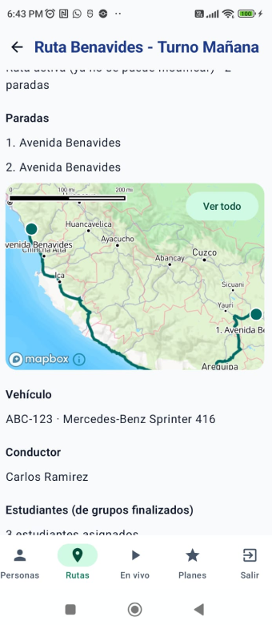<br>
      <sub><b>Figura 1.</b> Búsqueda de direcciones al crear paradas</sub>
    </td>
    <td align="center" width="33%">
      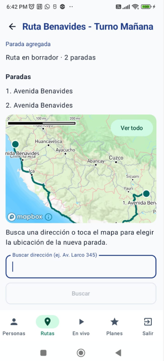<br>
      <sub><b>Figura 2.</b> Búsqueda inversa (tocar el mapa)</sub>
    </td>
    <td align="center" width="33%">
      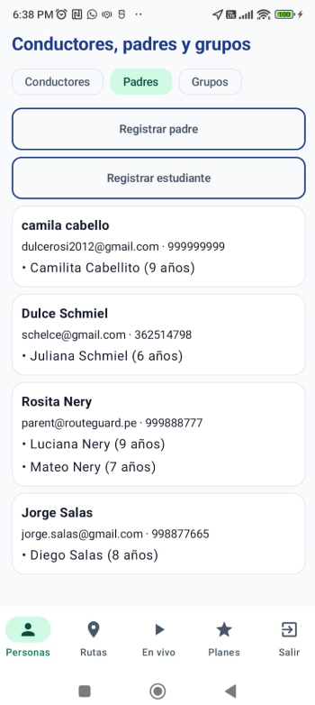<br>
      <sub><b>Figura 3.</b> Búsqueda dentro de Personas</sub>
    </td>
  </tr>
</table>

#### 3.1.2.5. Navigation Systems


La navegación de RouteGuard está pensada para que cada usuario llegue rápido a lo que necesita, sin pasos innecesarios. En el sitio web de presentación (Landing Page) el visitante recorre la propuesta de valor en orden: primero el problema, luego la solución, las funciones, los planes, el producto y el equipo. Una barra superior fija, visible durante todo el recorrido, permite saltar directamente a cada sección, y el desplazamiento entre ellas es suave. Los botones de llamada a la acción, ubicados al inicio y al cierre de la página, guían al visitante hacia el contacto o la prueba del producto. Además, el sitio ofrece un conmutador de tema claro/oscuro que recuerda la preferencia del usuario.

En la aplicación móvil, la navegación principal es una barra inferior que da acceso inmediato, con un solo toque, a las secciones más importantes de cada perfil:

- **Administrador (colegio o empresa de transporte):** Personas, Rutas, En vivo y Planes. Desde aquí gestiona conductores, padres y grupos, define rutas y paradas, supervisa los viajes en tiempo real y administra su suscripción.
- **Conductor:** Viaje y Alertas. Ve la ruta que debe cumplir y recibe avisos importantes.
- **Padre de familia:** Seguimiento y Alertas. Ve en un mapa dónde va el transporte de su hijo y recibe notificaciones del viaje.

Cada perfil solo ve lo que le corresponde. El padre de familia accede a una vista simple, centrada en el mapa y los avisos, mientras que el administrador dispone de herramientas de gestión más completas. Dentro de cada sección se usan pestañas y botones de acción directa; por ejemplo, en Personas el administrador alterna entre Conductores, Padres y Grupos, y desde ahí registra un padre o un estudiante. Al cambiar de sección, la aplicación recuerda en qué punto estaba el usuario, y al cerrar sesión no permite volver a pantallas privadas con el botón "atrás". Esto mantiene un flujo coherente y seguro, acorde con la naturaleza crítica del servicio.


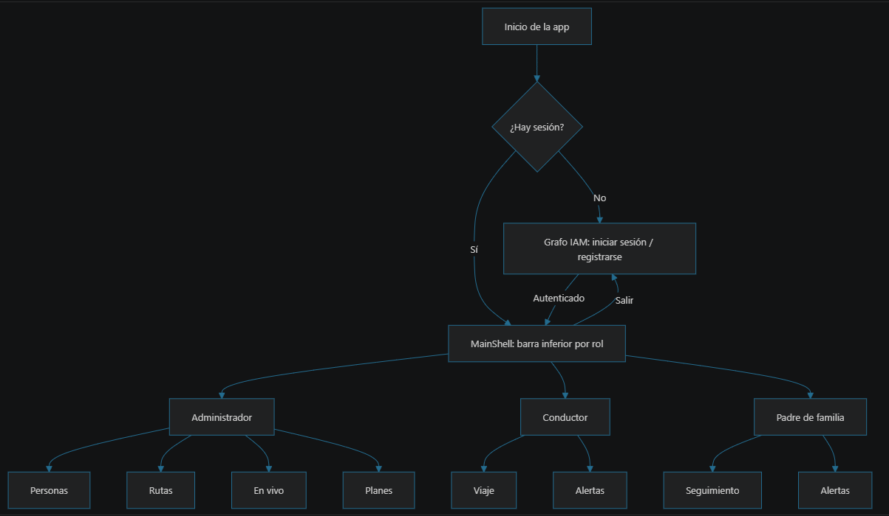


Técnicas de navegación aplicadas: **barra de navegación inferior por rol** (alcance a un toque), **un grafo de navegación por Bounded Context** (cada módulo gestiona sus propias pantallas), **conservación de estado** al cambiar de pestaña (`saveState`/`restoreState` con `launchSingleTop`), **limpieza de la pila de retroceso** al iniciar y cerrar sesión (`popUpTo ... inclusive`) para que "atrás" nunca regrese a una pantalla protegida, y **solicitud contextual del permiso de notificaciones** en Android 13+.

---

### 3.1.3. Landing Page UI Design

La *Landing Page* tiene como objetivo principal captar a dueños de flotas de transporte y presentar las ventajas competitivas de las aplicaciones a los padres.

#### 3.1.3.1. Landing Page Wireframe
A continuación, se presentan los wireframes de baja fidelidad que estructuran la propuesta de la web de aterrizaje, estableciendo el *Hero section*, beneficios, testimonios y *Call to Actions (CTA)*.

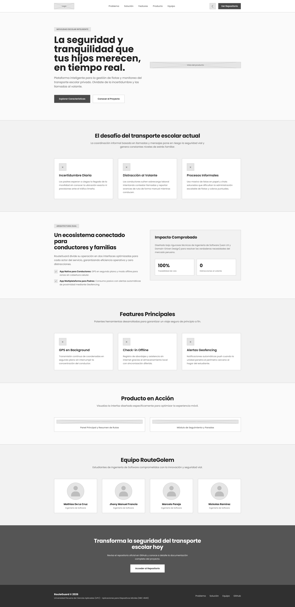

#### 3.1.3.2. Landing Page Mock-up
El diseño final de la Landing Page aplica nuestros colores corporativos y tipografías. Busca convencer visualmente al administrador de transportes para iniciar una prueba gratuita y adquirir nuestros planes.

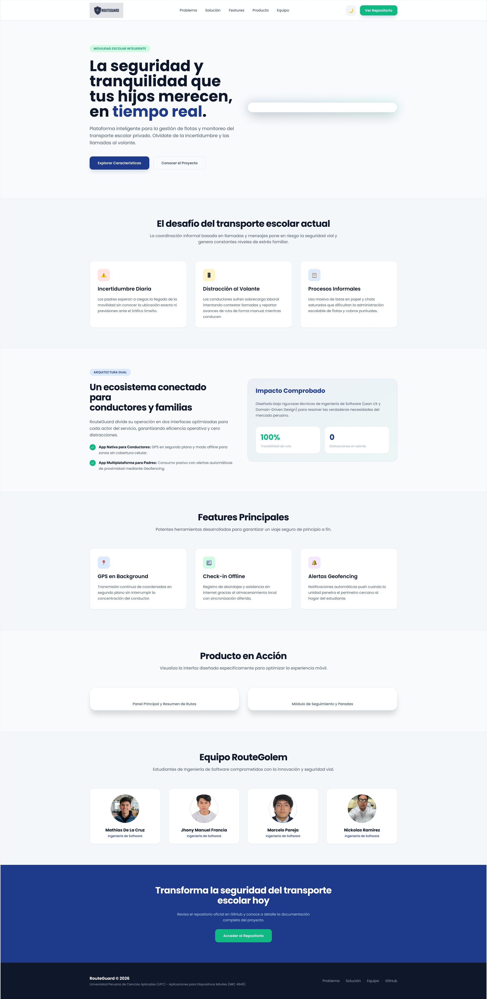


### 3.1.4. Mobile Applications UX/UI Design

El núcleo de RouteGuard reside en sus aplicaciones móviles, diseñadas teniendo en cuenta las fuertes diferencias en el contexto y entorno de uso de ambos usuarios objetivo.

#### 3.1.4.1. Mobile Applications Wireframes
Se elaboraron bocetos iniciales de las vistas críticas de la plataforma:
*   **App Conductor:** Pantalla de selección de ruta, vista de checklist modo offline con botones grandes y accesibles, y botón de incidente a 1 toque.
*   **App Padres:** Panel de estado principal, mapa de monitoreo pasivo, e historial de notificaciones.

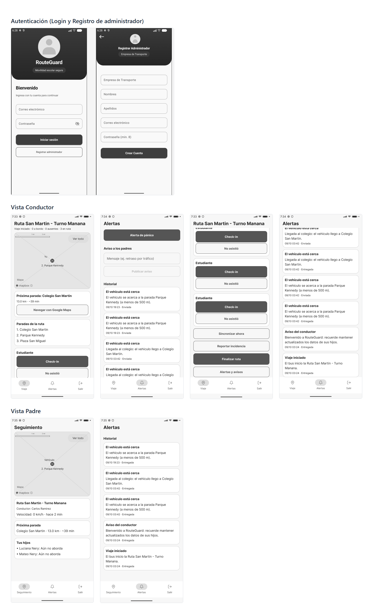

#### 3.1.4.2. Mobile Applications Wireflow Diagrams
Estos diagramas evidencian la interacción entre las pantallas según las decisiones del usuario. Por ejemplo, demuestran cómo la acción simple del conductor ("Registrar Abordaje") desencadena actualizaciones visuales en el flujo de la vista del padre.

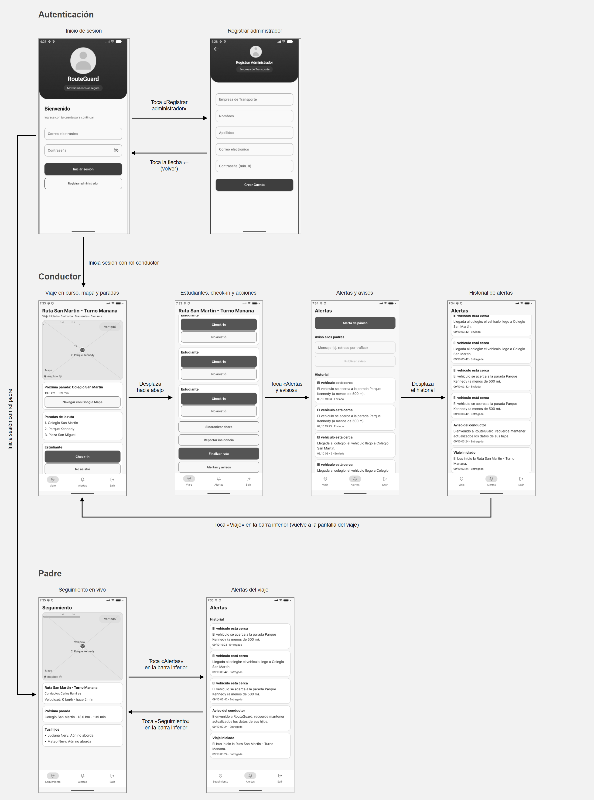

#### 3.1.4.3. Mobile Applications Mock-ups
Los diseños de alta fidelidad muestran la interfaz terminada, aplicando la guía de estilos:
*   En la vista del conductor, predominan controles grandes e intuitivos que evitan la sobrecarga cognitiva durante el viaje.
*   En la vista de los padres, la interfaz es amigable y resume en una vista el estado de seguridad de sus hijos mediante mapas y tarjetas de estado.

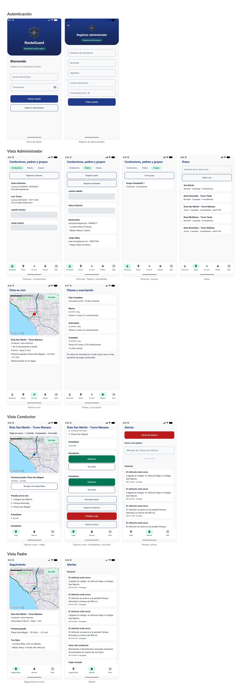

#### 3.1.4.4. Mobile Applications User Flow Diagrams
El *User Flow* diagrama las rutas obligatorias y condicionales (*Happy paths* & *Alternate paths*). Destacan:
*   **Flujo de Ejecución de Ruta (Conductor):** Login -> Seleccionar Ruta -> Modo Viaje (*GPS background tracking* activado) -> Checklists Parada a Parada -> Fin de Ruta.
*   **Flujo de Monitoreo (Padre):** Notificación Push (Alerta Geofence) -> Toca alerta -> Pantalla de Detalles del Recorrido.

Cada *User Flow* representa el recorrido que sigue un usuario para cumplir un **objetivo (*User Goal*)** y se relaciona con las **User Stories** del *Product Backlog* que dicho recorrido cubre. Los diagramas muestran las pantallas reales de la aplicación implementada y representan con un rombo las decisiones del usuario (*Happy paths* y *Alternate paths*).

**User Flow 1. Inicio de sesión y registro de administrador**

- **Usuario:** Administrador (nuevo usuario).
- **Objetivo (*User Goal*):** Ingresar a la plataforma o crear la cuenta de mi empresa de transporte para empezar a gestionar la flota.
- **User Stories relacionadas:** **US-01** Registro y Asignación de Rol.

Desde la pantalla de inicio de sesión, el usuario ingresa con su correo y contraseña o, si es un nuevo administrador, decide registrarse (*¿Registrar administrador?*) y completa empresa, nombres, apellidos, correo y contraseña.


**User Flow 2. Navegación principal del administrador (Home)**

- **Usuario:** Administrador.
- **Objetivo (*User Goal*):** Acceder rápidamente a las rutas, a la flota en vivo y a los planes de suscripción de mi organización.
- **User Stories relacionadas:** **US-02** Adquisición de Plan de Suscripción; **US-16** Asignación de Conductor a Vehículo; **US-08** Monitoreo de Ruta en Tiempo Real.

Tras iniciar sesión, el administrador llega a *Personas* y, desde la barra inferior, decide si desea ver la interfaz de **Rutas**, de **Flota en vivo** o de **Planes**.


**User Flow 3. Consulta de personas**

- **Usuario:** Administrador.
- **Objetivo (*User Goal*):** Consultar los conductores, los padres con sus hijos y los grupos de estudiantes registrados en mi organización.
- **User Stories relacionadas:** **US-11** Registro de Múltiples Hijos; **US-16** Asignación de Conductor a Vehículo.

Desde *Conductores, padres y grupos*, el administrador alterna entre las pestañas de conductores, padres registrados y grupos de estudiantes.


**User Flow 4. Registro de un conductor**

- **Usuario:** Administrador.
- **Objetivo (*User Goal*):** Dar de alta a un conductor de mi flota para poder asignarlo luego a un vehículo y a una ruta.
- **User Stories relacionadas:** **US-01** Registro y Asignación de Rol; **US-16** Asignación de Conductor a Vehículo.

Desde la lista de conductores, *Registrar conductor* abre el formulario con nombres, apellidos, teléfono, número de licencia y correo electrónico.


**User Flow 5. Registro de un padre o de un estudiante**

- **Usuario:** Administrador.
- **Objetivo (*User Goal*):** Registrar a los padres de familia y vincular a sus hijos para que puedan seguir el viaje en la aplicación.
- **User Stories relacionadas:** **US-01** Registro y Asignación de Rol; **US-11** Registro de Múltiples Hijos.

Desde la pestaña *Padres*, el administrador puede registrar un padre de familia o registrar un estudiante, que debe vincularse a un padre ya registrado.


**User Flow 6. Creación de un grupo de estudiantes**

- **Usuario:** Administrador.
- **Objetivo (*User Goal*):** Agrupar a los estudiantes que viajarán juntos para luego asignarlos a una ruta.
- **User Stories relacionadas:** **US-04** Listado y Secuencia de Paradas; **US-11** Registro de Múltiples Hijos.

El flujo guía paso a paso: asignar un nombre al grupo, elegir los padres, incluir a sus estudiantes vinculados y finalizar el grupo.


**User Flow 7. Información de la ruta**

- **Usuario:** Administrador.
- **Objetivo (*User Goal*):** Revisar el detalle de una ruta (paradas) y asignarle un vehículo y un conductor.
- **User Stories relacionadas:** **US-04** Listado y Secuencia de Paradas; **US-03** Gestión de Capacidad Vehicular; **US-16** Asignación de Conductor a Vehículo.

Desde *Flota en vivo*, el administrador puede ver toda la información de una ruta (paradas sobre el mapa, búsqueda de direcciones) y agregarle un vehículo y un conductor.


**User Flow 8. Ruta en vivo**

- **Usuario:** Conductor, padre de familia y administrador.
- **Objetivo (*User Goal*):** Ejecutar y seguir el viaje: el conductor atiende las paradas, el padre sigue el recorrido y recibe alertas, y el administrador supervisa y configura la ruta.
- **User Stories relacionadas:** **US-04** Listado y Secuencia de Paradas; **US-06** Check-in de Abordaje Offline; **US-07** Alerta de Geofencing; **US-08** Monitoreo de Ruta en Tiempo Real; **US-10** Botón de Incidencias Rápido; **US-16** Asignación de Conductor a Vehículo.

Relaciona las vistas del viaje en curso del conductor (paradas, check-in, alertas), el seguimiento del padre y la configuración de la ruta por el administrador (estudiantes, días de servicio, hora de salida, vehículo y conductor).


#### 3.1.4.5. Mobile Applications Prototyping
Se desarrolló un prototipo interactivo en Figma que simula el movimiento, transiciones y flujos entre pantallas. Este recurso sirvió de base fundamental para validar la solución con los usuarios durante las entrevistas de validación finales.

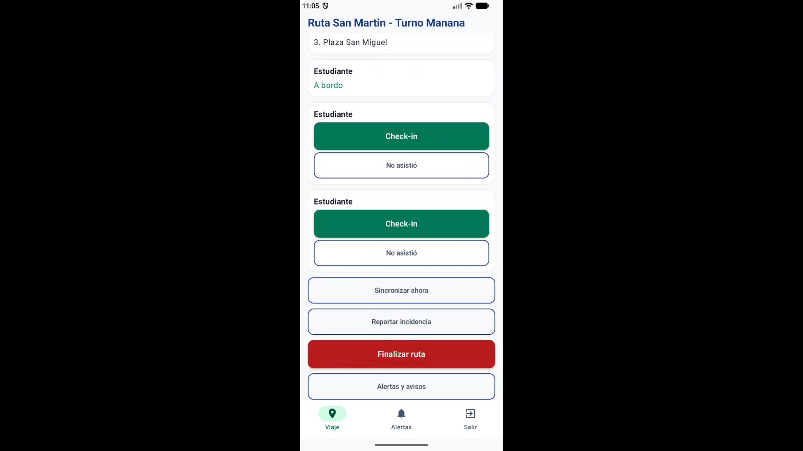

*Video del prototipo en ejecución (YouTube):* [https://youtu.be/co3LZYGSF_w](https://youtu.be/co3LZYGSF_w)

<div style="page-break-after: always;"></div>

# Capítulo IV: Product Implementation & Validation

## 4.1. Software Configuration Management

### 4.1.1. Software Development Environment Configuration

Para el desarrollo del proyecto RouteGuard, el equipo ha configurado un entorno de desarrollo estructurado y especializado para cada plataforma tecnológica. Esta segregación permite mantener estándares de calidad y aprovechar las herramientas de productividad que ofrece cada ecosistema.
- **Backend (Spring Boot):** Se utiliza **IntelliJ IDEA** (JetBrains, 2024b) como Entorno de Desarrollo Integrado (IDE) principal, dado su robusto soporte para el ecosistema Java/Kotlin, integración nativa con Maven/Gradle y herramientas de análisis estático. Esto acelera la construcción de los microservicios y la implementación del diseño guiado por el dominio (Evans, 2003).
- **Mobile (Android & Flutter):** El desarrollo de la aplicación nativa para conductores y la aplicación multiplataforma para padres se realiza utilizando **Android Studio** (Google, 2024b). Este IDE proporciona emuladores avanzados y herramientas de perfilamiento esenciales para integrar la funcionalidad de GPS en segundo plano y geofencing, características vitales para reducir la distracción cognitiva del conductor (Smith & Johnson, 2025) y mitigar la ansiedad de los padres (Chen & Davis, 2025; Chen & Zhao, 2025).
- **Web (Landing Page):** Para el desarrollo web enfocado en la *Landing Page*, se emplea **Visual Studio Code** (Microsoft, 2024), un editor de código ligero, extensible y altamente personalizable mediante plugins, ideal para el desarrollo frontend con HTML, CSS y JavaScript.
- **Diseño UX/UI:** La etapa de prototipado y diseño visual se lleva a cabo en **Figma** (Figma, 2024), plataforma colaborativa que permite iterar recursos gráficos alineados a las mejores prácticas de interfaces para logística y diseño de servicios (Kumar & Lee, 2024; Stickdorn et al., 2018).
- **Gestión de Proyectos:** La planificación ágil, seguimiento de Sprints y asignación de historias de usuario se gestionan mediante **Jira Software** (Atlassian, 2024), complementado con **Trello**. Esto asegura transparencia en el flujo de trabajo y alineación con la metodología Scrum en equipos ágiles (Gothelf & Seiden, 2021; Schwaber & Sutherland, 2020).

### 4.1.2. Source Code Management

La gestión del código fuente (Source Code Management) se centraliza en **GitHub**, actuando como el repositorio principal y entorno colaborativo. Para garantizar la estabilidad e integración progresiva del software, el equipo adopta el modelo de ramificación **GitFlow** (Driessen, 2010), el cual define ramas principales (`main`, `develop`) y ramas de soporte (`feature`, `release`, `hotfix`) para estructurar el ciclo de vida de desarrollo.

Asimismo, el versionado del producto se rige bajo **Semantic Versioning (SemVer)** (Preston-Werner, 2013), un sistema estándar de numeración de versiones (`MAJOR.MINOR.PATCH`) que comunica claramente la compatibilidad y el alcance de los cambios en cada entrega. Para estandarizar el registro de las modificaciones (commits), se aplica la convención de **Conventional Commits** (Conventional Commits, 2024), facilitando la generación automática de changelogs y proporcionando un historial de versiones legible y estructurado.

### 4.1.3. Source Code Style Guide & Conventions

Para mantener un código limpio, legible y mantenible a lo largo de los diferentes ecosistemas tecnológicos, RouteGuard se adhiere a pautas de estilo reconocidas por la industria:
- **Backend (Java/Kotlin):** Se sigue el **Google Java Style Guide** (Google, 2022) para establecer normas estrictas sobre el formato, estructura de clases y nomenclatura. Para los componentes desarrollados en Kotlin, se emplean las **Kotlin Coding Conventions** (JetBrains, 2024a), garantizando idiomaticidad y consistencia.
- **Web (HTML/CSS):** El marcado y los estilos de la *Landing Page* se rigen por el **Google HTML/CSS Style Guide** (Google, 2021), promoviendo la accesibilidad, semántica y validación de estándares web.

### 4.1.4. Software Deployment Configuration

El despliegue de las distintas soluciones de RouteGuard se realiza aprovechando plataformas de *Platform as a Service (PaaS)* y servicios en la nube para asegurar alta disponibilidad y escalabilidad:
- **Backend:** Los microservicios y la API de Spring Boot son desplegados en servicios modernos en la nube como **Railway** (Railway, 2024), los cuales ofrecen integración continua (CI/CD) directamente desde el repositorio de GitHub y aprovisionamiento automático de bases de datos PostgreSQL con extensiones espaciales como PostGIS (PostGIS Project Steering Committee, 2024). Esto es crítico para soportar la carga operativa y logística urbana de forma ininterrumpida (García, López & Torres, 2024).
- **Landing Page:** La aplicación web estática (Landing Page) se despliega utilizando **Vercel** (Vercel, 2024) o alternativamente **GitHub Pages**, herramientas especializadas en alojamiento rápido de frontend que proveen redes de entrega de contenido (CDN) globales y certificados SSL integrados para asegurar un rendimiento óptimo y seguro.

## 4.2. Landing Page & Mobile Application Implementation

### 4.2.1. Sprint 1

En esta sección se registra y explica el avance en términos de producto y trabajo colaborativo para el Sprint 1. El esfuerzo de esta iteración se concentró en establecer la presencia digital del producto a través del Landing Page y construir los cimientos de seguridad y base de datos en el Backend (Identity & Access Management).

#### 4.2.1.1. Sprint Planning 1

El Sprint Planning se llevó a cabo de manera síncrona para definir los objetivos iniciales del desarrollo, estimar los puntos de historia (Story Points) y asignar las tareas técnicas derivadas de los User Stories priorizados en el Product Backlog. Estos acuerdos se consolidan en la **Tabla 27**.

<p><strong>Tabla 27.</strong> <em>Resumen del Sprint Planning 1</em></p>
<table style="border-collapse: collapse; width: 100%; border: 1px solid #ddd;">
  <thead>
    <tr style="background-color: #003366; color: white;">
      <th style="padding: 10px; border: 1px solid #ddd; text-align: left;">Sprint #</th>
      <th style="padding: 10px; border: 1px solid #ddd; text-align: left;">Sprint 1</th>
    </tr>
  </thead>
  <tbody>
    <tr>
      <td style="padding: 10px; border: 1px solid #ddd;"><strong>Sprint Planning Background</strong></td>
      <td style="padding: 10px; border: 1px solid #ddd;"></td>
    </tr>
    <tr>
      <td style="padding: 10px; border: 1px solid #ddd;">Date</td>
      <td style="padding: 10px; border: 1px solid #ddd;">2026-09-10</td>
    </tr>
    <tr>
      <td style="padding: 10px; border: 1px solid #ddd;">Time</td>
      <td style="padding: 10px; border: 1px solid #ddd;">19:00 PM</td>
    </tr>
    <tr>
      <td style="padding: 10px; border: 1px solid #ddd;">Location</td>
      <td style="padding: 10px; border: 1px solid #ddd;">Microsoft Teams (Reunión Virtual)</td>
    </tr>
    <tr>
      <td style="padding: 10px; border: 1px solid #ddd;">Prepared By</td>
      <td style="padding: 10px; border: 1px solid #ddd;">Pareja Calloapaza, Marcelo Fausto</td>
    </tr>
    <tr>
      <td style="padding: 10px; border: 1px solid #ddd;">Attendees (to planning meeting)</td>
      <td style="padding: 10px; border: 1px solid #ddd;">Pareja Calloapaza, Marcelo Fausto / Francia Torres, Jhony Manuel / De la Cruz De los Santos, Mathias Marcelo / Ramirez Ruíz, Nickolas</td>
    </tr>
    <tr>
      <td style="padding: 10px; border: 1px solid #ddd;">Sprint n – 1 Review Summary</td>
      <td style="padding: 10px; border: 1px solid #ddd;">N/A - Al ser el primer Sprint, no hay entregas de software previas a revisar.</td>
    </tr>
    <tr>
      <td style="padding: 10px; border: 1px solid #ddd;">Sprint n – 1 Retrospective Summary</td>
      <td style="padding: 10px; border: 1px solid #ddd;">N/A - Primer Sprint del proyecto.</td>
    </tr>
    <tr>
      <td style="padding: 10px; border: 1px solid #ddd;"><strong>Sprint Goal & User Stories</strong></td>
      <td style="padding: 10px; border: 1px solid #ddd;"></td>
    </tr>
    <tr>
      <td style="padding: 10px; border: 1px solid #ddd;">Sprint 1 Goal</td>
      <td style="padding: 10px; border: 1px solid #ddd;"><strong>Our focus is on</strong> delivering the Landing Page and the Identity & Access Management (IAM) endpoints. <strong>We believe it delivers</strong> a clear product presentation to visitors and foundational security for the ecosystem. <strong>This will be confirmed when</strong> users can view the platform's value proposition online and the backend can issue valid JWT tokens for login.</td>
    </tr>
    <tr>
      <td style="padding: 10px; border: 1px solid #ddd;">Sprint 1 Velocity</td>
      <td style="padding: 10px; border: 1px solid #ddd;">15 Story Points.</td>
    </tr>
    <tr>
      <td style="padding: 10px; border: 1px solid #ddd;">Sum of Story Points</td>
      <td style="padding: 10px; border: 1px solid #ddd;">13 Story Points.</td>
    </tr>
  </tbody>
</table>
<p style="margin-top: 10px;"><em>Nota: Acuerdos, metas y velocidad proyectada para la ejecución del Sprint 1.</em></p>

#### 4.2.1.2. Aspect Leaders and Collaborators

Para mantener una comunicación efectiva y delegar responsabilidades, se elaboró la matriz *Leadership-and-Collaboration Matrix (LACX)* para los aspectos clave del Sprint 1, la cual se detalla en la **Tabla 28**.

<p><strong>Tabla 28.</strong> <em>Matriz de Liderazgo y Colaboración (LACX) del Sprint 1</em></p>
<table style="border-collapse: collapse; width: 100%; border: 1px solid #ddd;">
  <thead>
    <tr style="background-color: #003366; color: white;">
      <th style="padding: 10px; border: 1px solid #ddd; text-align: left;">Team Member</th>
      <th style="padding: 10px; border: 1px solid #ddd; text-align: left;">GitHub Username</th>
      <th style="padding: 10px; border: 1px solid #ddd; text-align: left;">Aspect Name 1: Landing Page (Frontend)</th>
      <th style="padding: 10px; border: 1px solid #ddd; text-align: left;">Aspect Name 2: IAM & Security (Backend)</th>
      <th style="padding: 10px; border: 1px solid #ddd; text-align: left;">Aspect Name 3: Database & DevOps</th>
    </tr>
  </thead>
  <tbody>
    <tr>
      <td style="padding: 10px; border: 1px solid #ddd;">Pareja Calloapaza, Marcelo</td>
      <td style="padding: 10px; border: 1px solid #ddd;">marc3lllob7</td>
      <td style="padding: 10px; border: 1px solid #ddd;">L (Leader)</td>
      <td style="padding: 10px; border: 1px solid #ddd;">C (Collaborator)</td>
      <td style="padding: 10px; border: 1px solid #ddd;">C (Collaborator)</td>
    </tr>
    <tr>
      <td style="padding: 10px; border: 1px solid #ddd;">De la Cruz, Mathias</td>
      <td style="padding: 10px; border: 1px solid #ddd;">Dela0405</td>
      <td style="padding: 10px; border: 1px solid #ddd;">C (Collaborator)</td>
      <td style="padding: 10px; border: 1px solid #ddd;">L (Leader)</td>
      <td style="padding: 10px; border: 1px solid #ddd;">C (Collaborator)</td>
    </tr>
    <tr>
      <td style="padding: 10px; border: 1px solid #ddd;">Francia Torres, Jhony</td>
      <td style="padding: 10px; border: 1px solid #ddd;">ManuelFT4</td>
      <td style="padding: 10px; border: 1px solid #ddd;">C (Collaborator)</td>
      <td style="padding: 10px; border: 1px solid #ddd;">C (Collaborator)</td>
      <td style="padding: 10px; border: 1px solid #ddd;">L (Leader)</td>
    </tr>
    <tr>
      <td style="padding: 10px; border: 1px solid #ddd;">Ramirez Ruíz, Nickolas</td>
      <td style="padding: 10px; border: 1px solid #ddd;">Bynickram02</td>
      <td style="padding: 10px; border: 1px solid #ddd;">C (Collaborator)</td>
      <td style="padding: 10px; border: 1px solid #ddd;">C (Collaborator)</td>
      <td style="padding: 10px; border: 1px solid #ddd;">C (Collaborator)</td>
    </tr>
  </tbody>
</table>
<p style="margin-top: 10px;"><em>Nota: Distribución de roles de liderazgo y colaboración entre los miembros del equipo para el Sprint 1.</em></p>

#### 4.2.1.3. Sprint Backlog 1

Para la gestión de nuestras tareas y User Stories durante este Sprint, utilizamos la herramienta ágil Trello/Jira. El tablero público donde se evidencia el movimiento de tarjetas (To Do, In Progress, In Review, Done) se puede visualizar a continuación:

> **URL del Board del Sprint 1:** [[Enlace Trello](https://trello.com/invite/b/6aaa233b7da14e3f3b292c5b/ATTI088a0337fde735af76ada946f5120d80DD2911AB/sprint-1-routeguard)]

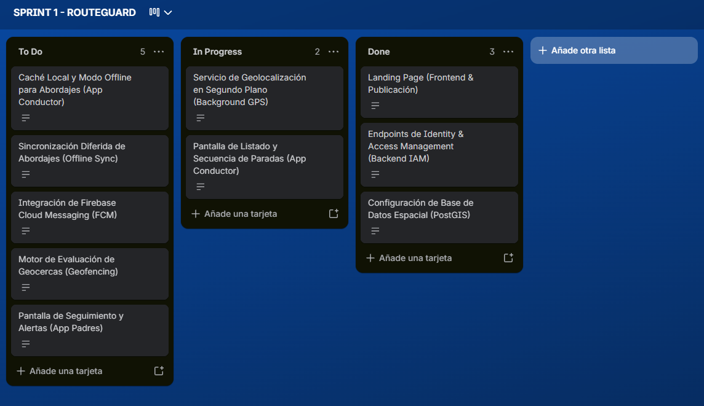

A continuación, se detalla la descomposición de los User Stories en Technical Tasks. La **Tabla 29** muestra este desglose detallado.

<p><strong>Tabla 29.</strong> <em>Descomposición de User Stories en Tareas Técnicas</em></p>
<table style="border-collapse: collapse; width: 100%; border: 1px solid #ddd;">
  <thead>
    <tr style="background-color: #003366; color: white;">
      <th style="padding: 10px; border: 1px solid #ddd; text-align: left;">User Story</th>
      <th style="padding: 10px; border: 1px solid #ddd; text-align: left;"></th>
      <th style="padding: 10px; border: 1px solid #ddd; text-align: left;">Work-Item / Task</th>
      <th style="padding: 10px; border: 1px solid #ddd; text-align: left;"></th>
      <th style="padding: 10px; border: 1px solid #ddd; text-align: left;"></th>
      <th style="padding: 10px; border: 1px solid #ddd; text-align: left;"></th>
      <th style="padding: 10px; border: 1px solid #ddd; text-align: left;"></th>
      <th style="padding: 10px; border: 1px solid #ddd; text-align: left;"></th>
    </tr>
  </thead>
  <tbody>
    <tr>
      <td style="padding: 10px; border: 1px solid #ddd;"><strong>Id</strong></td>
      <td style="padding: 10px; border: 1px solid #ddd;"><strong>Title</strong></td>
      <td style="padding: 10px; border: 1px solid #ddd;"><strong>Id</strong></td>
      <td style="padding: 10px; border: 1px solid #ddd;"><strong>Title</strong></td>
      <td style="padding: 10px; border: 1px solid #ddd;"><strong>Description</strong></td>
      <td style="padding: 10px; border: 1px solid #ddd;"><strong>Estimation (Hours)</strong></td>
      <td style="padding: 10px; border: 1px solid #ddd;"><strong>Assigned To</strong></td>
      <td style="padding: 10px; border: 1px solid #ddd;"><strong>Status</strong></td>
    </tr>
    <tr>
      <td style="padding: 10px; border: 1px solid #ddd;">US-01</td>
      <td style="padding: 10px; border: 1px solid #ddd;">Registro y Asignación de Rol</td>
      <td style="padding: 10px; border: 1px solid #ddd;">TK-101</td>
      <td style="padding: 10px; border: 1px solid #ddd;">Diseño de Entidades JPA</td>
      <td style="padding: 10px; border: 1px solid #ddd;">Crear entidades User, Role y Credential en Spring Boot con relaciones mapeadas.</td>
      <td style="padding: 10px; border: 1px solid #ddd;">4</td>
      <td style="padding: 10px; border: 1px solid #ddd;">Mathias</td>
      <td style="padding: 10px; border: 1px solid #ddd;">Done</td>
    </tr>
    <tr>
      <td style="padding: 10px; border: 1px solid #ddd;">US-01</td>
      <td style="padding: 10px; border: 1px solid #ddd;">Registro y Asignación de Rol</td>
      <td style="padding: 10px; border: 1px solid #ddd;">TK-102</td>
      <td style="padding: 10px; border: 1px solid #ddd;">Configurar Spring Security</td>
      <td style="padding: 10px; border: 1px solid #ddd;">Implementar la configuración de seguridad y filtros JWT.</td>
      <td style="padding: 10px; border: 1px solid #ddd;">6</td>
      <td style="padding: 10px; border: 1px solid #ddd;">Mathias</td>
      <td style="padding: 10px; border: 1px solid #ddd;">Done</td>
    </tr>
    <tr>
      <td style="padding: 10px; border: 1px solid #ddd;">US-01</td>
      <td style="padding: 10px; border: 1px solid #ddd;">Registro y Asignación de Rol</td>
      <td style="padding: 10px; border: 1px solid #ddd;">TK-103</td>
      <td style="padding: 10px; border: 1px solid #ddd;">IAM Controllers</td>
      <td style="padding: 10px; border: 1px solid #ddd;">Exponer los endpoints REST de `/api/v1/auth/sign-in` y `sign-up`.</td>
      <td style="padding: 10px; border: 1px solid #ddd;">5</td>
      <td style="padding: 10px; border: 1px solid #ddd;">Marcelo</td>
      <td style="padding: 10px; border: 1px solid #ddd;">Done</td>
    </tr>
    <tr>
      <td style="padding: 10px; border: 1px solid #ddd;">US-13</td>
      <td style="padding: 10px; border: 1px solid #ddd;">Gestión de Perfil</td>
      <td style="padding: 10px; border: 1px solid #ddd;">TK-104</td>
      <td style="padding: 10px; border: 1px solid #ddd;">Repositorios y Servicios</td>
      <td style="padding: 10px; border: 1px solid #ddd;">Crear el UserJPARepository y UserAppService para actualizar datos.</td>
      <td style="padding: 10px; border: 1px solid #ddd;">4</td>
      <td style="padding: 10px; border: 1px solid #ddd;">Nickolas</td>
      <td style="padding: 10px; border: 1px solid #ddd;">Done</td>
    </tr>
    <tr>
      <td style="padding: 10px; border: 1px solid #ddd;">TS-04</td>
      <td style="padding: 10px; border: 1px solid #ddd;">Pipeline CI/CD</td>
      <td style="padding: 10px; border: 1px solid #ddd;">TK-105</td>
      <td style="padding: 10px; border: 1px solid #ddd;">Configurar GitHub Actions</td>
      <td style="padding: 10px; border: 1px solid #ddd;">Crear el archivo .yml para compilación automática de Java/Spring.</td>
      <td style="padding: 10px; border: 1px solid #ddd;">3</td>
      <td style="padding: 10px; border: 1px solid #ddd;">Jhony</td>
      <td style="padding: 10px; border: 1px solid #ddd;">Done</td>
    </tr>
    <tr>
      <td style="padding: 10px; border: 1px solid #ddd;">N/A</td>
      <td style="padding: 10px; border: 1px solid #ddd;">Landing Page</td>
      <td style="padding: 10px; border: 1px solid #ddd;">TK-106</td>
      <td style="padding: 10px; border: 1px solid #ddd;">Maquetación HTML/CSS</td>
      <td style="padding: 10px; border: 1px solid #ddd;">Traducir los wireframes de Figma a código HTML semántico y CSS (Material).</td>
      <td style="padding: 10px; border: 1px solid #ddd;">8</td>
      <td style="padding: 10px; border: 1px solid #ddd;">Todos</td>
      <td style="padding: 10px; border: 1px solid #ddd;">Done</td>
    </tr>
    <tr>
      <td style="padding: 10px; border: 1px solid #ddd;">N/A</td>
      <td style="padding: 10px; border: 1px solid #ddd;">Landing Page</td>
      <td style="padding: 10px; border: 1px solid #ddd;">TK-107</td>
      <td style="padding: 10px; border: 1px solid #ddd;">Responsive Design</td>
      <td style="padding: 10px; border: 1px solid #ddd;">Adaptar el Landing Page para correcta visualización en móviles (Media Queries).</td>
      <td style="padding: 10px; border: 1px solid #ddd;">5</td>
      <td style="padding: 10px; border: 1px solid #ddd;">Todos</td>
      <td style="padding: 10px; border: 1px solid #ddd;">Done</td>
    </tr>
  </tbody>
</table>
<p style="margin-top: 10px;"><em>Nota: Desglose de historias de usuario en tareas técnicas específicas, con estimaciones de esfuerzo y asignación de responsables para el Sprint 1.</em></p>

#### 4.2.1.4. Development Evidence for Sprint Review

Tal como se documenta en la **Tabla 30**, a continuación se presentan las evidencias del desarrollo.

<p><strong>Tabla 30.</strong> <em>Evidencias de Desarrollo para el Sprint Review</em></p>
<table style="border-collapse: collapse; width: 100%; border: 1px solid #ddd;">
  <thead>
    <tr style="background-color: #003366; color: white;">
      <th style="padding: 10px; border: 1px solid #ddd; text-align: left;">Repository</th>
      <th style="padding: 10px; border: 1px solid #ddd; text-align: left;">Branch</th>
      <th style="padding: 10px; border: 1px solid #ddd; text-align: left;">Commit Id</th>
      <th style="padding: 10px; border: 1px solid #ddd; text-align: left;">Author</th>
      <th style="padding: 10px; border: 1px solid #ddd; text-align: left;">Commit Message</th>
      <th style="padding: 10px; border: 1px solid #ddd; text-align: left;">Commit Message Body</th>
      <th style="padding: 10px; border: 1px solid #ddd; text-align: left;">Commited on (Date)</th>
    </tr>
  </thead>
  <tbody>
    <tr>
      <td style="padding: 10px; border: 1px solid #ddd;"><code>routeguard-web-services</code></td>
      <td style="padding: 10px; border: 1px solid #ddd;"><code>main</code> / <code>deploy</code></td>
      <td style="padding: 10px; border: 1px solid #ddd;"><a href="https://github.com/upc-pre-202620-1acc0238-4945-routegolem/routeguard-web-services/commit/e1af89c"><code>e1af89c</code></a></td>
      <td style="padding: 10px; border: 1px solid #ddd;">Mathias De la Cruz</td>
      <td style="padding: 10px; border: 1px solid #ddd;"><code>Merge branch 'main' of routeguard-web-services</code></td>
      <td style="padding: 10px; border: 1px solid #ddd;">Consolidación de imagen Docker en Azure Container Registry con tag latest y verificación del smoke test <code>GET /health</code> en Azure App Service.</td>
      <td style="padding: 10px; border: 1px solid #ddd;">2026-10-09</td>
    </tr>
    <tr>
      <td style="padding: 10px; border: 1px solid #ddd;"><code>routeguard-web-services</code></td>
      <td style="padding: 10px; border: 1px solid #ddd;"><code>main</code> / <code>deploy</code></td>
      <td style="padding: 10px; border: 1px solid #ddd;"><a href="https://github.com/upc-pre-202620-1acc0238-4945-routegolem/routeguard-web-services/commit/0ed0e63"><code>0ed0e63</code></a></td>
      <td style="padding: 10px; border: 1px solid #ddd;">Mathias De la Cruz</td>
      <td style="padding: 10px; border: 1px solid #ddd;"><code>feat: migrate persistence to PostgreSQL and prepare Azure deployment</code></td>
      <td style="padding: 10px; border: 1px solid #ddd;">Migración del motor relacional a PostgreSQL Flexible Server en Azure, actualización de cadenas de conexión y configuración del pipeline de despliegue en GitHub Actions.</td>
      <td style="padding: 10px; border: 1px solid #ddd;">2026-10-09</td>
    </tr>
    <tr>
      <td style="padding: 10px; border: 1px solid #ddd;"><code>routeguard-web-services</code></td>
      <td style="padding: 10px; border: 1px solid #ddd;"><code>develop</code></td>
      <td style="padding: 10px; border: 1px solid #ddd;"><a href="https://github.com/upc-pre-202620-1acc0238-4945-routegolem/routeguard-web-services/commit/6c047b4"><code>6c047b4</code></a></td>
      <td style="padding: 10px; border: 1px solid #ddd;">Mathias De la Cruz</td>
      <td style="padding: 10px; border: 1px solid #ddd;"><code>fix(auth): store the session token before resolving the driver or parent profile</code></td>
      <td style="padding: 10px; border: 1px solid #ddd;">Corrección del flujo de inicio de sesión asegurando la persistencia en memoria del token JWT antes de la consulta de perfil contextual en IAM.</td>
      <td style="padding: 10px; border: 1px solid #ddd;">2026-10-09</td>
    </tr>
    <tr>
      <td style="padding: 10px; border: 1px solid #ddd;"><code>routeguard-web-services</code></td>
      <td style="padding: 10px; border: 1px solid #ddd;"><code>develop</code></td>
      <td style="padding: 10px; border: 1px solid #ddd;"><a href="https://github.com/upc-pre-202620-1acc0238-4945-routegolem/routeguard-web-services/commit/b2e2dd7"><code>b2e2dd7</code></a></td>
      <td style="padding: 10px; border: 1px solid #ddd;">Marcelo Pareja</td>
      <td style="padding: 10px; border: 1px solid #ddd;"><code>fix: enable swagger in production for render testing</code></td>
      <td style="padding: 10px; border: 1px solid #ddd;">Habilitación del middleware Swagger UI y OpenAPI spec para entornos de nube y verificación remota de endpoints REST.</td>
      <td style="padding: 10px; border: 1px solid #ddd;">2026-10-09</td>
    </tr>
    <tr>
      <td style="padding: 10px; border: 1px solid #ddd;"><code>routeguard-web-services</code></td>
      <td style="padding: 10px; border: 1px solid #ddd;"><code>develop</code></td>
      <td style="padding: 10px; border: 1px solid #ddd;"><a href="https://github.com/upc-pre-202620-1acc0238-4945-routegolem/routeguard-web-services/commit/02442b1"><code>02442b1</code></a></td>
      <td style="padding: 10px; border: 1px solid #ddd;">Mathias De la Cruz</td>
      <td style="padding: 10px; border: 1px solid #ddd;"><code>refactor(platform): rename bounded contexts to match the report names</code></td>
      <td style="padding: 10px; border: 1px solid #ddd;">Homologación de nombres de namespaces y carpetas con los 6 Bounded Contexts definidos en el Ubiquitous Language del informe técnico.</td>
      <td style="padding: 10px; border: 1px solid #ddd;">2026-10-08</td>
    </tr>
    <tr>
      <td style="padding: 10px; border: 1px solid #ddd;"><code>routeguard-web-services</code></td>
      <td style="padding: 10px; border: 1px solid #ddd;"><code>develop</code></td>
      <td style="padding: 10px; border: 1px solid #ddd;"><a href="https://github.com/upc-pre-202620-1acc0238-4945-routegolem/routeguard-web-services/commit/068f381"><code>068f381</code></a></td>
      <td style="padding: 10px; border: 1px solid #ddd;">Marcelo Pareja</td>
      <td style="padding: 10px; border: 1px solid #ddd;"><code>feat(db): add migration RemoveCrossContextFkAndSyncModels</code></td>
      <td style="padding: 10px; border: 1px solid #ddd;">Creación y aplicación de migración en EF Core eliminando claves foráneas entre Bounded Contexts para preservar la autonomía de agregados según DDD.</td>
      <td style="padding: 10px; border: 1px solid #ddd;">2026-10-04</td>
    </tr>
    <tr>
      <td style="padding: 10px; border: 1px solid #ddd;"><code>routeguard-web-services</code></td>
      <td style="padding: 10px; border: 1px solid #ddd;"><code>develop</code></td>
      <td style="padding: 10px; border: 1px solid #ddd;"><a href="https://github.com/upc-pre-202620-1acc0238-4945-routegolem/routeguard-web-services/commit/d33a003"><code>d33a003</code></a></td>
      <td style="padding: 10px; border: 1px solid #ddd;">Marcelo Pareja</td>
      <td style="padding: 10px; border: 1px solid #ddd;"><code>refactor(shared): remove domain value objects and duplicate VehicleResource from shared kernel</code></td>
      <td style="padding: 10px; border: 1px solid #ddd;">Desacoplamiento del Shared Kernel eliminando Value Objects redundantes y manteniendo modelos de dominio independientes.</td>
      <td style="padding: 10px; border: 1px solid #ddd;">2026-10-04</td>
    </tr>
    <tr>
      <td style="padding: 10px; border: 1px solid #ddd;"><code>routeguard-web-services</code></td>
      <td style="padding: 10px; border: 1px solid #ddd;"><code>develop</code></td>
      <td style="padding: 10px; border: 1px solid #ddd;"><a href="https://github.com/upc-pre-202620-1acc0238-4945-routegolem/routeguard-web-services/commit/d19afe8"><code>d19afe8</code></a></td>
      <td style="padding: 10px; border: 1px solid #ddd;">Marcelo Pareja</td>
      <td style="padding: 10px; border: 1px solid #ddd;"><code>refactor(iam,fleet,notifications): split aggregate services and localize value objects</code></td>
      <td style="padding: 10px; border: 1px solid #ddd;">Descomposición de servicios monolíticos en clases segregadas de CommandServices y QueryServices por agregado en IAM, Fleet y Notifications.</td>
      <td style="padding: 10px; border: 1px solid #ddd;">2026-10-04</td>
    </tr>
    <tr>
      <td style="padding: 10px; border: 1px solid #ddd;"><code>routeguard-web-services</code></td>
      <td style="padding: 10px; border: 1px solid #ddd;"><code>develop</code></td>
      <td style="padding: 10px; border: 1px solid #ddd;"><a href="https://github.com/upc-pre-202620-1acc0238-4945-routegolem/routeguard-web-services/commit/6d41faa"><code>6d41faa</code></a></td>
      <td style="padding: 10px; border: 1px solid #ddd;">Marcelo Pareja</td>
      <td style="padding: 10px; border: 1px solid #ddd;"><code>feat(trip): add vehicle-locations adapter for legacy hardware payloads</code></td>
      <td style="padding: 10px; border: 1px solid #ddd;">Implementación del controlador <code>VehicleLocationsAdapterController</code> para la ingesta telemática de tramas de dispositivos GPS externos.</td>
      <td style="padding: 10px; border: 1px solid #ddd;">2026-10-04</td>
    </tr>
    <tr>
      <td style="padding: 10px; border: 1px solid #ddd;"><code>routeguard-web-services</code></td>
      <td style="padding: 10px; border: 1px solid #ddd;"><code>develop</code></td>
      <td style="padding: 10px; border: 1px solid #ddd;"><a href="https://github.com/upc-pre-202620-1acc0238-4945-routegolem/routeguard-web-services/commit/1b3287e"><code>1b3287e</code></a></td>
      <td style="padding: 10px; border: 1px solid #ddd;">Marcelo Pareja</td>
      <td style="padding: 10px; border: 1px solid #ddd;"><code>refactor(trip): localize value objects and decouple from shared kernel</code></td>
      <td style="padding: 10px; border: 1px solid #ddd;">Aislamiento de Value Objects para geolocalización, bitácora de paradas y estados de viaje en Trip Execution &amp; Monitoring.</td>
      <td style="padding: 10px; border: 1px solid #ddd;">2026-10-04</td>
    </tr>
    <tr>
      <td style="padding: 10px; border: 1px solid #ddd;"><code>routeguard-web-services</code></td>
      <td style="padding: 10px; border: 1px solid #ddd;"><code>develop</code></td>
      <td style="padding: 10px; border: 1px solid #ddd;"><a href="https://github.com/upc-pre-202620-1acc0238-4945-routegolem/routeguard-web-services/commit/fc973b4"><code>fc973b4</code></a></td>
      <td style="padding: 10px; border: 1px solid #ddd;">Marcelo Pareja</td>
      <td style="padding: 10px; border: 1px solid #ddd;"><code>refactor(subscription): split plan/subscription services and localize value objects</code></td>
      <td style="padding: 10px; border: 1px solid #ddd;">Separación de servicios y repositorios de planes y suscripciones SaaS para desacoplar el ciclo de facturación de la gestión de usuarios.</td>
      <td style="padding: 10px; border: 1px solid #ddd;">2026-10-04</td>
    </tr>
    <tr>
      <td style="padding: 10px; border: 1px solid #ddd;"><code>routeguard-web-services</code></td>
      <td style="padding: 10px; border: 1px solid #ddd;"><code>develop</code></td>
      <td style="padding: 10px; border: 1px solid #ddd;"><a href="https://github.com/upc-pre-202620-1acc0238-4945-routegolem/routeguard-web-services/commit/1804f3f"><code>1804f3f</code></a></td>
      <td style="padding: 10px; border: 1px solid #ddd;">Marcelo Pareja</td>
      <td style="padding: 10px; border: 1px solid #ddd;"><code>refactor(stakeholder): split god services per aggregate and localize value objects</code></td>
      <td style="padding: 10px; border: 1px solid #ddd;">Segregación de servicios y repositorios de perfiles para Conductores, Padres de Familia y Grupos de Estudiantes en Stakeholder Context.</td>
      <td style="padding: 10px; border: 1px solid #ddd;">2026-10-04</td>
    </tr>
    <tr>
      <td style="padding: 10px; border: 1px solid #ddd;"><code>routeguard-web-services</code></td>
      <td style="padding: 10px; border: 1px solid #ddd;"><code>develop</code></td>
      <td style="padding: 10px; border: 1px solid #ddd;"><a href="https://github.com/upc-pre-202620-1acc0238-4945-routegolem/routeguard-web-services/commit/275e95f"><code>275e95f</code></a></td>
      <td style="padding: 10px; border: 1px solid #ddd;">Marcelo Pareja</td>
      <td style="padding: 10px; border: 1px solid #ddd;"><code>chore(platform): register split services in DI and configure user secrets</code></td>
      <td style="padding: 10px; border: 1px solid #ddd;">Registro de dependencias desacopladas en el contenedor IoC de ASP.NET Core, configuración de secretos y mensajería MassTransit con RabbitMQ.</td>
      <td style="padding: 10px; border: 1px solid #ddd;">2026-10-04</td>
    </tr>
    <tr>
      <td style="padding: 10px; border: 1px solid #ddd;"><code>routeguard-native-app</code></td>
      <td style="padding: 10px; border: 1px solid #ddd;"><code>develop</code></td>
      <td style="padding: 10px; border: 1px solid #ddd;"><a href="https://github.com/upc-pre-202620-1acc0238-4945-routegolem/routeguard-native-app/commit/4389e9f"><code>4389e9f</code></a></td>
      <td style="padding: 10px; border: 1px solid #ddd;">Marcelo Pareja</td>
      <td style="padding: 10px; border: 1px solid #ddd;"><code>chore(network): point BASE_URL to Render production environment</code></td>
      <td style="padding: 10px; border: 1px solid #ddd;">Configuración de la URL base del cliente Retrofit para consumo directo de los servicios desplegados en la nube.</td>
      <td style="padding: 10px; border: 1px solid #ddd;">2026-10-09</td>
    </tr>
    <tr>
      <td style="padding: 10px; border: 1px solid #ddd;"><code>routeguard-native-app</code></td>
      <td style="padding: 10px; border: 1px solid #ddd;"><code>develop</code></td>
      <td style="padding: 10px; border: 1px solid #ddd;"><a href="https://github.com/upc-pre-202620-1acc0238-4945-routegolem/routeguard-native-app/commit/4b873b6"><code>4b873b6</code></a></td>
      <td style="padding: 10px; border: 1px solid #ddd;">Marcelo Pareja</td>
      <td style="padding: 10px; border: 1px solid #ddd;"><code>fix(room): correct androidx.room3 imports to standard androidx.room and finalize offline persistence setup</code></td>
      <td style="padding: 10px; border: 1px solid #ddd;">Estandarización de dependencias de Room DB, definición de entidades locales y DAOs para almacenamiento offline de eventos de abordaje y GPS.</td>
      <td style="padding: 10px; border: 1px solid #ddd;">2026-10-09</td>
    </tr>
    <tr>
      <td style="padding: 10px; border: 1px solid #ddd;"><code>routeguard-native-app</code></td>
      <td style="padding: 10px; border: 1px solid #ddd;"><code>develop</code></td>
      <td style="padding: 10px; border: 1px solid #ddd;"><a href="https://github.com/upc-pre-202620-1acc0238-4945-routegolem/routeguard-native-app/commit/bdd5cfa"><code>bdd5cfa</code></a></td>
      <td style="padding: 10px; border: 1px solid #ddd;">Marcelo Pareja</td>
      <td style="padding: 10px; border: 1px solid #ddd;"><code>feat(ui): rescate de paleta de colores y UI del compañero</code></td>
      <td style="padding: 10px; border: 1px solid #ddd;">Integración de la identidad visual de RouteGuard, tokens de color corporativos y componentes accesibles en Material Design 3.</td>
      <td style="padding: 10px; border: 1px solid #ddd;">2026-10-09</td>
    </tr>
    <tr>
      <td style="padding: 10px; border: 1px solid #ddd;"><code>routeguard-native-app</code></td>
      <td style="padding: 10px; border: 1px solid #ddd;"><code>develop</code></td>
      <td style="padding: 10px; border: 1px solid #ddd;"><a href="https://github.com/upc-pre-202620-1acc0238-4945-routegolem/routeguard-native-app/commit/df87269"><code>df87269</code></a></td>
      <td style="padding: 10px; border: 1px solid #ddd;">Marcelo Pareja</td>
      <td style="padding: 10px; border: 1px solid #ddd;"><code>refactor(ddd): move bounded contexts to root package, add value classes and ACL mappers</code></td>
      <td style="padding: 10px; border: 1px solid #ddd;">Reorganización arquitectónica de la app móvil en Kotlin alineada con Bounded Contexts, Value Classes y mappers Anti-Corruption Layer.</td>
      <td style="padding: 10px; border: 1px solid #ddd;">2026-10-04</td>
    </tr>
    <tr>
      <td style="padding: 10px; border: 1px solid #ddd;"><code>routeguard-landing-page</code></td>
      <td style="padding: 10px; border: 1px solid #ddd;"><code>develop</code></td>
      <td style="padding: 10px; border: 1px solid #ddd;"><a href="https://github.com/upc-pre-202620-1acc0238-4945-routegolem/routeguard-landing-page/commit/01a66f3"><code>01a66f3</code></a></td>
      <td style="padding: 10px; border: 1px solid #ddd;">Mathias De la Cruz</td>
      <td style="padding: 10px; border: 1px solid #ddd;"><code>feat(landing): add hamburger menu for mobile navigation</code></td>
      <td style="padding: 10px; border: 1px solid #ddd;">Diseño responsivo del header institucional con menú hamburguesa colapsable para dispositivos móviles con viewport menor a 768 px.</td>
      <td style="padding: 10px; border: 1px solid #ddd;">2026-10-09</td>
    </tr>
    <tr>
      <td style="padding: 10px; border: 1px solid #ddd;"><code>routeguard-landing-page</code></td>
      <td style="padding: 10px; border: 1px solid #ddd;"><code>develop</code></td>
      <td style="padding: 10px; border: 1px solid #ddd;"><a href="https://github.com/upc-pre-202620-1acc0238-4945-routegolem/routeguard-landing-page/commit/0a36c29"><code>0a36c29</code></a></td>
      <td style="padding: 10px; border: 1px solid #ddd;">Mathias De la Cruz</td>
      <td style="padding: 10px; border: 1px solid #ddd;"><code>refactor(landing): move landing to repo root and fix asset paths for GitHub Pages</code></td>
      <td style="padding: 10px; border: 1px solid #ddd;">Reestructuración del repositorio trasladando archivos estáticos al root para el build y hosting automático en GitHub Pages.</td>
      <td style="padding: 10px; border: 1px solid #ddd;">2026-10-08</td>
    </tr>
    <tr>
      <td style="padding: 10px; border: 1px solid #ddd;"><code>routeguard-report</code></td>
      <td style="padding: 10px; border: 1px solid #ddd;"><code>develop</code></td>
      <td style="padding: 10px; border: 1px solid #ddd;"><a href="https://github.com/upc-pre-202620-1acc0238-4945-routegolem/routeguard-report/commit/cd651ae"><code>cd651ae</code></a></td>
      <td style="padding: 10px; border: 1px solid #ddd;">Mathias De la Cruz</td>
      <td style="padding: 10px; border: 1px solid #ddd;"><code>docs(chapter-4): fix links and inline code in HTML tables; point API link to Swagger</code></td>
      <td style="padding: 10px; border: 1px solid #ddd;">Corrección de formato de marcado HTML en tablas de evidencias, sustitución de sintaxis backtick por etiquetas code y vinculación con Swagger UI.</td>
      <td style="padding: 10px; border: 1px solid #ddd;">2026-10-10</td>
    </tr>
    <tr>
      <td style="padding: 10px; border: 1px solid #ddd;"><code>routeguard-report</code></td>
      <td style="padding: 10px; border: 1px solid #ddd;"><code>develop</code></td>
      <td style="padding: 10px; border: 1px solid #ddd;"><a href="https://github.com/upc-pre-202620-1acc0238-4945-routegolem/routeguard-report/commit/386931c"><code>386931c</code></a></td>
      <td style="padding: 10px; border: 1px solid #ddd;">Mathias De la Cruz</td>
      <td style="padding: 10px; border: 1px solid #ddd;"><code>docs(chapter-4): add Sprint 1 execution and deployment evidence</code></td>
      <td style="padding: 10px; border: 1px solid #ddd;">Documentación de evidencias de ejecución de la Landing Page, endpoints IAM en producción y arquitectura de despliegue en Microsoft Azure.</td>
      <td style="padding: 10px; border: 1px solid #ddd;">2026-10-10</td>
    </tr>
    <tr>
      <td style="padding: 10px; border: 1px solid #ddd;"><code>routeguard-report</code></td>
      <td style="padding: 10px; border: 1px solid #ddd;"><code>develop</code></td>
      <td style="padding: 10px; border: 1px solid #ddd;"><a href="https://github.com/upc-pre-202620-1acc0238-4945-routegolem/routeguard-report/commit/0357d74"><code>0357d74</code></a></td>
      <td style="padding: 10px; border: 1px solid #ddd;">Jhony Manuel Francia</td>
      <td style="padding: 10px; border: 1px solid #ddd;"><code>docs(README): Create userflow file</code></td>
      <td style="padding: 10px; border: 1px solid #ddd;">Integración de diagramas de flujo de usuario (User Flows) para los recorridos críticos de transportistas y padres de familia.</td>
      <td style="padding: 10px; border: 1px solid #ddd;">2026-10-10</td>
    </tr>
    <tr>
      <td style="padding: 10px; border: 1px solid #ddd;"><code>routeguard-report</code></td>
      <td style="padding: 10px; border: 1px solid #ddd;"><code>develop</code></td>
      <td style="padding: 10px; border: 1px solid #ddd;"><a href="https://github.com/upc-pre-202620-1acc0238-4945-routegolem/routeguard-report/commit/3d589cb"><code>3d589cb</code></a></td>
      <td style="padding: 10px; border: 1px solid #ddd;">Nickolas Ramirez</td>
      <td style="padding: 10px; border: 1px solid #ddd;"><code>docs: fix lean ux canvas hypotheses and learning assumptions (1.2.2.4)</code></td>
      <td style="padding: 10px; border: 1px solid #ddd;">Refinamiento de hipótesis del Lean UX Canvas y suposiciones de aprendizaje para el segmento de transportistas y padres de familia.</td>
      <td style="padding: 10px; border: 1px solid #ddd;">2026-10-10</td>
    </tr>
    <tr>
      <td style="padding: 10px; border: 1px solid #ddd;"><code>routeguard-report</code></td>
      <td style="padding: 10px; border: 1px solid #ddd;"><code>develop</code></td>
      <td style="padding: 10px; border: 1px solid #ddd;"><a href="https://github.com/upc-pre-202620-1acc0238-4945-routegolem/routeguard-report/commit/8c3f288"><code>8c3f288</code></a></td>
      <td style="padding: 10px; border: 1px solid #ddd;">Nickolas Ramirez</td>
      <td style="padding: 10px; border: 1px solid #ddd;"><code>docs: add sprint planning 1 with sprint goal and story points (4.2.1.1)</code></td>
      <td style="padding: 10px; border: 1px solid #ddd;">Planificación y estructuración del Sprint 1, definición del Sprint Goal y estimación de puntos de historia en el Sprint Backlog.</td>
      <td style="padding: 10px; border: 1px solid #ddd;">2026-10-10</td>
    </tr>
  </tbody>
</table>
<p style="margin-top: 10px;"><em>Nota: Repositorio y enlaces a los commits y pull requests principales generados durante el ciclo de desarrollo.</em></p>

#### 4.2.1.5. Testing Suite Evidence for Sprint Review

Como se resume en la **Tabla 31**, se incluyen las pruebas ejecutadas durante la revisión del sprint.

<p><strong>Tabla 31.</strong> <em>Evidencia del Testing Suite para el Sprint Review</em></p>
<table style="border-collapse: collapse; width: 100%; border: 1px solid #ddd;">
  <thead>
    <tr style="background-color: #003366; color: white;">
      <th style="padding: 10px; border: 1px solid #ddd; text-align: left;">Repository</th>
      <th style="padding: 10px; border: 1px solid #ddd; text-align: left;">Branch</th>
      <th style="padding: 10px; border: 1px solid #ddd; text-align: left;">Commit Id</th>
      <th style="padding: 10px; border: 1px solid #ddd; text-align: left;">Commit Message</th>
      <th style="padding: 10px; border: 1px solid #ddd; text-align: left;">Commit Message Body</th>
      <th style="padding: 10px; border: 1px solid #ddd; text-align: left;">Commited on (Date)</th>
    </tr>
  </thead>
  <tbody>
    <tr>
      <td style="padding: 10px; border: 1px solid #ddd;"><code>routeguard-native-app</code></td>
      <td style="padding: 10px; border: 1px solid #ddd;"><code>develop</code></td>
      <td style="padding: 10px; border: 1px solid #ddd;"><a href="https://github.com/upc-pre-202620-1acc0238-4945-routegolem/routeguard-native-app/commit/25f72b8"><code>25f72b8</code></a></td>
      <td style="padding: 10px; border: 1px solid #ddd;"><code>test: add NotificationDto deserialization test and update RouteProgressTest imports</code></td>
      <td style="padding: 10px; border: 1px solid #ddd;">Pruebas unitarias de deserialización JSON de DTOs de notificaciones Push (FCM) y cálculo de avance en paradas de ruta con JUnit y MockK.</td>
      <td style="padding: 10px; border: 1px solid #ddd;">2026-10-04</td>
    </tr>
    <tr>
      <td style="padding: 10px; border: 1px solid #ddd;"><code>routeguard-web-services</code></td>
      <td style="padding: 10px; border: 1px solid #ddd;"><code>deploy</code> / <code>main</code></td>
      <td style="padding: 10px; border: 1px solid #ddd;"><a href="https://github.com/upc-pre-202620-1acc0238-4945-routegolem/routeguard-web-services/commit/0ed0e63"><code>0ed0e63</code></a></td>
      <td style="padding: 10px; border: 1px solid #ddd;"><code>feat: migrate persistence to PostgreSQL and prepare Azure deployment</code></td>
      <td style="padding: 10px; border: 1px solid #ddd;">Batería de 96 pruebas automáticas de integración sobre PostgreSQL validando autenticación, autorización por rol, ciclo de vida de viajes y disparador de geocercas (96/96 satisfactorias).</td>
      <td style="padding: 10px; border: 1px solid #ddd;">2026-10-09</td>
    </tr>
    <tr>
      <td style="padding: 10px; border: 1px solid #ddd;"><code>routeguard-web-services</code></td>
      <td style="padding: 10px; border: 1px solid #ddd;"><code>deploy</code> / <code>main</code></td>
      <td style="padding: 10px; border: 1px solid #ddd;"><a href="https://github.com/upc-pre-202620-1acc0238-4945-routegolem/routeguard-web-services/commit/e1af89c"><code>e1af89c</code></a></td>
      <td style="padding: 10px; border: 1px solid #ddd;"><code>Merge branch 'main' of routeguard-web-services</code></td>
      <td style="padding: 10px; border: 1px solid #ddd;">Prueba de disponibilidad continua (Smoke Test) en GitHub Actions validando respuesta HTTP 200 Healthy en <code>GET /health</code> en Azure App Service.</td>
      <td style="padding: 10px; border: 1px solid #ddd;">2026-10-09</td>
    </tr>
  </tbody>
</table>
<p style="margin-top: 10px;"><em>Nota: Listado de pruebas de validación y verificación de la calidad del software entregado en este sprint.</em></p>

#### 4.2.1.6. Execution Evidence for Sprint Review

La meta del Sprint 1 consistió en entregar el *Landing Page* y los endpoints de *Identity & Access Management* (IAM) capaces de emitir tokens JWT válidos. La evidencia de ejecución se presenta en tres partes: (a) la landing publicada y accesible en línea, (b) la ejecución real de los endpoints IAM desplegados, y (c) la aplicación móvil consumiendo dichos endpoints. Todas las verificaciones de esta sección se realizaron el **2026-10-10** sobre los servicios desplegados.

**a) Landing Page en ejecución**

La landing está publicada en GitHub Pages y es accesible en la URL [https://upc-pre-202620-1acc0238-4945-routegolem.github.io/routeguard-landing-page/](https://upc-pre-202620-1acc0238-4945-routegolem.github.io/routeguard-landing-page/). Las figuras siguientes muestran el sitio en producción en formato escritorio y móvil (con el botón de menú tipo *hamburguesa* visible bajo 768 px).

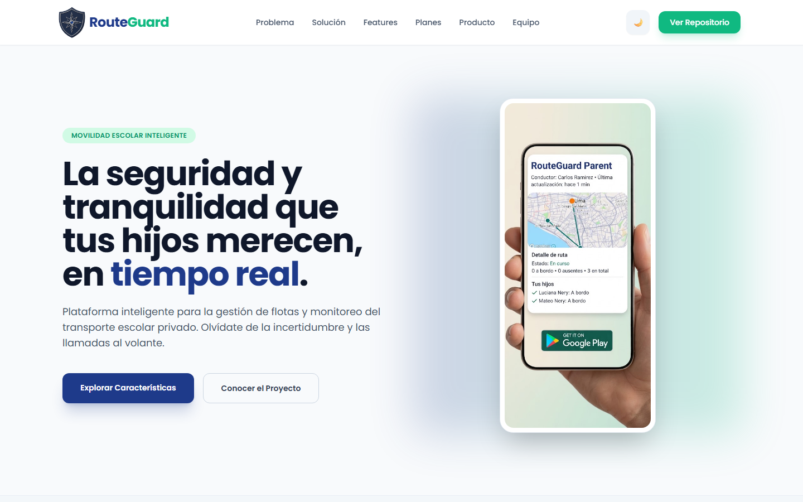

*Landing Page publicada, vista de escritorio (1440 px).*

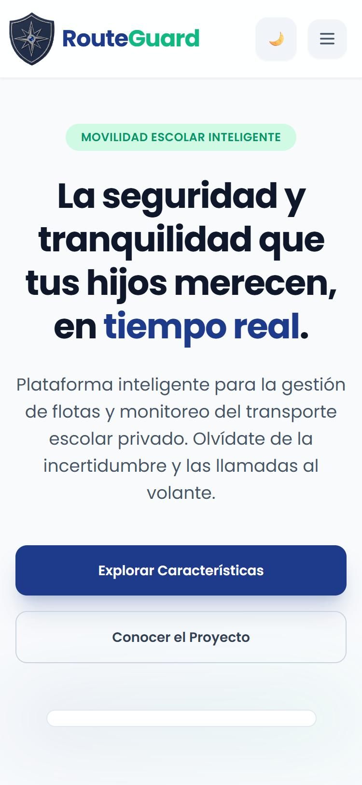

*Landing Page publicada, vista móvil (375 px) con menú de navegación colapsable.*

<p><strong>Tabla 32.</strong> <em>Verificación de la ejecución del Landing Page</em></p>
<table style="border-collapse: collapse; width: 100%; border: 1px solid #ddd;">
  <thead>
    <tr style="background-color: #003366; color: white;">
      <th style="padding: 10px; border: 1px solid #ddd; text-align: left;">Verificación</th>
      <th style="padding: 10px; border: 1px solid #ddd; text-align: left;">Resultado esperado</th>
      <th style="padding: 10px; border: 1px solid #ddd; text-align: left;">Resultado obtenido</th>
    </tr>
  </thead>
  <tbody>
    <tr>
      <td style="padding: 10px; border: 1px solid #ddd;">Acceso a la URL pública (<code>GET /</code>)</td>
      <td style="padding: 10px; border: 1px solid #ddd;">HTTP 200 sobre HTTPS</td>
      <td style="padding: 10px; border: 1px solid #ddd;">HTTP 200 OK, servidor <code>GitHub.com</code></td>
    </tr>
    <tr>
      <td style="padding: 10px; border: 1px solid #ddd;">Última publicación</td>
      <td style="padding: 10px; border: 1px solid #ddd;">Contenido actualizado</td>
      <td style="padding: 10px; border: 1px solid #ddd;"><code>Last-Modified: Fri, 09 Oct 2026 09:27:08 GMT</code></td>
    </tr>
    <tr>
      <td style="padding: 10px; border: 1px solid #ddd;">Secciones de la página</td>
      <td style="padding: 10px; border: 1px solid #ddd;">Problema, Solución, Features, Planes, Producto, Equipo</td>
      <td style="padding: 10px; border: 1px solid #ddd;">Las seis secciones navegables desde el menú</td>
    </tr>
    <tr>
      <td style="padding: 10px; border: 1px solid #ddd;">Tema claro / oscuro</td>
      <td style="padding: 10px; border: 1px solid #ddd;">Botón que alterna el tema y recuerda la preferencia</td>
      <td style="padding: 10px; border: 1px solid #ddd;">Implementado en <code>script.js</code> (clase <code>dark</code> y preferencia en <code>localStorage</code>)</td>
    </tr>
    <tr>
      <td style="padding: 10px; border: 1px solid #ddd;">Diseño responsive</td>
      <td style="padding: 10px; border: 1px solid #ddd;">Menú colapsable y contenido en una columna en móvil</td>
      <td style="padding: 10px; border: 1px solid #ddd;">Botón hamburguesa visible bajo 768 px; secciones en una columna</td>
    </tr>
    <tr>
      <td style="padding: 10px; border: 1px solid #ddd;">Enlaces al repositorio</td>
      <td style="padding: 10px; border: 1px solid #ddd;">Apuntan al repositorio del reporte</td>
      <td style="padding: 10px; border: 1px solid #ddd;">Correctos en cabecera, hero y pie de página</td>
    </tr>
  </tbody>
</table>
<p style="margin-top: 10px;"><em>Nota: Verificación manual y por solicitud HTTP a la landing publicada. El video de validación con usuario se incrusta desde YouTube.</em></p>

**b) Endpoints IAM en ejecución**

Los endpoints de IAM están desplegados en Azure (ver sección 4.2.1.8) y documentados en Swagger. Los recursos expuestos por el contexto son:

- `POST /api/v1/organizations`: registra una empresa de transporte (tenant).
- `POST /api/v1/users`: *sign-up* de un usuario con rol `ADMIN`, `DRIVER` o `PARENT`.
- `POST /api/v1/users/sign-in`: autenticación; devuelve los datos del usuario y un token JWT.
- `GET /api/v1/users` y `GET /api/v1/users/{userId}`: consulta de usuarios (restringida por rol).

<p><strong>Tabla 33.</strong> <em>Pruebas de ejecución de los endpoints IAM sobre el backend desplegado</em></p>
<table style="border-collapse: collapse; width: 100%; border: 1px solid #ddd;">
  <thead>
    <tr style="background-color: #003366; color: white;">
      <th style="padding: 10px; border: 1px solid #ddd; text-align: left;">#</th>
      <th style="padding: 10px; border: 1px solid #ddd; text-align: left;">Endpoint</th>
      <th style="padding: 10px; border: 1px solid #ddd; text-align: left;">Caso de prueba</th>
      <th style="padding: 10px; border: 1px solid #ddd; text-align: left;">Resultado esperado</th>
      <th style="padding: 10px; border: 1px solid #ddd; text-align: left;">Resultado obtenido</th>
    </tr>
  </thead>
  <tbody>
    <tr>
      <td style="padding: 10px; border: 1px solid #ddd;">1</td>
      <td style="padding: 10px; border: 1px solid #ddd;"><code>POST /api/v1/users/sign-in</code></td>
      <td style="padding: 10px; border: 1px solid #ddd;">Credenciales válidas de un administrador</td>
      <td style="padding: 10px; border: 1px solid #ddd;">200 y token JWT con rol <code>ADMIN</code></td>
      <td style="padding: 10px; border: 1px solid #ddd;">200; token de 753 caracteres con rol <code>ADMIN</code></td>
    </tr>
    <tr>
      <td style="padding: 10px; border: 1px solid #ddd;">2</td>
      <td style="padding: 10px; border: 1px solid #ddd;"><code>POST /api/v1/users/sign-in</code></td>
      <td style="padding: 10px; border: 1px solid #ddd;">Credenciales válidas de un conductor</td>
      <td style="padding: 10px; border: 1px solid #ddd;">200 y token JWT con rol <code>DRIVER</code></td>
      <td style="padding: 10px; border: 1px solid #ddd;">200; rol <code>DRIVER</code></td>
    </tr>
    <tr>
      <td style="padding: 10px; border: 1px solid #ddd;">3</td>
      <td style="padding: 10px; border: 1px solid #ddd;"><code>POST /api/v1/users/sign-in</code></td>
      <td style="padding: 10px; border: 1px solid #ddd;">Credenciales válidas de un padre</td>
      <td style="padding: 10px; border: 1px solid #ddd;">200 y token JWT con rol <code>PARENT</code></td>
      <td style="padding: 10px; border: 1px solid #ddd;">200; rol <code>PARENT</code></td>
    </tr>
    <tr>
      <td style="padding: 10px; border: 1px solid #ddd;">4</td>
      <td style="padding: 10px; border: 1px solid #ddd;"><code>POST /api/v1/users/sign-in</code></td>
      <td style="padding: 10px; border: 1px solid #ddd;">Contraseña incorrecta</td>
      <td style="padding: 10px; border: 1px solid #ddd;">Rechazo sin emitir token</td>
      <td style="padding: 10px; border: 1px solid #ddd;">400</td>
    </tr>
    <tr>
      <td style="padding: 10px; border: 1px solid #ddd;">5</td>
      <td style="padding: 10px; border: 1px solid #ddd;"><code>POST /api/v1/users/sign-in</code></td>
      <td style="padding: 10px; border: 1px solid #ddd;">Cuerpo vacío</td>
      <td style="padding: 10px; border: 1px solid #ddd;">Rechazo por validación</td>
      <td style="padding: 10px; border: 1px solid #ddd;">400</td>
    </tr>
    <tr>
      <td style="padding: 10px; border: 1px solid #ddd;">6</td>
      <td style="padding: 10px; border: 1px solid #ddd;"><code>GET /api/v1/users</code></td>
      <td style="padding: 10px; border: 1px solid #ddd;">Sin token</td>
      <td style="padding: 10px; border: 1px solid #ddd;">No autenticado</td>
      <td style="padding: 10px; border: 1px solid #ddd;">401</td>
    </tr>
    <tr>
      <td style="padding: 10px; border: 1px solid #ddd;">7</td>
      <td style="padding: 10px; border: 1px solid #ddd;"><code>GET /api/v1/users</code></td>
      <td style="padding: 10px; border: 1px solid #ddd;">Token de <code>ADMIN</code></td>
      <td style="padding: 10px; border: 1px solid #ddd;">Acceso permitido</td>
      <td style="padding: 10px; border: 1px solid #ddd;">200</td>
    </tr>
    <tr>
      <td style="padding: 10px; border: 1px solid #ddd;">8</td>
      <td style="padding: 10px; border: 1px solid #ddd;"><code>GET /api/v1/users</code></td>
      <td style="padding: 10px; border: 1px solid #ddd;">Token de <code>DRIVER</code></td>
      <td style="padding: 10px; border: 1px solid #ddd;">Prohibido por rol</td>
      <td style="padding: 10px; border: 1px solid #ddd;">403</td>
    </tr>
    <tr>
      <td style="padding: 10px; border: 1px solid #ddd;">9</td>
      <td style="padding: 10px; border: 1px solid #ddd;"><code>GET /api/v1/users</code></td>
      <td style="padding: 10px; border: 1px solid #ddd;">Token de <code>PARENT</code></td>
      <td style="padding: 10px; border: 1px solid #ddd;">Prohibido por rol</td>
      <td style="padding: 10px; border: 1px solid #ddd;">403</td>
    </tr>
    <tr>
      <td style="padding: 10px; border: 1px solid #ddd;">10</td>
      <td style="padding: 10px; border: 1px solid #ddd;"><code>GET /api/v1/routes</code></td>
      <td style="padding: 10px; border: 1px solid #ddd;">Token de <code>PARENT</code> (recurso de otro rol)</td>
      <td style="padding: 10px; border: 1px solid #ddd;">Prohibido por rol</td>
      <td style="padding: 10px; border: 1px solid #ddd;">403</td>
    </tr>
    <tr>
      <td style="padding: 10px; border: 1px solid #ddd;">11</td>
      <td style="padding: 10px; border: 1px solid #ddd;"><code>GET /api/v1/users</code></td>
      <td style="padding: 10px; border: 1px solid #ddd;">Token inventado</td>
      <td style="padding: 10px; border: 1px solid #ddd;">No autenticado</td>
      <td style="padding: 10px; border: 1px solid #ddd;">401</td>
    </tr>
  </tbody>
</table>
<p style="margin-top: 10px;"><em>Nota: Pruebas ejecutadas el 2026-10-10 (07:17 UTC) contra el servicio desplegado en Azure, con las cuentas de demostración del sistema. Las contraseñas y los tokens no se incluyen en este reporte.</em></p>

<p><strong>Tabla 34.</strong> <em>Contenido del token JWT emitido por IAM</em></p>
<table style="border-collapse: collapse; width: 100%; border: 1px solid #ddd;">
  <thead>
    <tr style="background-color: #003366; color: white;">
      <th style="padding: 10px; border: 1px solid #ddd; text-align: left;">Claim</th>
      <th style="padding: 10px; border: 1px solid #ddd; text-align: left;">Descripción</th>
    </tr>
  </thead>
  <tbody>
    <tr>
      <td style="padding: 10px; border: 1px solid #ddd;"><code>nameidentifier</code></td>
      <td style="padding: 10px; border: 1px solid #ddd;">Identificador único del usuario</td>
    </tr>
    <tr>
      <td style="padding: 10px; border: 1px solid #ddd;"><code>emailaddress</code> y <code>name</code></td>
      <td style="padding: 10px; border: 1px solid #ddd;">Correo y nombre completo del usuario</td>
    </tr>
    <tr>
      <td style="padding: 10px; border: 1px solid #ddd;"><code>role</code></td>
      <td style="padding: 10px; border: 1px solid #ddd;">Rol del usuario (<code>ADMIN</code>, <code>DRIVER</code> o <code>PARENT</code>); con él la API autoriza cada recurso</td>
    </tr>
    <tr>
      <td style="padding: 10px; border: 1px solid #ddd;"><code>organizationId</code></td>
      <td style="padding: 10px; border: 1px solid #ddd;">Empresa de transporte a la que pertenece el usuario (aislamiento por tenant)</td>
    </tr>
    <tr>
      <td style="padding: 10px; border: 1px solid #ddd;"><code>iat</code>, <code>nbf</code>, <code>exp</code></td>
      <td style="padding: 10px; border: 1px solid #ddd;">Emisión, inicio de validez y expiración; el token es válido por 7 días (10 080 minutos)</td>
    </tr>
  </tbody>
</table>
<p style="margin-top: 10px;"><em>Nota: Claims verificados decodificando el token devuelto por <code>sign-in</code>.</em></p>

Adicionalmente, el 2026-10-09 se ejecutó una batería de **96 comprobaciones automáticas de integración** (autenticación, autorización por rol, flujo completo de un viaje, geocercas y notificaciones) sobre el backend con PostgreSQL, con resultado de 96 satisfactorias y ninguna fallida. Este script de pruebas aún no está versionado en el repositorio.

**c) Aplicación móvil consumiendo IAM**

La aplicación Android consume `sign-in` y, según el rol del token, presenta una navegación distinta: el administrador gestiona personas, rutas, flota en vivo y planes; el conductor ejecuta el viaje; y el padre sigue el recorrido en tiempo real. La figura siguiente muestra el inicio de sesión, el registro del administrador y la pantalla principal de cada rol. Por privacidad, los datos de contacto de personas reales registradas durante las pruebas se ocultaron con recuadros grises.

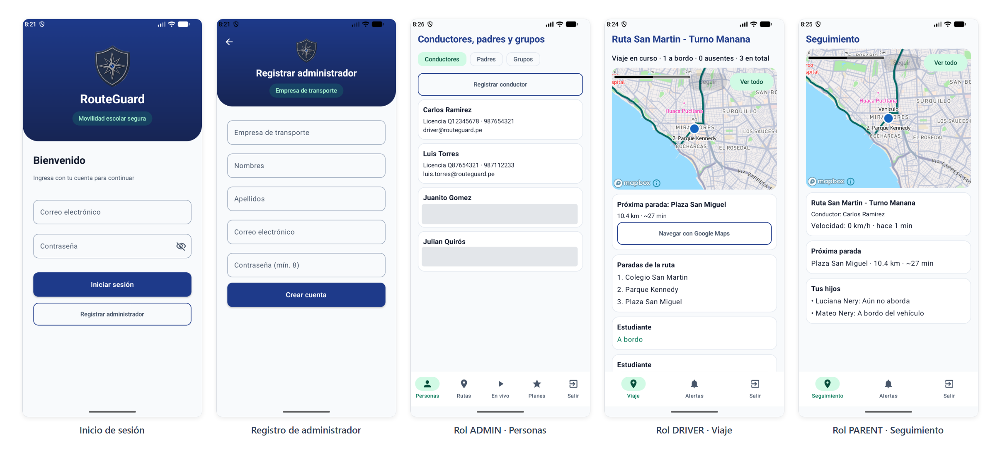

*Aplicación Android conectada al backend desplegado: login, registro y navegación por rol (ADMIN, DRIVER, PARENT).*

#### 4.2.1.7. Services Documentation Evidence for Sprint Review

El backend de RouteGuard implementa una arquitectura orientada al dominio (*Domain-Driven Design*), construida sobre **ASP.NET Core (.NET 10)** y desplegada en **Azure App Service (Linux Containers)**. Toda la superficie de la API REST está documentada mediante la especificación OpenAPI v3 y expuesta de forma interactiva a través de **Swagger UI**, permitiendo la inspección de esquemas, parámetros y pruebas de invocación en vivo.

* **Base URL de Producción:** <a href="https://routeguard-api-mobiles-a3cza3byc3b3dpfs.brazilsouth-01.azurewebsites.net"><code>https://routeguard-api-mobiles-a3cza3byc3b3dpfs.brazilsouth-01.azurewebsites.net</code></a>
* **Documentación Interactiva (Swagger UI):** <a href="https://routeguard-api-mobiles-a3cza3byc3b3dpfs.brazilsouth-01.azurewebsites.net/swagger/index.html"><code>https://routeguard-api-mobiles-a3cza3byc3b3dpfs.brazilsouth-01.azurewebsites.net/swagger/index.html</code></a>
* **Especificación OpenAPI (JSON):** <a href="https://routeguard-api-mobiles-a3cza3byc3b3dpfs.brazilsouth-01.azurewebsites.net/swagger/v1/swagger.json"><code>https://routeguard-api-mobiles-a3cza3byc3b3dpfs.brazilsouth-01.azurewebsites.net/swagger/v1/swagger.json</code></a>
* **Esquema de Seguridad:** La API implementa autenticación basada en tokens JWT (*JSON Web Tokens*). Todas las peticiones a endpoints protegidos deben incluir el encabezado HTTP:
  ```http
  Authorization: Bearer <token_jwt>
  ```
  Los únicos endpoints públicos de libre acceso son el registro inicial (<code>POST /api/v1/users</code>), el inicio de sesión (<code>POST /api/v1/users/sign-in</code>), el sondeo de disponibilidad (<code>GET /health</code>) y la consola de documentación Swagger.

Como se detalla en la **Tabla 35**, a continuación se presenta el catálogo consolidado de endpoints REST distribuidos por Bounded Context:

<p><strong>Tabla 35.</strong> <em>Catálogo de Servicios y Endpoints REST de la Plataforma RouteGuard</em></p>
<table style="border-collapse: collapse; width: 100%; border: 1px solid #ddd;">
  <thead>
    <tr style="background-color: #003366; color: white;">
      <th style="padding: 10px; border: 1px solid #ddd; text-align: left;">Bounded Context</th>
      <th style="padding: 10px; border: 1px solid #ddd; text-align: left;">Método</th>
      <th style="padding: 10px; border: 1px solid #ddd; text-align: left;">Ruta (Endpoint)</th>
      <th style="padding: 10px; border: 1px solid #ddd; text-align: left;">Descripción de Operación</th>
      <th style="padding: 10px; border: 1px solid #ddd; text-align: left;">Autorización</th>
    </tr>
  </thead>
  <tbody>
    <tr>
      <td rowspan="5" style="padding: 10px; border: 1px solid #ddd;"><strong>Identity &amp; Access Management (IAM)</strong></td>
      <td style="padding: 10px; border: 1px solid #ddd;"><code>POST</code></td>
      <td style="padding: 10px; border: 1px solid #ddd;"><code>/api/v1/users</code></td>
      <td style="padding: 10px; border: 1px solid #ddd;">Registra una cuenta de usuario asignando el rol especificado (<code>ROLE_ADMIN</code>, <code>ROLE_DRIVER</code>, <code>ROLE_PARENT</code>).</td>
      <td style="padding: 10px; border: 1px solid #ddd;">Público (Anónimo)</td>
    </tr>
    <tr>
      <td style="padding: 10px; border: 1px solid #ddd;"><code>POST</code></td>
      <td style="padding: 10px; border: 1px solid #ddd;"><code>/api/v1/users/sign-in</code></td>
      <td style="padding: 10px; border: 1px solid #ddd;">Autentica credenciales y emite el token JWT de sesión con claims de identidad y rol.</td>
      <td style="padding: 10px; border: 1px solid #ddd;">Público (Anónimo)</td>
    </tr>
    <tr>
      <td style="padding: 10px; border: 1px solid #ddd;"><code>GET</code></td>
      <td style="padding: 10px; border: 1px solid #ddd;"><code>/api/v1/users/{userId}</code></td>
      <td style="padding: 10px; border: 1px solid #ddd;">Recupera los datos de perfil y estado de cuenta del usuario identificado por su GUID.</td>
      <td style="padding: 10px; border: 1px solid #ddd;"><code>Bearer JWT</code></td>
    </tr>
    <tr>
      <td style="padding: 10px; border: 1px solid #ddd;"><code>POST</code></td>
      <td style="padding: 10px; border: 1px solid #ddd;"><code>/api/v1/organizations</code></td>
      <td style="padding: 10px; border: 1px solid #ddd;">Crea una organización escolar o empresa de movilidad vinculada al administrador.</td>
      <td style="padding: 10px; border: 1px solid #ddd;"><code>Bearer JWT</code> (Admin)</td>
    </tr>
    <tr>
      <td style="padding: 10px; border: 1px solid #ddd;"><code>GET</code></td>
      <td style="padding: 10px; border: 1px solid #ddd;"><code>/api/v1/organizations/{organizationId}</code></td>
      <td style="padding: 10px; border: 1px solid #ddd;">Obtiene el perfil corporativo, razón social y configuración de la organización.</td>
      <td style="padding: 10px; border: 1px solid #ddd;"><code>Bearer JWT</code></td>
    </tr>
    <tr>
      <td rowspan="8" style="padding: 10px; border: 1px solid #ddd;"><strong>Fleet &amp; Route Management</strong></td>
      <td style="padding: 10px; border: 1px solid #ddd;"><code>POST</code></td>
      <td style="padding: 10px; border: 1px solid #ddd;"><code>/api/v1/routes</code></td>
      <td style="padding: 10px; border: 1px solid #ddd;">Define una nueva ruta de transporte escolar asociada a una organización.</td>
      <td style="padding: 10px; border: 1px solid #ddd;"><code>Bearer JWT</code> (Admin)</td>
    </tr>
    <tr>
      <td style="padding: 10px; border: 1px solid #ddd;"><code>GET</code></td>
      <td style="padding: 10px; border: 1px solid #ddd;"><code>/api/v1/routes</code></td>
      <td style="padding: 10px; border: 1px solid #ddd;">Lista todas las rutas vigentes registradas, con filtro opcional por <code>organizationId</code>.</td>
      <td style="padding: 10px; border: 1px solid #ddd;"><code>Bearer JWT</code></td>
    </tr>
    <tr>
      <td style="padding: 10px; border: 1px solid #ddd;"><code>GET</code></td>
      <td style="padding: 10px; border: 1px solid #ddd;"><code>/api/v1/routes/{routeId}</code></td>
      <td style="padding: 10px; border: 1px solid #ddd;">Obtiene el detalle completo de la ruta: waypoints, paradas, conductor y vehículo asignado.</td>
      <td style="padding: 10px; border: 1px solid #ddd;"><code>Bearer JWT</code></td>
    </tr>
    <tr>
      <td style="padding: 10px; border: 1px solid #ddd;"><code>POST</code></td>
      <td style="padding: 10px; border: 1px solid #ddd;"><code>/api/v1/routes/{routeId}/stops</code></td>
      <td style="padding: 10px; border: 1px solid #ddd;">Agrega un punto de parada (*Stop*) con coordenadas geográficas y radio de geocerca en metros.</td>
      <td style="padding: 10px; border: 1px solid #ddd;"><code>Bearer JWT</code> (Admin)</td>
    </tr>
    <tr>
      <td style="padding: 10px; border: 1px solid #ddd;"><code>PUT</code></td>
      <td style="padding: 10px; border: 1px solid #ddd;"><code>/api/v1/routes/{routeId}/vehicle</code></td>
      <td style="padding: 10px; border: 1px solid #ddd;">Asigna una unidad vehicular de la flota como responsable operativa de la ruta.</td>
      <td style="padding: 10px; border: 1px solid #ddd;"><code>Bearer JWT</code> (Admin)</td>
    </tr>
    <tr>
      <td style="padding: 10px; border: 1px solid #ddd;"><code>PUT</code></td>
      <td style="padding: 10px; border: 1px solid #ddd;"><code>/api/v1/routes/{routeId}/driver</code></td>
      <td style="padding: 10px; border: 1px solid #ddd;">Asigna formalmente al conductor titular encargado de operar el recorrido.</td>
      <td style="padding: 10px; border: 1px solid #ddd;"><code>Bearer JWT</code> (Admin)</td>
    </tr>
    <tr>
      <td style="padding: 10px; border: 1px solid #ddd;"><code>POST</code></td>
      <td style="padding: 10px; border: 1px solid #ddd;"><code>/api/v1/routes/{routeId}/activate</code></td>
      <td style="padding: 10px; border: 1px solid #ddd;">Valida precondiciones y cambia el estado a activa, publicando <code>RouteActivationFinalized</code>.</td>
      <td style="padding: 10px; border: 1px solid #ddd;"><code>Bearer JWT</code> (Admin)</td>
    </tr>
    <tr>
      <td style="padding: 10px; border: 1px solid #ddd;"><code>POST</code></td>
      <td style="padding: 10px; border: 1px solid #ddd;"><code>/api/v1/vehicles</code></td>
      <td style="padding: 10px; border: 1px solid #ddd;">Registra un vehículo en la flota escolar (placa, modelo, capacidad de pasajeros y SOAT).</td>
      <td style="padding: 10px; border: 1px solid #ddd;"><code>Bearer JWT</code> (Admin)</td>
    </tr>
    <tr>
      <td rowspan="6" style="padding: 10px; border: 1px solid #ddd;"><strong>Stakeholder &amp; Asset Management</strong></td>
      <td style="padding: 10px; border: 1px solid #ddd;"><code>POST</code></td>
      <td style="padding: 10px; border: 1px solid #ddd;"><code>/api/v1/drivers</code></td>
      <td style="padding: 10px; border: 1px solid #ddd;">Registra el perfil del conductor, número de brevete y datos de contacto de emergencia.</td>
      <td style="padding: 10px; border: 1px solid #ddd;"><code>Bearer JWT</code></td>
    </tr>
    <tr>
      <td style="padding: 10px; border: 1px solid #ddd;"><code>GET</code></td>
      <td style="padding: 10px; border: 1px solid #ddd;"><code>/api/v1/drivers/{driverId}</code></td>
      <td style="padding: 10px; border: 1px solid #ddd;">Consulta la información detallada del transportista registrado.</td>
      <td style="padding: 10px; border: 1px solid #ddd;"><code>Bearer JWT</code></td>
    </tr>
    <tr>
      <td style="padding: 10px; border: 1px solid #ddd;"><code>POST</code></td>
      <td style="padding: 10px; border: 1px solid #ddd;"><code>/api/v1/parents</code></td>
      <td style="padding: 10px; border: 1px solid #ddd;">Crea el perfil de padre de familia o apoderado responsable en el sistema.</td>
      <td style="padding: 10px; border: 1px solid #ddd;"><code>Bearer JWT</code></td>
    </tr>
    <tr>
      <td style="padding: 10px; border: 1px solid #ddd;"><code>POST</code></td>
      <td style="padding: 10px; border: 1px solid #ddd;"><code>/api/v1/parents/{parentId}/children</code></td>
      <td style="padding: 10px; border: 1px solid #ddd;">Registra y vincula un hijo/estudiante al perfil del apoderado (nombre, edad, colegio).</td>
      <td style="padding: 10px; border: 1px solid #ddd;"><code>Bearer JWT</code> (Parent/Admin)</td>
    </tr>
    <tr>
      <td style="padding: 10px; border: 1px solid #ddd;"><code>POST</code></td>
      <td style="padding: 10px; border: 1px solid #ddd;"><code>/api/v1/student-groups</code></td>
      <td style="padding: 10px; border: 1px solid #ddd;">Agrupa estudiantes vinculados para consolidar la nómina de pasajeros de una movilidad.</td>
      <td style="padding: 10px; border: 1px solid #ddd;"><code>Bearer JWT</code> (Admin)</td>
    </tr>
    <tr>
      <td style="padding: 10px; border: 1px solid #ddd;"><code>POST</code></td>
      <td style="padding: 10px; border: 1px solid #ddd;"><code>/api/v1/student-groups/{groupId}/finalize</code></td>
      <td style="padding: 10px; border: 1px solid #ddd;">Cierra el grupo y emite <code>GroupFinalized</code> para exportar el manifiesto hacia la ruta.</td>
      <td style="padding: 10px; border: 1px solid #ddd;"><code>Bearer JWT</code> (Admin)</td>
    </tr>
    <tr>
      <td rowspan="9" style="padding: 10px; border: 1px solid #ddd;"><strong>Trip Execution &amp; Monitoring</strong></td>
      <td style="padding: 10px; border: 1px solid #ddd;"><code>POST</code></td>
      <td style="padding: 10px; border: 1px solid #ddd;"><code>/api/v1/trips</code></td>
      <td style="padding: 10px; border: 1px solid #ddd;">Crea la instancia física de viaje del día basada en el plan de ruta activo.</td>
      <td style="padding: 10px; border: 1px solid #ddd;"><code>Bearer JWT</code> (Driver/Admin)</td>
    </tr>
    <tr>
      <td style="padding: 10px; border: 1px solid #ddd;"><code>POST</code></td>
      <td style="padding: 10px; border: 1px solid #ddd;"><code>/api/v1/trips/{tripId}/start</code></td>
      <td style="padding: 10px; border: 1px solid #ddd;">Inicia la ejecución del viaje, publica <code>TripStarted</code> en RabbitMQ y abre la sesión telemática.</td>
      <td style="padding: 10px; border: 1px solid #ddd;"><code>Bearer JWT</code> (Driver)</td>
    </tr>
    <tr>
      <td style="padding: 10px; border: 1px solid #ddd;"><code>POST</code></td>
      <td style="padding: 10px; border: 1px solid #ddd;"><code>/api/v1/trips/{tripId}/locations</code></td>
      <td style="padding: 10px; border: 1px solid #ddd;">Recibe las coordenadas GPS en tiempo real transmitidas por la app nativa en segundo plano.</td>
      <td style="padding: 10px; border: 1px solid #ddd;"><code>Bearer JWT</code> (Driver)</td>
    </tr>
    <tr>
      <td style="padding: 10px; border: 1px solid #ddd;"><code>GET</code></td>
      <td style="padding: 10px; border: 1px solid #ddd;"><code>/api/v1/trips/{tripId}/locations/latest</code></td>
      <td style="padding: 10px; border: 1px solid #ddd;">Retorna la última coordenada, velocidad y timestamp registrados del vehículo en ruta.</td>
      <td style="padding: 10px; border: 1px solid #ddd;"><code>Bearer JWT</code></td>
    </tr>
    <tr>
      <td style="padding: 10px; border: 1px solid #ddd;"><code>POST</code></td>
      <td style="padding: 10px; border: 1px solid #ddd;"><code>/api/v1/trips/{tripId}/boarding</code></td>
      <td style="padding: 10px; border: 1px solid #ddd;">Registra el estado de abordaje del estudiante (<code>Boarded</code>, <code>DroppedOff</code>, <code>Absent</code>) y notifica al padre.</td>
      <td style="padding: 10px; border: 1px solid #ddd;"><code>Bearer JWT</code> (Driver)</td>
    </tr>
    <tr>
      <td style="padding: 10px; border: 1px solid #ddd;"><code>POST</code></td>
      <td style="padding: 10px; border: 1px solid #ddd;"><code>/api/v1/trips/{tripId}/offline-sync</code></td>
      <td style="padding: 10px; border: 1px solid #ddd;">Sincroniza en lote registros de abordaje y telemetría acumulados en Room DB durante desconexión.</td>
      <td style="padding: 10px; border: 1px solid #ddd;"><code>Bearer JWT</code> (Driver)</td>
    </tr>
    <tr>
      <td style="padding: 10px; border: 1px solid #ddd;"><code>POST</code></td>
      <td style="padding: 10px; border: 1px solid #ddd;"><code>/api/v1/trips/{tripId}/incidents</code></td>
      <td style="padding: 10px; border: 1px solid #ddd;">Reporta incidencias mecánicas o viales; propaga evento crítico a la cola de RabbitMQ.</td>
      <td style="padding: 10px; border: 1px solid #ddd;"><code>Bearer JWT</code> (Driver)</td>
    </tr>
    <tr>
      <td style="padding: 10px; border: 1px solid #ddd;"><code>POST</code></td>
      <td style="padding: 10px; border: 1px solid #ddd;"><code>/api/v1/trips/{tripId}/complete</code></td>
      <td style="padding: 10px; border: 1px solid #ddd;">Finaliza la operación del viaje, archiva la bitácora y publica <code>TripCompleted</code>.</td>
      <td style="padding: 10px; border: 1px solid #ddd;"><code>Bearer JWT</code> (Driver)</td>
    </tr>
    <tr>
      <td style="padding: 10px; border: 1px solid #ddd;"><code>GET</code></td>
      <td style="padding: 10px; border: 1px solid #ddd;"><code>/api/v1/parents/{parentId}/active-trip</code></td>
      <td style="padding: 10px; border: 1px solid #ddd;">Permite al padre monitorear en tiempo real el viaje en curso donde viaja su hijo.</td>
      <td style="padding: 10px; border: 1px solid #ddd;"><code>Bearer JWT</code> (Parent)</td>
    </tr>
    <tr>
      <td rowspan="4" style="padding: 10px; border: 1px solid #ddd;"><strong>Notifications &amp; Communication</strong></td>
      <td style="padding: 10px; border: 1px solid #ddd;"><code>POST</code></td>
      <td style="padding: 10px; border: 1px solid #ddd;"><code>/api/v1/users/{userId}/device-tokens</code></td>
      <td style="padding: 10px; border: 1px solid #ddd;">Registra o actualiza el token de dispositivo Firebase Cloud Messaging (FCM) del usuario.</td>
      <td style="padding: 10px; border: 1px solid #ddd;"><code>Bearer JWT</code></td>
    </tr>
    <tr>
      <td style="padding: 10px; border: 1px solid #ddd;"><code>POST</code></td>
      <td style="padding: 10px; border: 1px solid #ddd;"><code>/api/v1/notifications</code></td>
      <td style="padding: 10px; border: 1px solid #ddd;">Crea y encola una notificación interna dirigida a un apoderado o conductor.</td>
      <td style="padding: 10px; border: 1px solid #ddd;"><code>Bearer JWT</code></td>
    </tr>
    <tr>
      <td style="padding: 10px; border: 1px solid #ddd;"><code>GET</code></td>
      <td style="padding: 10px; border: 1px solid #ddd;"><code>/api/v1/notifications</code></td>
      <td style="padding: 10px; border: 1px solid #ddd;">Consulta la bandeja de notificaciones recibidas, filtrable por <code>parentId</code>.</td>
      <td style="padding: 10px; border: 1px solid #ddd;"><code>Bearer JWT</code></td>
    </tr>
    <tr>
      <td style="padding: 10px; border: 1px solid #ddd;"><code>POST</code></td>
      <td style="padding: 10px; border: 1px solid #ddd;"><code>/api/v1/notifications/{notificationId}/dispatch</code></td>
      <td style="padding: 10px; border: 1px solid #ddd;">Despacha la notificación de forma inmediata hacia el dispositivo móvil mediante Firebase Admin SDK.</td>
      <td style="padding: 10px; border: 1px solid #ddd;"><code>Bearer JWT</code></td>
    </tr>
  </tbody>
</table>
<p style="margin-top: 10px;"><em>Nota: Catálogo exhaustivo de endpoints REST expuestos en Azure App Service, alineados con los 6 Bounded Contexts y protegidos mediante JWT Bearer tokens.</em></p>

##### Estructura de Peticiones y Respuestas Principales (Payloads JSON)

A continuación se documentan los contratos de datos (Request y Response) de las transacciones operativas esenciales del sistema:

###### 1. Autenticación y Emisión de Token JWT (Identity & Access Management)

* **Endpoint:** `POST /api/v1/users/sign-in`
* **Cabecera:** `Content-Type: application/json`

**Petición (Request):**
```json
{
  "username": "admin@routeguard.com",
  "password": "Password123!"
}
```

**Respuesta Exitosa (Response - HTTP 200 OK):**
```json
{
  "id": "e4b1a8d0-23a4-4f11-9a7b-8c4d2e1a3b5c",
  "username": "admin@routeguard.com",
  "token": "eyJhbGciOiJIUzI1NiIsInR5cCI6IkpXVCJ9.eyJzdWIiOiJlNGIxYThkMC0yM2E0LTRmMTEtOWE3Yi04YzRkMmUxYTNiNWNlIiwidW5pcXVlX25hbWUiOiJhZG1pbkByb3V0ZWd1YXJkLmNvbSIsInJvbGUiOiJST0xFX0FETUlOIiwiaXNzIjoiUm91dGVHdWFyZC5QbGF0Zm9ybSIsImV4cCI6MTc2MDE1MDQwMH0...",
  "roles": [
    "ROLE_ADMIN"
  ]
}
```

###### 2. Definición y Creación de Ruta de Transporte (Fleet & Route Management)

* **Endpoint:** `POST /api/v1/routes`
* **Cabecera:** `Authorization: Bearer <token_jwt>`, `Content-Type: application/json`

**Petición (Request):**
```json
{
  "organizationId": "b1a2c3d4-e5f6-7a8b-9c0d-1e2f3a4b5c6d",
  "name": "Ruta Matutina Miraflores - San Isidro"
}
```

**Respuesta Exitosa (Response - HTTP 201 Created):**
```json
{
  "id": "c2b3a4d5-e6f7-8a9b-0c1d-2e3f4a5b6c7d",
  "organizationId": "b1a2c3d4-e5f6-7a8b-9c0d-1e2f3a4b5c6d",
  "name": "Ruta Matutina Miraflores - San Isidro",
  "state": "DRAFT",
  "departureTime": "07:15",
  "serviceDays": [
    "MONDAY",
    "TUESDAY",
    "WEDNESDAY",
    "THURSDAY",
    "FRIDAY"
  ],
  "vehicle": null,
  "assignment": null,
  "stops": []
}
```

###### 3. Transmisión de Telemetría GPS en Tiempo Real (Trip Execution & Monitoring)

* **Endpoint:** `POST /api/v1/trips/{tripId}/locations`
* **Cabecera:** `Authorization: Bearer <token_jwt>`, `Content-Type: application/json`

**Petición (Request):**
```json
{
  "latitude": -12.086438,
  "longitude": -77.081745,
  "speedKmh": 28.5,
  "headingDegrees": 182.0,
  "recordedAt": "2026-10-10T14:32:00Z"
}
```

**Respuesta Exitosa (Response - HTTP 200 OK):**
```json
{
  "tripId": "7f8a9b0c-1d2e-3f4a-5b6c-7d8e9f0a1b2c",
  "latitude": -12.086438,
  "longitude": -77.081745,
  "speedKmh": 28.5,
  "headingDegrees": 182.0,
  "recordedAt": "2026-10-10T14:32:00Z",
  "geofenceBreached": true,
  "approachingStopId": "3b4c5d6e-7f8a-9b0c-1d2e-3f4a5b6c7d8e"
}
```

###### 4. Registro de Abordaje de Estudiante (Trip Execution & Monitoring)

* **Endpoint:** `POST /api/v1/trips/{tripId}/boarding`
* **Cabecera:** `Authorization: Bearer <token_jwt>`, `Content-Type: application/json`

**Petición (Request):**
```json
{
  "studentId": "9a1b2c3d-4e5f-6a7b-8c9d-0e1f2a3b4c5d",
  "stopId": "3b4c5d6e-7f8a-9b0c-1d2e-3f4a5b6c7d8e",
  "status": "Boarded",
  "timestamp": "2026-10-10T14:35:12Z"
}
```

**Respuesta Exitosa (Response - HTTP 200 OK):**
```json
{
  "boardingRecordId": "a1b2c3d4-e5f6-7a8b-9c0d-1e2f3a4b5c6d",
  "tripId": "7f8a9b0c-1d2e-3f4a-5b6c-7d8e9f0a1b2c",
  "studentId": "9a1b2c3d-4e5f-6a7b-8c9d-0e1f2a3b4c5d",
  "status": "Boarded",
  "recordedAt": "2026-10-10T14:35:12Z",
  "notificationDispatched": true
}
```

###### 5. Sincronización por Lotes de Bitácora Offline (Room DB a Backend)

* **Endpoint:** `POST /api/v1/trips/{tripId}/offline-sync`
* **Cabecera:** `Authorization: Bearer <token_jwt>`, `Content-Type: application/json`

**Petición (Request):**
```json
{
  "deviceId": "samsung-sm-g991b-driver01",
  "cachedRecords": [
    {
      "type": "Boarding",
      "studentId": "9a1b2c3d-4e5f-6a7b-8c9d-0e1f2a3b4c5d",
      "status": "Boarded",
      "recordedAt": "2026-10-10T14:28:40Z"
    },
    {
      "type": "Location",
      "latitude": -12.089201,
      "longitude": -77.083110,
      "speedKmh": 22.0,
      "recordedAt": "2026-10-10T14:29:15Z"
    }
  ]
}
```

**Respuesta Exitosa (Response - HTTP 200 OK):**
```json
{
  "syncBatchId": "d9e8f7a6-b5c4-3d2e-1f0a-9b8c7d6e5f4a",
  "recordsProcessed": 2,
  "recordsFailed": 0,
  "synchronizedAt": "2026-10-10T14:36:02Z",
  "status": "Completed"
}
```

###### 6. Registro de Token FCM para Notificaciones Push (Notifications & Communication)

* **Endpoint:** `POST /api/v1/users/{userId}/device-tokens`
* **Cabecera:** `Authorization: Bearer <token_jwt>`, `Content-Type: application/json`

**Petición (Request):**
```json
{
  "token": "fGa8Y3lQrK...1a2b3c_fcm_token_sample",
  "platform": "Android",
  "deviceModel": "Pixel 7 Pro"
}
```

**Respuesta Exitosa (Response - HTTP 201 Created):**
```json
{
  "deviceTokenId": "e3f4a5b6-c7d8-9e0f-1a2b-3c4d5e6f7a8b",
  "userId": "e4b1a8d0-23a4-4f11-9a7b-8c4d2e1a3b5c",
  "platform": "Android",
  "isActive": true,
  "registeredAt": "2026-10-10T14:38:00Z"
}
```

###### 7. Formato Estandarizado de Errores (RFC 7807 Problem Details)

En concordancia con el estándar RFC 7807, ante cualquier petición con credenciales inválidas o datos no conformes, la API retorna una respuesta uniforme estructurada:

**Ejemplo de Error de Validación (HTTP 400 Bad Request):**
```json
{
  "type": "https://tools.ietf.org/html/rfc7231#section-6.5.1",
  "title": "One or more validation errors occurred.",
  "status": 400,
  "detail": "The Latitude field must be between -90 and 90.",
  "instance": "/api/v1/trips/7f8a9b0c-1d2e-3f4a-5b6c-7d8e9f0a1b2c/locations"
}
```

#### 4.2.1.8. Software Deployment Evidence for Sprint Review

Esta sección documenta cómo se despliegan el *Landing Page* y el backend de RouteGuard, los recursos en la nube utilizados y las evidencias de que ambos servicios están publicados y operativos. El despliegue es automático: cada *push* a la rama configurada dispara la publicación sin pasos manuales.

> **Nota:** respecto a lo previsto en la sección 4.1.4 (Railway y Vercel), la implementación efectiva usa **Azure** para el backend y **GitHub Pages** para la landing, y el backend está construido con **ASP.NET Core (.NET 10)** y **PostgreSQL**.

<p><strong>Tabla 36.</strong> <em>Componentes desplegados y estado verificado</em></p>
<table style="border-collapse: collapse; width: 100%; border: 1px solid #ddd;">
  <thead>
    <tr style="background-color: #003366; color: white;">
      <th style="padding: 10px; border: 1px solid #ddd; text-align: left;">Componente</th>
      <th style="padding: 10px; border: 1px solid #ddd; text-align: left;">Plataforma</th>
      <th style="padding: 10px; border: 1px solid #ddd; text-align: left;">Identificador / URL</th>
      <th style="padding: 10px; border: 1px solid #ddd; text-align: left;">Disparador de despliegue</th>
      <th style="padding: 10px; border: 1px solid #ddd; text-align: left;">Estado (2026-10-10)</th>
    </tr>
  </thead>
  <tbody>
    <tr>
      <td style="padding: 10px; border: 1px solid #ddd;">Landing Page</td>
      <td style="padding: 10px; border: 1px solid #ddd;">GitHub Pages</td>
      <td style="padding: 10px; border: 1px solid #ddd;"><a href="https://upc-pre-202620-1acc0238-4945-routegolem.github.io/routeguard-landing-page/">https://upc-pre-202620-1acc0238-4945-routegolem.github.io/routeguard-landing-page/</a></td>
      <td style="padding: 10px; border: 1px solid #ddd;"><code>push</code> a la rama <code>develop</code> (carpeta raíz) de <code>routeguard-landing-page</code></td>
      <td style="padding: 10px; border: 1px solid #ddd;">HTTP 200 (servidor GitHub.com)</td>
    </tr>
    <tr>
      <td style="padding: 10px; border: 1px solid #ddd;">API REST de RouteGuard</td>
      <td style="padding: 10px; border: 1px solid #ddd;">Azure App Service (contenedor Linux, plan Basic B1)</td>
      <td style="padding: 10px; border: 1px solid #ddd;"><a href="https://routeguard-api-mobiles-a3cza3byc3b3dpfs.brazilsouth-01.azurewebsites.net/swagger/index.html">https://routeguard-api-mobiles-a3cza3byc3b3dpfs.brazilsouth-01.azurewebsites.net/swagger/index.html</a></td>
      <td style="padding: 10px; border: 1px solid #ddd;"><code>push</code> a la rama <code>deploy</code> de <code>routeguard-web-services</code></td>
      <td style="padding: 10px; border: 1px solid #ddd;"><code>GET /health</code> responde 200 <code>Healthy</code></td>
    </tr>
    <tr>
      <td style="padding: 10px; border: 1px solid #ddd;">Registro de imágenes Docker</td>
      <td style="padding: 10px; border: 1px solid #ddd;">Azure Container Registry</td>
      <td style="padding: 10px; border: 1px solid #ddd;"><code>routeguardacrmobil.azurecr.io/routeguard-platform-wa</code></td>
      <td style="padding: 10px; border: 1px solid #ddd;">Paso de *build and push* del workflow</td>
      <td style="padding: 10px; border: 1px solid #ddd;">Etiquetas <code>latest</code> y SHA del commit <code>e1af89c</code></td>
    </tr>
    <tr>
      <td style="padding: 10px; border: 1px solid #ddd;">Base de datos</td>
      <td style="padding: 10px; border: 1px solid #ddd;">Azure Database for PostgreSQL (Flexible Server)</td>
      <td style="padding: 10px; border: 1px solid #ddd;">Base <code>routeguard</code></td>
      <td style="padding: 10px; border: 1px solid #ddd;">Migraciones de EF Core aplicadas al iniciar la API</td>
      <td style="padding: 10px; border: 1px solid #ddd;">Operativa (la API responde con datos)</td>
    </tr>
    <tr>
      <td style="padding: 10px; border: 1px solid #ddd;">Mensajería de eventos</td>
      <td style="padding: 10px; border: 1px solid #ddd;">RabbitMQ en CloudAMQP (plan gratuito)</td>
      <td style="padding: 10px; border: 1px solid #ddd;">Variable <code>RABBITMQ_URL</code></td>
      <td style="padding: 10px; border: 1px solid #ddd;">Configuración del App Service</td>
      <td style="padding: 10px; border: 1px solid #ddd;">Conectada (MassTransit)</td>
    </tr>
    <tr>
      <td style="padding: 10px; border: 1px solid #ddd;">Integración y entrega continua</td>
      <td style="padding: 10px; border: 1px solid #ddd;">GitHub Actions</td>
      <td style="padding: 10px; border: 1px solid #ddd;"><code>.github/workflows/deploy.yml</code></td>
      <td style="padding: 10px; border: 1px solid #ddd;"><code>push</code> a <code>deploy</code> o ejecución manual (<code>workflow_dispatch</code>)</td>
      <td style="padding: 10px; border: 1px solid #ddd;">Workflow operativo</td>
    </tr>
  </tbody>
</table>
<p style="margin-top: 10px;"><em>Nota: Los valores sensibles (claves, contraseñas y cadenas de conexión) no se versionan y se guardan como variables de entorno y *secrets*.</em></p>

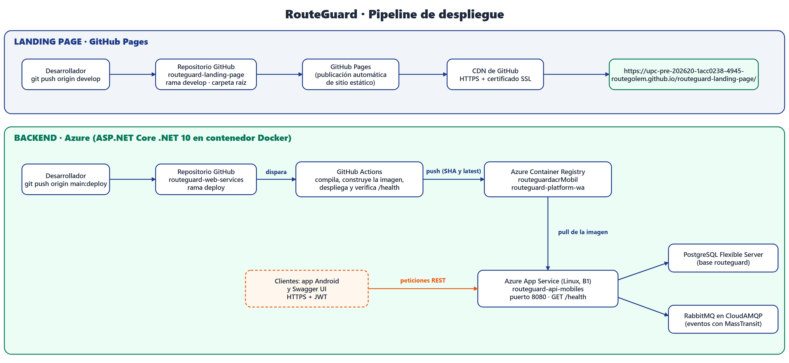

*Pipeline de despliegue: GitHub Pages para la landing y GitHub Actions + Azure Container Registry + App Service para el backend.*

**Despliegue de la Landing Page.** El repositorio `routeguard-landing-page` está configurado en *Settings → Pages* con origen en la rama `develop` y carpeta raíz. Cada cambio incorporado a `develop` se publica automáticamente con HTTPS y CDN de GitHub. La prueba de acceso se muestra a continuación.

```text
$ curl -I https://upc-pre-202620-1acc0238-4945-routegolem.github.io/routeguard-landing-page/
HTTP/1.1 200 OK
Server: GitHub.com
Last-Modified: Fri, 09 Oct 2026 09:27:08 GMT
```

**Despliegue del Backend.** El backend se empaqueta en una imagen Docker de dos etapas (`dotnet/sdk:10.0` para compilar y `dotnet/aspnet:10.0` para ejecutar, con la API escuchando en el puerto 8080) y se publica mediante el workflow de GitHub Actions descrito en la **Tabla 37**.

<p><strong>Tabla 37.</strong> <em>Pasos del workflow de despliegue (<code>deploy.yml</code>)</em></p>
<table style="border-collapse: collapse; width: 100%; border: 1px solid #ddd;">
  <thead>
    <tr style="background-color: #003366; color: white;">
      <th style="padding: 10px; border: 1px solid #ddd; text-align: left;">#</th>
      <th style="padding: 10px; border: 1px solid #ddd; text-align: left;">Paso</th>
      <th style="padding: 10px; border: 1px solid #ddd; text-align: left;">Acción</th>
    </tr>
  </thead>
  <tbody>
    <tr>
      <td style="padding: 10px; border: 1px solid #ddd;">1</td>
      <td style="padding: 10px; border: 1px solid #ddd;">Checkout repository</td>
      <td style="padding: 10px; border: 1px solid #ddd;">Descarga el código de la rama <code>deploy</code></td>
    </tr>
    <tr>
      <td style="padding: 10px; border: 1px solid #ddd;">2</td>
      <td style="padding: 10px; border: 1px solid #ddd;">Set up .NET</td>
      <td style="padding: 10px; border: 1px solid #ddd;">Instala el SDK de .NET 10</td>
    </tr>
    <tr>
      <td style="padding: 10px; border: 1px solid #ddd;">3</td>
      <td style="padding: 10px; border: 1px solid #ddd;">Compile (fail fast)</td>
      <td style="padding: 10px; border: 1px solid #ddd;"><code>dotnet build</code> en modo Release; si falla, se detiene antes de construir la imagen</td>
    </tr>
    <tr>
      <td style="padding: 10px; border: 1px solid #ddd;">4</td>
      <td style="padding: 10px; border: 1px solid #ddd;">Log in to Azure Container Registry</td>
      <td style="padding: 10px; border: 1px solid #ddd;">Autentica con los *secrets* <code>ACR_LOGIN_SERVER</code>, <code>ACR_USERNAME</code> y <code>ACR_PASSWORD</code></td>
    </tr>
    <tr>
      <td style="padding: 10px; border: 1px solid #ddd;">5</td>
      <td style="padding: 10px; border: 1px solid #ddd;">Build and push the Docker image</td>
      <td style="padding: 10px; border: 1px solid #ddd;">Construye la imagen y la sube al registro con dos etiquetas: el SHA del commit y <code>latest</code></td>
    </tr>
    <tr>
      <td style="padding: 10px; border: 1px solid #ddd;">6</td>
      <td style="padding: 10px; border: 1px solid #ddd;">Deploy to Azure Web App</td>
      <td style="padding: 10px; border: 1px solid #ddd;">Actualiza el App Service con la nueva imagen mediante el *secret* <code>AZURE_WEBAPP_PUBLISH_PROFILE</code></td>
    </tr>
    <tr>
      <td style="padding: 10px; border: 1px solid #ddd;">7</td>
      <td style="padding: 10px; border: 1px solid #ddd;">Smoke test (GET /health)</td>
      <td style="padding: 10px; border: 1px solid #ddd;">Hasta 20 intentos cada 15 s; el despliegue solo se da por bueno si <code>/health</code> responde 200</td>
    </tr>
  </tbody>
</table>
<p style="margin-top: 10px;"><em>Nota: Workflow ubicado en <code>routeguard-web-services/.github/workflows/deploy.yml</code>.</em></p>

Las dos capturas siguientes, tomadas del portal de Azure, evidencian la imagen publicada en el registro (etiquetas `latest` y SHA del commit, publicadas el 2026-10-09) y la configuración del App Service para ejecutar esa imagen desde el registro.

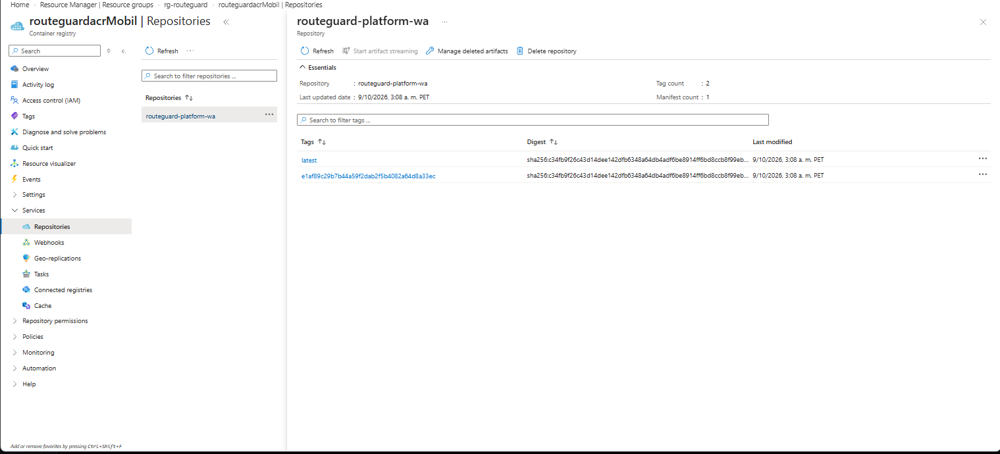

*Azure Container Registry: repositorio routeguard-platform-wa con las etiquetas latest y el SHA del commit.*

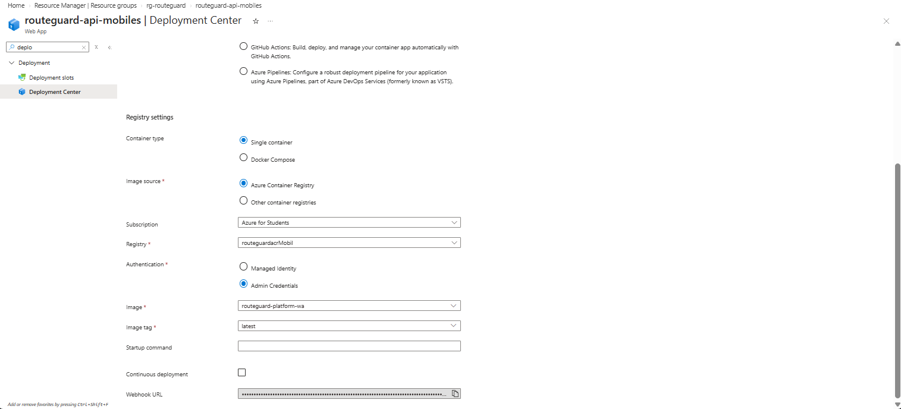

*Deployment Center del App Service: contenedor único desde Azure Container Registry, imagen routeguard-platform-wa, etiqueta latest.*

La verificación de que el servicio desplegado está operativo se realizó con la ruta de salud de la API y con la documentación Swagger publicada por el mismo servicio.

```text
$ curl -s -w "\nHTTP %{http_code}\n" https://routeguard-api-mobiles-a3cza3byc3b3dpfs.brazilsouth-01.azurewebsites.net/health
Healthy
HTTP 200
(2026-10-10 07:16 UTC)
```

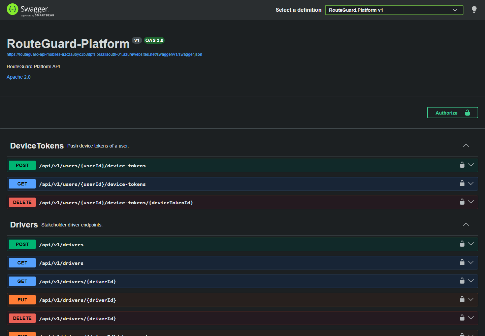

*Documentación Swagger (OpenAPI 3.0) servida por la API desplegada en Azure.*

<p><strong>Tabla 38.</strong> <em>Configuración del entorno de producción (nombres de variables)</em></p>
<table style="border-collapse: collapse; width: 100%; border: 1px solid #ddd;">
  <thead>
    <tr style="background-color: #003366; color: white;">
      <th style="padding: 10px; border: 1px solid #ddd; text-align: left;">Ubicación</th>
      <th style="padding: 10px; border: 1px solid #ddd; text-align: left;">Variables o *secrets*</th>
      <th style="padding: 10px; border: 1px solid #ddd; text-align: left;">Propósito</th>
    </tr>
  </thead>
  <tbody>
    <tr>
      <td style="padding: 10px; border: 1px solid #ddd;">App Service (variables de entorno)</td>
      <td style="padding: 10px; border: 1px solid #ddd;"><code>WEBSITES_PORT</code>, <code>ASPNETCORE_ENVIRONMENT</code></td>
      <td style="padding: 10px; border: 1px solid #ddd;">Puerto del contenedor (8080) y entorno de ejecución</td>
    </tr>
    <tr>
      <td style="padding: 10px; border: 1px solid #ddd;">App Service (variables de entorno)</td>
      <td style="padding: 10px; border: 1px solid #ddd;"><code>JWT_SECRET</code></td>
      <td style="padding: 10px; border: 1px solid #ddd;">Clave de firma de los tokens JWT (mínimo 32 caracteres; la API no arranca sin ella)</td>
    </tr>
    <tr>
      <td style="padding: 10px; border: 1px solid #ddd;">App Service (variables de entorno)</td>
      <td style="padding: 10px; border: 1px solid #ddd;"><code>DATABASE_URL</code>, <code>DATABASE_PORT</code>, <code>DATABASE_SCHEMA</code>, <code>DATABASE_USER</code>, <code>DATABASE_PASSWORD</code></td>
      <td style="padding: 10px; border: 1px solid #ddd;">Conexión a PostgreSQL</td>
    </tr>
    <tr>
      <td style="padding: 10px; border: 1px solid #ddd;">App Service (variables de entorno)</td>
      <td style="padding: 10px; border: 1px solid #ddd;"><code>RABBITMQ_URL</code></td>
      <td style="padding: 10px; border: 1px solid #ddd;">Conexión al broker RabbitMQ</td>
    </tr>
    <tr>
      <td style="padding: 10px; border: 1px solid #ddd;">App Service (variables de entorno)</td>
      <td style="padding: 10px; border: 1px solid #ddd;"><code>Seed__Enabled</code>, <code>Cors__AllowedOrigins__0</code>, <code>HardwareAdapter__ApiKey</code></td>
      <td style="padding: 10px; border: 1px solid #ddd;">Datos de demostración, origen web permitido y clave del adaptador de hardware</td>
    </tr>
    <tr>
      <td style="padding: 10px; border: 1px solid #ddd;">GitHub Actions (*secrets*)</td>
      <td style="padding: 10px; border: 1px solid #ddd;"><code>ACR_LOGIN_SERVER</code>, <code>ACR_USERNAME</code>, <code>ACR_PASSWORD</code>, <code>AZURE_WEBAPP_NAME</code>, <code>AZURE_WEBAPP_PUBLISH_PROFILE</code></td>
      <td style="padding: 10px; border: 1px solid #ddd;">Acceso al registro y al App Service desde el pipeline</td>
    </tr>
  </tbody>
</table>
<p style="margin-top: 10px;"><em>Nota: Ningún valor secreto forma parte del repositorio; la guía completa está en <code>routeguard-web-services/docs/despliegue-azure.md</code>.</em></p>

<p><strong>Tabla 39.</strong> <em>Trazabilidad del despliegue (commits)</em></p>
<table style="border-collapse: collapse; width: 100%; border: 1px solid #ddd;">
  <thead>
    <tr style="background-color: #003366; color: white;">
      <th style="padding: 10px; border: 1px solid #ddd; text-align: left;">Repositorio</th>
      <th style="padding: 10px; border: 1px solid #ddd; text-align: left;">Rama</th>
      <th style="padding: 10px; border: 1px solid #ddd; text-align: left;">Commit</th>
      <th style="padding: 10px; border: 1px solid #ddd; text-align: left;">Mensaje</th>
      <th style="padding: 10px; border: 1px solid #ddd; text-align: left;">Fecha</th>
    </tr>
  </thead>
  <tbody>
    <tr>
      <td style="padding: 10px; border: 1px solid #ddd;">routeguard-landing-page</td>
      <td style="padding: 10px; border: 1px solid #ddd;"><code>develop</code></td>
      <td style="padding: 10px; border: 1px solid #ddd;"><code>0a36c29</code></td>
      <td style="padding: 10px; border: 1px solid #ddd;">refactor(landing): move landing to repo root and fix asset paths for GitHub Pages</td>
      <td style="padding: 10px; border: 1px solid #ddd;">2026-10-08</td>
    </tr>
    <tr>
      <td style="padding: 10px; border: 1px solid #ddd;">routeguard-landing-page</td>
      <td style="padding: 10px; border: 1px solid #ddd;"><code>develop</code></td>
      <td style="padding: 10px; border: 1px solid #ddd;"><code>01a66f3</code></td>
      <td style="padding: 10px; border: 1px solid #ddd;">feat(landing): add hamburger menu for mobile navigation</td>
      <td style="padding: 10px; border: 1px solid #ddd;">2026-10-09</td>
    </tr>
    <tr>
      <td style="padding: 10px; border: 1px solid #ddd;">routeguard-web-services</td>
      <td style="padding: 10px; border: 1px solid #ddd;"><code>main</code> / <code>deploy</code></td>
      <td style="padding: 10px; border: 1px solid #ddd;"><code>0ed0e63</code></td>
      <td style="padding: 10px; border: 1px solid #ddd;">feat: migrate persistence to PostgreSQL and prepare Azure deployment</td>
      <td style="padding: 10px; border: 1px solid #ddd;">2026-10-09</td>
    </tr>
    <tr>
      <td style="padding: 10px; border: 1px solid #ddd;">routeguard-web-services</td>
      <td style="padding: 10px; border: 1px solid #ddd;"><code>main</code> / <code>deploy</code></td>
      <td style="padding: 10px; border: 1px solid #ddd;"><code>e1af89c</code></td>
      <td style="padding: 10px; border: 1px solid #ddd;">Merge branch 'main' (commit desplegado; etiqueta de la imagen en el registro)</td>
      <td style="padding: 10px; border: 1px solid #ddd;">2026-10-09</td>
    </tr>
  </tbody>
</table>
<p style="margin-top: 10px;"><em>Nota: El commit <code>e1af89c</code> es el que aparece como etiqueta de la imagen en el Azure Container Registry.</em></p>

#### 4.2.1.9. Team Collaboration Insights during Sprint

## 4.3. Validation Interviews

### 4.3.1. Diseño de Entrevistas

### 4.3.2. Registro de Entrevistas

### 4.3.3. Evaluaciones según heurísticas

<div style="page-break-after: always;"></div>

# Conclusiones

### Conclusiones y recomendaciones


1. Las entrevistas de validación confirmaron que la problemática es real: tanto padres (Manuel, Máximo) como transportistas (Luis Johnny) dependen de canales informales como WhatsApp y llamadas, validando la propuesta de valor de RouteGuard centrada en automatizar la comunicación y el monitoreo pasivo.

2. El *Domain-Driven Design* aplicado permitió delimitar con claridad los seis Bounded Contexts del sistema, identificando a *Trip Execution & Monitoring* como el Core Domain, lo que asegura que el mayor esfuerzo de ingeniería se concentre en la funcionalidad que diferencia a RouteGuard de sus competidores.

3. Dividir el ecosistema en dos aplicaciones nativa para el conductor con soporte offline y GPS en segundo plano, y multiplataforma pasiva para el padre responde a las diferencias de uso evidenciadas en el *User Task Matrix* y los *User Journey Maps* de ambos segmentos.

4. La priorización del *Product Backlog* por valor temprano aseguró que las historias del Core Domain (autenticación, sincronización offline, GPS y monitoreo en tiempo real) queden al inicio del desarrollo, antes que funcionalidades secundarias.

**Conclusión del equipo (TB1).** 

Pasar del modelado al producto desplegado obligó a cada integrante a aprender herramientas nuevas (CI/CD en la nube, diseño de interfaces, pruebas automatizadas, arquitectura de información) y a revisar su propio trabajo con criterios externos. El equipo concluye que el aprendizaje autónomo y el contraste con evidencia (código, métricas, usuarios) fueron lo que permitió detectar y corregir deficiencias antes de la entrega.


### Video App Validation

### Video About the product

### Video About the team

<div style="page-break-after: always;"></div>

# Glosario

<div style="page-break-after: always;"></div>

# Bibliografía

**Dominio de negocio**

* Autoridad de Transporte Urbano para Lima y Callao [ATU]. (2024). *Reporte anual de fiscalización y formalización del transporte especial de estudiantes*. Gobierno del Perú.
* Chen, L., & Davis, M. (2025). Passive monitoring and geofencing in child logistics: Impacts on parental anxiety and user engagement. *Journal of Interactive Mobile Technologies*, 19(1), 78-95. https://doi.org/10.1016/j.jimt.2025.02.012
* García, M., López, R., & Torres, P. (2024). Smart mobility in developing cities: Challenges in private school transportation logistics. *Journal of Urban Technology and Smart Cities*, 12(3), 45-62. https://doi.org/10.1080/10630732.2024.1234567
* Ministerio de Educación [MINEDU]. (2023). *Resultados del Censo Educativo 2022-2023: Matrícula y tendencias en zonas urbanas*. Gobierno del Perú.
* Smith, J., & Johnson, A. (2025). Cognitive load and mobile distraction among commercial drivers: A real-time monitoring approach. *International Journal of Transportation Safety*, 41(2), 112-128. https://doi.org/10.1016/j.ijts.2025.01.005

**Métodos y técnicas de ingeniería de software**

* Adzic, G. (2012). *Impact Mapping: Making a big impact with software products and projects.* Provoking Thoughts.
* Brandolini, A. (2021). *Introducing EventStorming: An Act of Deliberate Collective Learning.* Leanpub.
* Chen, Y., & Zhao, M. (2025). Passive monitoring and location-based notifications in family tracking applications. *Journal of Mobile Human-Computer Interaction,* 15(2), 45-60. https://doi.org/10.1016/j.jmhci.2025.104221
* Cohn, M. (2004). *User Stories Applied: For Agile Software Development.* Addison-Wesley Professional.
* Cooper, A. (1999). *The Inmates Are Running the Asylum: Why High Tech Products Drive Us Crazy and How to Restore the Sanity.* Sams Publishing.
* Enge, E., Spencer, S., & Stricchiola, J. (2015). *The Art of SEO: Mastering Search Engine Optimization* (3rd ed.). O'Reilly Media.
* Evans, E. (2003). *Domain-Driven Design: Tackling Complexity in the Heart of Software.* Addison-Wesley Professional.
* Gothelf, J., & Seiden, J. (2021). *Lean UX: Designing Great Products with Agile Teams* (3rd ed.). O'Reilly Media.
* Kumar, A., & Lee, S. (2024). Role-based task frequency analysis in mobile interface design for logistics. *International Journal of Human-Computer Studies,* 182, 103-118. https://doi.org/10.1016/j.ijhcs.2024.103118
* Nielsen, J. (1994). *Usability Engineering*. Morgan Kaufmann.
* Rosenfeld, L., Morville, P., & Arango, J. (2015). *Information Architecture: For the Web and Beyond* (4th ed.). O'Reilly Media.
* Rubin, K. S. (2012). *Essential Scrum: A Practical Guide to the Most Popular Agile Process.* Addison-Wesley.
* Schwaber, K., & Sutherland, J. (2020). *The Scrum Guide.* Scrum.org.
* Stickdorn, M., Hormess, M. E., Lawrence, A., & Schneider, J. (2018). *This Is Service Design Doing: Applying Service Design Thinking in the Real World*. O'Reilly Media.
* Vernon, V. (2013). *Implementing Domain-Driven Design.* Addison-Wesley.

**Lenguajes, frameworks y herramientas**

* Atlassian. (2024). *Jira Software*. https://www.atlassian.com/software/jira
* Figma. (2024). *Figma: The collaborative interface design tool*. https://www.figma.com/
* Google. (2024a). *Firebase Cloud Messaging Documentation.* Google Developers. https://firebase.google.com/docs/cloud-messaging
* Google. (2024b). *Android Studio*. Android Developers. https://developer.android.com/studio
* JetBrains. (2024b). *IntelliJ IDEA: The Capable & Ergonomic Java IDE*. https://www.jetbrains.com/idea/
* Mapbox. (2024). *Mapbox Navigation SDK for Mobile.* Mapbox. https://docs.mapbox.com/
* Microsoft. (2024). *Visual Studio Code*. https://code.visualstudio.com/
* PostGIS Project Steering Committee. (2024). *PostGIS: Spatial and Geographic Objects for PostgreSQL.* OSGeo. https://postgis.net/
* Railway. (2024). *Railway: Infrastructure platform*. https://railway.app/
* Vercel. (2024). *Vercel: Develop. Preview. Ship.* https://vercel.com/
* VMware. (2024). *RabbitMQ: Messaging that just works.* Broadcom. https://www.rabbitmq.com/

**Métodos y técnicas de ingeniería de software**

* Nielsen, J. (1994). *10 usability heuristics for user interface design*. Nielsen Norman Group. https://www.nngroup.com/articles/ten-usability-heuristics/
* Rosenfeld, L., Morville, P., & Arango, J. (2015). *Information architecture: For the web and beyond* (4th ed.). O'Reilly Media.
* Cucumber. (s. f.). *Gherkin reference*. https://cucumber.io/docs/gherkin/reference/

**Lenguajes, frameworks y herramientas**

* Google. (s. f.). *Search Central: SEO starter guide*. Google for Developers. https://developers.google.com/search/docs/fundamentals/seo-starter-guide
* Google. (s. f.). *Navigation in Jetpack Compose*. Android Developers. https://developer.android.com/develop/ui/compose/navigation
* Google. (s. f.). *Save data in a local database using Room*. Android Developers. https://developer.android.com/training/data-storage/room
* Mapbox. (s. f.). *Geocoding API*. https://docs.mapbox.com/api/search/geocoding/
* Microsoft. (s. f.). *ASP.NET Core documentation*. Microsoft Learn. https://learn.microsoft.com/aspnet/core
* Microsoft. (s. f.). *Azure App Service documentation*. Microsoft Learn. https://learn.microsoft.com/azure/app-service/
* OpenAPI Initiative. (2021). *OpenAPI Specification v3.1.0*. https://spec.openapis.org/oas/v3.1.0
* W3C. (2018). *Web Content Accessibility Guidelines (WCAG) 2.1*. https://www.w3.org/TR/WCAG21/


**Gestión de Configuración y Estándares**

* Conventional Commits. (2024). *Conventional Commits 1.0.0*. https://www.conventionalcommits.org/
* Driessen, V. (2010). *A successful Git branching model*. nvie.com. https://nvie.com/posts/a-successful-git-branching-model/
* Google. (2021). *Google HTML/CSS Style Guide*. Google GitHub. https://google.github.io/styleguide/htmlcssguide.html
* Google. (2022). *Google Java Style Guide*. Google GitHub. https://google.github.io/styleguide/javaguide.html
* JetBrains. (2024a). *Coding conventions*. Kotlin Documentation. https://kotlinlang.org/docs/coding-conventions.html
* Preston-Werner, T. (2013). *Semantic Versioning 2.0.0*. SemVer. https://semver.org/

<div style="page-break-after: always;"></div>

# Anexos


